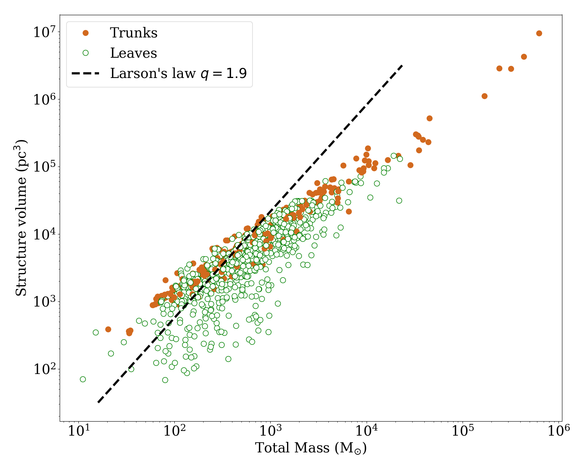
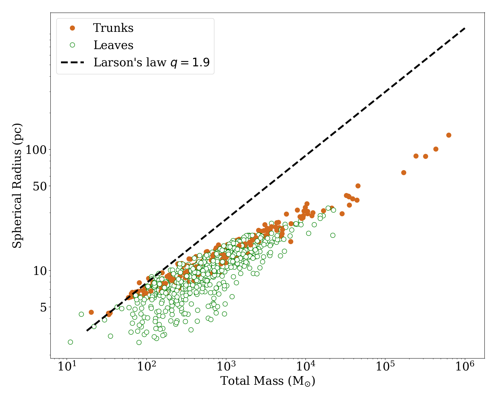
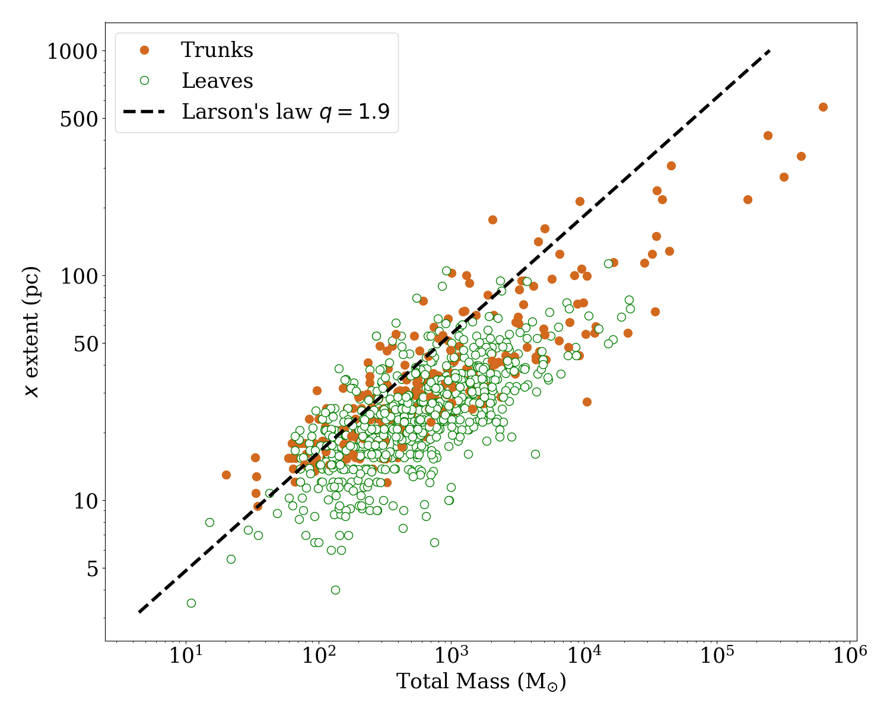
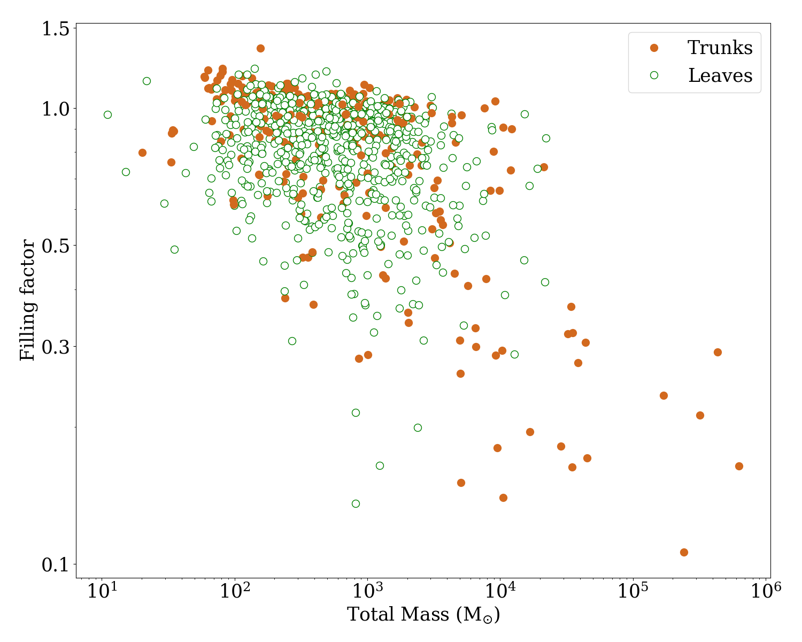
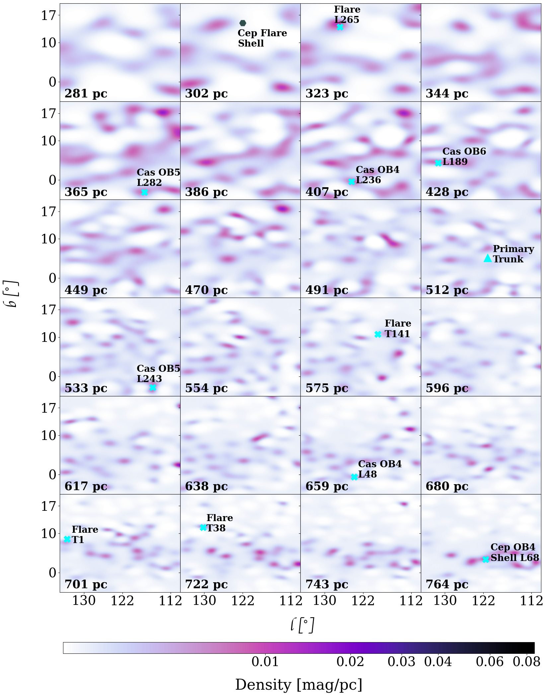
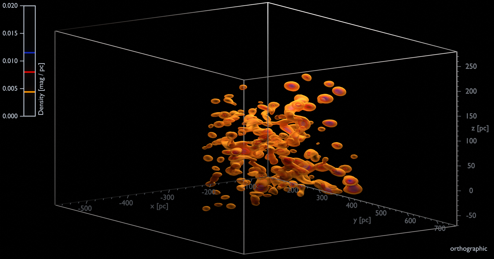
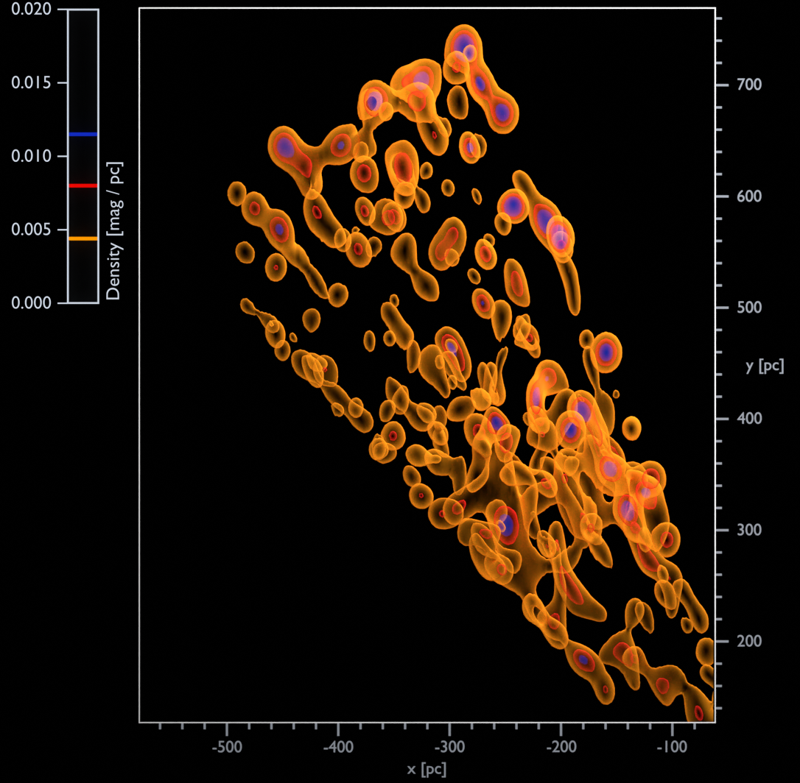
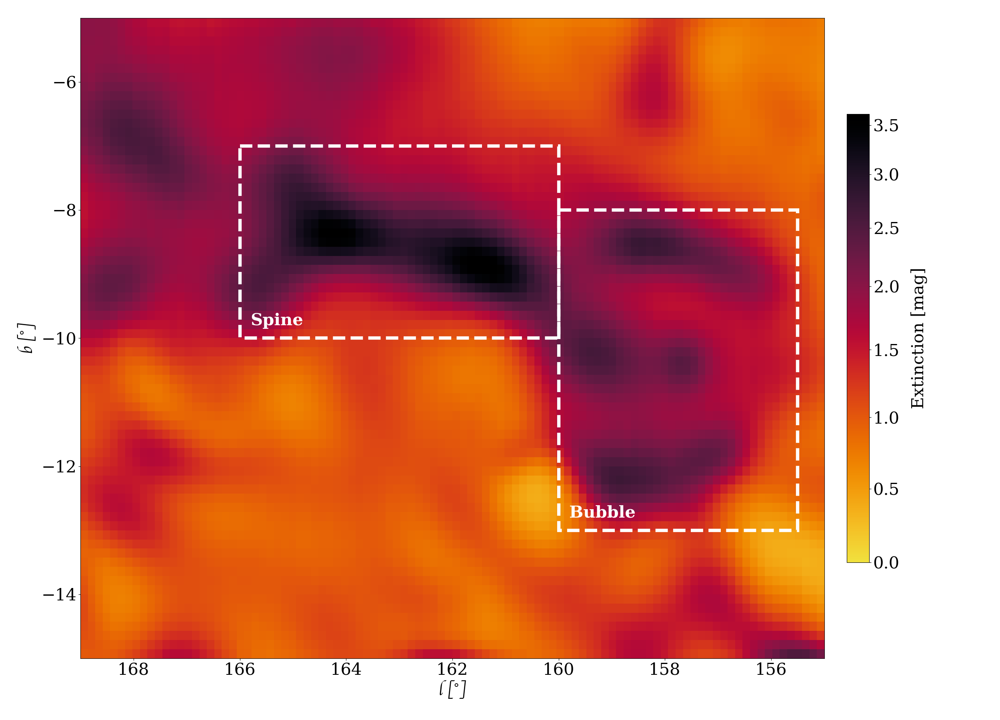

$\newcommand{\ensuremath}{}$
$\newcommand{\xspace}{}$
$\newcommand{\object}[1]{\texttt{#1}}$
$\newcommand{\farcs}{{.}''}$
$\newcommand{\farcm}{{.}'}$
$\newcommand{\arcsec}{''}$
$\newcommand{\arcmin}{'}$
$\newcommand{\ion}[2]{#1#2}$
$\newcommand{\textsc}[1]{\textrm{#1}}$
$\newcommand{\hl}[1]{\textrm{#1}}$
$\newcommand{\thebibliography}{\DeclareRobustCommand{\VAN}[3]{##3}\VANthebibliography}$

$\newcommand{\ensuremath}{}$
$\newcommand{\xspace}{}$
$\newcommand{\object}[1]{\texttt{#1}}$
$\newcommand{\farcs}{{.}''}$
$\newcommand{\farcm}{{.}'}$
$\newcommand{\arcsec}{''}$
$\newcommand{\arcmin}{'}$
$\newcommand{\ion}[2]{#1#2}$
$\newcommand{\textsc}[1]{\textrm{#1}}$
$\newcommand{\hl}[1]{\textrm{#1}}$
$\newcommand{\thebibliography}{\DeclareRobustCommand{\VAN}[3]{##3}\VANthebibliography}$

# The three-dimensional structure of Galactic molecular cloud complexes out to 2.5 kpc 

<mark>Appeared on: 2022-10-07</mark> - _accepted for publication by MNRAS, 23 pages, 9 figures, 3 tables_

T. E. Dharmawardena, et al. -- incl., <mark><mark>C.A.L. Bailer-Jones</mark></mark>, <mark><mark>M. Fouesneau</mark></mark>, <mark><mark>T. Müller</mark></mark>

**Abstract:** Knowledge of the three-dimensional structure of Galactic molecular clouds is important for understanding how clouds are affected by processes such as turbulence and magnetic fields and how this structure effects star formation within them.Great progress has been made in this field with the arrival of the Gaia mission, which provides accurate distances to $\sim10^{9}$ stars. Combining these distances with extinctions inferred from optical-IR, we recover the three-dimensional structure of 16 Galactic molecular cloud complexes at $\sim1$ pc resolution using our novel three-dimensional dust mapping algorithm \texttt{Dustribution} .Using \texttt{astrodendro} we derive a catalogue of physical parameters for each complex.We recover structures with aspect ratios between 1 and 11, i.e. everything from near-spherical to very elongated shapes.We find a large variation in cloud environments that is not apparent when studying them in two-dimensions.For example, the nearby California and Orion A clouds look similar on-sky, but we find California to be more sheet-like, and massive, which could explain their different star-formation rates.In Carina, our most distant complex, we observe evidence for dust sputtering, which explains its measured low dust mass.By calculating the total mass of these individual clouds, we demonstrate that it is necessary to define cloud boundaries in three-dimensions in order to obtain an accurate mass; simply integrating the extinction overestimates masses.We find that Larson's relationship on mass vs radius holds true whether you assume a spherical shape for the cloud or take their true extents.

**Figure 18. -** The total mass vs. (top left) volume of structure within contours laid down by \texttt{astrodendro}; (top right) spherical radius; (bottom left) $x$ extent; and (bottom right) filling factor of all trunks (brown filled circles) and leaves (green empty circles) for all the mapped molecular cloud complexes. In all plots the black dashed line represents the Larson's law where $M \propto R^{q}$ with $q = 1.9$. (*fig:Mass_vs_ParamsComp*)

**Figure 21. -**  Predicted 3D density structure of the Cassiopeia molecular cloud complex. Left: Slices along the line-of-sight of the predicted 3D density structure. With the Cyan triangle we have marked the mass weighted centroid of the primary trunk (as given in Table \ref{tab:maintrunk_params} placed on the closest distance slice included in the plot. The Cyan $\times$s mark the mass weighted centroids of the interesting features discussed in Sec.\ref{sec:IndGMCs} and highlighted in Table \ref{tab:leaf_params} placed on the closest distance slice included in the plot. The grey hexagon marks the centre of the Cepheus flare shell; Right top: Video of a volume rendering of the predicted 3D density structure which begins from the view as seen from the Sun. It then rotates anti-clockwise about an axis perpendicular to the initial viewing angle. The semi-transparent iso-surfaces mark three different density levels with orange being the least dense to blue being the most dense as shown by the colour bar.; Right bottom: Still image showing the top down view of the predicted 3D density structure of the molecular cloud region using identical rendering to the preceding video. (*fig:Cas_3Ddens*)

**Figure 1. -** The predicted integrated 2D extinction of the California molecular cloud complex as seen from the Sun (i.e: on the plane of the sky). The California spine and bubble are highlighted (*fig:Calif_2D*)

