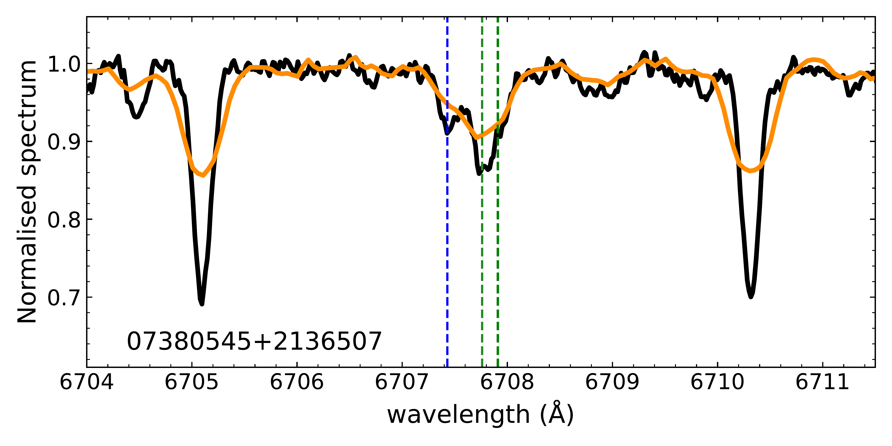
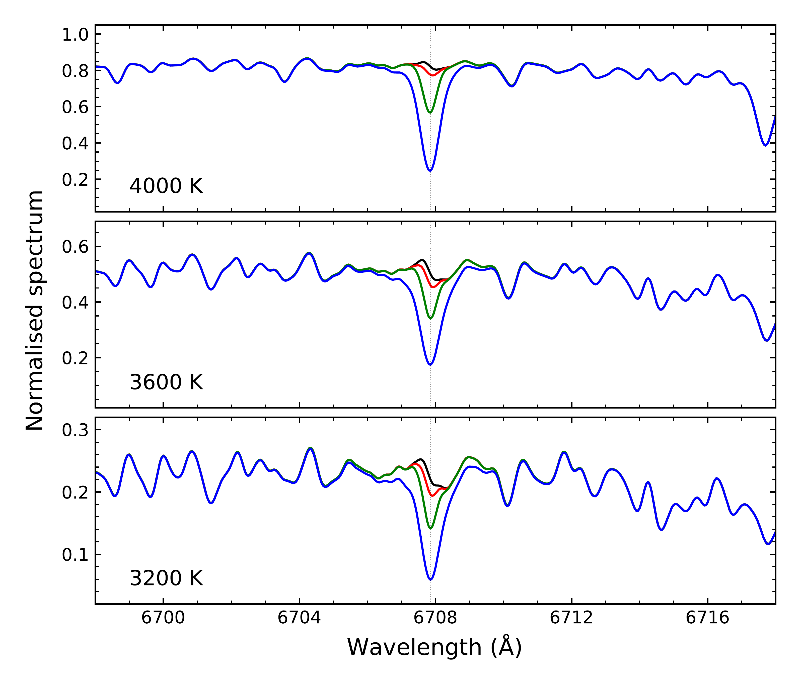
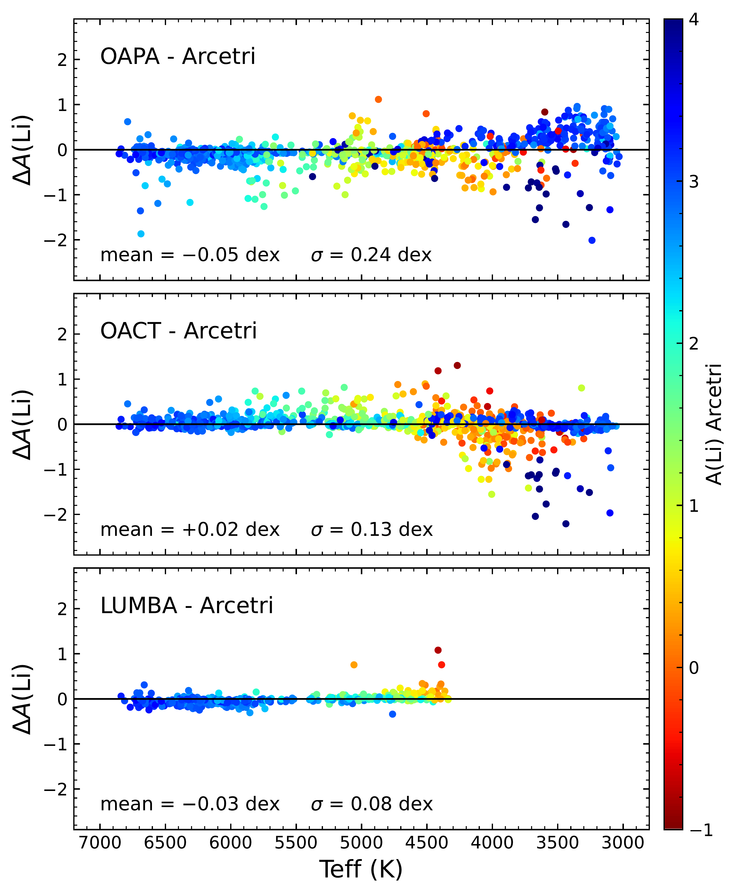

$\newcommand{\ensuremath}{}$
$\newcommand{\xspace}{}$
$\newcommand{\object}[1]{\texttt{#1}}$
$\newcommand{\farcs}{{.}''}$
$\newcommand{\farcm}{{.}'}$
$\newcommand{\arcsec}{''}$
$\newcommand{\arcmin}{'}$
$\newcommand{\ion}[2]{#1#2}$
$\newcommand{\textsc}[1]{\textrm{#1}}$
$\newcommand{\hl}[1]{\textrm{#1}}$

$\newcommand{$\ensuremath$}{}$
$\newcommand{$\xspace$}{}$
$\newcommand{$\object$}[1]{\texttt{#1}}$
$\newcommand{$\farcs$}{{.}''}$
$\newcommand{$\farcm$}{{.}'}$
$\newcommand{$\arcsec$}{''}$
$\newcommand{$\arcmin$}{'}$
$\newcommand{$\ion$}[2]{#1#2}$
$\newcommand{$\textsc$}[1]{\textrm{#1}}$
$\newcommand{$\hl$}[1]{\textrm{#1}}$

# Tables A.1--A.3 are fully available in electronic form at theCDS via anonymous ftp to cdsarc.u-strasbg.fr (130.79.128.5) or viahttp://cdsweb.u-strasbg.fr/cgi-bin/qcat?J/A+A/

<mark>Appeared on: 2022-10-11</mark> - _15 pages, 15 figures. Accepted by Astronomy & Astrophysics_

E. Franciosini, et al. -- incl., <mark><mark>K. Lind</mark></mark>, <mark><mark>G. Guiglion</mark></mark>, <mark><mark>E.J. Alfaro</mark></mark>, <mark><mark>M. Bergemann</mark></mark>, <mark><mark>U. Heiter</mark></mark>, <mark><mark>J. Lewis</mark></mark>

**Abstract:** The Gaia-ESO Survey (GES) is a large public spectroscopic survey that wascarried out using the multi-object FLAMES spectrograph at the Very LargeTelescope. The survey provides accurate radial velocities, stellarparameters, and elemental abundances for$\sim$115 000 stars in all MilkyWay components.In this paper we describe the method adopted in the final data release toderive lithium equivalent widths (EWs) and abundances.Lithium EWs were measured using two different approaches for FGK and M-typestars, to account for the intrinsic differences in the spectra. For FGKstars, we fitted the lithium line using Gaussian components, while directintegration over a predefined interval was adopted for M-type stars. Carewas taken to ensure continuity between the two regimes. Abundances werederived using a new set of homogeneous curves of growth that were derivedspecifically for GES, and which were measured on a synthetic spectral gridconsistently with the way the EWs were measured. The derived abundances werevalidated by comparison with those measured by other analysis groups usingdifferent methods.Lithium EWs were measured for$\sim$40 000 stars, and abundances couldbe derived for$\sim$38 000 of them. The vast majority of the measures(80\%) have been obtained for stars in open cluster fields. The remainingobjects are stars in globular clusters, or field stars in the Milky Waydisc, bulge, and halo.The GES dataset of homogeneous lithium abundances described here will bevaluable for our understanding of several processes, from stellar evolutionand internal mixing in stars at different evolutionary stages to Galacticevolution.

**Figure 1. -** UVES (black, S/N=119) and Giraffe (orange, S/N=223) spectra of the
giant star 07380545+2136507 which was observed with both instruments. The
vertical green and blue dashed lines mark the positions of the lithium
doublet and of the 6707.4 \AA  iron line, respectively. (*fig:compare_ug*)

**Figure 4. -** Synthetic spectra of M-type dwarf stars with $T_\mathrm{eff}=4000$,
3600 and 3200 K (from top to bottom), $\log g=4.5$ and solar metallicity, at
the Giraffe resolution. Spectra are plotted for $A\mathrm{(Li)}=-1.0$(black
line), 0.0 (red line), $+1.0$(green line), and $+3.0$(blue line). The
vertical dotted line shows the mean position of the lithium doublet. (*fig:mtype_synt*)

**Figure 8. -** Comparison between the abundances derived by Arcetri with those
derived by other nodes as a function of $T_\mathrm{eff}$, for stars observed
with Giraffe. The plotted differences $\Delta A(\mathrm{Li})$ are computed
as the other node minus Arcetri, and are colour-coded by the Arcetri
abundance. Only stars with detections in both nodes are plotted. The
3-$\sigma$ clipped average and standard deviation of the abundance
differences are indicated in the respective panels. (*fig:comp_gir*)

