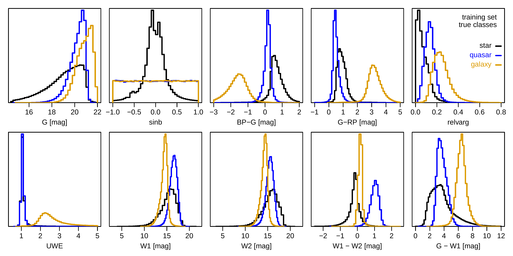
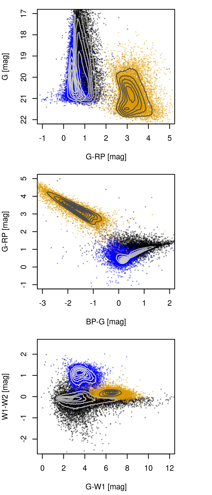
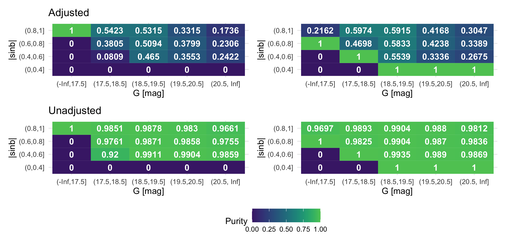

$\newcommand{\ensuremath}{}$
$\newcommand{\xspace}{}$
$\newcommand{\object}[1]{\texttt{#1}}$
$\newcommand{\farcs}{{.}''}$
$\newcommand{\farcm}{{.}'}$
$\newcommand{\arcsec}{''}$
$\newcommand{\arcmin}{'}$
$\newcommand{\ion}[2]{#1#2}$
$\newcommand{\textsc}[1]{\textrm{#1}}$
$\newcommand{\hl}[1]{\textrm{#1}}$
$\newcommand{\nodata}{ ~\cdots~ }$

$\newcommand{\ensuremath}{}$
$\newcommand{\xspace}{}$
$\newcommand{\object}[1]{\texttt{#1}}$
$\newcommand{\farcs}{{.}''}$
$\newcommand{\farcm}{{.}'}$
$\newcommand{\arcsec}{''}$
$\newcommand{\arcmin}{'}$
$\newcommand{\ion}[2]{#1#2}$
$\newcommand{\textsc}[1]{\textrm{#1}}$
$\newcommand{\hl}[1]{\textrm{#1}}$
$\newcommand{\nodata}{ ~\cdots~ }$

# Quasar and galaxy classification using Gaia EDR3 and CatWise2020

<mark>Appeared on: 2022-10-11</mark> - _21 pages, 23 figures, Accepted for publication in A&A_

<mark>Arvind C.N. Hughes</mark>, <mark>Coryn A.L. Bailer-Jones</mark>, <mark>Sara Jamal</mark>

**Abstract:** In this work, we assess the combined use of Gaia photometry and astrometry with infrared data from CatWISE in improving the identification of extragalactic sources compared to the classification obtained using Gaia data. Here we perform a comprehensive study in which we assess different input feature configurations and prior functions to identify extragalactic sources in Gaia, with the aim of presenting a classification methodology integrating prior knowledge stemming from realistic class distributions in the universe.In our work, we compare different classifiers, namely Gaussian Mixture Models (GMMs) and the boosted decision trees, XGBoost and CatBoost, in a supervised approach, and classify sources into three classes - star, quasar, and galaxy, with the target quasar and galaxy class labels obtained from the Sloan Digital Sky Survey Data Release 16 (SDSS16) and the star label from Gaia EDR3.In our approach, we adjust the posterior probabilities to reflect the intrinsic distribution of extragalactic sources in the universe via a prior function. In particular, we introduce two priors, a global prior reflecting the overall rarity of quasars and galaxies, and a mixed prior that incorporates in addition the distribution of the extragalactic sources as a function of Galactic latitude and magnitude.   Our best classification performances, in terms of completeness and purity of the extragalactic classes, namely the galaxy and quasar classes, are achieved using the mixed prior for sources at high latitudes and in the magnitude range G = 18.5 to 19.5.   We apply our identified best-performing classifier to three application datasets from Gaia Data Release 3 (GDR3), and find that the global prior is more conservative in what it considers to be a quasar or a galaxy compared to the mixed prior.   In particular, when applied to the quasar and galaxy candidates tables from GDR3, the classifier using a global prior achieves purities of 55 \% for quasars and 93 \% for galaxies, and purities of 59 \% and 91 \% respectively using the mixed prior.   When compared to the  performances obtained on the GDR3 pure quasar and galaxy candidates samples, we reach a higher level of purity, 97 \% for quasars and 99.9 \% for galaxies using the global prior, and purities of 96 \% and 99 \% respectively using the mixed prior.   When refining the GDR3 candidates tables via a cross-match with SDSS DR16 confirmed quasars and galaxies, the classifier reaches purities of 99.8 \% for quasars and 99.9 \% for galaxies using a global prior, and 99.9 \% and 99.9 \% using the mixed prior.   We conclude our work by discussing the importance of applying adjusted priors portraying realistic class distributions in the universe and the effect of introducing infrared data as ancillary inputs in the identification of extragalactic sources.

**Figure 11. -** Distribution of the features from the training dataset, coloured according to their true classes. Black: stars, blue: quasars, orange: galaxies. Each distribution is separately normalised and the $sin b$ has been randomised for quasars and galaxies (constant probability
per unit sky area). (*fig:Data-Feature_Hists*)

**Figure 2. -** Colour- magnitude diagram (_top_) and two colour-colour (_middle \& bottom_) diagrams highlighting the distribution of each class, with contours designating the density on a linear-scale for a random sample of 10,000 observations. The color black corresponds to stars, blue for quasars and gold for galaxies. Distinct aggregates can be identified for each class, although a significant interclass overlap still occurs. (*fig:Data-col_col*)

**Figure 13. -** Imbalanced Classifier Mixed Prior: Purity evaluated for the quasar class in the test set from predictions obtained by the best performing models, i.e. XGBoost, trained on the _Feature Set 1_(left panel) and the _Feature Set 4_(right panel).
Top-panels show the classification performances modified by the adjustment factor. The near unit purity at low latitudes in the right panels is not meaningful as there a very few objects as shown in Fig. \ref{fig:Data-mixedpriors} (*fig:Results-3class_quasar_purity_mixedprior*)

