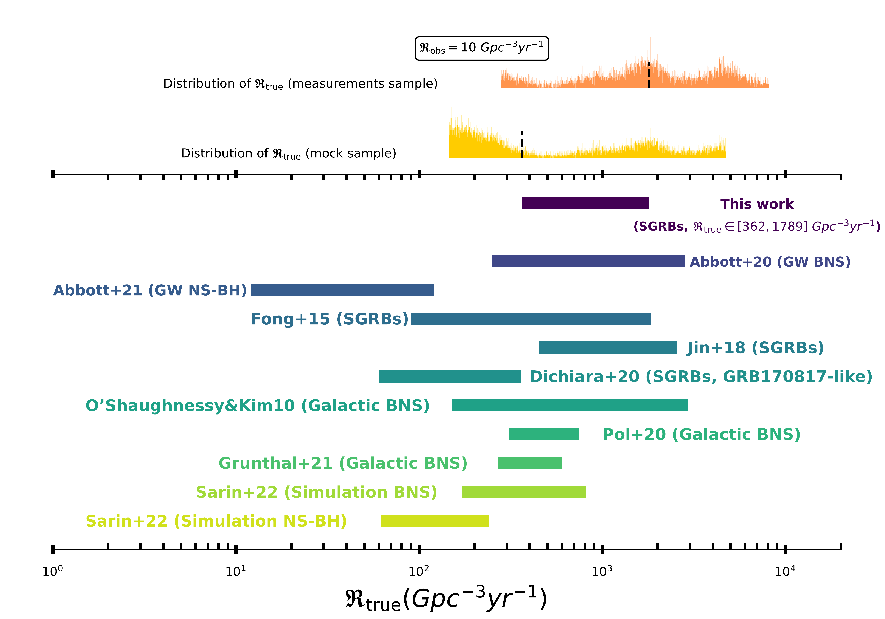
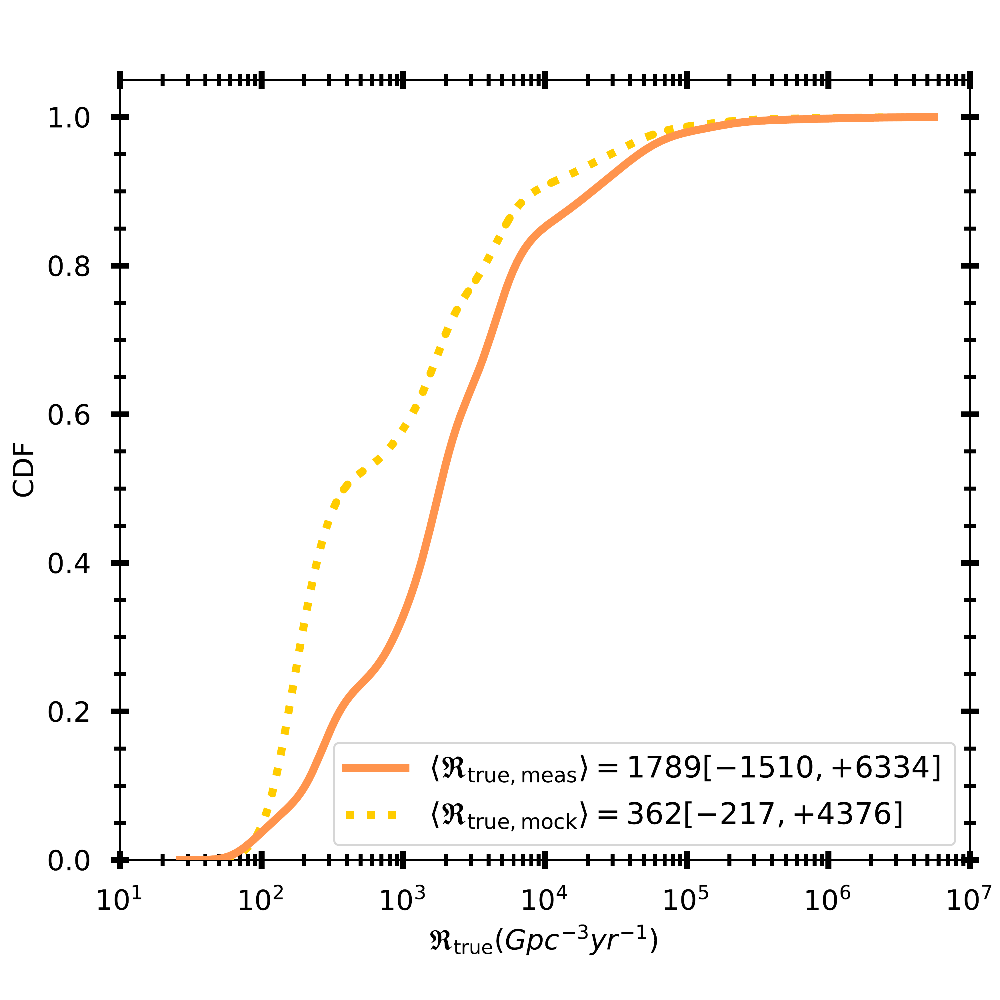
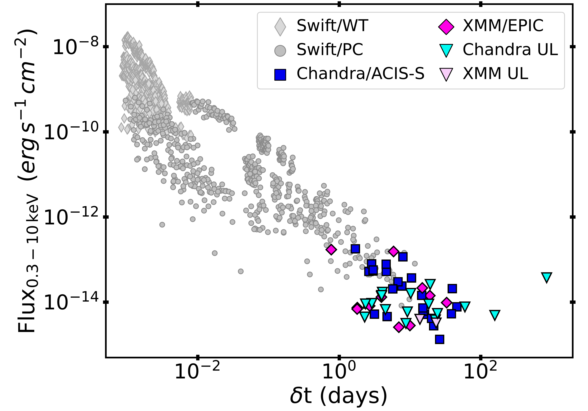

$\newcommand{\ensuremath}{}$
$\newcommand{\xspace}{}$
$\newcommand{\object}[1]{\texttt{#1}}$
$\newcommand{\farcs}{{.}''}$
$\newcommand{\farcm}{{.}'}$
$\newcommand{\arcsec}{''}$
$\newcommand{\arcmin}{'}$
$\newcommand{\ion}[2]{#1#2}$
$\newcommand{\textsc}[1]{\textrm{#1}}$
$\newcommand{\hl}[1]{\textrm{#1}}$
$\newcommand{\vdag}{(v)^\dagger}$
$\newcommand$
$\newcommand$
$\newcommand{\raf}[1]{\textcolor{orange}{#1}}$
$\newcommand{\NU}{\affiliation{Center for Interdisciplinary Exploration and Research in Astrophysics (CIERA) and Department of Physics and Astronomy, Northwestern University, 1800 Sherman Ave, Evanston, IL 60201, USA}}$
$\newcommand{\GSFC}{\affiliation{NASA Goddard Space Flight Center, University of Maryland, Baltimore County, Greenbelt, MD 20771, USA}}$
$\newcommand{\CfA}{\affiliation{Center for Astrophysics\:|\:Harvard \& Smithsonian, 60 Garden St. Cambridge, MA 02138, USA}}$
$\newcommand{\Einstein}{\altaffiliation{NASA Einstein Fellow}}$
$\newcommand{\NASA}{\altaffiliation{NASA Postdoctoral Fellow}}$
$\newcommand{\UAH}{\affiliation{Center for Space Plasma and Aeronomic Research, University of Alabama in Huntsville, 320 Sparkman Drive, Huntsville, AL 35899, USA}}$
$\newcommand{\USRA}{\affiliation{Science and Technology Institute, Universities Space Research Association, Huntsville, AL 35805, USA}}$
$\newcommand{\Arizona}{\affiliation{University of Arizona, Steward Observatory, 933 N. Cherry Avenue, Tucson, AZ 85721, USA}}$
$\newcommand{\Bath}{\affiliation{Department of Physics, University of Bath, Claverton Down, Bath, BA2 7AY, UK}}$
$\newcommand{\OU}{\affiliation{Astrophysical Institute, Department of Physics and Astronomy, 251B Clippinger Lab, Ohio University, Athens, OH 45701, USA}}$
$\newcommand{\Adler}{\affiliation{The Adler Planetarium, Chicago, IL 60605, USA}}$
$\newcommand{\GeminiN}{\affiliation{Gemini Observatory/NSF's NOIRLab, 670 N. A'ohoku Place, Hilo, HI, 96720, USA}}$
$\newcommand{\UMD}{\affiliation{Joint Space-Science Institute, University of Maryland, College Park, MD 20742, USA}}$
$\newcommand{\GWU}{\affiliation{Department of Physics, The George Washington University, Washington, DC 20052, USA}}$
$\newcommand{\Leicester}{\affiliation{School of Physics and Astronomy, University of Leicester, University Road, Leicester, LE1 7RH, UK}}$
$\newcommand{\Marin}{\affiliation{College of Marin, 120 Kent Avenue, Kentfield 94904 CA, USA}}$
$\newcommand{\UVI}{\affiliation{University of the Virgin Islands, \#2 Brewers bay road, Charlotte Amalie, 00802 USVI, USA}}$
$\newcommand{\Radboud}{\affiliation{Department of Astrophysics/IMAPP, Radboud University, 6525 AJ Nijmegen, The Netherlands}}$
$\newcommand{\Warwick}{\affiliation{Department of Physics, University of Warwick, Coventry, CV4 7AL, UK}}$
$\newcommand{\Birmingham}{\affiliation{Birmingham Institute for Gravitational Wave Astronomy and School of Physics and Astronomy, University of Birmingham, Birmingham B15 2TT, UK}}$
$\newcommand{\Edinburgh}{\affiliation{Institute for Astronomy, University of Edinburgh, Royal Observatory, Blackford Hill, EH9 3HJ, UK}}$
$\newcommand{\Caltech}{\affiliation{Cahill Center for Astrophysics, California Institute of Technology, 1200 E. California Blvd. Pasadena, CA 91125, USA}}$
$\newcommand{\LJMU}{\affiliation{Astrophysics Research Institute, Liverpool John Moores University, 146 Brownlow Hill, Liverpool L3 5RF, UK}}$
$\newcommand{ÇA}{\affiliation{Center for Computational Astrophysics, Flatiron Institute, 162 W. 5th Avenue, New York, NY 10011, USA}}$
$\newcommand{\Columbia}{\affiliation{Department of Physics and Columbia Astrophysics Laboratory, Columbia University, New York, NY 10027, USA}}$
$\newcommand{\CRESST}{\affiliation{Center for Research and Exploration in Space Science and Technology (CRESST) and NASA Goddard Space Flight Center, Greenbelt, MD 20771, USA}}$
$\newcommand{\Maryland}{\affiliation{Department of Physics, University of Maryland, Baltimore County, 1000 Hilltop Circle, Baltimore, MD 21250, USA}}$
$\newcommand{\MPIA}{\affiliation{Max-Planck-Institut für Astronomie (MPIA), Königstuhl 17, 69117 Heidelberg, Germany}}$
$\newcommand{\Berkely}{\affiliation{Department of Astronomy, University of California, Berkeley, CA 94720-3411, USA}}$
$\newcommand{\IU}{\affiliation{Department of Astronomy, Indiana University, Bloomington, IN 47405-7105, USA}}$
$\newcommand{\Cornell}{\affiliation{Department of Astronomy, Cornell University, 404 Space Sciences Building, Ithaca, NY 14853, USA}}$
$\newcommand{\UChicago}{\affiliation{University of Chicago, 5801 S Ellis Ave, Chicago, IL 60637, USA}}$
$\newcommand{\Utah}{\affiliation{Department of Physics and Astronomy, University of Utah, James Fletcher Building, Salt Lake City, UT 84112,USA}}$
$\newcommand{\}{ra}$
$\newcommand{\}{dec}$
$\newcommand{\nod}{\nodata}$

$\newcommand{\ensuremath}{}$
$\newcommand{\xspace}{}$
$\newcommand{\object}[1]{\texttt{#1}}$
$\newcommand{\farcs}{{.}''}$
$\newcommand{\farcm}{{.}'}$
$\newcommand{\arcsec}{''}$
$\newcommand{\arcmin}{'}$
$\newcommand{\ion}[2]{#1#2}$
$\newcommand{\textsc}[1]{\textrm{#1}}$
$\newcommand{\hl}[1]{\textrm{#1}}$
$\newcommand{\vdag}{(v)^\dagger}$
$\newcommand$
$\newcommand$
$\newcommand{\raf}[1]{\textcolor{orange}{#1}}$
$\newcommand{\NU}{\affiliation{Center for Interdisciplinary Exploration and Research in Astrophysics (CIERA) and Department of Physics and Astronomy, Northwestern University, 1800 Sherman Ave, Evanston, IL 60201, USA}}$
$\newcommand{\GSFC}{\affiliation{NASA Goddard Space Flight Center, University of Maryland, Baltimore County, Greenbelt, MD 20771, USA}}$
$\newcommand{\CfA}{\affiliation{Center for Astrophysics\:|\:Harvard \& Smithsonian, 60 Garden St. Cambridge, MA 02138, USA}}$
$\newcommand{\Einstein}{\altaffiliation{NASA Einstein Fellow}}$
$\newcommand{\NASA}{\altaffiliation{NASA Postdoctoral Fellow}}$
$\newcommand{\UAH}{\affiliation{Center for Space Plasma and Aeronomic Research, University of Alabama in Huntsville, 320 Sparkman Drive, Huntsville, AL 35899, USA}}$
$\newcommand{\USRA}{\affiliation{Science and Technology Institute, Universities Space Research Association, Huntsville, AL 35805, USA}}$
$\newcommand{\Arizona}{\affiliation{University of Arizona, Steward Observatory, 933 N. Cherry Avenue, Tucson, AZ 85721, USA}}$
$\newcommand{\Bath}{\affiliation{Department of Physics, University of Bath, Claverton Down, Bath, BA2 7AY, UK}}$
$\newcommand{\OU}{\affiliation{Astrophysical Institute, Department of Physics and Astronomy, 251B Clippinger Lab, Ohio University, Athens, OH 45701, USA}}$
$\newcommand{\Adler}{\affiliation{The Adler Planetarium, Chicago, IL 60605, USA}}$
$\newcommand{\GeminiN}{\affiliation{Gemini Observatory/NSF's NOIRLab, 670 N. A'ohoku Place, Hilo, HI, 96720, USA}}$
$\newcommand{\UMD}{\affiliation{Joint Space-Science Institute, University of Maryland, College Park, MD 20742, USA}}$
$\newcommand{\GWU}{\affiliation{Department of Physics, The George Washington University, Washington, DC 20052, USA}}$
$\newcommand{\Leicester}{\affiliation{School of Physics and Astronomy, University of Leicester, University Road, Leicester, LE1 7RH, UK}}$
$\newcommand{\Marin}{\affiliation{College of Marin, 120 Kent Avenue, Kentfield 94904 CA, USA}}$
$\newcommand{\UVI}{\affiliation{University of the Virgin Islands, \#2 Brewers bay road, Charlotte Amalie, 00802 USVI, USA}}$
$\newcommand{\Radboud}{\affiliation{Department of Astrophysics/IMAPP, Radboud University, 6525 AJ Nijmegen, The Netherlands}}$
$\newcommand{\Warwick}{\affiliation{Department of Physics, University of Warwick, Coventry, CV4 7AL, UK}}$
$\newcommand{\Birmingham}{\affiliation{Birmingham Institute for Gravitational Wave Astronomy and School of Physics and Astronomy, University of Birmingham, Birmingham B15 2TT, UK}}$
$\newcommand{\Edinburgh}{\affiliation{Institute for Astronomy, University of Edinburgh, Royal Observatory, Blackford Hill, EH9 3HJ, UK}}$
$\newcommand{\Caltech}{\affiliation{Cahill Center for Astrophysics, California Institute of Technology, 1200 E. California Blvd. Pasadena, CA 91125, USA}}$
$\newcommand{\LJMU}{\affiliation{Astrophysics Research Institute, Liverpool John Moores University, 146 Brownlow Hill, Liverpool L3 5RF, UK}}$
$\newcommand{ÇA}{\affiliation{Center for Computational Astrophysics, Flatiron Institute, 162 W. 5th Avenue, New York, NY 10011, USA}}$
$\newcommand{\Columbia}{\affiliation{Department of Physics and Columbia Astrophysics Laboratory, Columbia University, New York, NY 10027, USA}}$
$\newcommand{\CRESST}{\affiliation{Center for Research and Exploration in Space Science and Technology (CRESST) and NASA Goddard Space Flight Center, Greenbelt, MD 20771, USA}}$
$\newcommand{\Maryland}{\affiliation{Department of Physics, University of Maryland, Baltimore County, 1000 Hilltop Circle, Baltimore, MD 21250, USA}}$
$\newcommand{\MPIA}{\affiliation{Max-Planck-Institut für Astronomie (MPIA), Königstuhl 17, 69117 Heidelberg, Germany}}$
$\newcommand{\Berkely}{\affiliation{Department of Astronomy, University of California, Berkeley, CA 94720-3411, USA}}$
$\newcommand{\IU}{\affiliation{Department of Astronomy, Indiana University, Bloomington, IN 47405-7105, USA}}$
$\newcommand{\Cornell}{\affiliation{Department of Astronomy, Cornell University, 404 Space Sciences Building, Ithaca, NY 14853, USA}}$
$\newcommand{\UChicago}{\affiliation{University of Chicago, 5801 S Ellis Ave, Chicago, IL 60637, USA}}$
$\newcommand{\Utah}{\affiliation{Department of Physics and Astronomy, University of Utah, James Fletcher Building, Salt Lake City, UT 84112,USA}}$
$\newcommand{\}{ra}$
$\newcommand{\}{dec}$
$\newcommand{\nod}{\nodata}$

# The Jet Opening Angle and Event Rate Distributions of Short Gamma-ray Bursts from Late-time X-ray Afterglows

<mark>Appeared on: 2022-10-11</mark> - _32 pages, 8 figures, 4 tables (Submitted to ApJ)_

A.~Rouco~Escorial, et al. -- incl., <mark>K.~Paterson</mark>

**Abstract:** We present a comprehensive study of 29 short gamma-ray bursts (SGRBs) observed $\approx 0.8-60$ days post-burst using _Chandra_ and _XMM-Newton_ . We provide the inferred distributions of SGRB jet opening angles and true event rates to compare against neutron star merger rates. We perform uniform analysis and modeling of their afterglows, obtaining 10 opening angle measurements and 19 lower limits. We report on two new opening angle measurements (SGRBs 050724A and 200411A) and eight updated values, obtaining a median value of $\langle \theta_{\rm j} \rangle \approx 6.1^{\circ}$ [ -3.2 $^{\circ}$ ,+9.3 $^{\circ}$ ] (68 \% confidence on the full distribution) from jet measurements alone. For the remaining events, we infer $\theta_{\rm j}\gtrsim 0.5-26^{\circ}$ . We uncover a population of SGRBs with wider jets of $\theta_{\rm j} \gtrsim 10^{\circ}$ (including two measurements of $\theta_{\rm j} \gtrsim 15^{\circ}$ ), representing $\sim 28\%$ of our sample. Coupled with multi-wavelength afterglow information, we derive a total true energy of $\langle E_{\rm true, tot} \rangle \approx 10^{49}-10^{50}$ erg which is consistent with MHD jet launching mechanisms. Furthermore, we determine a range for the beaming-corrected event rate of $\mathfrak{R}_{\rm true} \approx360-1800$ Gpc $^{-3}$ yr $^{-1}$ , set by the inclusion of a population of wide jets on the low end, and the jet measurements alone on the high end. From a comparison with the latest merger rates, our results are consistent with the majority of SGRBs originating from binary neutron star mergers. However, our inferred rates are well above the latest neutron star-black hole merger rates, consistent with at most a small fraction of SGRBs originating from such mergers.

**Figure 7. -** _upper panel:_ The SGRB true event rate distributions ($\mathfrak{R}_{\rm true}$) derived from the opening angle measurements, $\langle \mathfrak{R}_{\rm true, meas} \rangle = 1789[-1510,+6334]$ Gpc$^{-3}$ yr$^{-1}$, (orange) and mock, $\langle \mathfrak{R}_{\rm true, mock} \rangle = 362[-217,+4376]$ Gpc$^{-3}$ yr$^{-1}$, (yellow) samples using the observed rate of $\mathfrak{R}_{\rm obs}=10$ Gpc$^{-3}$ yr$^{-1}$. Median values of each distribution are indicated by black vertical lines. _bottom panel:_ We present a more realistic range of values of $\mathfrak{R}_{\rm true}$ that extends between the median values of the true event rate distributions derived from the opening angle measurements (vertical black dashed line) and mock samples (vertical grey dashed line). Other published rates are also shown as comparison. In particular, these rates are derived from: the detection of gravitational waves generated by BNS \citep{Abbott2020b} and NS-BH mergers \citep{Abbott2021}, SGRBs \citep{Fong2015a,Jin2018,Dichiara2020}, Galactic BNS \citep{OShaughnessy2010,Pol2020,Grunthal2021}, and the estimates for the BNS and NS-BH merger rates derived from population synthesis simulations by \citet{Sarin2022}. 68\% confidence levels are represented. (*fig:True_Rate*)

**Figure 2. -** The CDFs of true event rates for the opening angle measurement sample (orange solid line) and the mock sample including wide jets (yellow dashed line) assuming an observed local rate of $\mathfrak{R}_{\rm obs} \approx 10$ Gpc$^{-3}$ yr$^{-1}$. Comparing both distributions, we see that a larger number of wider jet opening angles in our sample would lead to a more constrained true event rate median value. (*fig:true_event_rate*)

**Figure 4. -** Unabsorbed X-ray flux ($0.3-10$ keV)  afterglow light curves of the 29 SGRBs in our sample. _Swift_ observations are represented as follows: WT-mode data with light grey thin diamond, and PC-mode data with dark grey circles. _Chandra_ and _XMM-Newton_ detections are depicted with dark blue squares and pink diamonds, respectively. The X-ray flux upper limits (3$\sigma$) for both observatories are shown with light blue and light pink triangles, respectively. (*fig:latetime_observations*)

