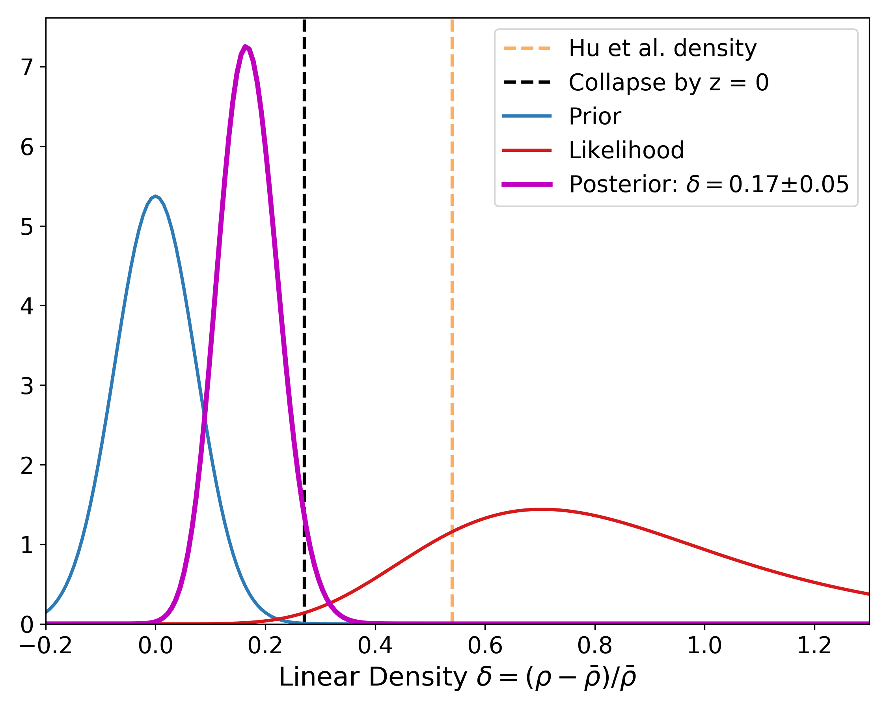
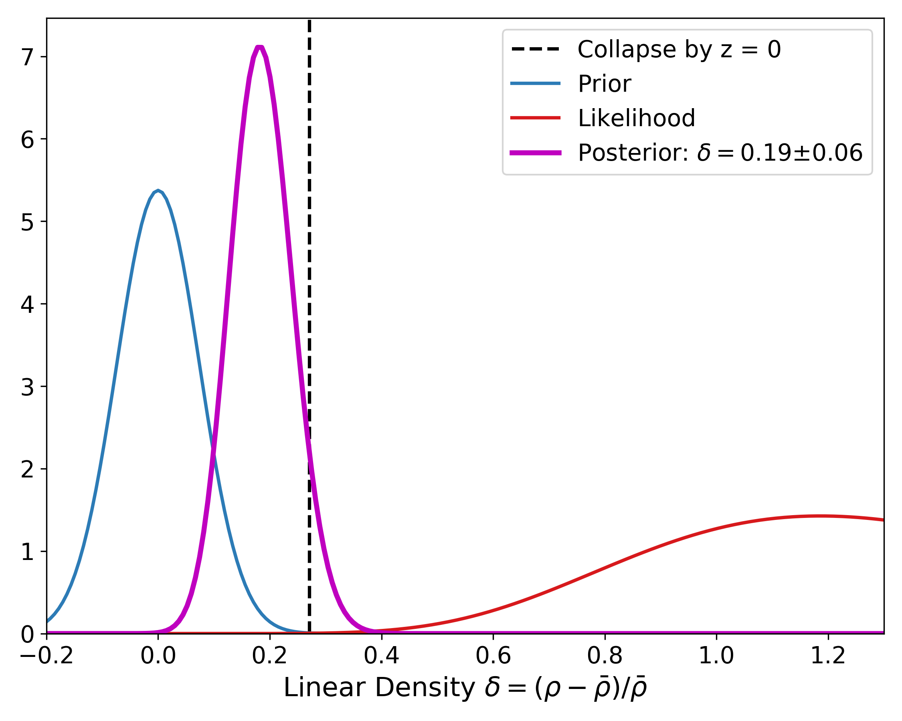
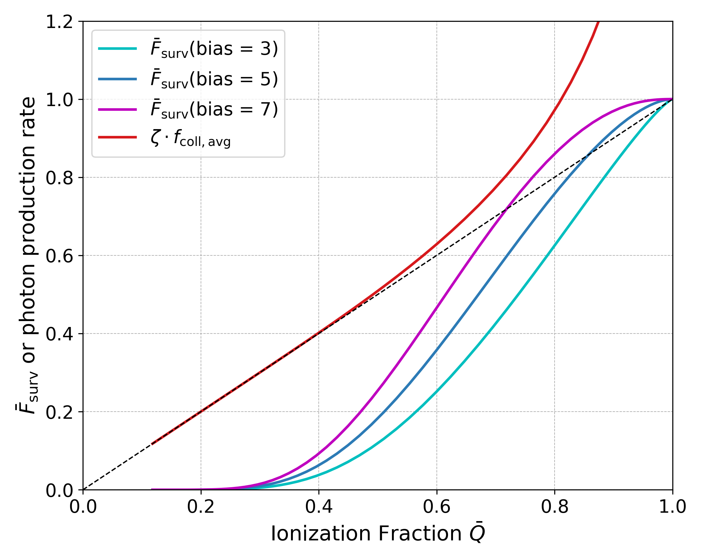
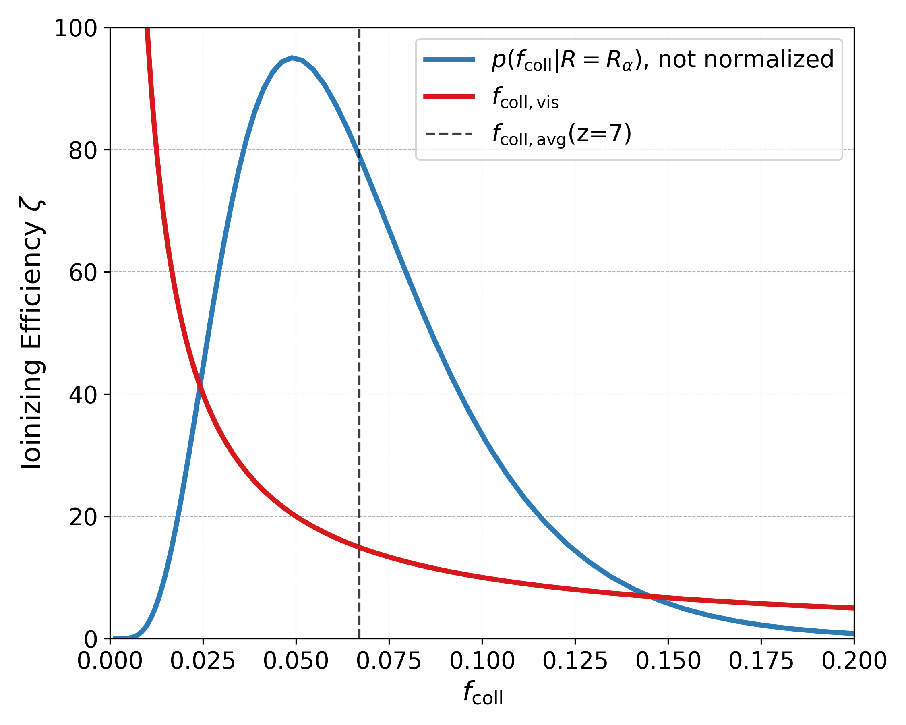

$\newcommand{\ensuremath}{}$
$\newcommand{\xspace}{}$
$\newcommand{\object}[1]{\texttt{#1}}$
$\newcommand{\farcs}{{.}''}$
$\newcommand{\farcm}{{.}'}$
$\newcommand{\arcsec}{''}$
$\newcommand{\arcmin}{'}$
$\newcommand{\ion}[2]{#1#2}$
$\newcommand{\textsc}[1]{\textrm{#1}}$
$\newcommand{\hl}[1]{\textrm{#1}}$
$\newcommand$
$\newcommand$
$\newcommand$
$\newcommand$
$\newcommand$
$\newcommand$
$\newcommand$
$\newcommand$
$\newcommand$
$\newcommand$
$\newcommand$
$\newcommand$
$\newcommand$
$\newcommand$
$\newcommand$
$\newcommand$
$\newcommand$
$\newcommand$
$\newcommand$
$\newcommand$
$\newcommand$
$\newcommand$
$\newcommand$
$\newcommand$
$\newcommand{\thebibliography}{\DeclareRobustCommand{\VAN}[3]{##3}\VANthebibliography}$

$\newcommand{\ensuremath}{}$
$\newcommand{\xspace}{}$
$\newcommand{\object}[1]{\texttt{#1}}$
$\newcommand{\farcs}{{.}''}$
$\newcommand{\farcm}{{.}'}$
$\newcommand{\arcsec}{''}$
$\newcommand{\arcmin}{'}$
$\newcommand{\ion}[2]{#1#2}$
$\newcommand{\textsc}[1]{\textrm{#1}}$
$\newcommand{\hl}[1]{\textrm{#1}}$
$\newcommand$
$\newcommand$
$\newcommand$
$\newcommand$
$\newcommand$
$\newcommand$
$\newcommand$
$\newcommand$
$\newcommand$
$\newcommand$
$\newcommand$
$\newcommand$
$\newcommand$
$\newcommand$
$\newcommand$
$\newcommand$
$\newcommand$
$\newcommand$
$\newcommand$
$\newcommand$
$\newcommand$
$\newcommand$
$\newcommand$
$\newcommand$
$\newcommand{\thebibliography}{\DeclareRobustCommand{\VAN}[3]{##3}\VANthebibliography}$

# Lyman-$\alpha$ Emitters in Ionized Bubbles: Constraining the Environment and Ionized Fraction

<mark>Appeared on: 2022-10-12</mark> - _14 pages, 14 figures, submitted to MNRAS_

A.C. Trapp, Steven R. Furlanetto, <mark><mark>Frederick B. Davies</mark></mark>

**Abstract:** Lyman-alpha emitters (LAEs) are excellent probes of the reionization process, as they must be surrounded by large ionized bubbles in order to be visible during the reionization era. Large ionized regions are thought to correspond to over-dense regions and may beprotoclusters, making them interesting test-beds for early massive structures.Close associations containing several LAEs are often assumed to mark over-dense, ionized bubbles.Here, we develop the first framework to quantify the ionization and density fields of high- $z$ galaxy associations.We explore the interplay between _(i)_ the large-scale density of a survey field, _(ii)_ Poisson noise due to the small number density of bright sources at high redshifts ( $z \sim$ 7), and _(iii)_ the effects of the ionized fraction on the observation of LAEs.We use Bayesian statistics, a simple model of reionization, and a Monte-Carlo simulation to construct a more comprehensive method for calculating the large-scale density of LAE regions than previous works.We find that Poisson noise has a strong effect on the inferred density of a regionand show how the ionized fraction can be inferred. We then apply our framework to the strongest association yet identified: Hu et al. (2021) found 14 LAEs in a volume of $\sim$ 50,000 cMpc $^3$ inside the COSMOS field at $z \sim7$ . We show that this is most likely a 2.5 $\sigma$ over-densityinside of an ionized or nearly ionized bubble. We also show that this LAE association implies that the global ionized fraction is $\bar{Q} = 0.60^{+0.08}_{-0.09}$ , within the context of a simple reionization model.

**Figure 13. -** 
    The inferred density  for the  ([Hu, et. al (2021)](https://ui.adsabs.harvard.edu/abs/2021NatAs...5..485H))  volume, assuming no effect from reionization.  *Left:* The _magenta curve_ shows the posterior of the linear density, which has 68.27\% credible interval
    $\delta = 0.17 \pm 0.05$, taking the average source density from the COSMOS field alone.
    The vertical dashed _black_ line indicates the approximate density required for this region to virialize by $z = $ 0, $\delta_{\textrm{pc}} = 0.27$, which is disfavored by the posterior. The vertical dashed _orange_ line shows the density estimate of  ([Hu, et. al (2021)](https://ui.adsabs.harvard.edu/abs/2021NatAs...5..485H)) .
    The _red and blue_ curves show the likelihood and prior, respectively;
    we are in the prior-dominated regime, given the likelihood's large breadth.
    The likelihood and prior are very far apart, indicating that this volume is a rare find; we show in the text that
    the probability of finding at least one such region in a larger survey of 20 similar volumes (the COSMOS field) is 0.11\%. *Right:* Same, but using the $\Nexpavg$ value from all 4 LAGER fields. The inferred density increases from $\delta = 0.17 \rightarrow 0.19$. The probability of finding at least one such region in a larger survey of 118 similar volumes (all 4 LAGER fields) drops to 0.01\%. (*lae_fig:HuPost_COSMOS*)

**Figure 4. -** 
    The fraction of LAEs that are visible $\Fsurvavg$ as a function of average ionization fraction $\bar{Q}$ for various bias values.
    Higher bias values result in a larger fraction of all LAEs being visible for a given ionization fraction of the Universe.
    The _red_ line shows the total ionizing photon production rate $\zeta \cdot f_{\textrm{coll,avg}}$, for which a value above the line $x=y$ means photons are escaping their host galaxies but being absorbed before contributing to reionization. The most over-dense $R_\alpha$ regions are overproducing photons but can't help their neighbors reionize. This effect is only large when the Universe is mostly reionized. (*lae_fig:Fsurvive*)

**Figure 3. -** 
    Properties of our simple reionization model. The
    _red_ curve shows the ionizing efficiency required to ionize an independent region as a function of its collapse fraction (see eq. \ref{lae_eq:Qzetafcoll}).
    The _blue_ curve shows $p(f_{\textrm{coll}}|R=R_\alpha)$, the (un-normalized) probability distribution of collapse fractions for regions of size $R = R_\alpha$. The _black dashed_ curve shows the  average collapse fraction at $z=$ 7. (*lae_fig:zetafcoll*)

