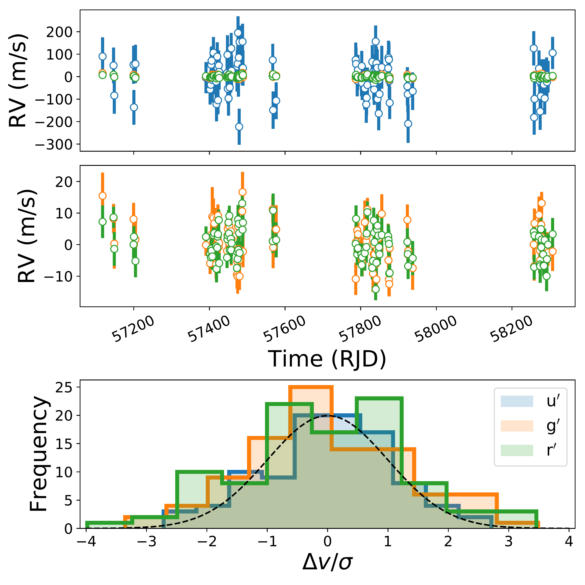

$\newcommand{\ensuremath}{}$
$\newcommand{\xspace}{}$
$\newcommand{\object}[1]{\texttt{#1}}$
$\newcommand{\farcs}{{.}''}$
$\newcommand{\farcm}{{.}'}$
$\newcommand{\arcsec}{''}$
$\newcommand{\arcmin}{'}$
$\newcommand{\ion}[2]{#1#2}$
$\newcommand{\textsc}[1]{\textrm{#1}}$
$\newcommand{\hl}[1]{\textrm{#1}}$
$\newcommand{\me}{~\rm M_{\oplus}}$
$\newcommand{\re}{~\rm R_{\oplus}}$
$\newcommand{\ms}{~\rm M_{\odot}}$
$\newcommand$

$\newcommand{$\ensuremath$}{}$
$\newcommand{$\xspace$}{}$
$\newcommand{$\object$}[1]{\texttt{#1}}$
$\newcommand{$\farcs$}{{.}''}$
$\newcommand{$\farcm$}{{.}'}$
$\newcommand{$\arcsec$}{''}$
$\newcommand{$\arcmin$}{'}$
$\newcommand{$\ion$}[2]{#1#2}$
$\newcommand{$\textsc$}[1]{\textrm{#1}}$
$\newcommand{$\hl$}[1]{\textrm{#1}}$
$\newcommand{$\me$}{~\rm M_{\oplus}}$
$\newcommand{$\re$}{~\rm R_{\oplus}}$
$\newcommand{$\ms$}{~\rm M_{\odot}}$
$\newcommand$

# Revisiting Radial Velocity Measurements of the K2-18 System with the Line-by-Line Framework

<mark>Appeared on: 2022-10-18</mark> - _16 pages, 11 figures. Accepted in MNRAS_

Michael Radica, et al. -- incl., <mark><mark>Thomas Henning</mark></mark>

**Abstract:** The cross-correlation function and template matching techniques have dominated the world of precision radial velocities for many years. Recently, a new technique, named line-by-line, has been developed as an outlier resistant way to efficiently extract radial velocity content from high resolution spectra. We apply this new method to archival HARPS and CARMENES datasets of the K2-18 system. After reprocessing the HARPS dataset with the line-by-line framework, we are able to replicate the findings of previous studies. Furthermore, by splitting the full wavelength range into sub-domains, we were able to identify a systematic chromatic correlation of the radial velocities in the reprocessed CARMENES dataset. After post-processing the radial velocities to remove this correlation, as well as rejecting some outlier nights, we robustly uncover the signal of both K2-18 b and K2-18 c, with masses that agree with those found from our analysis of the HARPS dataset. We then combine both the HARPS and CARMENES velocities to refine the parameters of both planets, notably resulting in a revised mass and period for K2-18 c of$6.99^{+0.96}_{-0.99}$\meand$9.2072\pm0.0065$d, respectively. Our work thoroughly demonstrates the power of the line-by-line technique for the extraction of precision radial velocity information.

**Figure 11. -** Posterior distributions for all fitted parameters for the joint HARPS + CARMENES + K2 (green) fit, as well as for the individual HARPS + K2 (blue) and CARMENES + K2 (red) fits. Labels capping each column are the median, and 1$\sigma$ errors for the joint fit. In general, the HARPS and CARMENES posteriors are nearly identical, with CARMENES proving to be 1$\sigma$ consistent, although marginally less constraining for the RV semi-amplitudes of both planets, as well as the orbital parameters of K2-18 c.
    \label{fig:JOINT Corner} (*fig:JOINT Corner*)

**Figure 1. -** \emph{Top}: Median subtracted RV values for each of our three chosen HARPS bands.
    \emph{Middle}: Same as the top, but with the $u^\prime$ band removed to better visualize the other two bands.
    \emph{Bottom}: Histogram showing the velocity difference from the mean, divided by the RV error for each band. The distribution for each band traces a normal distribution (dashed black curve), and no $>$5$\sigma$ outliers are present.
    \label{fig:HARPS_hist} (*fig:HARPS_hist*)

**Figure 2. -** Lomb-Scargle periodograms for each of our three HARPS bands, as well as the total RV and dLW parameter. The derived orbital periods of K2-18 b, and c, as well as the stellar rotation period (from Section $\re$f{sec: HARPS Revisited}) are denoted with blue, green, and red dotted vertical lines respectively. The 1\%, and 0.1\% false alarm probabilities are denoted via the grey horizontal dotted lines. The next to last panel also displays the periodogram of the window function in red.
    \label{fig:HARPS_periodogram} (*fig:HARPS_periodogram*)

