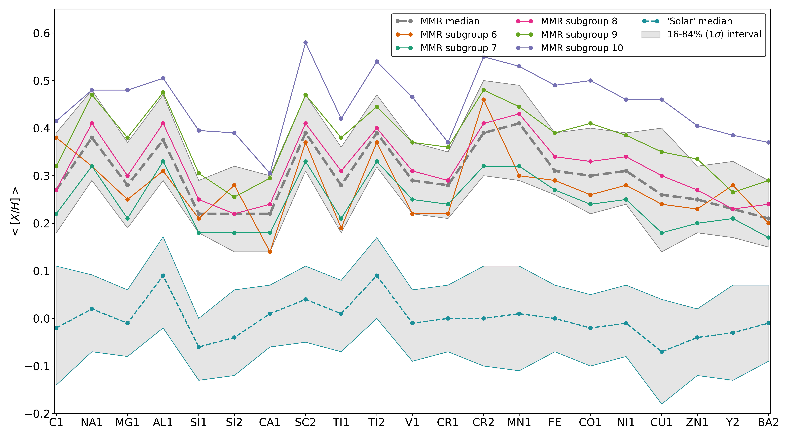
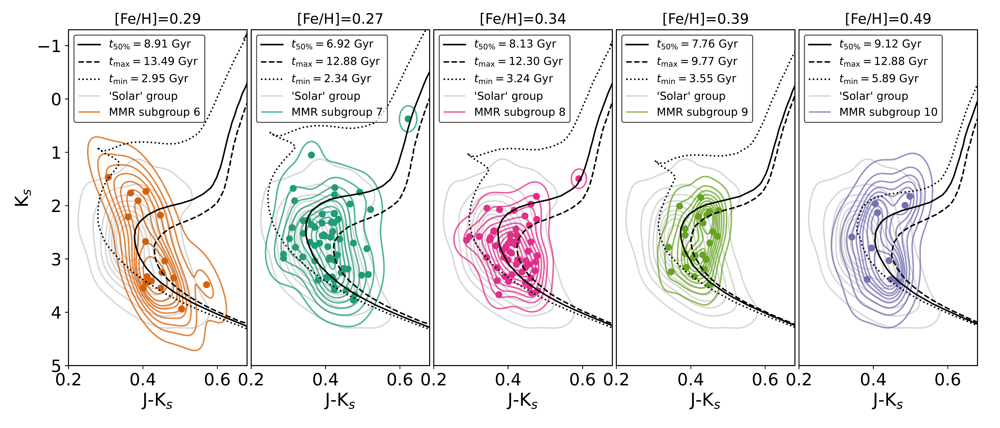

$\newcommand{\ensuremath}{}$
$\newcommand{\xspace}{}$
$\newcommand{\object}[1]{\texttt{#1}}$
$\newcommand{\farcs}{{.}''}$
$\newcommand{\farcm}{{.}'}$
$\newcommand{\arcsec}{''}$
$\newcommand{\arcmin}{'}$
$\newcommand{\ion}[2]{#1#2}$
$\newcommand{\textsc}[1]{\textrm{#1}}$
$\newcommand{\hl}[1]{\textrm{#1}}$
$\newcommand$

$\newcommand{$\ensuremath$}{}$
$\newcommand{$\xspace$}{}$
$\newcommand{$\object$}[1]{\texttt{#1}}$
$\newcommand{$\farcs$}{{.}''}$
$\newcommand{$\farcm$}{{.}'}$
$\newcommand{$\arcsec$}{''}$
$\newcommand{$\arcmin$}{'}$
$\newcommand{$\ion$}[2]{#1#2}$
$\newcommand{$\textsc$}[1]{\textrm{#1}}$
$\newcommand{$\hl$}[1]{\textrm{#1}}$
$\newcommand$

# Table XX is only available in electronic form at the CDS via anonymous ftp to cdsarc.u-strasbg.fr (130.79.128.5) or via http://cdsweb.u-strasbg.fr/cgi-bin/qcat?J/A+A/.

<mark>Appeared on: 2022-10-18</mark> - _18 pages, 13 figures. A&A in review; version after second interaction with the referee. The catalogue remains to be released. Abridged abstract to fit arxiv's requirements_

M. L. L. Dantas, et al. -- incl., <mark><mark>G. Guiglion</mark></mark>, <mark><mark>M. Bergemann</mark></mark>

**Abstract:** The Solar vicinity is currently populated by a mix of stars with various chemo-dynamical properties, including stars with a high metallicity when compared to the Sun. Dynamical processes such as churning and blurring are expected to relocate such metal-rich stars from the inner Galaxy to the Solar region.We report the identification of a set of old super metal-rich (+0.15$\leq$[Fe/H]$\leq$+0.50) dwarf stars with orbits of low eccentricity ($e \lesssim 0.2$) that reach a maximum height from the Galactic plane between$\sim$0.5-1.5 kpc. We discuss their chemo-dynamical properties with the goal of understanding their potential origins.We use data from the internal data release 6 of the\textit{Gaia}-ESO Survey. We selected stars observed at high resolution with abundances of 21 species of 18 individual elements (i.e. 21 dimensions). We apply a hierarchical clustering algorithm to group the stars with similar chemical abundances within the complete chemical abundance space. Orbits were integrated using astrometric data from\textit{Gaia}and radial velocities from\textit{Gaia}-ESO. Stellar ages were estimated using isochrones and a Bayesian method.According to their chemical properties, this set of super metal-rich stars can be arranged into five subgroups. Four of them seem to follow a chemical enrichment flow, where nearly all abundances increase in lockstep with Fe. The fifth subgroup shows different chemical characteristics. All subgroups have the following features: median ages of the order of 7--9 Gyr (with five outlier stars of estimated younger age), Solar or sub-Solar[Mg/Fe]ratios, maximum height from the Galactic plane between 0.5--1.5 kpc, low eccentricities ($e\lesssim$0.2), and a detachment from the expected metallicity gradient with guiding radius (which varies between$\sim$6 to 9 kpc for the majority of the stars).The high metallicity of our stars is incompatible with a formation in the Solar neighbourhood. Their dynamic properties agree with theoretical expectations that these stars travelled from the inner Galaxy due to blurring and, most importantly, to churning. We, therefore, suggest that most of the stars in this population originated in the inner regions of the Milky Way (inner disc and/or the bulge) and later migrated to the Solar neighbourhood. The region from where the stars originated had a complex chemical enrichment history, with contribution from supernovae types Ia and II, and possibly asymptotic giant branch stars as well.

**Figure 5. -** \textit{Top panel:} median abundances $\langle \rm{[X/H]} \rangle$($y$-axis) of each element X ($x$-axis) for the most metal-rich (MMR) group. The grey and cyan thick dashed lines are the median abundances of each element of the MMR and `solar' groups respectively, whereas the grey area represents 1$\sigma$(16-84\%) confidence interval for each one. The purple, light green, pink, dark green, and orange lines represent respectively the MMR subgroups 6 to 10 given by the hierarchical clustering in Fig. \ref{fig:dendrogram}. Disclaimer: this image does not represent a regression; the lines connecting the abundances act as a visual guide to depict whether the abundances of each element increase or decrease in comparison with the previous one. \textit{Bottom panel:} an analogue image of top panel but with the distributions of the same abundances ([X/H]) in the shape of letter-value plots \citep[which is a more general version of the box-plot,][]{Hofmann2017} with \texttt{k\_depth} set as \texttt{`trustworthy'}. The colours are the same as the top panel, but with the `solar' group omitted. The vertical lines divide the distributions by element. The outliers are the diamond-shaped fliers. The bottom panel has been made with $\textsc${seaborn}, a $\textsc${python} package for data visualisation \citep{Waskom2021}. In both panels the abundances are shown in increasing order of atomic number. (*fig:abund_lvplot*)

**Figure 7. -** \emph{Top panel:} surface gravity \emph{vs.} effective temperature [$\log(g)$\emph{vs.}$T_{\rm{eff}}$] for the five MMR subgroups in the same colours as Fig. \ref{fig:abund_lvplot} in the shape of 2D kernel density plots with their respective scatter markers. In grey we display the `solar' group parameters for comparison. Isochrones for the maximum, median, and minimum ages (according to Table \ref{tab:mmr_subgs_ages}) are also displayed in dashed, straight, and dotted lines respectively.  All isochrones shown are in terms of the median values of [Fe/H] shown in Table \ref{tab:mmr_subgs}. It is worth mentioning that the stars herein shown also have a distribution of metallicities that are not shown in the isochrones. \emph{Bottom panel}: equivalent colour-magnitude diagram (CMD) of the top panel. The CMD uses \emph{JHK$_s$} absolute magnitudes from 2MASS, which were used by $\textsc${unidam} to estimate the ages. (*fig:logg_teff_kde*)

**Figure 1. -** Median eccentricities ($\langle e \rangle$) shown as a 1D-Gaussian kernel densities for all the MMR subgroups (6 to 10). Medians for each distribution displayed in dashed lines with the same colours as the corresponding distributions. It is noticeable that most of the stars peak at $\langle e \rangle < 0.2$, except for groups 9 and 10 that have $\langle e \rangle$ slightly higher than 2. This is in agreement with \citet[][see Fig. 3 therein]{Sales2009} and \citet[][see Fig. 9 therein]{Kordopatis2015}. (*fig:appendix_eccentricities*)

