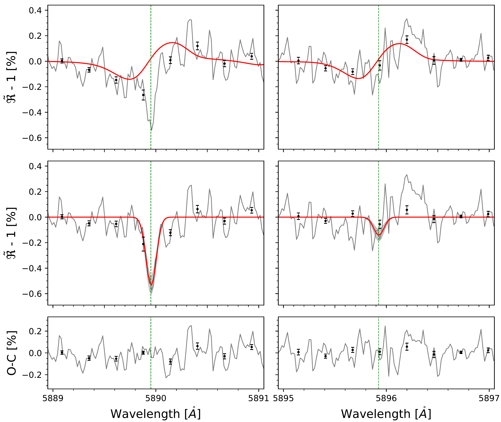
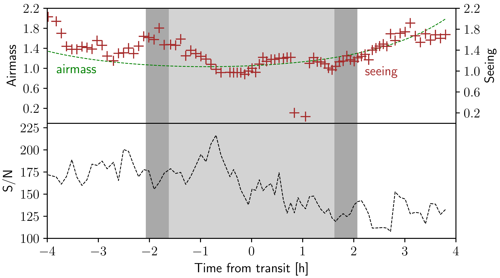
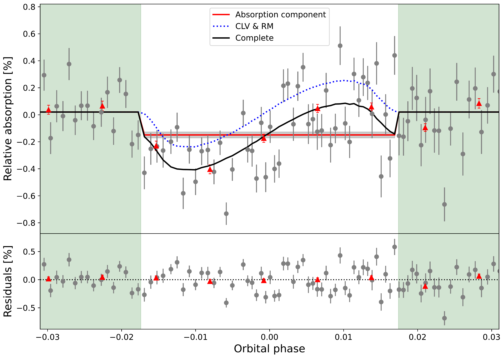

$\newcommand{\ensuremath}{}$
$\newcommand{\xspace}{}$
$\newcommand{\object}[1]{\texttt{#1}}$
$\newcommand{\farcs}{{.}''}$
$\newcommand{\farcm}{{.}'}$
$\newcommand{\arcsec}{''}$
$\newcommand{\arcmin}{'}$
$\newcommand{\ion}[2]{#1#2}$
$\newcommand{\textsc}[1]{\textrm{#1}}$
$\newcommand{\hl}[1]{\textrm{#1}}$
$\newcommand{\wb}[0]{\mbox{WASP-7} b}$
$\newcommand{\tbd}[1]{{\color{blue}TBD: #1}}$
$\newcommand{\ms}[0]{m s^{-1}}$
$\newcommand{\kms}[0]{km s^{-1}}$
$\newcommand{\cahk}[0]{\ion{Ca}{ii} H and K}$
$\newcommand{\ha}[0]{\mbox{H\alpha}}$
$\newcommand{\mf}[0]{\texttt{molecfit}}$
$\newcommand{\Mf}[0]{\texttt{Molecfit}}$
$\newcommand{\hb}[0]{\mbox{H\beta}}$
$\newcommand{\hg}[0]{\mbox{H\gamma}}$

$\newcommand{\ensuremath}{}$
$\newcommand{\xspace}{}$
$\newcommand{\object}[1]{\texttt{#1}}$
$\newcommand{\farcs}{{.}''}$
$\newcommand{\farcm}{{.}'}$
$\newcommand{\arcsec}{''}$
$\newcommand{\arcmin}{'}$
$\newcommand{\ion}[2]{#1#2}$
$\newcommand{\textsc}[1]{\textrm{#1}}$
$\newcommand{\hl}[1]{\textrm{#1}}$
$\newcommand{\wb}[0]{\mbox{WASP-7} b}$
$\newcommand{\tbd}[1]{{\color{blue}TBD: #1}}$
$\newcommand{\ms}[0]{m s^{-1}}$
$\newcommand{\kms}[0]{km s^{-1}}$
$\newcommand{\cahk}[0]{\ion{Ca}{ii} H and K}$
$\newcommand{\ha}[0]{\mbox{H\alpha}}$
$\newcommand{\mf}[0]{\texttt{molecfit}}$
$\newcommand{\Mf}[0]{\texttt{Molecfit}}$
$\newcommand{\hb}[0]{\mbox{H\beta}}$
$\newcommand{\hg}[0]{\mbox{H\gamma}}$

# Transmission spectroscopy of \wb with UVES\thanks{Based on observations collected at the European Southern Observatory under ESO programme ID 091.C-0632(A) (PI: F. Pfeifer).}

<mark>Appeared on: 2022-10-16</mark> - _Accepted for publication in A&A_

Hossein Rahmati, Stefan Czesla, Sara Khalafinejad, <mark>Paul Mollière</mark>

**Abstract:** Transmission spectroscopy is a prime technique to study the chemical composition and structure of exoplanetary atmospheres. Strong excess absorption signals have been detected in the optical \ion{Na}{I} D $1,2$ Fraunhofer lines during transits of hot Jupiters, which are attributed to the planetary atmospheres and allow us to constrain their structure. We study the atmosphere of \wb by means of high-resolution transit spectroscopy in the sodium lines. We analyzed a spectral transit time series of 89 high-resolution spectra of the hot Jupiter WASP-7 b that was observed using the Ultraviolet and Visual Echelle Spectrograph (UVES). We used the telluric lines for an accurate alignment of the spectra and carried out a telluric correction with \mf . Stellar magnetic activity was monitored by investigating chromospheric lines such as the \cahk , and hydrogen \ha lines. Finally, we obtained transmission spectra and light curves for various lines. The star shows no identifiable flares and, if any, marginal changes in activity during our observing run. The sodium transmission spectra and corresponding light curves clearly show signs of the Rossiter-McLaughlin (RM) effect and the stellar center-to-limb variation (CLV) that we modeled using synthetic spectra. A statistically significant, narrow absorption feature with a line contrast of 0.50 $\pm$ 0.06 \% (at $\sim 8.3\sigma$ level) and a full width at half maximum (FWHM) of 0.13 $\pm$ 0.02 {Å} is detected at the location of the \ion{Na}{I} D $_2$ line. For the \ion{Na}{I} D $_1$ line signal, we derived a line contrast of 0.13 $\pm$ 0.04 \% (at $\sim 3.2\sigma$ level), which we consider a tentative detection.In addition, we provide upper limits for absorption by the hydrogen Balmer lines ( \ha , \hb , and \hg ), K {\sc i} $\lambda$ 7699 {Å} , Ca {\sc ii} H and K, and infra-red triplet (IRT) lines.

**Figure 10. -** Transmission spectrum of WASP-7 b around the $\ion${Na}{i} D$_2$(left column) and $\ion${Na}{i} D$_1$(right column) lines. Top panels: Observed transmission spectrum (gray), along with best-fit model components representing the CLV and RM effects (solid red). Middle panels: Observed transmission spectrum with the best-fit Gaussian absorption components (red), and with the model shown in the upper panels subtracted (gray). The gray shades indicate 1$\sigma$ uncertainty of the best-fit model (red). Bottom panel: Residuals with respect to the best-fit model. The black data points correspond to binning by a factor of 15.
         (*fig:transmission-spectrum*)

**Figure 1. -** Time evolution of seeing in arcsec (brown crosses, top panel), airmass (dashed green lines, top panel), and S/N in the regions of the Na doublet lines (bottom panel). Dark gray shades indicate the ranges of ingress and egress, and light shades show the range between second and third contact.
   (*fig:airmass*)

**Figure 8. -** Transmission light curves of WASP-7 b around the $\ion${Na}{i} D$_2$ line. Top panel: Observation transmission light curves (gray) and modeled transmission light curves of the RM and the CLV (dotted blue line) for the 0.45 Å integration band centered on the $\ion${Na}{I} D$_2$ line. The dashed red line is the absorption component using a box model, and the gray shades denote its 1$\sigma$ uncertainty. The solid black line is the best-fit combined model and the red points show binning by a factor of ten. Bottom panel: Residuals for binned and unbinned data. Green shades indicate out-of-transit time throughout. (*fig:transmission-light-curve*)

