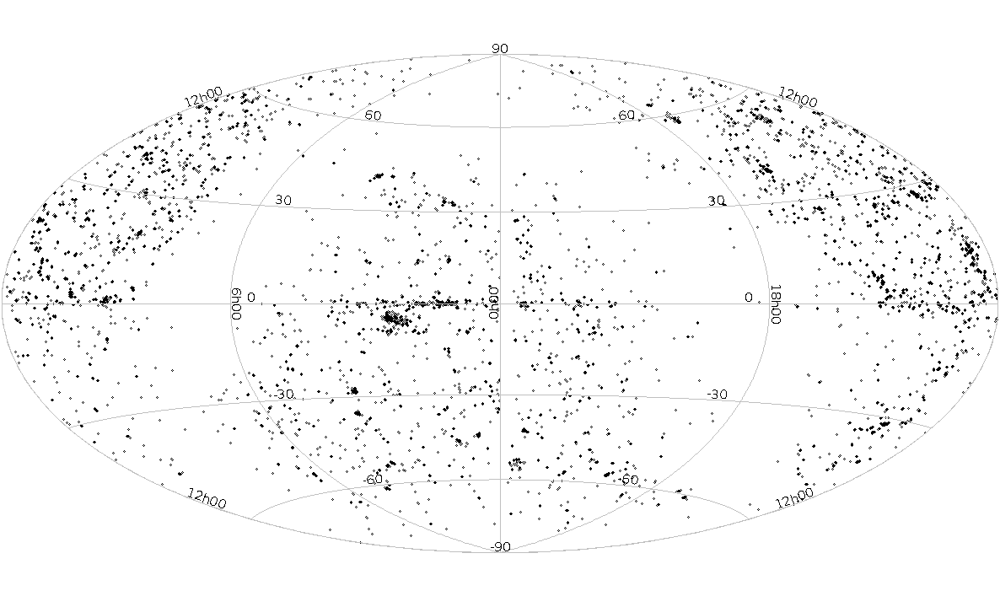
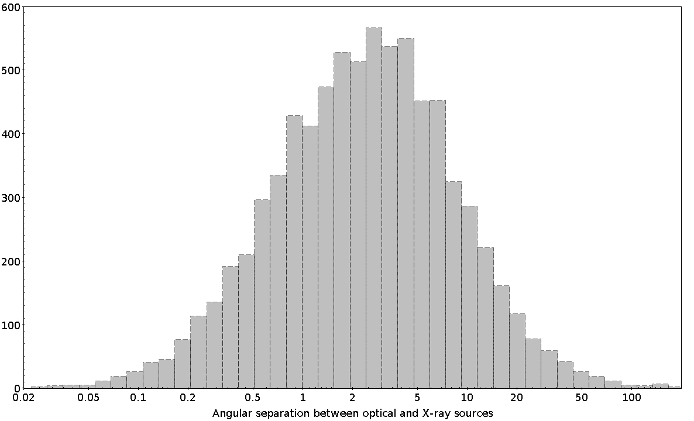

$\newcommand{\ensuremath}{}$
$\newcommand{\xspace}{}$
$\newcommand{\object}[1]{\texttt{#1}}$
$\newcommand{\farcs}{{.}''}$
$\newcommand{\farcm}{{.}'}$
$\newcommand{\arcsec}{''}$
$\newcommand{\arcmin}{'}$
$\newcommand{\ion}[2]{#1#2}$
$\newcommand{\textsc}[1]{\textrm{#1}}$
$\newcommand{\hl}[1]{\textrm{#1}}$

$\newcommand{$\ensuremath$}{}$
$\newcommand{$\xspace$}{}$
$\newcommand{$\object$}[1]{\texttt{#1}}$
$\newcommand{$\farcs$}{{.}''}$
$\newcommand{$\farcm$}{{.}'}$
$\newcommand{$\arcsec$}{''}$
$\newcommand{$\arcmin$}{'}$
$\newcommand{$\ion$}[2]{#1#2}$
$\newcommand{$\textsc$}[1]{\textrm{#1}}$
$\newcommand{$\hl$}[1]{\textrm{#1}}$

# X-ray galaxies selected from HyperLEDA database

<mark>Appeared on: 2022-10-20</mark> - _11 pages and 5 figures_

<mark><mark>N. Pulatova</mark></mark>, et al. -- incl., <mark><mark>R. Seeburger</mark></mark>

**Abstract:** We cross-matched the 4XMM-DR10 catalog with the HyperLEDA database and obtained the new sample of galaxies that contain X-ray sources. Excluding duplicate observations and false matches, we present a total of 7759 galaxies with X-ray sources. In the current work, we present general properties of the sample: namely the distribution in equatorial coordinates, radial velocity distribution, morphological type, and X-ray fluxes. The sample includes morphological classification for 5241 galaxies with X-ray emission, almost half of which, 42\%, are elliptical (E, E-S0). Most galaxies in the sample have nuclear X-ray emission (6313 or 81\%), and the remaining 1443 (19\%) present X-ray emission from the host galaxy. This sample can be used for future deep studies of multi wavelengths properties of the galaxies with X-ray emission.\\[1ex]{\bf Key words:}X-rays: galaxies, catalogues, galaxies: statistics

**Figure 4. -** Optical B magnitude and X-ray flux. The three regions marked with the numbers 1-3 corresponds to: 1 - brightest galaxies with low redshift; 2 - the limit of  XMM sensitivity; 3- the gap between two populations of active galaxies. (*fig4*)

**Figure 1. -** Distribution in equatorial coordinates (*fig1*)

**Figure 2. -** The angular separation between the position of objects
in HyperLEDA and XMM-Newton catalogues, in $arcsec (")$. (*fig2*)

