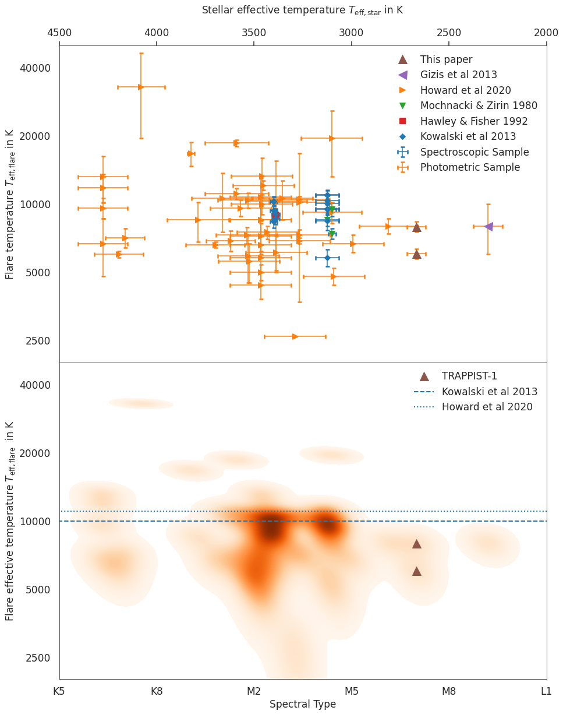
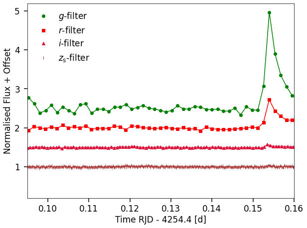
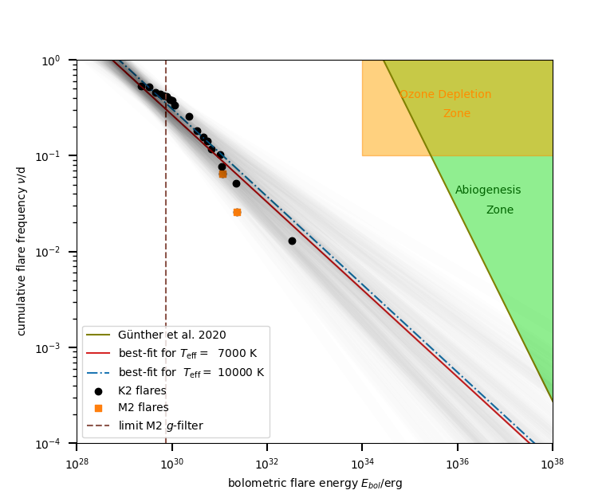

$\newcommand{\ensuremath}{}$
$\newcommand{\xspace}{}$
$\newcommand{\object}[1]{\texttt{#1}}$
$\newcommand{\farcs}{{.}''}$
$\newcommand{\farcm}{{.}'}$
$\newcommand{\arcsec}{''}$
$\newcommand{\arcmin}{'}$
$\newcommand{\ion}[2]{#1#2}$
$\newcommand{\textsc}[1]{\textrm{#1}}$
$\newcommand{\hl}[1]{\textrm{#1}}$

$\newcommand{$\ensuremath$}{}$
$\newcommand{$\xspace$}{}$
$\newcommand{$\object$}[1]{\texttt{#1}}$
$\newcommand{$\farcs$}{{.}''}$
$\newcommand{$\farcm$}{{.}'}$
$\newcommand{$\arcsec$}{''}$
$\newcommand{$\arcmin$}{'}$
$\newcommand{$\ion$}[2]{#1#2}$
$\newcommand{$\textsc$}[1]{\textrm{#1}}$
$\newcommand{$\hl$}[1]{\textrm{#1}}$

# Lower-than-expected flare temperatures for TRAPPIST-1

<mark>Appeared on: 2022-10-21</mark> - _17 pages, 11 figures, 2 tables, accepted for publication in A&A_

A. J. Maas, et al. -- incl., <mark>C.-L. Lin</mark>

**Abstract:** Although high energetic radiation from flares is a potential threat to exoplanet atmospheres and may lead to surface sterilization, it might also provide the extra energy for low-mass stars needed to trigger and sustain prebiotic chemistry. We investigate two flares on TRAPPIST-1, an ultra-cool dwarf star that hosts seven exoplanets of which three lie within its habitable zone. The flares are detected in all four passbands of the MuSCAT2 allowing a determination of their temperatures and bolometric energies. We analyzed the light curves of the MuSCAT1 and MuSCAT2 instruments obtained between 2016 and 2021 in $g,r,i,z_\mathrm{s}$-filters. We conducted an automated flare search and visually confirmed possible flare events. We studied the temperature evolution, the global temperature, and the peak temperature of both flares. For the first time we infer effective black body temperatures of flares that occurred on TRAPPIST-1. The black body temperatures for the two TRAPPIST-1 flares derived from the SED are consistent with $T_\mathrm{SED} = 7940_{-390}^{+430}$K and $T_\mathrm{SED} = 6030_{-270}^{+300}$K. The flare black body temperatures at the peak are also calculated from the peak SED yielding $T_\mathrm{SEDp} = 13620_{-1220}^{1520}$K and $T_\mathrm{SEDp} = 8290_{-550}^{+660}$K. We show that for the ultra-cool M-dwarf TRAPPIST-1 the flare black body temperatures associated with the total continuum emission are lower and not consistent with the usually adopted assumption of 9000-10000 K. This could imply different and faster cooling mechanisms. Further multi-color observations are needed to investigate whether or not our observations are a general characteristic of ultra-cool M-dwarfs. This would have significant implications for the habitability of exoplanets around these stars because the UV surface flux is likely to be overestimated by the models with higher flare temperatures. 

**Figure 8. -** Spectral type and stellar effective temperature versus total flare temperature for different photometric and spectroscopic studies: The upper panel uses the stellar effective temperature if available from the TESS input catalogue \citep{Stassun_2019}. For the Kowalski sample, we use conservative uncertainties of $\pm 500$K. The lower panel shows a density map of flare temperatures per spectral type that is consistent with the upper stellar effective temperatures. The flare temperature axis is represented in log-scale. The two TRAPPIST-1 flares are overplotted and the blue horizontal lines represent the average temperatures from the two biggest temperature samples. (*fig:fig9*)

**Figure 1. -** Light curve in all four filters of MuSCAT2 (M2) of Flare 1: The flare is visible in the $g$, $r$, and $i$ filter, whereas the S/N in the $z_\mathrm{s}$-filter is too low. To better distinguish between the four M2 channels, we add constant values to the flux. The time is given in days in reduced Julian date (RJD), RJD = BJD - 2454833 d where BJD is the barycentric Julian date.  (*fig:observation*)

**Figure 11. -** Flare frequency distribution for K2 and M2 data. The FFD for TRAPPIST-1 is updated by our flares indicated in orange. The black points are adopted from \citep{Paudel_2018}. The best fit to the power law is chosen from 2500 MC trials, here only 100 random samples are shown to mark the uncertainty of the model. Also overplotted are the abiogenesis zone in green \citep{Rimmer_2018,Gunther_2020} and the ozone-depletion zone in yellow \citep{2019_Tilley, Gunther_2020} for TRAPPIST-1. (*fig:FFD*)

