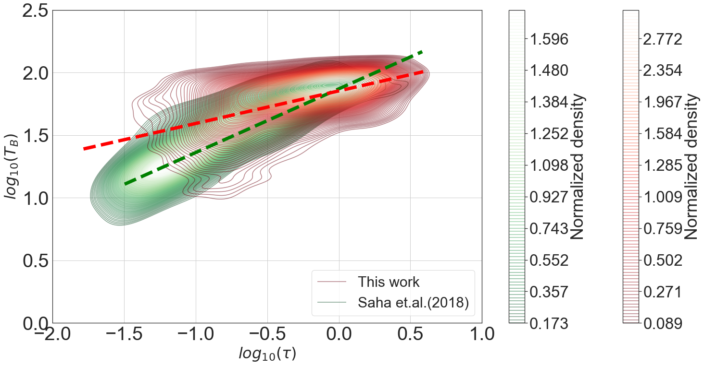
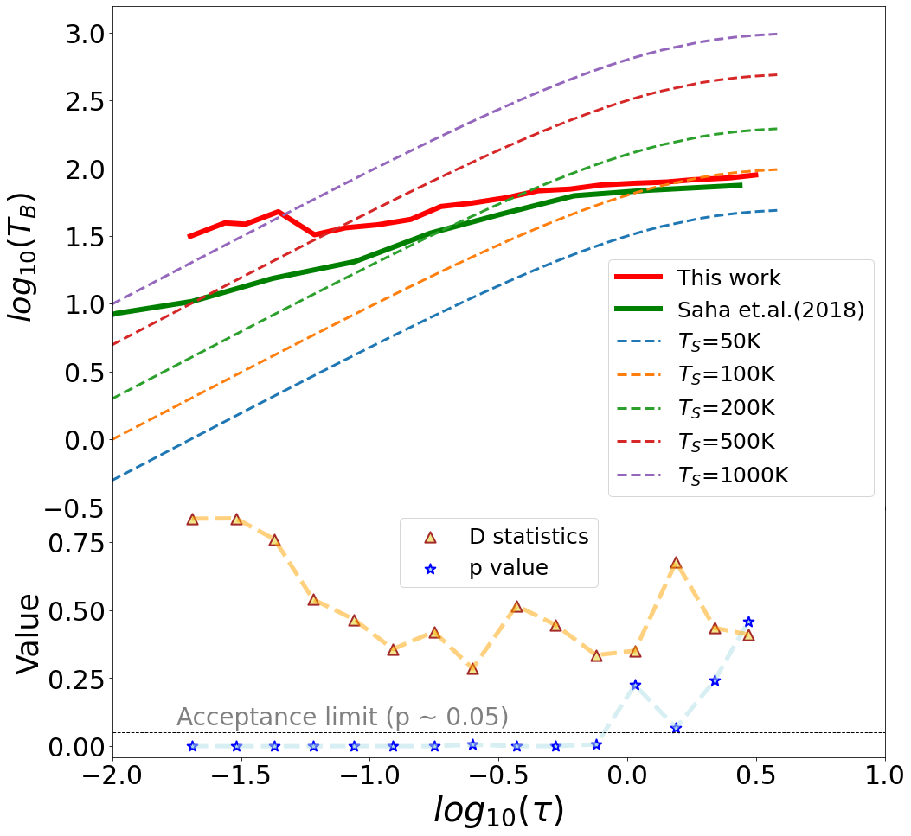
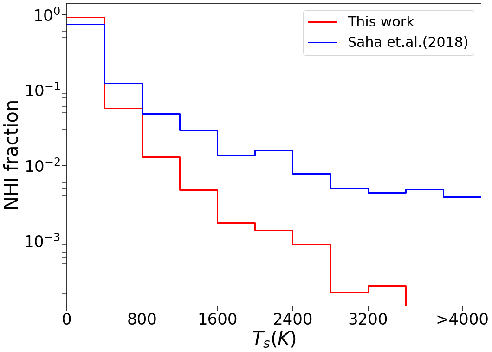
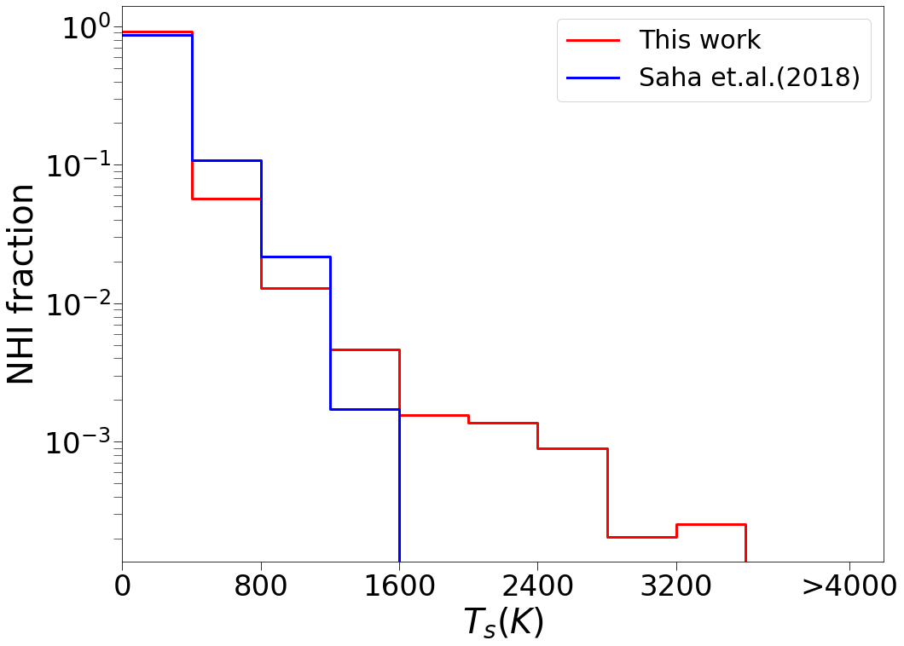
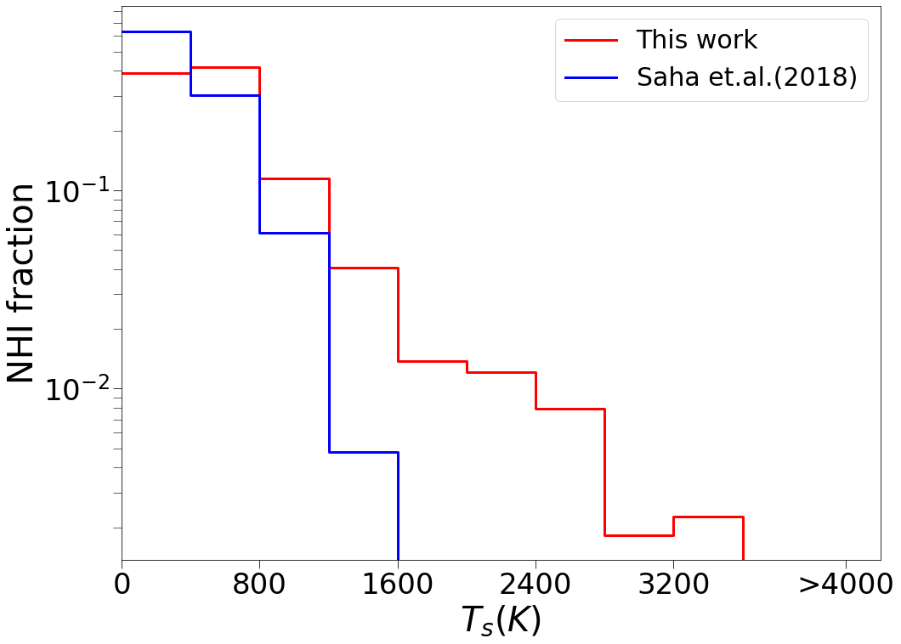
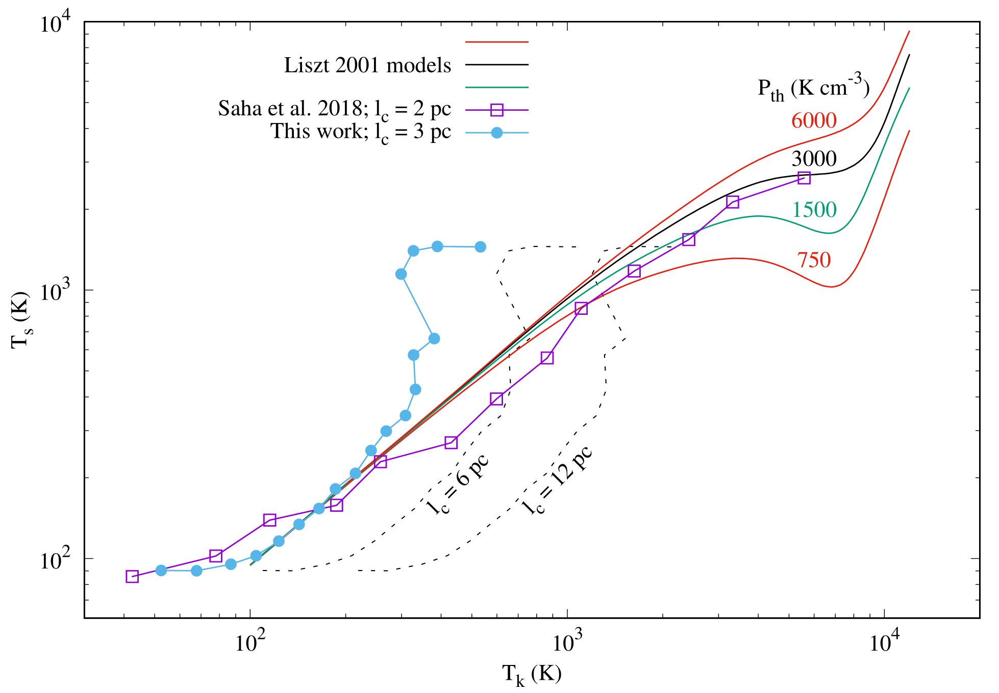

$\newcommand{\ensuremath}{}$
$\newcommand{\xspace}{}$
$\newcommand{\object}[1]{\texttt{#1}}$
$\newcommand{\farcs}{{.}''}$
$\newcommand{\farcm}{{.}'}$
$\newcommand{\arcsec}{''}$
$\newcommand{\arcmin}{'}$
$\newcommand{\ion}[2]{#1#2}$
$\newcommand{\textsc}[1]{\textrm{#1}}$
$\newcommand{\hl}[1]{\textrm{#1}}$
$\newcommand{\thebibliography}{\DeclareRobustCommand{\VAN}[3]{##3}\VANthebibliography}$

$\newcommand{$\ensuremath$}{}$
$\newcommand{$\xspace$}{}$
$\newcommand{$\object$}[1]{\texttt{#1}}$
$\newcommand{$\farcs$}{{.}''}$
$\newcommand{$\farcm$}{{.}'}$
$\newcommand{$\arcsec$}{''}$
$\newcommand{$\arcmin$}{'}$
$\newcommand{$\ion$}[2]{#1#2}$
$\newcommand{$\textsc$}[1]{\textrm{#1}}$
$\newcommand{$\hl$}[1]{\textrm{#1}}$
$\newcommand{$\thebibliography$}{\DeclareRobustCommand{\VAN}[3]{##3}\VANthebibliography}$

# Properties of atomic hydrogen gas in the Galactic plane from THOR 21-cm absorption spectra: a comparison with the high latitude gas

<mark>Appeared on: 2022-10-24</mark> - _6 pages, 5 figures, submitted and accepted for publication in MNRAS_

Arghyadeep Basu, et al. -- incl., <mark><mark>Henrik Beuther</mark></mark>, <mark><mark>Jonas Syed</mark></mark>

**Abstract:** The neutral hydrogen 21 cm line is an excellent tracer of the atomic interstellar medium in the cold and the warm phases. Combined 21 cm emission and absorption observations are very useful to study the properties of the gas over a wide range of density and temperature. In this work, we have used 21 cm absorption spectra from recent interferometric surveys, along with the corresponding emission spectra from earlier single dish surveys to study the properties of the atomic gas in the Milky Way. In particular, we focus on a comparison of properties between lines of sight through the gas disk in the Galactic plane and high Galactic latitude lines of sight through more diffuse gas. As expected, the analysis shows a lower average temperature for the gas in the Galactic plane compared to that along the high latitude lines of sight. The gas in the plane also has a higher molecular fraction, showing a sharp transition and flattening in the dust - gas correlation. On the other hand, the observed correlation between 21 cm brightness temperature and optical depth indicates some intrinsic difference in spin temperature distribution and a fraction of gas in the Galactic plane having intermediate optical depth (for$0.02<\tau<0.2$) but higher spin temperature, compared to that of the diffuse gas at high latitude with the same optical depth. This may be due to a small fraction of cold gas with slightly higher temperature and lower density present on the Galactic plane.

**Figure 2. -** Observed $T_{B} - \tau$ distribution (in $log_{10}$ scale) for H {\sc i} 21 cm emission and absorption lines. \textbf{Left}: Optical depth ($\tau$) from the THOR and brightness temperature $T_B$ from LAB survey (resampled to the same velocity resolution of 1.5 km s$^{-1}$) for corresponding spectral channels shown as density contours (red). The comparable $T_{B} - \tau$ distribution for the high latitude sample (ie. \citealt{saha}) is shown in green. Red and green dashed lines are corresponding fitted straight lines for these two samples. \textbf{Right:}(Top panel) Binned $T_B - \tau$ observed median distribution for low (red line) and high latitudes (green line) lines of sight. Dashed lines indicate the $T_B - \tau$ relation for constant $T_{s}$ values. (Bottom panel) Statistical values for the non-parametric K-S test over the same $log_{10}(\tau)$ range. (*fig:figure1*)

**Figure 5. -** Comparison of H {\sc i} column density fraction in different $T_{s}$ ranges between the THOR sample (this work) and the high latitude sample \citep{roy,saha}, shown in red and blue line respectively. \textbf{Left panel}: Entire range of $\tau$; \textbf{Middle panel}: For $\tau > 0.02$\textbf{Right panel}: For $0.2 > \tau > 0.02$.  (*fig:tsdistribution*)

**Figure 1. -** Comparison of inferred $T_{k}$ and $T_{s}$ from the THOR data with models from \citet{Lizst}. Solid lines are model $T_{k} - T_{s}$ relation for different thermal pressure. Line with filled circles is from this analysis, for $P_{th} = 3000  K cm^{-3}$ and $l_c = 3  pc$. Dashed lines are for $l_c = 6$ and 12 pc. Line with empty squares is based on data from \citet{saha} for $l_c = 2  pc$ for a comparison with the low latitude sample. (*fig:tstkcompare*)

