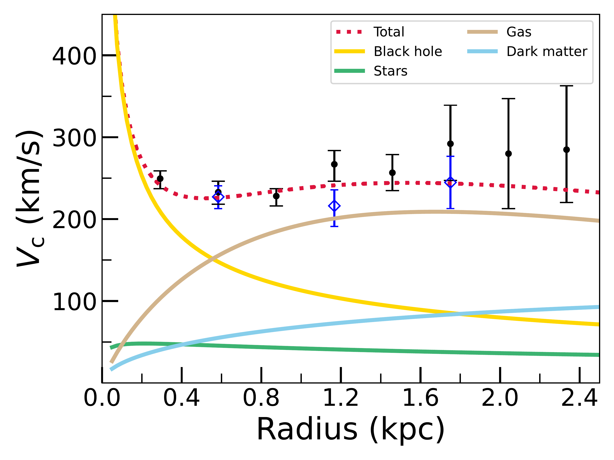
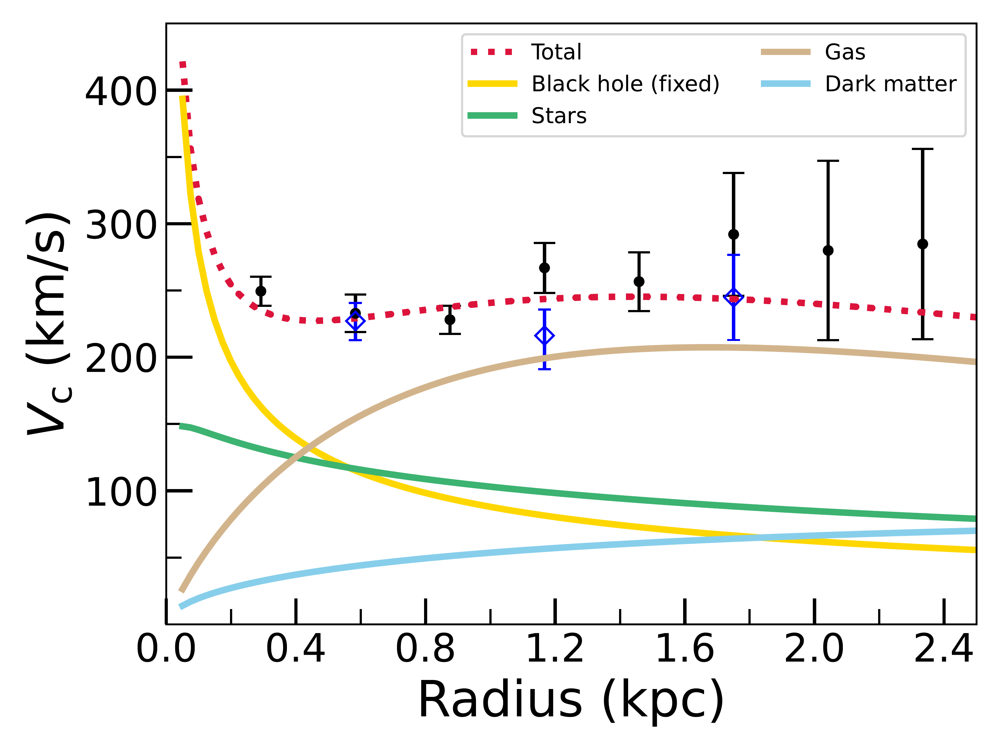
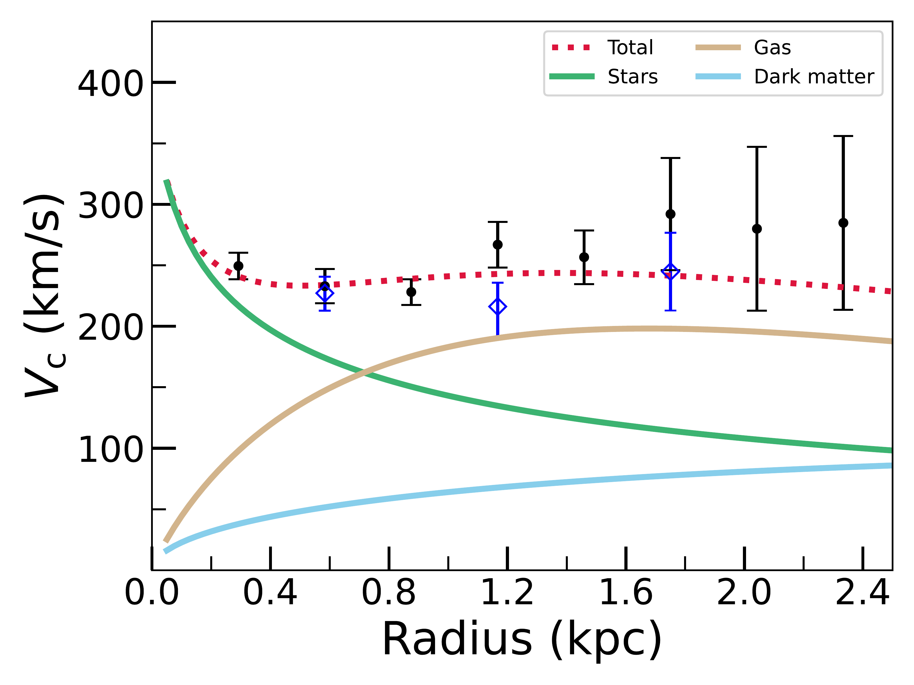
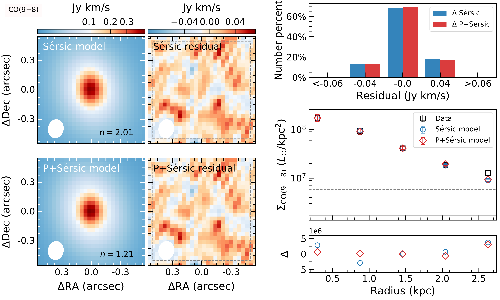
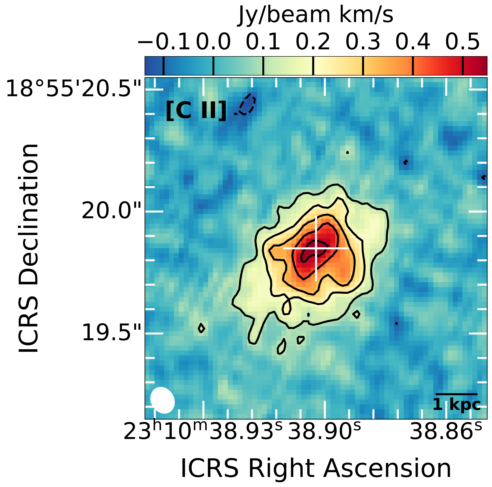
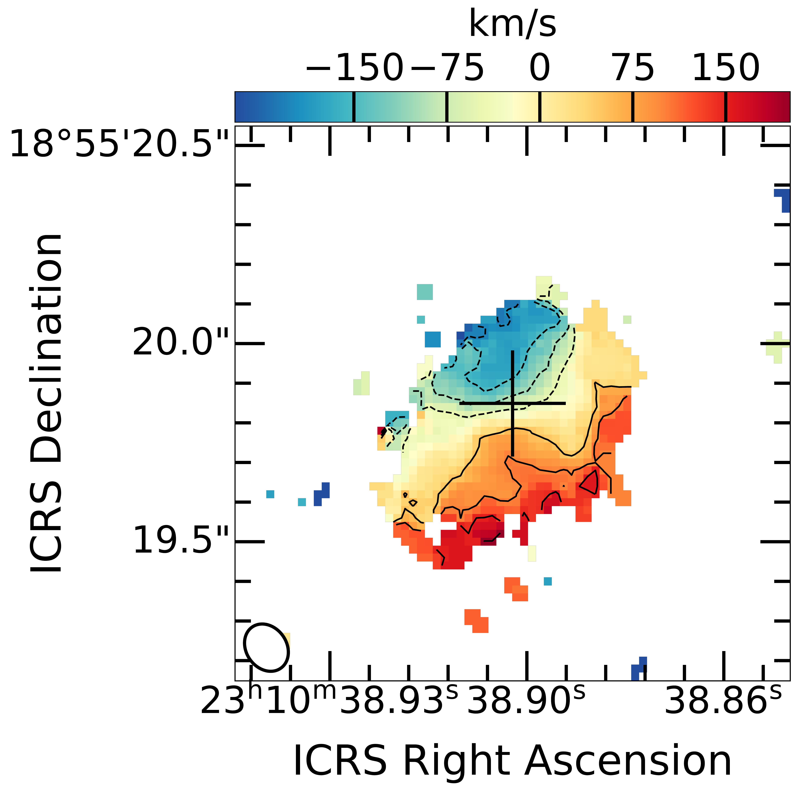
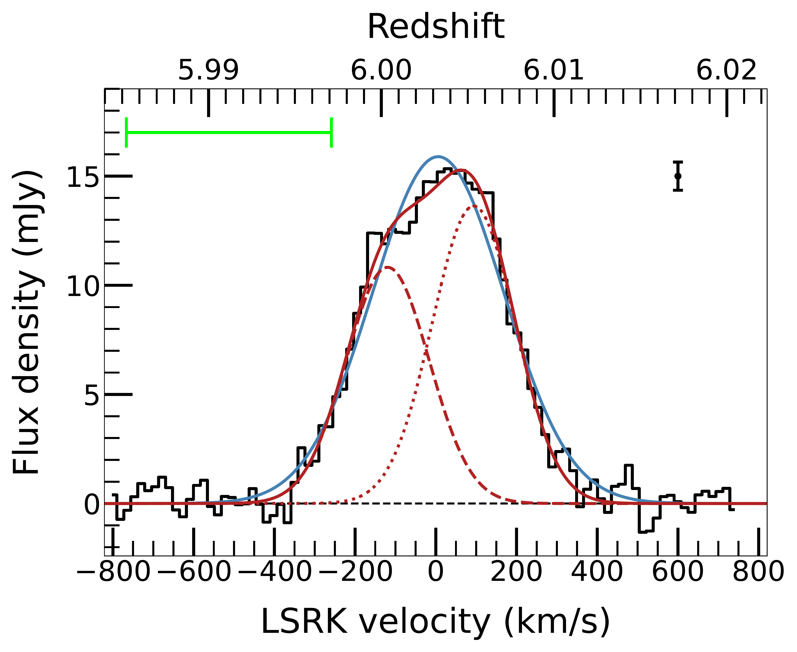

$\newcommand{\ensuremath}{}$
$\newcommand{\xspace}{}$
$\newcommand{\object}[1]{\texttt{#1}}$
$\newcommand{\farcs}{{.}''}$
$\newcommand{\farcm}{{.}'}$
$\newcommand{\arcsec}{''}$
$\newcommand{\arcmin}{'}$
$\newcommand{\ion}[2]{#1#2}$
$\newcommand{\textsc}[1]{\textrm{#1}}$
$\newcommand{\hl}[1]{\textrm{#1}}$
$\newcommand{\footnote}[1]{}$
$\newcommand$
$\newcommand$
$\newcommand$
$\newcommand$

$\newcommand{\ensuremath}{}$
$\newcommand{\xspace}{}$
$\newcommand{\object}[1]{\texttt{#1}}$
$\newcommand{\farcs}{{.}''}$
$\newcommand{\farcm}{{.}'}$
$\newcommand{\arcsec}{''}$
$\newcommand{\arcmin}{'}$
$\newcommand{\ion}[2]{#1#2}$
$\newcommand{\textsc}[1]{\textrm{#1}}$
$\newcommand{\hl}[1]{\textrm{#1}}$
$\newcommand{\footnote}[1]{}$
$\newcommand$
$\newcommand$
$\newcommand$
$\newcommand$

# The interstellar medium distribution, gas kinematics, and system dynamics of the far-infrared luminous quasar SDSS J2310+1855 at $z=6.0$

<mark>Appeared on: 2022-10-21</mark> - _Accepted for publication in A&A_

Yali Shao, et al. -- incl., <mark>Fabian Walter</mark>, <mark>Frank Bertoldi</mark>

**Abstract:** We present Atacama Large Millimeter/submillimeter Array (ALMA)  sub-kiloparsec- to kiloparsec-scale resolution observations of the [ $\ion{C}{II}$ ] , CO (9--8), and OH $^{+}$ ( $1_{1}$ -- $0_{1}$ )  lines along with their dust continuum emission toward the far-infrared (FIR) luminous quasar SDSS J231038.88+185519.7 at $z = 6.0031$ , to study the interstellar medium distribution, the gas kinematics, and the quasar-host system dynamics. We decompose the intensity maps of the [ $\ion{C}{II}$ ] and CO (9--8) lines and  the dust continuum with two-dimensional elliptical S ${é}$ rsic models. The [ $\ion{C}{II}$ ] brightness follows a flat distribution with a S ${é}$ rsic index of 0.59. The CO (9--8) line and the dust continuum can be  fit with an unresolved nuclear component and an extended S ${é}$ rsic component with a S ${é}$ rsic index of $\sim$ 1, which may correspond to the emission from an active galactic nucleus dusty molecular torus and a quasar host galaxy, respectively. The different [ $\ion{C}{II}$ ] spatial distribution may be due to the effect of the high dust opacity, which increases the FIR background radiation on the [ $\ion{C}{II}$ ] line, especially in the galaxy center, significantly suppressing the [ $\ion{C}{II}$ ] emission profile. The dust temperature drops with distance from the center. The effective radius of the dust continuum is smaller than that of the line emission and the dust mass  surface density, but is consistent with that of the star formation rate surface density. This may indicate that the dust emission is a less robust tracer of the dust and gas distribution but is a decent tracer of the obscured star formation activity. The OH $^{+}$ ( $1_{1}$ -- $0_{1}$ ) line shows a P-Cygni profile with an absorption at $\sim$ --400 km/s, which may indicate an outflow with a neutral gas mass of $(6.2\pm1.2)\times10^{8} M_{\odot}$ along the line of sight. We employed a three-dimensional tilted ring model to fit the [ $\ion{C}{II}$ ] and CO (9--8)  data cubes. The two lines   are both rotation dominated and trace identical disk geometries and gas motions. This suggest that the [ $\ion{C}{II}$ ] and CO (9--8) gas are coplanar and corotating in this quasar host galaxy. The consistent circular velocities measured with [ $\ion{C}{II}$ ] and CO (9--8)  lines indicate that these two lines trace a similar gravitational potential. We decompose the circular rotation curve measured from the kinematic model fit to the [ $\ion{C}{II}$ ] line into four matter components (black hole, stars, gas, and dark matter). The quasar-starburst system is dominated by  baryonic matter inside the central few kiloparsecs. We constrain the black hole mass to be $2.97^{+0.51}_{-0.77}\times 10^{9} M_{\odot}$ ; this is the first time that the dynamical mass of a black hole has been measured at $z\sim6$ . This mass is consistent with that determined using the scaling relations from quasar emission lines. A massive stellar component (on the order of $10^{9} M_{\odot}$ ) may have already existed when the Universe was only $\sim$ 0.93 Gyr old. The relations between the black hole mass and  the baryonic mass of this quasar indicate that the central supermassive black hole may have formed before its host galaxy.

**Figure 14. -** Best-fit of the decomposition of the circular rotation curve traced by the [$\ion${C}{II}] line when allowing the black hole component to be free (left), fixed to $1.8\times10^{9} M_{\odot}$(\citealt{Feruglio2018}; middle) and none (right). Black points with error bars are the circular velocities, these  are the rotation velocities corrected for the asymmetric drift (caused by  gas random motions). The solid yellow, green, brown and blue lines represent the black hole, stellar, gas and dark matter components, respectively. The dashed red lines are the sum of these four components. The blue diamonds with error bars are the circular velocities measured from the  CO (9--8) line. These two lines trace the identical gravitational potential within the errors. (*rcd*)

**Figure 9. -**  Image decomposition of the CO (9--8) line. Top-left panels: 2D elliptical S{é}rsic model and the residual between the observed and modeled CO (9--8) intensity maps, from left to right. We measured the residual rms inside the dashed gray square with a side length of 1$\arcsec$. Bottom-left panels: Same as in the top panels but for the Point+2D elliptical S{é}rsic modeling. The peak values and rms within the dashed gray square are 0.061 and 0.021, and 0.059 and 0.020 Jy/beam km/s for the S{é}rsic and P+S{é}rsic residual maps, respectively. The shape of the CO (9--8) synthesized beam  with a FWHM size of $0$\farcs$187\times0$\farcs$153$ is plotted in the bottom-left corner of each panel. Top-right panel: Distributions of the residuals for pixels inside the dashed gray squares (S{é}rsic modeling: blue histogram; P+S{é}rsic modeling: red histogram). Middle-right panel: CO (9--8) luminosity surface brightness (black squares, blue circles, and red diamonds with error bars are measurements from the observed intensity map, the 2D elliptical S{é}rsic model, and the Point+2D elliptical S{é}rsic model, respectively) at different radii, measured using elliptical rings with the ring width along the major axis half ($0$\farcs$1$) that of the CO (9--8) clean beam size, the rotation angle equal to $\overline{\rm PA}$(=198$◦$), and the ratio of semiminor and semimajor axis -- $b/a$ of $\cos(\overline{i})$($\overline{i}=43◦$), where $\overline{\rm PA}$ and $\overline{i}$ come from the CO (9--8) line kinematic modeling (listed in Table \ref{par_kin}). The error bar represents the deviation of the values of all pixels in each ring. The solid and dashed gray lines are three times the CO (9--8) luminosity surface brightness limit measured in the emission-free region with an elliptical annulus that is the same with the ones used to measure the CO (9--8) luminosity surface brightness but has a larger radius, and its corresponding rms. Bottom-right panel: Luminosity surface brightness difference between the measurements from the observed intensity map and the ones from the 2D elliptical S{é}rsic model (blue circles) and from the Point+2D elliptical S{é}rsic model (red diamonds). Note that the vertical scale is linear and in units of $10^{6}L_{\odot}/\rm kpc^{2}$. (*sbco98*)

**Figure 4. -** 
ALMA observed [$\ion${C}{II}] line. Left panel: [$\ion${C}{II}] velocity-integrated map. The white plus sign is the _Hubble_ Space Telescope (HST) quasar position (RA of 23:10:38.90; Dec of 18:55:19.85). The shape of the restoring beam with a FWHM size of $0$\farcs$111$$\times$$0$\farcs$092$ is plotted  in the bottom-left corner. The contour levels are  [$-$3, 3, 6, 9, 12, 15]$\times$ rms$_{\rm[$\ion${C}{II}]}$, where rms$_{\rm[$\ion${C}{II}]}=0.035$ Jy/beam km/s.
Middle panel: [$\ion${C}{II}] velocity map produced using pixels above 4$\sigma$ in the channel maps. The black plus sign is the HST quasar position. A clear velocity gradient can be seen.
Right panel: [$\ion${C}{II}] line spectrum (black histogram) overplotted with the best-fit Gaussian profiles. The spectrum is extracted from the 2$\sigma$ region of the source emitting area in the [$\ion${C}{II}] intensity map. The solid blue line presents the best-fit single Gaussian model. The solid red line represents the best-fit double-Gaussian model, and the dashed and dotted red lines are for each of the double Gaussians. The  kinematic local standard of rest (LSRK) velocity scale is relative to the [$\ion${C}{II}] redshift from our ALMA Cycle 0 observations \citep{Wang2013}. The spectral resolution is 15.625 MHz, corresponding to 17 km/s. The rms of the spectrum measured using the line-free spectrum is 0.65 mJy and is shown as a black bar. The  [$\ion${C}{II}] spectral profile is asymmetric, with enhancement on the red side. The green bar indicates the velocity range of the OH$^{+}$ absorption.
 (*ciimap*)

