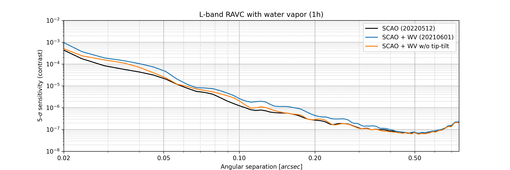
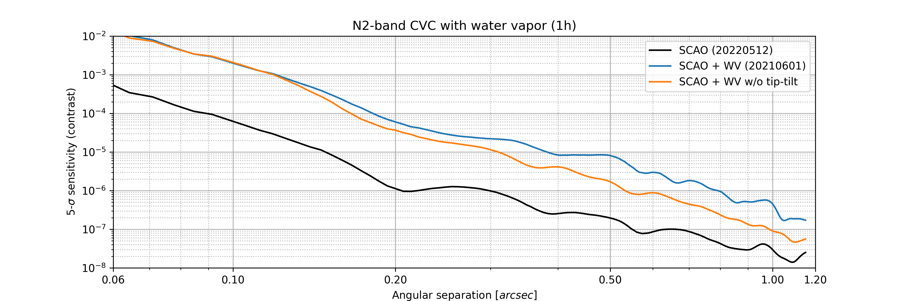
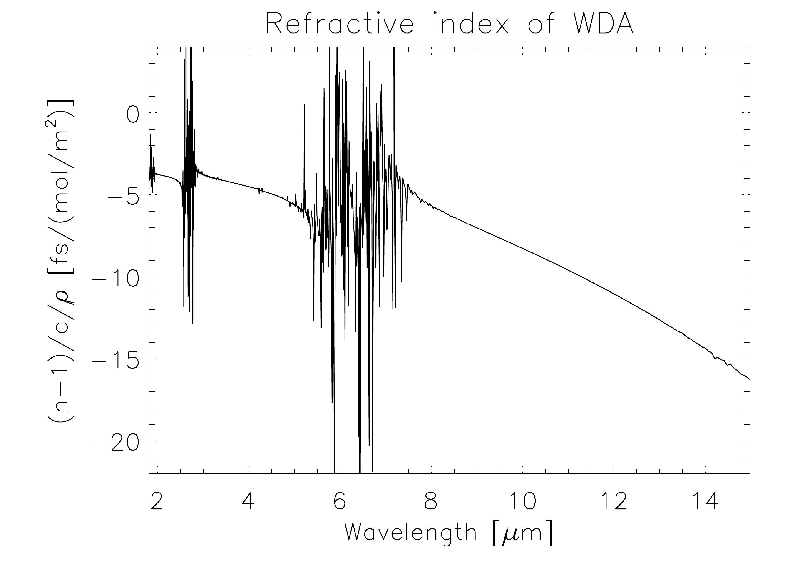
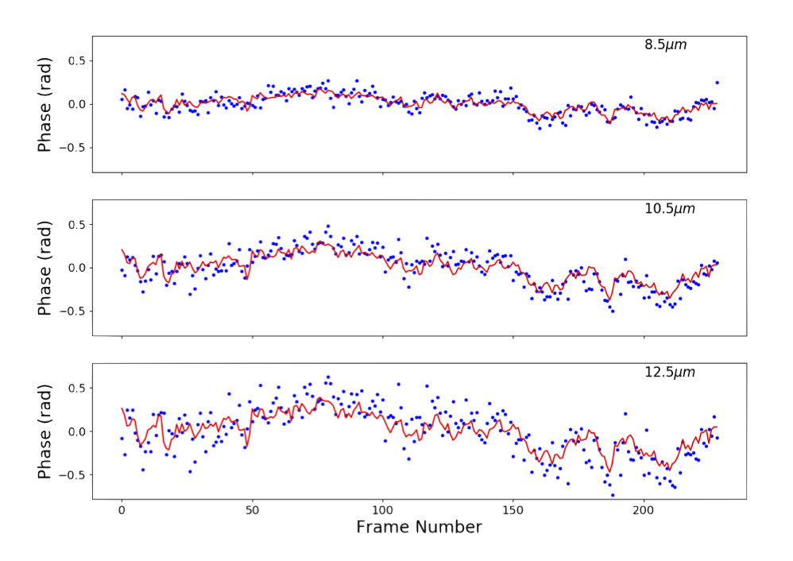
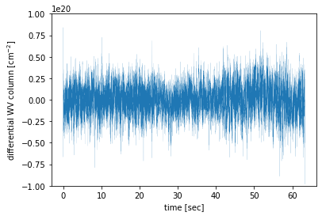

$\newcommand{\ensuremath}{}$
$\newcommand{\xspace}{}$
$\newcommand{\object}[1]{\texttt{#1}}$
$\newcommand{\farcs}{{.}''}$
$\newcommand{\farcm}{{.}'}$
$\newcommand{\arcsec}{''}$
$\newcommand{\arcmin}{'}$
$\newcommand{\ion}[2]{#1#2}$
$\newcommand{\textsc}[1]{\textrm{#1}}$
$\newcommand{\hl}[1]{\textrm{#1}}$
$\newcommand{\baselinestretch}{1.0}$

$\newcommand{\ensuremath}{}$
$\newcommand{\xspace}{}$
$\newcommand{\object}[1]{\texttt{#1}}$
$\newcommand{\farcs}{{.}''}$
$\newcommand{\farcm}{{.}'}$
$\newcommand{\arcsec}{''}$
$\newcommand{\arcmin}{'}$
$\newcommand{\ion}[2]{#1#2}$
$\newcommand{\textsc}[1]{\textrm{#1}}$
$\newcommand{\hl}[1]{\textrm{#1}}$
$\newcommand{\baselinestretch}{1.0}$

# Impact of water vapor seeing on mid-infrared high-contrast imaging at ELT scale

<mark>Appeared on: 2022-10-22</mark> - _13 pages, paper presented at SPIE Astronomical Telescopes + Instrumentation 2022_

Olivier Absil, et al. -- incl., <mark>Roy~van~Boekel</mark>

**Abstract:** The high-speed variability of the local water vapor content in the Earth atmosphere is a significant contributor to ground-based wavefront quality throughout the infrared domain. Unlike dry air, water vapor is highly chromatic, especially in the mid-infrared. This means that adaptive optics correction in the visible or near-infrared domain does not necessarily ensure a high wavefront quality at longer wavelengths. Here, we use literature measurements of water vapor seeing, and more recent infrared interferometric data from the Very Large Telescope Interferometer (VLTI), to evaluate the wavefront quality that will be delivered to the METIS mid-infrared camera and spectrograph for the Extremely Large Telescope (ELT), operating from 3 to 13 $\mu$ m, after single-conjugate adaptive optics correction in the near-infrared. We discuss how the additional wavefront error due to water vapor seeing is expected to dominate the wavefront quality budget at N band (8--13 $\mu$ m), and therefore to drive the performance of mid-infrared high-contrast imaging modes at ELT scale. Then we present how the METIS team is planning to mitigate the effect of water vapor seeing using focal-plane wavefront sensing techniques, and show with end-to-end simulations by how much the high-contrast imaging performance can be improved.

**Figure 8. -** example
Post-ADI contrast curves for a 1-h observing sequence at L band (top) and N band (bottom), in the presence of SCAO residuals only (black), and of SCAO residual and WV seeing (blue). The orange curves show the performance after completely removing tip-tilt errors from the WV phase screens. These contrast curves were obtained with a ring-apodized vortex coronagraph (RAVC) concept at L band, and a classical vortex coronagraph (CVC) concept at N band, following the METIS design ([Carlomagno, et. al (2020)](https://ui.adsabs.harvard.edu/abs/2020JATIS...6c5005C)) . (*fig:perf_kolmo*)

**Figure 2. -** example
Reduced refractive index of WDA, for standard conditions at Cerro Paranal (288 K, 743 mbar). (*fig:refrac_wda*)

**Figure 4. -** example
Left. Comparison of the N-band fringe position estimated by the GRAVITY fringe tracker (red) with the actually measured fringe position with MATISSE (blue), adapted from RD08. Right. Representative time sequence of differential WV column density measured on a $\sim 30$-m baseline at VLTI. (*fig:gra4mat*)

