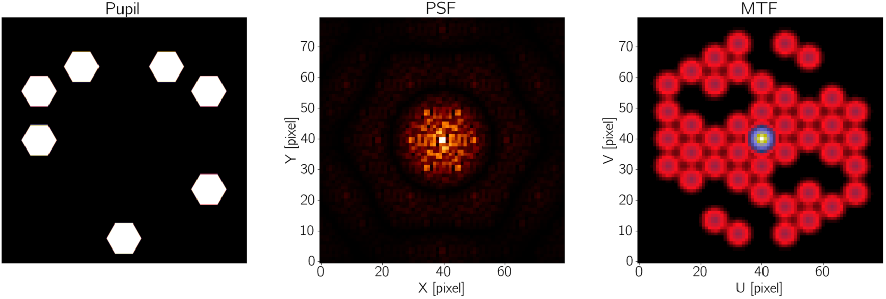
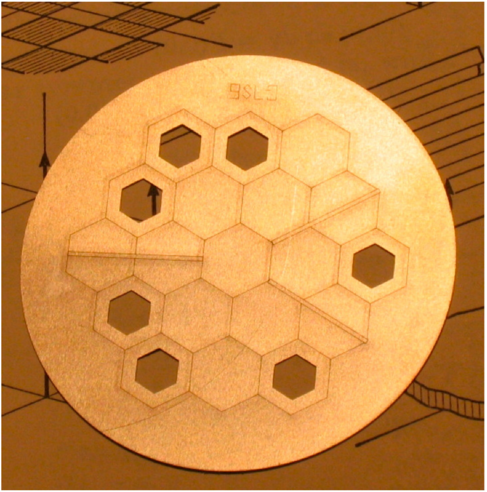
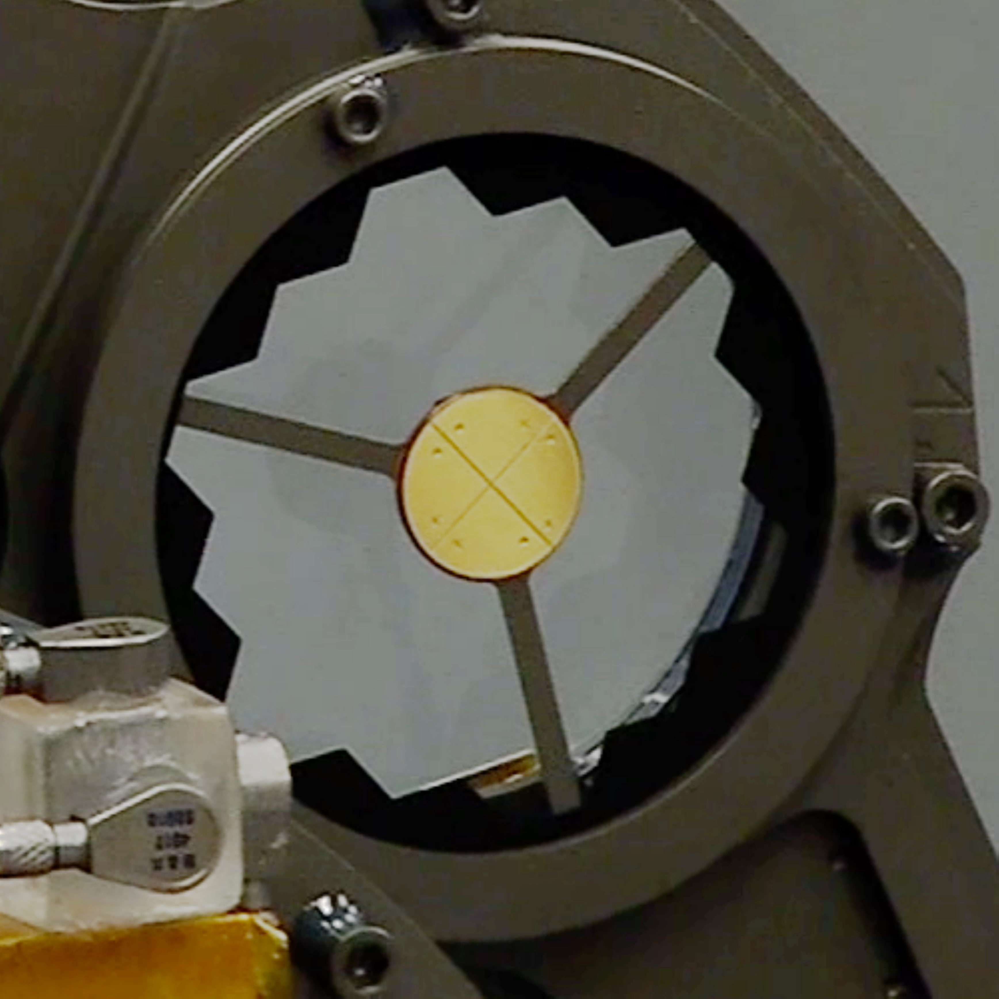
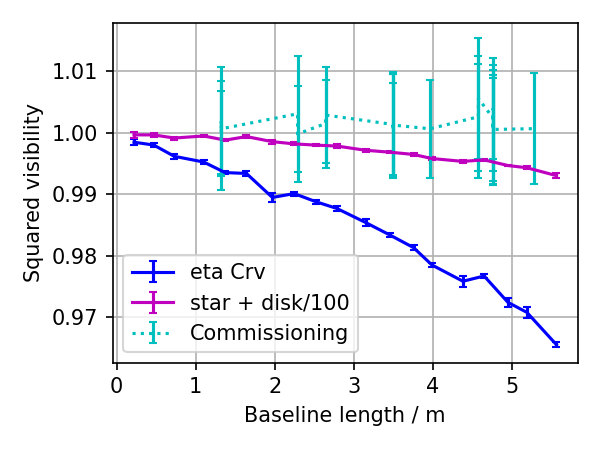

$\newcommand{\ensuremath}{}$
$\newcommand{\xspace}{}$
$\newcommand{\object}[1]{\texttt{#1}}$
$\newcommand{\farcs}{{.}''}$
$\newcommand{\farcm}{{.}'}$
$\newcommand{\arcsec}{''}$
$\newcommand{\arcmin}{'}$
$\newcommand{\ion}[2]{#1#2}$
$\newcommand{\textsc}[1]{\textrm{#1}}$
$\newcommand{\hl}[1]{\textrm{#1}}$
$\newcommand{\etal}{\textit{et al}.}$
$\newcommand{\ie}{\textit{i}.\textit{e}.}$
$\newcommand{\eg}{\textit{e}.\textit{g}.}$
$\newcommand$
$\newcommand$
$\newcommand$
$\newcommand$
$\newcommand$
$\newcommand{\nicemicron}{\text{\textmu m}}$
$\newcommand{\angstrom}{\textup{Å}}$
$\newcommand{\uvplane}{uv-plane}$
$\newcommand{\mirage}{\texttt{MIRaGe}}$
$\newcommand{\finished}{\bf \color{black}}$
$\newcommand{\indraft}{\color{blue}}$
$\newcommand{\notstarted}{\color{red}}$
$\newcommand{\logl}{\ln \mathcal{L}}$
$\newcommand$
$\newcommand$
$\newcommand$
$\newcommand$
$\newcommand$
$\newcommand$
$\newcommand$
$\newcommand$
$\newcommand$
$\newcommand$
$\newcommand$
$\newcommand$
$\newcommand$
$\newcommand$
$\newcommand$
$\newcommand$
$\newcommand$
$\newcommand$
$\newcommand$
$\newcommand$
$\newcommand$
$\newcommand$
$\newcommand$
$\newcommand$
$\newcommand$

$\newcommand{\ensuremath}{}$
$\newcommand{\xspace}{}$
$\newcommand{\object}[1]{\texttt{#1}}$
$\newcommand{\farcs}{{.}''}$
$\newcommand{\farcm}{{.}'}$
$\newcommand{\arcsec}{''}$
$\newcommand{\arcmin}{'}$
$\newcommand{\ion}[2]{#1#2}$
$\newcommand{\textsc}[1]{\textrm{#1}}$
$\newcommand{\hl}[1]{\textrm{#1}}$
$\newcommand{\etal}{\textit{et al}.}$
$\newcommand{\ie}{\textit{i}.\textit{e}.}$
$\newcommand{\eg}{\textit{e}.\textit{g}.}$
$\newcommand$
$\newcommand$
$\newcommand$
$\newcommand$
$\newcommand$
$\newcommand{\nicemicron}{\text{\textmu m}}$
$\newcommand{\angstrom}{\textup{Å}}$
$\newcommand{\uvplane}{uv-plane}$
$\newcommand{\mirage}{\texttt{MIRaGe}}$
$\newcommand{\finished}{\bf \color{black}}$
$\newcommand{\indraft}{\color{blue}}$
$\newcommand{\notstarted}{\color{red}}$
$\newcommand{\logl}{\ln \mathcal{L}}$
$\newcommand$
$\newcommand$
$\newcommand$
$\newcommand$
$\newcommand$
$\newcommand$
$\newcommand$
$\newcommand$
$\newcommand$
$\newcommand$
$\newcommand$
$\newcommand$
$\newcommand$
$\newcommand$
$\newcommand$
$\newcommand$
$\newcommand$
$\newcommand$
$\newcommand$
$\newcommand$
$\newcommand$
$\newcommand$
$\newcommand$
$\newcommand$
$\newcommand$

# The Near Infrared Imager and Slitless Spectrograph for    the  James Webb Space Telescope -    IV. Aperture Masking Interferometry

<mark>Appeared on: 2022-10-31</mark> - _30 pages, 10 figures_

Anand Sivaramakrishnan, et al. -- incl., <mark>Michael R. Meyer</mark>

**Abstract:** The James Webb Space Telescope's Near Infrared Imager and Slitless Spectrograph (JWST-NIRISS) flies a 7-hole non-redundant mask (NRM), the first such interferometer in space, operating at 3-5 \nicemicron wavelengths, and a bright limit of $\simeq 4$ magnitudes in W2.   We describe the NIRISS Aperture Masking Interferometry (AMI) mode to help potential observers understand its underlying principles, present some sample science cases, explain its operational observing strategies, indicate how AMI proposals can be developed with data simulations, and how AMI data can be analyzed.  We also present key results from commissioning AMI.  Since the allied Kernel Phase Imaging (KPI) technique benefits from AMI operational strategies, we also cover NIRISS KPI methods and analysis techniques, including a new user-friendly KPI pipeline.  The NIRISS KPI bright limit is $\simeq 8$ W2 magnitudes.  AMI (and KPI) achieve an inner working angle of $\sim  70$ mas that is well inside the $\sim 400$ mas NIRCam inner working angle for its circular occulter coronagraphs at comparable wavelengths.

**Figure 1. -** The JWST-NIRISS AMI NRM, PSF, and its uv-coverage. **Left**: AMI's 7 hole pupil mask. **Middle**: a point source image taken through the NRM, showing a bright peak at the phase center, and with the primary beam crisscrossed by fringe patterns at 21 spatial frequencies. **Right**: The Fourier amplitude of the PSF. Note 21 "splodges" isolating regions of strong fringe signal (in red) and their mirrored Hermitian counterparts in this $\uvplane$ coverage, or Modulation Transfer Function (MTF), plot. (*fig:pup_psf_mtf*)

**Figure 2. -** **Left**: A full size prototype of the NRM flying aboard NIRISS AMI.  The nominal JWST pupil circumscribing circle diameter is  $40 \mathrm{mm}$ in the plane of the mask.  **Right**: The CLEARP pupil mask enables full pupil images using AMI's filters, target acquisition, and fast readout subarray. The backwards-facing reflective element at the center of CLEARP is an unilluminated pupil alignment mirror which defines the inner edge of the CLEARP pupil.
CLEARP obscures 5.9\% of the JWST primary mirror's reflective surface.
Of this, 3.8\% is intercepted by pupil alignment mirror, so incident light is scattered back toward the NIRISS collimator and pick off mirror, while the remainder (2.1\%) is obscured by the structure holding the CLEARP pupil alignment mirror.
Scattering off internal CLEARP edges has not been detected, but is possible.    CLEARP’s outer edge is oversized by $\sim$4\% of the primary mirror's circumscribing circle. (*fig:g7s6clearp*)

**Figure 3. -** Squared visibilities as a function of maximum baseline length. Simulated AMI observations of the dusty debris system $\eta$ Crv  and a hypothetical exozodiacal system with 100 times lower dust density were analyzed with a precursor to the \texttt{AMICAL} interferometric package.  Commissioning results (utilizing \texttt{ImPlaneIA}) of a calibrator star calibrated against another calibrator star are also shown.  These data indicate $\eta$ Crv's zodiacal light can be detected with AMI.  Improved charge migration calibration could yet render the fainter disk detectable. Such data could constrain the form of the extrazodiacal dust distribution in a routine AMI observation of a single target-calibrator pair.  JWST Program 1242 includes such an observation. (*fig:zodi*)

