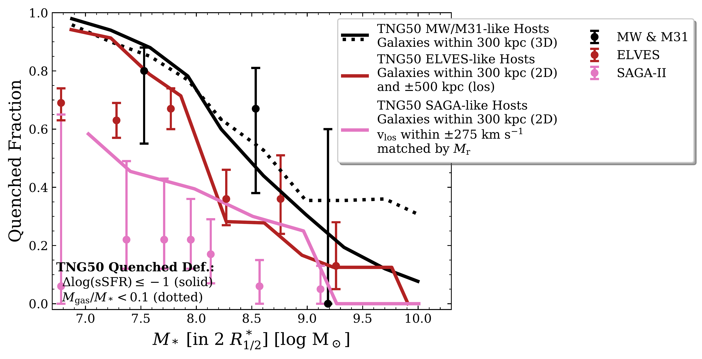
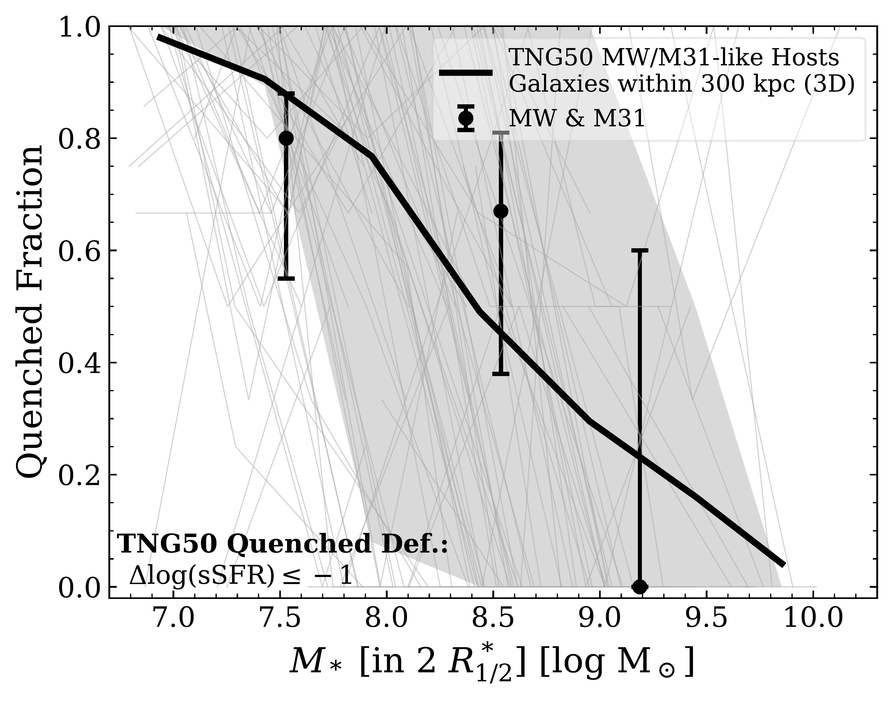
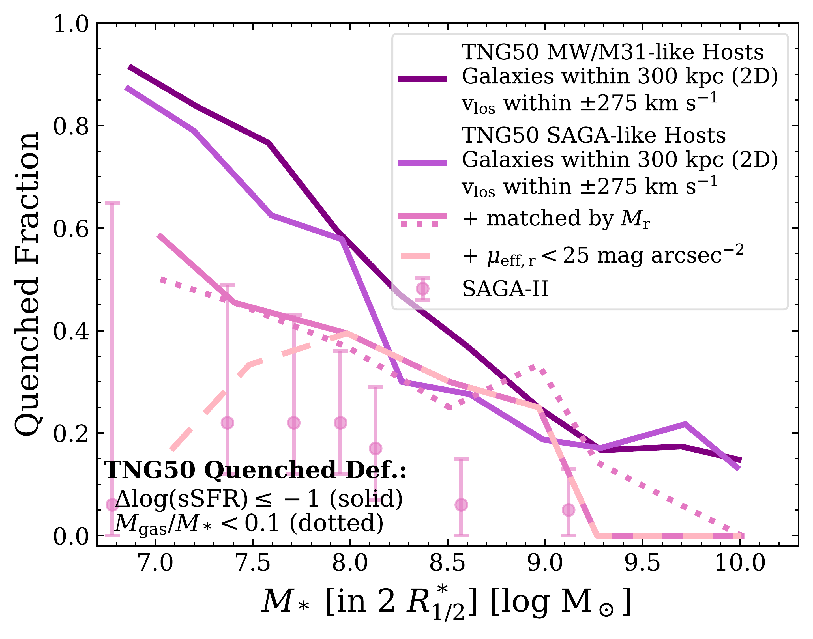

$\newcommand{\ensuremath}{}$
$\newcommand{\xspace}{}$
$\newcommand{\object}[1]{\texttt{#1}}$
$\newcommand{\farcs}{{.}''}$
$\newcommand{\farcm}{{.}'}$
$\newcommand{\arcsec}{''}$
$\newcommand{\arcmin}{'}$
$\newcommand{\ion}[2]{#1#2}$
$\newcommand{\textsc}[1]{\textrm{#1}}$
$\newcommand{\hl}[1]{\textrm{#1}}$
$\newcommand{\MSUN}{{\rm M}_{\sun}}$
$\newcommand{\MHOST}{M_{\rm 200c}}$
$\newcommand{\RHOST}{R_{\rm 200c}}$
$\newcommand{\MSTAR}{M_{\rm *}}$
$\newcommand{\ap}[1]{\textcolor{magenta}{#1}}$
$\newcommand{\thebibliography}{\DeclareRobustCommand{\VAN}[3]{##3}\VANthebibliography}$

$\newcommand{\ensuremath}{}$
$\newcommand{\xspace}{}$
$\newcommand{\object}[1]{\texttt{#1}}$
$\newcommand{\farcs}{{.}''}$
$\newcommand{\farcm}{{.}'}$
$\newcommand{\arcsec}{''}$
$\newcommand{\arcmin}{'}$
$\newcommand{\ion}[2]{#1#2}$
$\newcommand{\textsc}[1]{\textrm{#1}}$
$\newcommand{\hl}[1]{\textrm{#1}}$
$\newcommand{\MSUN}{{\rm M}_{\sun}}$
$\newcommand{\MHOST}{M_{\rm 200c}}$
$\newcommand{\RHOST}{R_{\rm 200c}}$
$\newcommand{\MSTAR}{M_{\rm *}}$
$\newcommand{\ap}[1]{\textcolor{magenta}{#1}}$
$\newcommand{\thebibliography}{\DeclareRobustCommand{\VAN}[3]{##3}\VANthebibliography}$

# Satellites of MW/M31-like galaxies with TNG50: quenched fractions, gas content, and star formation histories

<mark>Appeared on: 2022-10-31</mark> - _Submitted to MNRAS -- comments welcome. Part of a set of papers based on TNG50 MW/M31-like galaxies_

Christoph Engler, et al. -- incl., <mark><mark>Annalisa Pillepich</mark></mark>

**Abstract:** We analyse the quenched fractions, gas content, and star formation histories of $\sim$ 1200 satellite galaxies with $M_* \geq 5 \times 10^6 \MSUN$ around 198 Milky Way- (MW) and Andromeda-like (M31) hosts in TNG50, the highest-resolution run of the IllustrisTNG simulations. Satellites exhibit larger quenched fractions for smaller masses, at smaller distances to their host galaxy, and in the more massive M31-like compared to MW-like hosts. As satellites cross their host’s virial radius, their gas content drops significantly: most satellites within $300 {\rm kpc}$ do not contain any detectable gas reservoirs at $z = 0$ , unless they are massive like the Magellanic Clouds and M32. Nevertheless, their stellar assembly exhibits a large degree of diversity. On average, the cumulative star formation histories of satellites are more extended for brighter, more massive satellites with a later infall, and for those in less massive hosts. Based on these relationships, we can even infer infall periods for observed MW and M31 dwarfs: e.g. $0-4 {\rm Gyr}$ ago for the Magellanic Clouds and Leo I, $4-8$ and $0-2 {\rm Gyr}$ ago for M32 and IC 10, respectively. Ram pressure stripping (in combination with tidal stripping) deprives TNG50 satellites of their gas reservoirs and ultimately quenches their star formation activity, even though only a few per cent of the present-day satellites around the 198 TNG50 MW/M31-like hosts appear as jellyfish. The typical time since quenching for currently quenched TNG50 satellites is $6.9\substack{+2.5\\-3.3}$ Gyr ago. The TNG50 results are consistent with the quenched fractions and stellar assembly of observed MW and M31 satellites, however, satellites of the SAGA survey exhibit lower quenched fractions than TNG50 and other, observed analogues.

**Figure 4. -** ** Quenched fractions of satellite galaxies with $\mathbf{M_{\boldsymbol{***} \boldsymbol{\geq} 5 \boldsymbol{\times} 10^{6} ** M**_{\boldsymbol{\odot}0}}$ around MW/M31-like hosts in TNG50, the observed MW and M31, ELVES, and SAGA-II.}_ Top panel:_ median quenched fractions of TNG50 satellites stacked across all hosts (curves) and of observed satellites (points). In each comparison, we impose the respective observations' selection criteria on TNG50: galaxies within $300 {\rm kpc}$ (3D) of their host for the MW and M31 (black curve), galaxies within $300 {\rm kpc}$(2D) and $\pm 500 {\rm kpc}$ along the line of sight for ELVES (red curve), and galaxies within $300 {\rm kpc}$(2D) with line-of-sight velocities of $\pm 275 {\rm km s}^{-1}$ that have been matched to the absolute $r$-band magnitude $M_{\rm r}$ of each observed SAGA-II satellite for the SAGA survey (pink curve). The black points denote the quenched fractions of the observed MW and M31 satellites \protect ([Wetzel, Tollerud and Weisz 2015](https://ui.adsabs.harvard.edu/abs/2015ApJ...808L..27W))  while the red and pink points correspond to the stacked satellites of ELVES  ([Carlsten, et. al 2022](https://ui.adsabs.harvard.edu/abs/2022arXiv220300014C))  and SAGA-II \protect ([Mao, et. al 2021](https://ui.adsabs.harvard.edu/abs/2021ApJ...907...85M)) . While our fiducial quenched definition is based on the satellites' distance to the SFMS (solid curves), \protect ([Wetzel, Tollerud and Weisz (2015)](https://ui.adsabs.harvard.edu/abs/2015ApJ...808L..27W))  employ a gas fraction criterion for LG satellites, \protect ([Carlsten, et. al (2022)](https://ui.adsabs.harvard.edu/abs/2022arXiv220300014C))  determine star formation activity based on their satellites' morphology, and the quenched fractions of \protect ([Mao, et. al (2021)](https://ui.adsabs.harvard.edu/abs/2021ApJ...907...85M))  are based on H$\alpha$ equivalent widths. Thus, the solid curves represent a comparison at face value. We adopt the gas fraction-based criterion of \protect ([Wetzel, Tollerud and Weisz (2015)](https://ui.adsabs.harvard.edu/abs/2015ApJ...808L..27W)) (dotted, black curve) to more directly compare to their observations. _ Bottom left panel:_ satellite quenched fractions including host-to-host variations. The thin, grey curves in the background denote the quenched fractions of satellites around individual TNG50 MW/M31-like hosts while the thick, black curve and the grey shaded area correspond to their mean and scatter as $16^{\rm th}$ and $84^{\rm th}$ percentiles. _ Bottom right panel:_ effects of host and satellite selections on the quenched fractions of the TNG50 SAGA-II analogue sample using our fiducial quenched definition. We show the quenched fractions for satellites around both TNG50 MW/M31-like and SAGA-like hosts according to the spatial SAGA-II selection criteria (dark and medium purple solid curves, respectively), and for the smaller sample of TNG50 satellites that are matched to the SAGA-II satellites based on their absolute $r$-band magnitude (pink solid curve, as in the top panel). The dashed light pink curve gives the quenched fractions predicted by TNG50 for SAGA-like satellites including an implicit selection cut on their surface brightness as suggested by \protect\citet[][see text for more details]{Font2022}. We illustrate the effects of different quenched definitions by adopting the gas fraction-based definition for our matched SAGA-like satellite sample (dotted vs. solid pink curves). (*fig:fquench*)

**Figure 11. -** ** Satellite stellar assembly times as a function of absolute $V$-band magnitude and stellar mass.** We define satellites (circles) as all galaxies with $M_* \geq 5 \times 10^6 $\MSUN$$ within $300 {\rm kpc}$ of either TNG50 MW-like hosts (left panels) or M31-like hosts (right panels) and define their stellar assembly in terms of $\tau_{90}$(top panels) and $\tau_{50}$(bottom panels), i.e. the lookback times at which the satellites had assembled 90 and 50 per cent of their present-day stellar mass. Filled blue circles denote galaxies that are star-forming or in the green valley at $z=0$, according to their distance to the SFMS; empty circles represent quenched satellites. Furthermore, we compare our TNG50 satellites to the observed dwarfs of the MW and M31 \protect\citep[red and brown diamonds, respectively,][]{Weisz2013, Weisz2014a, Navabi2021}. (*fig:stellarAssembly_vs_Vmag*)

**Figure 9. -** ** Cumulative star formation histories (SFHs) of satellites within $\mathbf{300 {\rm \bf kpc**}$ of TNG50 MW-like hosts (i.e. with $\mathbf{M_{\boldsymbol{*}} \boldsymbol{=} 10^{10.5} \boldsymbol{-} 10^{10.9} {\rm \bf M}_{\boldsymbol{\odot}}}$)}. Each row depicts a different bin in satellite stellar mass (decreasing from top to bottom) whereas each column corresponds to a different bin of time since infall (accretion time $t_{\rm acc}$, with early to late infallers from left to right). The thin, grey curves show the cumulative SFHs of individual TNG50 satellites. For bins containing at least ten satellite galaxies, we compute the median SFH and its scatter as $16^{\rm th}$ and $84^{\rm th}$ percentiles (black curves and grey shaded areas, respectively). The grey diamonds denote the median stellar assembly times $\tau_{10}$, $\tau_{50}$, and $\tau_{90}$, i.e.  the times at which 10, 50, and 90 per cent of the present-day stellar mass has been assembled. Furthermore, we compare the normalised, cumulative SFHs of TNG50 satellites to those of observed satellites around the MW (coloured curves): the LMC and SMC \protect ([Weisz, et. al 2013](https://ui.adsabs.harvard.edu/abs/2013MNRAS.431..364W)) , as well as Sagittarius, Fornax, and Leo I \protect ([Weisz, et. al 2014](https://ui.adsabs.harvard.edu/abs/2014ApJ...789..147W))  using the best fit SFHs and their 68 per cent confidence intervals due to random and systematic uncertainties. (*fig:sfh_MWlike*)

