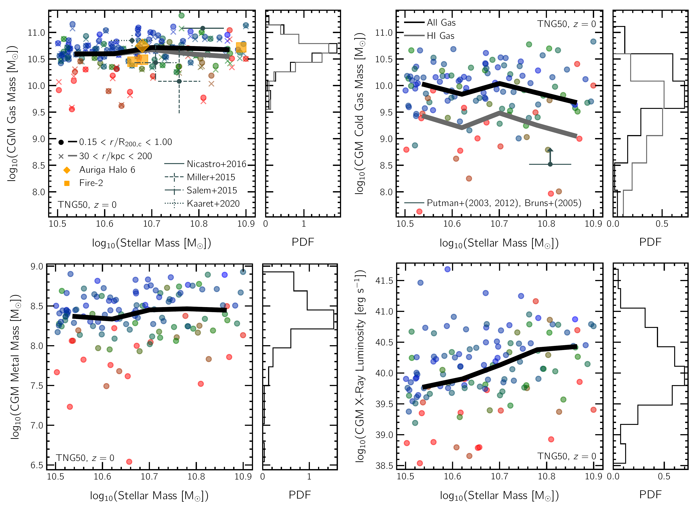

$\newcommand{\ensuremath}{}$
$\newcommand{\xspace}{}$
$\newcommand{\object}[1]{\texttt{#1}}$
$\newcommand{\farcs}{{.}''}$
$\newcommand{\farcm}{{.}'}$
$\newcommand{\arcsec}{''}$
$\newcommand{\arcmin}{'}$
$\newcommand{\ion}[2]{#1#2}$
$\newcommand{\textsc}[1]{\textrm{#1}}$
$\newcommand{\hl}[1]{\textrm{#1}}$
$\newcommand{\ap}[1]{{\color{magenta} #1}}$
$\newcommand{\}{MSUN}$
$\newcommand{\}{RVIR}$
$\newcommand{\}{RTC}$
$\newcommand{\}{MTC}$
$\newcommand{\}{MSTC}$
$\newcommand{\}{RFC}$
$\newcommand{\}{MFC}$
$\newcommand{\}{ROUT}$
$\newcommand{\}{RHALF}$
$\newcommand{\}{MVIR}$
$\newcommand{\}{MHALO}$
$\newcommand{\}{MSH}$
$\newcommand{\}{MS}$
$\newcommand{\}{AS}$
$\newcommand{\}{ADM}$
$\newcommand{\}{etal}$

$\newcommand{$\ensuremath$}{}$
$\newcommand{$\xspace$}{}$
$\newcommand{$\object$}[1]{\texttt{#1}}$
$\newcommand{$\farcs$}{{.}''}$
$\newcommand{$\farcm$}{{.}'}$
$\newcommand{$\arcsec$}{''}$
$\newcommand{$\arcmin$}{'}$
$\newcommand{$\ion$}[2]{#1#2}$
$\newcommand{$\textsc$}[1]{\textrm{#1}}$
$\newcommand{$\hl$}[1]{\textrm{#1}}$
$\newcommand{$\ap$}[1]{{\color{magenta} #1}}$
$\newcommand{\}{MSUN}$
$\newcommand{\}{RVIR}$
$\newcommand{\}{RTC}$
$\newcommand{\}{MTC}$
$\newcommand{\}{MSTC}$
$\newcommand{\}{RFC}$
$\newcommand{\}{MFC}$
$\newcommand{\}{ROUT}$
$\newcommand{\}{RHALF}$
$\newcommand{\}{MVIR}$
$\newcommand{\}{MHALO}$
$\newcommand{\}{MSH}$
$\newcommand{\}{MS}$
$\newcommand{\}{AS}$
$\newcommand{\}{ADM}$
$\newcommand{\}{etal}$

# The Circumgalactic Medium of Milky Way-like Galaxies in the TNG50 Simulation -- I: Halo Gas Properties and the Role of SMBH Feedback

<mark>Appeared on: 2022-11-02</mark> - _Submitted to MNRAS. Part of a set of papers based on TNG50 MW/M31-like galaxies. Additional visuals at www.tng-project.org/ramesh22!_

Rahul Ramesh, Dylan Nelson, <mark><mark>Annalisa Pillepich</mark></mark>

**Abstract:** We analyze the physical properties of gas in the circumgalactic medium (CGM) of 132 Milky Way (MW)-like galaxies at$z=0$from the cosmological magneto-hydrodynamical simulation TNG50, part of the IllustrisTNG project. The properties and abundance of CGM gas across the sample are diverse, and the fractional budgets of different phases (cold, warm, and hot), as well as neutral HI mass and metal mass, vary considerably. Over our stellar mass range of$10.5 < \rm{M}_\star / \rm{M}_\odot < 10.9$, radial profiles of gas physical properties from$0.15 < \rm{R/R_{\rm 200c}} < 1.0$reveal great CGM structural complexity, with significant variations both at fixed distance around individual galaxies, and across different galaxies. CGM gas is multi-phase: the distributions of density, temperature and entropy are all multimodal, while metallicity and thermal pressure distributions are unimodal; all are broad. We present predictions for magnetic fields in MW-like halos: a median field strength of$|B|\sim 1\mu$G in the inner halo decreases rapidly at larger distance, while magnetic pressure dominates over thermal pressure only within$\sim0.2 \times \RVIR$. Virial temperature gas at$\sim 10^6 $K coexists with a sub-dominant cool,$< 10^5 $K component in approximate pressure equilibrium. Finally, the physical properties of the CGM are tightly connected to the galactic star formation rate, in turn dependent on feedback from supermassive black holes (SMBHs). In TNG50, we find that energy from SMBH-driven kinetic winds generates high-velocity outflows ($\gtrsim 2000$km/s), heats gas to super-virial temperatures ($> 10^{6.5-7}$K), and regulates the net balance of inflows versus outflows in otherwise quasi-static gaseous halos.

**Figure 6. -** Spherically-averaged radial profiles of six physical gas quantities as a function of (3D) galactocentric distance around TNG50 MW-like galaxies. We consider density (upper left), HI density (upper right), temperature (center left), metallicity (center right), thermal pressure (lower left) and entropy (lower right). Each panel shows the median profile across the galaxy sample (black line), while the thinner curves correspond to profiles of individual halos, colored by galaxy stellar mass. Such profiles represent the azimuthally-averages of the depicted integrated or mass-weighted gas property at the given radius. Whereas the temperature and entropy of gas is generally lower in the inner halo as compared to the outskirts, due to the presence of a second cooler component becoming dominant, no such trend is clearly seen in the other four panels. The galaxy-to-galaxy scatter of individual curves about the median profile is large, and often correlates well with stellar mass. (*fig:radial_profiles*)

**Figure 4. -** Selected integral properties of the CGM plotted as a function of galaxy stellar mass for all 132 MW-like galaxies from the TNG50 simulation, at $z=0$: total CGM gas mass (top-left), CGM cold gas (T $<10^{4.5}$K) mass (along with the median line of CGM HI mass; top-right panel), CGM metal mass (bottom-left), and CGM X-ray luminosity (0.5-2.0 keV; bottom right panel). The first three quantities depend only weakly on galaxy stellar mass, while X-ray luminosity rises sharply with increasing stellar mass of the galaxy. In each panel, the circular markers are color coded by the sSFR of the galaxy -- in all cases, we note that galaxies with a lower sSFR have smaller values of the corresponding quantity. In the top-left panel, we consider two different definitions for the CGM: variable volume (extends between 0.15 and 1.0 R$_{\rm{200,c}}$) and constant volume (extends between 30 and 200 kpc) -- the two definitions yield statistically similar results at the low mass end, while differences are apparent towards the high mass end. In all other panels, we adopt the variable volume definition, which is our fiducial choice. (*fig:cgm_props_vs_mass*)

**Figure 8. -** Distributions of the physical properties of gas in the CGM of TNG50 MW-like galaxies at $z=0$(in each case, histograms employ 30 bins, and extend between the visible tick marks. Each (thin) curve corresponds to a single galaxy/halo, color showing its stellar mass, and accounts, as per definition, only of the gas between $0.15$ and $1.00 \times \rm{R_{vir}}$. The thicker curves show medians across halos binned into four galaxy stellar mass quartiles. While the metallicity and thermal pressure distributions are unimodal, gas density, HI density, temperature, and entropy are multimodal, suggesting that the CGM hosts multi-phase gas that forms distinct populations in density, temperature, and entropy. Only temperature and entropy show peaks with strong monotonic trends as a function of stellar mass, with more more massive galaxies hosting gas at higher temperatures and higher entropy in their CGM. (*fig:histPlots*)

