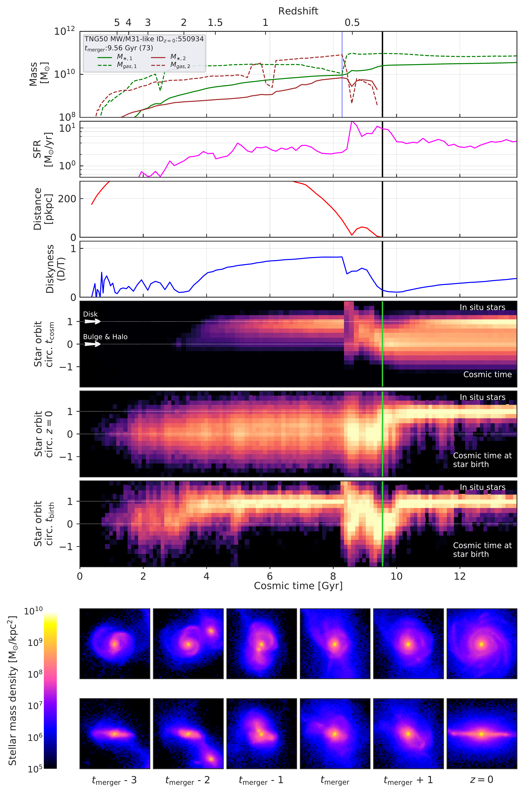
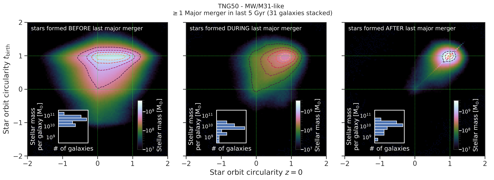
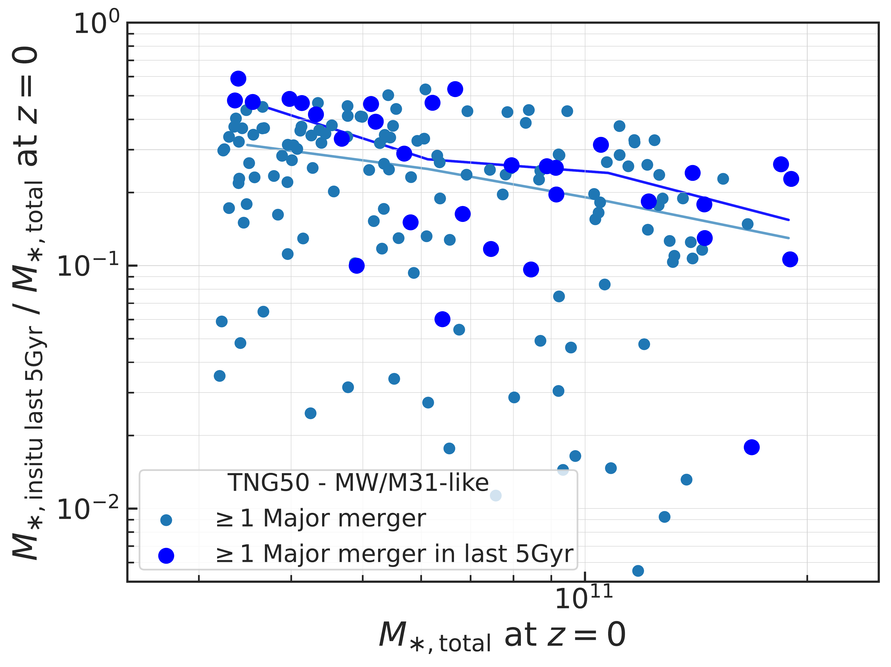
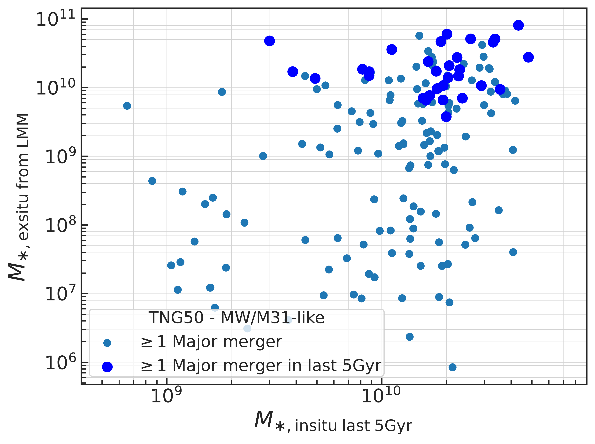
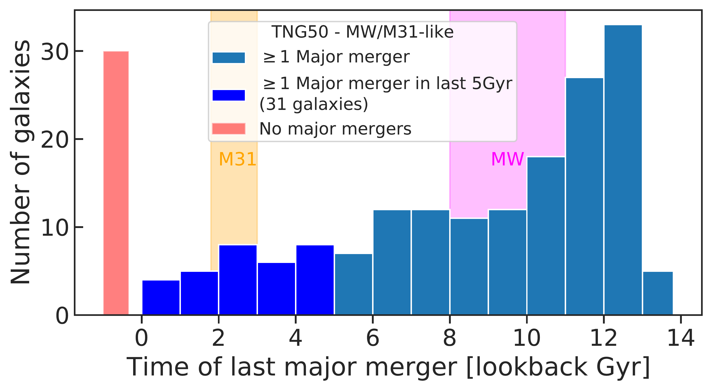
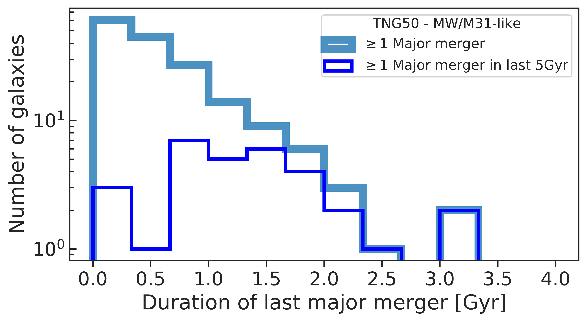
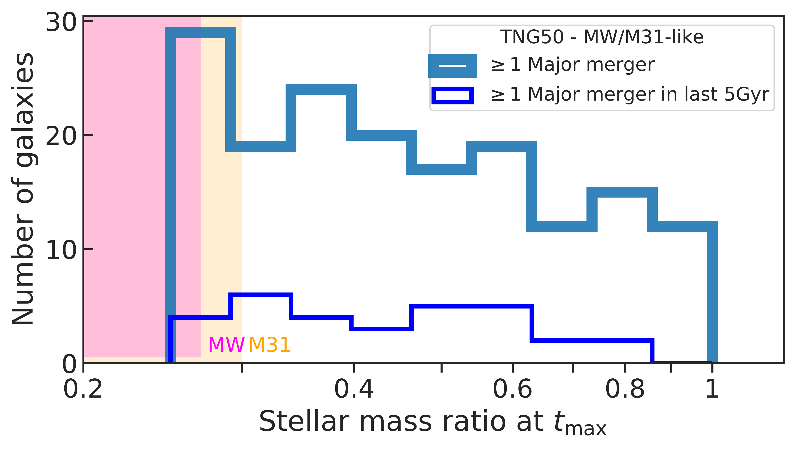
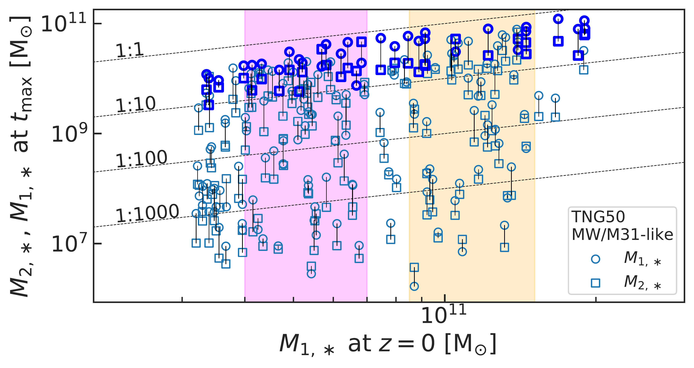

$\newcommand{\ensuremath}{}$
$\newcommand{\xspace}{}$
$\newcommand{\object}[1]{\texttt{#1}}$
$\newcommand{\farcs}{{.}''}$
$\newcommand{\farcm}{{.}'}$
$\newcommand{\arcsec}{''}$
$\newcommand{\arcmin}{'}$
$\newcommand{\ion}[2]{#1#2}$
$\newcommand{\textsc}[1]{\textrm{#1}}$
$\newcommand{\hl}[1]{\textrm{#1}}$
$\newcommand{\DSR}[1]{\textcolor{red}{#1}}$
$\newcommand{\DSRc}[1]{\textit{\textcolor{red}{#1}}}$
$\newcommand{\DTA}[1]{\textcolor{cyan}{#1}}$
$\newcommand{\ap}[1]{\textcolor{magenta}{#1}}$
$\newcommand{\apn}[1]{\textcolor{red}{#1}}$
$\newcommand{\MS}{\rm{M}_{\odot}}$
$\newcommand{\MH}{\rm{M}_{\rm 200c}}$
$\newcommand{\thebibliography}{\DeclareRobustCommand{\VAN}[3]{##3}\VANthebibliography}$
$\newcommand{\}{blankpage}$

$\newcommand{\ensuremath}{}$
$\newcommand{\xspace}{}$
$\newcommand{\object}[1]{\texttt{#1}}$
$\newcommand{\farcs}{{.}''}$
$\newcommand{\farcm}{{.}'}$
$\newcommand{\arcsec}{''}$
$\newcommand{\arcmin}{'}$
$\newcommand{\ion}[2]{#1#2}$
$\newcommand{\textsc}[1]{\textrm{#1}}$
$\newcommand{\hl}[1]{\textrm{#1}}$
$\newcommand{\DSR}[1]{\textcolor{red}{#1}}$
$\newcommand{\DSRc}[1]{\textit{\textcolor{red}{#1}}}$
$\newcommand{\DTA}[1]{\textcolor{cyan}{#1}}$
$\newcommand{\ap}[1]{\textcolor{magenta}{#1}}$
$\newcommand{\apn}[1]{\textcolor{red}{#1}}$
$\newcommand{\MS}{\rm{M}_{\odot}}$
$\newcommand{\MH}{\rm{M}_{\rm 200c}}$
$\newcommand{\thebibliography}{\DeclareRobustCommand{\VAN}[3]{##3}\VANthebibliography}$
$\newcommand{\}{blankpage}$

# The merger and assembly histories of Milky Way- and M31-like galaxies with TNG50: disk survival through mergers

<mark>Appeared on: 2022-10-31</mark> - _Published by MNRAS. Check also Chen et al., Engler et al. and Ramesh et al., on arxiv.org today, for further analyses of Milky Way- and Andromeda-like galaxies using the cosmological simulation TNG50. Main figures: 2, 7, 16_

<mark><mark>Diego Sotillo-Ramos</mark></mark>, et al. -- incl., <mark><mark>Annalisa Pillepich</mark></mark>, <mark><mark>Lukas Eisert</mark></mark>

**Abstract:** We analyze the merger and assembly histories of Milky Way (MW) and Andromeda (M31)-like galaxies to quantify how, and how often, disk galaxies of this mass can survive recent major mergers (stellar mass ratio $\ge$ 1:4).For this, we use the cosmological magneto-hydrodynamical simulation TNG50 and identify 198 analog galaxies, selected based on their $z=0$ stellar mass ( $10^{10.5-11.2} \MS$ ), disky stellar morphology and local environment.Firstly, major mergers are common: 85 per cent (168) of MW/M31-like galaxies in TNG50 have undergone at least one major merger across their lifetime.In fact, 31 galaxies (16 per cent) have undergone a recent major merger, i.e. in the last 5 Gyr. The gas available during the merger suffices to either induce starbursts at pericentric passages or to sustain prolonged star formation after coalescence: in roughly half of the cases, the pre-existing stellar disk is destroyed because of the merger but reforms thanks to star formation. Moreover, higher merger mass ratios are more likely to destroy the stellar disks.In comparison to those with more ancient massive mergers, MW/M31-like galaxies with recent major mergers have, on average, somewhat thicker stellar disks, more massive and somewhat shallower stellar haloes, larger stellar ex-situ mass fractions, but similarly massive kinematically-defined bulges. All this is qualitatively consistent with the different observed properties of the Galaxy and Andromeda and with the constraints on their most recent major mergers, $8-11$ and  2 Gyr ago, respectively.According to contemporary cosmological simulations, a recent quiet merger history is not a pre-requisite for obtaining a relatively-thin stellar disk at $z=0$ .

**Figure 13. -** Evolutionary tracks of an example TNG50 MW/M31-like galaxy whose last major merger destroys the stellar disk, but a new one reforms.
    In all panels, but the images at the bottom, values are shown as a function of cosmic time. The vertical thick solid line represents the time of the last major merger; the thin vertical line in the top panel denotes the time when the stellar mass ratio is evaluated.
    _Top panel:_ Time evolution of the gravitationaly-bound stellar and gas mass (solid and dashed line, respectively) for the primary and secondary progenitors.
    _Second to fourth panels:_ SFR of the main progenitor (fuchsia), distance between progenitors (red), and diskyness i.e. D/T mass ratio (blue -- see definition in Section \ref{sec:galStarProperties}).
    _Fifth to seventh panels:_ Distributions of the orbit circularities of stellar particles. From top to bottom: circularities of the in-situ stars along the main-progenitor branch of the galaxy; in-situ circularities evaluated at $z=0$ and shown as a function of the birth time of the stars; in-situ circularity evaluated at the time of birth and shown as as a function of birth time.
    _Bottom panels:_ Stellar density images of the main progenitors, centered at the main galaxy, face-on and an edge-on views, across snapshots separated by about 150 Myrs.
     (*fig:circularitiesLMMdestroysDisk*)

**Figure 16. -** 
    Connection between star formation, orbital circularities of the stars and the amount of in-situ star formation triggered by the merger and of the ex-situ stars brought in by the mergers.
    _Top_: circularities of the stellar orbits at the time of formation vs. at $z=0$, stacked for all 31 TNG50 MW/M31-like galaxies with a recent major merger, for stars formed before (before $t_{\rm{max}}$),  during (between $t_{\rm{max}}$ and $t_{\rm{merger}}$), and after the last major merger, from left to right. In all panels, stars in perfectly circular orbits have a circularity $=1$(or $-1$ if they are counter-rotating); stars in radial orbits have a circularity of $\sim0$. Histograms show the total stellar mass per galaxy born in the respective periods of time.
    _Bottom left_: Fraction of in-situ stellar mass formed in the last 5 Gyr as a function of total stellar mass at $z=0$.
    _Bottom right_: Ex-situ stellar mass brought during the last major merger vs. in situ stellar mass in the last 5 Gyr. In both cases, TNG50 MW/M31-like galaxies with a recent major merger (blue) are contrasted with those with at least one major merger across their history but irrespective of when (light blue). Most of the stars were born in circular orbits, this is generally the case both before and after the times of the last major merger and, to a lesser extent, during the last major merger; however, the orbits of the stars born after the last recent major merger remain mostly unaltered, i.e. in circular orbits, all the way to $z=0$. Furthermore, recent major mergers also seem to trigger more in-situ star formation in the resulting galaxy than in galaxies with more ancient mergers, in addition to bringing large amounts of ex-situ stellar mass. (*fig:circularitiesPrePostLMM*)

**Figure 12. -** Characteristics of the last major mergers of MW/M31-like galaxies in TNG50 at $z=0$: major mergers. In all panels, MW/M31-like galaxies that experienced their final major merger in the last 5 Gyr are depicted in blue; MW/M31 analogues with their last major merger at any cosmic time are indicated in light blue.
    _Top left_: Time of the last major merger (in lookback Gyr) for each of the 198 galaxies, in bins of $1 $Gyr: 30 MW/M31-like galaxies did not undergo any major mergers (orange bin); 95 galaxies (approximately 50 per cent) underwent their last major merger more than 9 Gyr ago ($z\gtrsim1.3)$; 31 galaxies have had a late major merger, i.e. as recent as in the last 5 Gyr. The occurrence of the latter is distributed in an approximately uniform way in the considered period of time.
    _Top right_: Duration of the major mergers, defined as the time elapsed since the secondary reached its maximum in stellar mass ($t_\rmn{max}$) and the moment of coalescence -- bins span 330 million years. 77 per cent of the major mergers lasting longer than $1.5 $Gyr are recent.
    _Bottom left_: Stellar-mass ratios between the secondary and the primary, at $t_\rmn{max}$. _Bottom right_: Stellar mass of both progenitors, at $t_\rmn{max}$, versus the stellar mass of the galaxy at $z=0$. For the Galaxy and Andromeda, we show observational estimates with magenta and orange annotations, respectively: the mass-ratio and the time of the known last major merger are taken for the case of GES \citep[][]{Helmi2018, Gallart2019, Naidu2021} and for M32 \citep[][]{DSouza2018}.
     (*fig:lastMajorMerger*)

