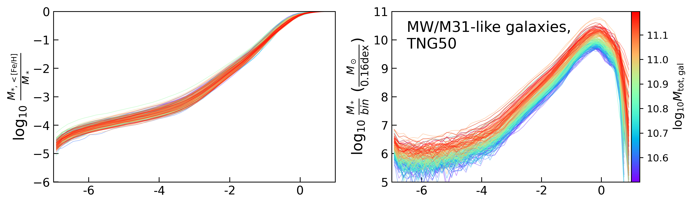
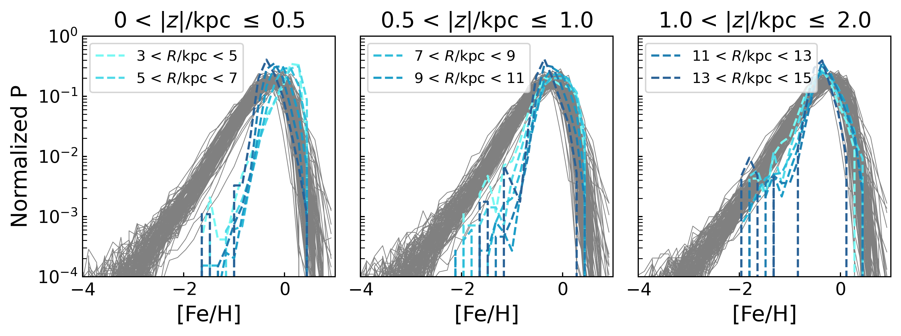

$\newcommand{\ensuremath}{}$
$\newcommand{\xspace}{}$
$\newcommand{\object}[1]{\texttt{#1}}$
$\newcommand{\farcs}{{.}''}$
$\newcommand{\farcm}{{.}'}$
$\newcommand{\arcsec}{''}$
$\newcommand{\arcmin}{'}$
$\newcommand{\ion}[2]{#1#2}$
$\newcommand{\textsc}[1]{\textrm{#1}}$
$\newcommand{\hl}[1]{\textrm{#1}}$
$\newcommand{\footnote}[1]{}$
$\newcommand{\angstrom}{\textup{Å}}$
$\newcommand{\lhnote}[1]{\textcolor{cyan}{{#1}}}$
$\newcommand{\msun}{{\rm M}_\odot}$
$\newcommand{\zsun}{Z_\odot}$
$\newcommand{\mste}{M_{\rm *}}$
$\newcommand{\feh}{\mathrm{[Fe/H]}}$
$\newcommand{\epz}{\epsilon_\mathrm{z}}$
$\newcommand{\empempall}{M_{\mathrm{EMP, comp}}-to-M_\mathrm{EMP} (<300\mathrm{kpc}) }$
$\newcommand{\empall}{M_{\mathrm{EMP, comp}}-to-M_{\mathrm{tot, comp}} }$
$\newcommand{\empallr}{M_{\mathrm{EMP}}(r)-to-M_{\mathrm{tot}}(r) }$
$\newcommand{\ap}[1]{\textcolor{magenta}{#1}}$

$\newcommand{\ensuremath}{}$
$\newcommand{\xspace}{}$
$\newcommand{\object}[1]{\texttt{#1}}$
$\newcommand{\farcs}{{.}''}$
$\newcommand{\farcm}{{.}'}$
$\newcommand{\arcsec}{''}$
$\newcommand{\arcmin}{'}$
$\newcommand{\ion}[2]{#1#2}$
$\newcommand{\textsc}[1]{\textrm{#1}}$
$\newcommand{\hl}[1]{\textrm{#1}}$
$\newcommand{\footnote}[1]{}$
$\newcommand{\angstrom}{\textup{Å}}$
$\newcommand{\lhnote}[1]{\textcolor{cyan}{{#1}}}$
$\newcommand{\msun}{{\rm M}_\odot}$
$\newcommand{\zsun}{Z_\odot}$
$\newcommand{\mste}{M_{\rm *}}$
$\newcommand{\feh}{\mathrm{[Fe/H]}}$
$\newcommand{\epz}{\epsilon_\mathrm{z}}$
$\newcommand{\empempall}{M_{\mathrm{EMP, comp}}-to-M_\mathrm{EMP} (<300\mathrm{kpc}) }$
$\newcommand{\empall}{M_{\mathrm{EMP, comp}}-to-M_{\mathrm{tot, comp}} }$
$\newcommand{\empallr}{M_{\mathrm{EMP}}(r)-to-M_{\mathrm{tot}}(r) }$
$\newcommand{\ap}[1]{\textcolor{magenta}{#1}}$

# Where are the extremely metal-poor stars in the Milky Way and Andromeda? Expectations from TNG50

<mark>Appeared on: 2022-10-31</mark> - _Part of a set of papers based on TNG50 MW/M31-like galaxies. 14 pages, 9 figures. Accepted manuscript by MNRAS_

<mark><mark>Li-Hsin Chen</mark></mark>, <mark><mark>Annalisa Pillepich</mark></mark>, Simon C. O. Glover, Ralf S. Klessen

**Abstract:** We analyse the location of extremely metal-poor stars (EMPs, $\feh < -3$ ) in 198 Milky Way (MW)/M31-like galaxies at $z=0$ in the TNG50 simulation. Each system is divided into four kinematically-defined morphological stellar components based on stellar circularity and galactocentric distance, namely bulge, cold disk, warm disk, and stellar halo, in addition to satellites (with stellar mass $\ge5\times10^6 \msun$ ). According to TNG50 and across all simulated systems, the stellar halo of the main galaxy and satellites present the highest frequency of EMPs (largest $\empall$ stellar mass ratio), and thus the highest chances of finding them. Such frequency is larger in lower-mass than high-mass satellites. Moreover, TNG50 predicts that the stellar halo of the main galaxy always hosts and thus contributes the majority of the EMPs of the system. Namely, it has the highest mass ratio  of EMPs in it to all the EMPs in the system (largest $\empempall$ ). However, notably, we also find that 33 MW/M31-like galaxies in TNG50 have cold disks that contribute more than 10 per cent to the total EMP mass, each with $\gtrsim 10^{6.5-7}  \msun$ of EMPs in cold circular orbits. These qualitative statements do not depend on the precise definition of EMP stars, i.e. on  the adopted metallicity threshold. The results of this work provide a theoretical prediction for the location of EMP stars from both a spatial and kinematic perspective and across an unprecedented number of well-resolved MW/M31-like systems.

**Figure 8. -** Mass fraction of EMP stars in 198 TNG50 MW/M31 analogues in different morphological components**Stellar mass and mass fractions of EMPs in 198 TNG50 MW/M31 analogues across their different morphological components.** In the top panel, we give the amounts of stellar mass in EMP stellar populations predicted by TNG50 across and within the different galaxies. In the bottom left panel, we show the $\empall$ fraction, i.e. the frequency of EMPs on a component-by-component basis. In the bottom right, we show the $\empempall$ fractions, i.e. the contribution of each morphological component to the total mass in EMPs, i.e. across all components. Satellites belonging to each galaxy are considered as one component in the system (the "satellites", see Sec. \ref{sec:morph} for details). Bulge, cold disk, warm disk, stellar halo, and satellites in each MW/M31-like system are shown as red, blue, green, orange, and grey circles, respectively. The amount of EMPs across all the morphological components ($M_\mathrm{EMP} (<300\mathrm{kpc})$) is shown as black crosses.
    There are 6 MW/M31 analogues without any satellites and 1 MW/M31 analogue that has only one metal-enriched satellite. They are manually added in the bottom of the top panel in filled grey circles.
     (*fig:empfraction*)

**Figure 3. -** Kinematically-defined morphological decomposition of the simulated MW/M31-like galaxies adopted throughout.** Kinematically-defined morphological decomposition of the simulated MW/M31-like galaxies adopted throughout.**_ Top_: Cartoon plot of the morphological decomposition of the main galaxy's body, based on circularity and galactocentric distance of the stars: $r_\mathrm{cut} = 3.5$ kpc, $r_\mathrm{disk} = 6 \times r_\mathrm{disk scale length}$, and $r_\mathrm{halo} = 300$ kpc. In addition to the depicted components, namely bulge, cold disk, warm disk, and stellar halo, satellite galaxies are identified as gravitationally-bound substructures of stars within 300 kpc from the centre, via the Subfind algorithm. In this paper, we only consider satellites more massive than $5\times10^6 $\msun$$ in stars.
    _ Bottom_: stellar mass in the distinct morphological components of all 198 MW/M31-like systems of TNG50 at $z=0$. (*fig:morph_decomp*)

**Figure 4. -** MDFs of TNG50 MW/M31 analogues** Stellar metallicity distribution functions (MDFs) of MW/M31-like galaxies in TNG50.**_ Top panels:_ we show the MDFs of all 198 MW/M31 systems, across _ all_ their morphological components: disks, bulge, stellar halo and satellites, colour coded by galaxy stellar mass. The redder the colour, the higher the galaxy stellar mass. On the left, we show the cumulative fraction and on the right, we show the stellar mass. _ Middle three panels:_ MDFs of the subsample TNG50 galaxies with mass more similar to the Milky Way (gray curves) overlaid to results from observations and thus with stars selected by height and radial distance to attempt to account for the surveys' selection functions: we report here the Milky Way's MDF by \citet[][green]{Youakim:2020aa}, \citet[][magenta]{Bonifacio:2021aa}, and by \citet[][orange]{Buder:2021aa}. For the middle left panel, we select stars that have heliocentric distances between 6 and 20 kpc, and at Galactic latitudes between 30 and 78 degrees ($|b| = 30-78$). The probability is then normalised to the total number of stars between $-4. < $\feh$ < -1.05$ to compare with \citet{Youakim:2020aa}. In the middle central panel, we select stars that are < 6 kpc from the galactic plane and < 14 kpc from the galactic centre. The probability is again normalised to the total number of stars between $-4. < $\feh$ < -1.05$ to compare with \citet{Bonifacio:2021aa}. For the middle right panel, we select stars that have heliocentric distances $<2$ kpc and that are positioned at Galactic latitudes larger than 10 degrees ($|b| > 10$) to compare with data from GALAH survey Data Release 3 \citep{Buder:2021aa}. In order to take into account the distance-selection criterion from the survey, the solar position in each MW-like galaxy is randomly sampled, at 8.2 kpc from the galactic centre, and we compute the mean MDF over 100 possibilities. The probability is normalised to the total number of stars. _ Bottom three panels:_ MDF comparison to data from \citet[][shades of blue, for three different height selections]{Hayden:2015aa}. We group stars at different distances from the galactic plane to compare with \citet{Hayden:2015aa}, where the probabilities are normalised to total number of stars in each subset. We do not impose any additional selection function to TNG50 star particles but for the aforementioned geometrical spatial cuts that account for the effective footprints of the APOGEE survey Data Release 12. Note that the survey cannot report many metal-poor stars as it hits the detection limit at $\feh \sim -2$. (*fig:mdf*)

