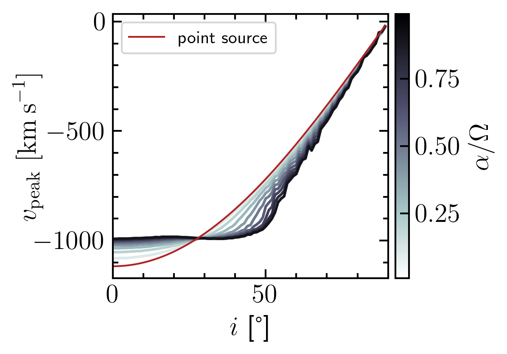
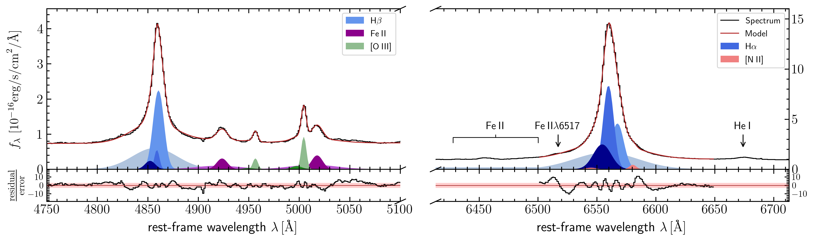
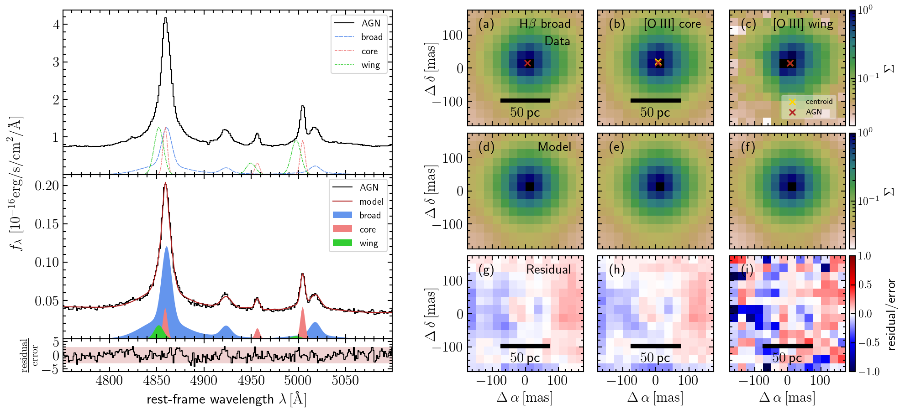

$\newcommand{\ensuremath}{}$
$\newcommand{\xspace}{}$
$\newcommand{\object}[1]{\texttt{#1}}$
$\newcommand{\farcs}{{.}''}$
$\newcommand{\farcm}{{.}'}$
$\newcommand{\arcsec}{''}$
$\newcommand{\arcmin}{'}$
$\newcommand{\ion}[2]{#1#2}$
$\newcommand{\textsc}[1]{\textrm{#1}}$
$\newcommand{\hl}[1]{\textrm{#1}}$

$\newcommand{\ensuremath}{}$
$\newcommand{\xspace}{}$
$\newcommand{\object}[1]{\texttt{#1}}$
$\newcommand{\farcs}{{.}''}$
$\newcommand{\farcm}{{.}'}$
$\newcommand{\arcsec}{''}$
$\newcommand{\arcmin}{'}$
$\newcommand{\ion}[2]{#1#2}$
$\newcommand{\textsc}[1]{\textrm{#1}}$
$\newcommand{\hl}[1]{\textrm{#1}}$

# The Close AGN Reference Survey (CARS)

<mark>Appeared on: 2022-11-01</mark> - _17 pages. 12 figures. Re-submitted to A&A after minor revision. Comments welcome_

<mark>N. Winkel</mark>, et al. -- incl., <mark>K. Jahnke</mark>, <mark>M. A. Pérez-Torres</mark>

**Abstract:** The interaction between Active Galactic Nuclei (AGN) and their host galaxies is scarcely resolved. Narrow-line Seyfert 1 (NLS1) galaxies are believed to represent AGN at early stages of their evolution and allow to observe AGN feeding and feedback processes at high accretion rates. We aim to constrain the properties of the ionised gas outflow in Mrk 1044, a nearby super-Eddington accreting NLS1. Based on the outflow energetics and the associated timescales, we estimate the outflow's future impact on the ongoing host galaxy star formation on different spatial scales. We apply a spectroastrometric analysis to VLT MUSE NFM-AO observations of Mrk 1044's nucleus. This allows us to map two ionised gas outflows traced by [ \ion{O}{iii} ] which have velocities of $-560 \pm 20 {\rm km\:s}^{-1}$ and $-144 \pm 5  {\rm km\:s}^{-1}$ .   Furthermore, we use an archival HST/STIS spectrum to identify two Ly- $\alpha$ absorbing components that escape from the centre with approximately twice the velocity of the ionised gas components. Both [ \ion{O}{iii} ] outflows are spatially unresolved and located close to the AGN ( $< 1 {\rm pc}$ ). They have gas densities higher than $10^5  {\rm cm}^{-3}$ , which implies that the BPT diagnostic cannot be used to constrain the underlying ionisation mechanism.   We explore whether an expanding shell model can describe the velocity structure of Mrk 1044's multi-phase outflow.   We find an additional ionised gas outflowing component that is spatially resolved. It has a velocity of $-211 \pm 22  {\rm km\:s}^{-1}$ and projected size of $$4.6 \pm 0.6  {\rm pc$$} .   A kinematic analysis suggests that significant turbulence may be present in the ISM around the nucleus, which may lead to a condensation rain, potentially explaining the efficient feeding of Mrk 1044's AGN.   Within the innermost 0.5 $\arcsec$ (160 $ {\rm pc}$ ) we detect modest star formation hidden by the beam-smeared emission from the outflow. We estimate that the multi-phase outflow has been launched $< 10^4  {\rm yrs}$ ago. Together with the star formation in the vicinity of the nucleus, this suggests that Mrk 1044's AGN phase set on recently.    The outflow carries enough mass and energy to impact the host galaxy star formation on different spatial scales, highlighting the complexity of the AGN feeding and feedback cycle in its early stages.

**Figure 7. -** Dependence of the emission line flux maximum corresponding velocity on inclination. Independent of how concentrated the light profile is ($\alpha/\theta_0$), the geometric model requires high inclinations of the [$\ion${O}{iii}]-emitting shell to significantly reduce the peak velocity by a factor of approximately two.
  (*fig:shell_model_parameters*)

**Figure 8. -** Modelling Mrk 1044's AGN spectrum in the H$\beta$-[$\ion${O}{iii}] region (left) and H$\alpha$-[$\ion${N}{ii}] region (right). To reproduce the observed spectrum (black) we use a multi-Gaussian model for H$\beta$(blue), [$\ion${O}{iii}](green), $\ion${Fe}{ii}(purple), H$\alpha$(blue, right panel) and [$\ion${N}{ii}](red). The best-fit spectrum is shown as a red line and well reproduces the prominent emission lines, including the blue shoulder of the [$\ion${O}{iii}] narrow line. (*fig:MUSE_fit*)

**Figure 9. -** Spectroastrometric analysis of Mrk 1044's central region using the original MUSE NFM-AO data cube.
            The left panels show an arbitrary example spectrum that is picked from the small window around the nucleus shown in the panels on the right. To fit the spectrum, we keep the kinematics and line ratios of the kinematics fixed to that of the components found in the AGN spectrum.
            The panels on the right show the surface brightness within the central 150$ {\rm mas}$ for the kinematic components where the flux maps are normalised to their peak flux.
            Here we only show the measure light distribution from the BLR H$\beta$(left), [$\ion${O}{iii}]-wing (middle), and narrow [$\ion${O}{iii}]-core (right) component. From top to bottom the maps show the 2D light distributions, the best-fit model of the PSF and the residual maps. The red cross indicates the PSFAO19 centroid for the best-fit PSFAO19 fit to the BLR H$\beta$. The green and white crosses indicate the centroids for the PSFAO19 models to the surface brightness maps of the [$\ion${O}{iii}]-wing and core respectively, in which the amplitude and position of the Moffat model were varied only. The offset of both [$\ion${O}{iii}] core and wing component from the AGN position are smaller than $0.1 {\rm px}$. (*fig:spectroastrometry_maps*)

