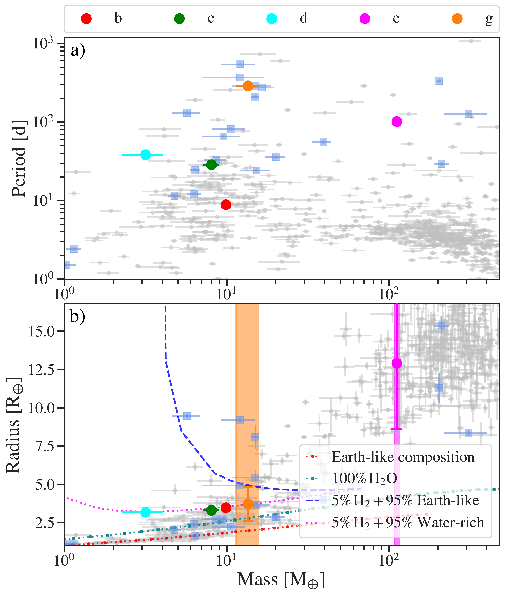
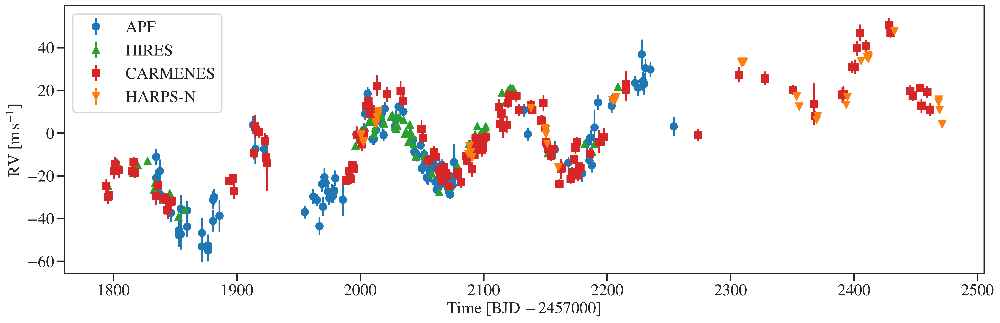

$\newcommand{\ensuremath}{}$
$\newcommand{\xspace}{}$
$\newcommand{\object}[1]{\texttt{#1}}$
$\newcommand{\farcs}{{.}''}$
$\newcommand{\farcm}{{.}'}$
$\newcommand{\arcsec}{''}$
$\newcommand{\arcmin}{'}$
$\newcommand{\ion}[2]{#1#2}$
$\newcommand{\textsc}[1]{\textrm{#1}}$
$\newcommand{\hl}[1]{\textrm{#1}}$

$\newcommand{$\ensuremath$}{}$
$\newcommand{$\xspace$}{}$
$\newcommand{$\object$}[1]{\texttt{#1}}$
$\newcommand{$\farcs$}{{.}''}$
$\newcommand{$\farcm$}{{.}'}$
$\newcommand{$\arcsec$}{''}$
$\newcommand{$\arcmin$}{'}$
$\newcommand{$\ion$}[2]{#1#2}$
$\newcommand{$\textsc$}[1]{\textrm{#1}}$
$\newcommand{$\hl$}[1]{\textrm{#1}}$

# HD 191939 revisited: New and refined planet mass determinations, and a new planet in the habitable zone.

<mark>Appeared on: 2022-11-03</mark> - _Accepted for publication in A&A. 20 pages, 8 figures_

J. Orell-Miquel, et al. -- incl., <mark>J. Livingston</mark>

**Abstract:** HD 191939 (TOI-1339) is a nearby (d$=$54 pc), bright (V$=$9 mag), and inactive Sun-like star (G9 V) known to host a multi-planet transiting system. Ground-based spectroscopic observations confirmed the planetary nature of the three transiting sub-Neptunes (HD 191939 b, c, and d) originally detected by\textit{TESS}and were used to measure the masses for planets b and c with$3\sigma$precision. These previous observations also reported the discovery of an additional Saturn-mass planet (HD 191939 e) and evidence for a further, very long-period companion (HD 191939 f). Here, we report the discovery of a new non-transiting planet in the system and a refined mass determination of HD 191939 d. The new planet, HD 191939 g, has a minimum mass of 13.5$\pm$2.0$M_\oplus$and a period of about 280 d. This period places the planet within the conservative habitable zone of the host star, and near a 1:3 resonance with HD 191939 e.  The compilation of 362 radial velocity measurements with a baseline of 677 days from four different high-resolution spectrographs also allowed us to refine the properties of the previously known planets, including a$4.6\sigma$mass determination for planet d, for which only a$2\sigma$upper limit had been set until now. We confirm the previously suspected low density of HD 191939 d, which makes it an attractive target for attempting atmospheric characterisation.  Overall, the planetary system consists of three sub-Neptunes interior to a Saturn-mass and a Uranus-mass planet plus a high-mass long-period companion. This particular configuration has no counterpart in the literature and makes HD 191939 an exceptional multi-planet transiting system with an unusual planet demographic worthy of future observation.

**Figure 2. -** \label{fig: SYSTEM DIAGRAM PLOT}
    Mass--period (\textit{top panel}) and mass--radius (\textit{bottom panel}) diagrams for well-characterised planets with masses and radii measured with a precision better than 30\%, from 1 ${M}_\oplus$ up to 1.5 ${M}_{\mathrm{J}}$ and 1 ${R}_\oplus$ up to 1.5 ${R}_{\mathrm{J}}$, from the TEPCat database (February 2022; \citealp{Southworth_database}) and \url{http://exoplanet.eu}. HD 191939 planets are colour coded and marked with a filled circle with error bars (the radii  of HD 191939 e and g are forecasted). Vertical colour bands indicate the $\pm 1\sigma$ mass regions of HD 191939 g and e. Temperate planets with $T_{\mathrm{eq}}$ = 250--395 K are marked by blue squares. The mass--radius panel also shows theoretical composition models at 300 K from \citet{Zeng_models}. (*fig: SYSTEM DIAGRAM PLOT*)

**Figure 8. -** \label{fig: RV DATA}
Time series of RV measurements taken by APF (blue circles), HIRES (green up triangles), CARMENES (red squares), and HARPS-N (orange down triangles). (*fig: RV DATA*)

**Figure 14. -** \label{fig: TESS SECTORS}\textit{TESS} photometry from Sectors 15--19, 21, 22, 24, and 25 along with the best-fit model (see Fig. \ref{fig: TESS SECTORS 41 48} for Sectors 41 and 48). Upward-pointing triangles mark the transits for HD 191939 b (red), c (cyan), and d (green). Downward-pointing triangles with error bars mark the expected $t_0$ and $\pm   1\sigma$ uncertainty for the non-transiting planets HD 191939 e (magenta) and g (orange). (*fig: TESS SECTORS*)

