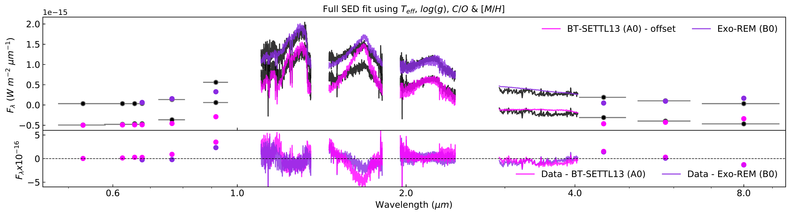
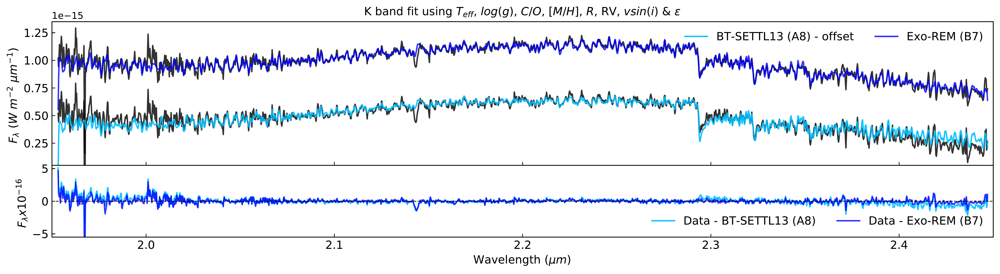
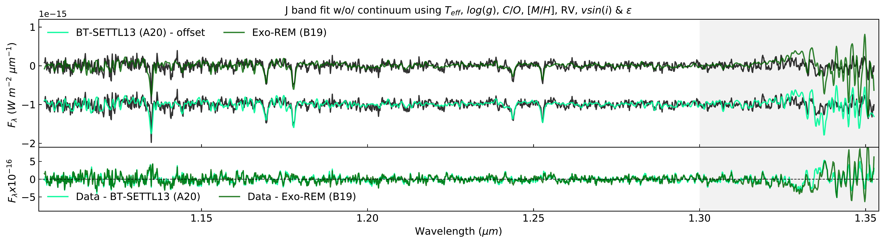
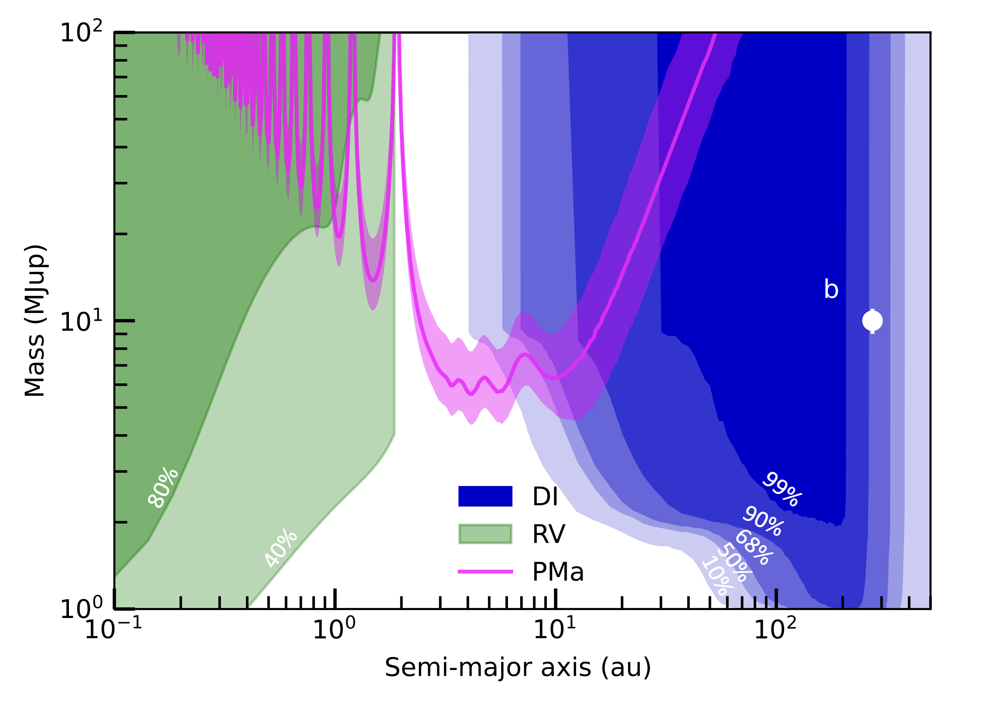
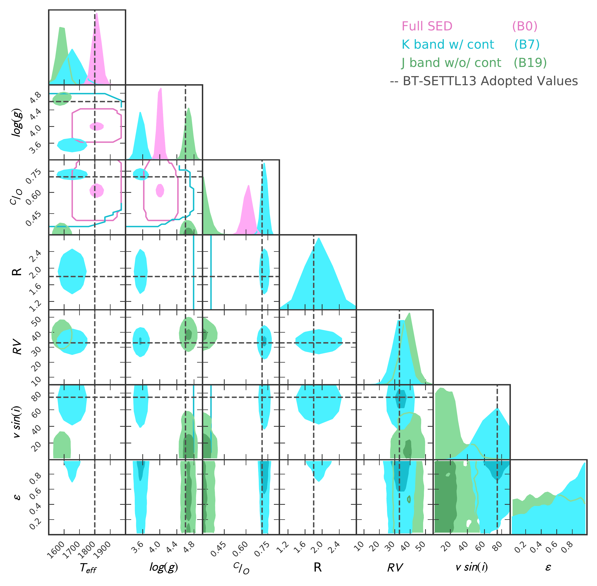

$\newcommand{\ensuremath}{}$
$\newcommand{\xspace}{}$
$\newcommand{\object}[1]{\texttt{#1}}$
$\newcommand{\farcs}{{.}''}$
$\newcommand{\farcm}{{.}'}$
$\newcommand{\arcsec}{''}$
$\newcommand{\arcmin}{'}$
$\newcommand{\ion}[2]{#1#2}$
$\newcommand{\textsc}[1]{\textrm{#1}}$
$\newcommand{\hl}[1]{\textrm{#1}}$
$\newcommand{\red}[1]{\textcolor{red}{#1}}$
$\newcommand{\blue}[1]{\textcolor{blue}{#1}}$
$\newcommand{\teal}[1]{\textcolor{teal}{#1}}$
$\newcommand{\cyan}[1]{\textcolor{cyan}{#1}}$
$\newcommand{\violet}[1]{\textcolor{violet}{#1}}$
$\newcommand{\magenta}[1]{\textcolor{magenta}{#1}}$
$\newcommand{\fgreen}[1]{\textcolor{ForestGreen}{#1}}$
$\newcommand{\lgreen}[1]{\textcolor{LimeGreen}{#1}}$
$\newcommand{\nblue}[1]{\textcolor{NavyBlue}{#1}}$
$\newcommand{\theenumi}{\roman{enumi}}$
$\newcommand{\arraystretch}{1.7}$

$\newcommand{$\ensuremath$}{}$
$\newcommand{$\xspace$}{}$
$\newcommand{$\object$}[1]{\texttt{#1}}$
$\newcommand{$\farcs$}{{.}''}$
$\newcommand{$\farcm$}{{.}'}$
$\newcommand{$\arcsec$}{''}$
$\newcommand{$\arcmin$}{'}$
$\newcommand{$\ion$}[2]{#1#2}$
$\newcommand{$\textsc$}[1]{\textrm{#1}}$
$\newcommand{$\hl$}[1]{\textrm{#1}}$
$\newcommand{$\red$}[1]{\textcolor{red}{#1}}$
$\newcommand{$\blue$}[1]{\textcolor{blue}{#1}}$
$\newcommand{$\teal$}[1]{\textcolor{teal}{#1}}$
$\newcommand{$\cyan$}[1]{\textcolor{cyan}{#1}}$
$\newcommand{$\violet$}[1]{\textcolor{violet}{#1}}$
$\newcommand{$\magenta$}[1]{\textcolor{magenta}{#1}}$
$\newcommand{$\fgreen$}[1]{\textcolor{ForestGreen}{#1}}$
$\newcommand{$\lgreen$}[1]{\textcolor{LimeGreen}{#1}}$
$\newcommand{$\nblue$}[1]{\textcolor{NavyBlue}{#1}}$
$\newcommand{$\theenumi$}{\roman{enumi}}$
$\newcommand{$\arraystretch$}{1.7}$

# Peering into the Young Planetary System AB Pic:  Second Planetary Candidate

<mark>Appeared on: 2022-11-04</mark> - _17 pages, 13 Figures, 6 Tables. Accepted for publication in A&A (31 of October)_

P. Palma-Bifani, et al. -- incl., <mark><mark>M. Langlois</mark></mark>, <mark><mark>C. Desgrange</mark></mark>, <mark><mark>M. Feldt</mark></mark>, <mark><mark>M. Meyer</mark></mark>, <mark><mark>M. Samland</mark></mark>, <mark><mark>Y. Zhang</mark></mark>

**Abstract:** We aim to revisit the system AB Pic which has a known companion at the exoplanet/ brown-dwarf boundary. We based this study on a rich set of observations to investigate the companion's orbit and atmosphere. We composed a spectrum of AB Pic b merging archival VLT/SINFONI K-band data, with published spectra at J and H-band (SINFONI) and Lp-band (Magellan-AO), and photometric measurements (HST and Spitzer). We modeled the spectrum with ForMoSA, based on two atmospheric models: ExoREM and BT-SETTL13. We determined the orbital properties of b fitting the astrometric measurements from NaCo (2003 and 2004) and SPHERE (2015). The orbital solutions favor a semi-major axis of $\sim$190au viewed edge-on. With Exo-REM, we derive a T$_{eff}$ of 1700$\pm$50K and surface gravity of 4.5$\pm$0.3dex, consistent with previous works, and we report for the first time a C/O ratio of 0.58$\pm$0.08 ($\sim$solar). The posteriors are sensitive to the wavelength interval and the family of models used. Given the 2.1hr rotation period and our vsin(i) of $\sim$73km/s, we estimate for the first time the true obliquity to be $\sim$45 or $\sim$135deg, indicating a significant misalignment between the planet's spin and orbit orientations. Finally, the existence of a proper motion anomaly between the Hipparcos and Gaia eDR3 compared to our SPHERE detection limits and adapted radial velocity limits indicate the existence of a $\sim$6M$_{Jup}$ inner planet orbiting from 2 to 10au (40-200mas). The possible existence of an inner companion, together with the likely miss-alignment of the spin axis orientation, strongly favor a formation path by gravitational instability or core accretion within a disk closer inside followed by dynamical interactions. Confirmation and characterization of planet c and access to a broader wavelength coverage for planet b will be essential to probe the uncertainties associated with the parameters. 

**Figure 10. -** Top: Full SED fit for both families of atmospheric models and the residuals (data - model). An offset was applied to the BT-SETTL13 model.
    Middle: Same as the top but for the K-band only.
    Bottom: Same as the top but for the J-band modeled without the continuum. Here, the gray area ($>1.3  \mu$m) stands for the spectral region excluded from the fit.
    Each model is identifiable by the label with the numeration of Tables \ref{ForMoSA1} and \ref{ForMoSA2}. The colors are consistent with the corner plots (Figures \ref{Corner_1} and \ref{Corner_2}) and the Tables. (*Fit*)

**Figure 7. -** Mass detection limits for an inner planet without assuming coplanarity with AB Pic b. The pink curve shows the estimated mass and orbital distance from the \textit{Hipparcos}-\textit{Gaia} proper motion anomaly (PMa), the blue area represents the SPHERE detection limits (DI), and the green area represents the RV detection limits from \citet{Grandjean2020} to give a rough idea of the inner regions that we can exclude. The semi-major axis and mass of AB Pic b is represented by the white point. (*detLimABPicc*)

**Figure 11. -** Corner-plot comparing the posteriors of the models presented on Figure \ref{Fit} for BT-SETTL13 with consistent colors. The black dashed lines represent the adopted values from this work listed in Table \ref{tab:atmosparams}. (*Corner_1*)

