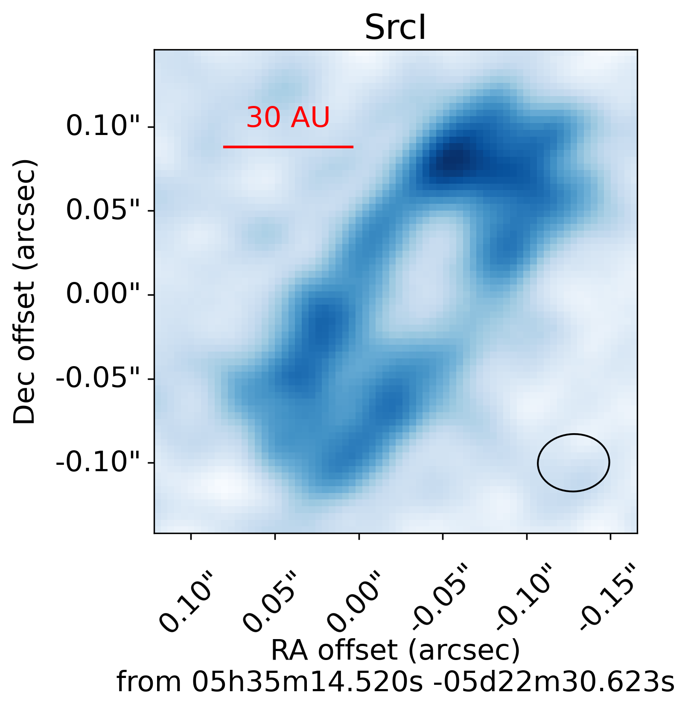
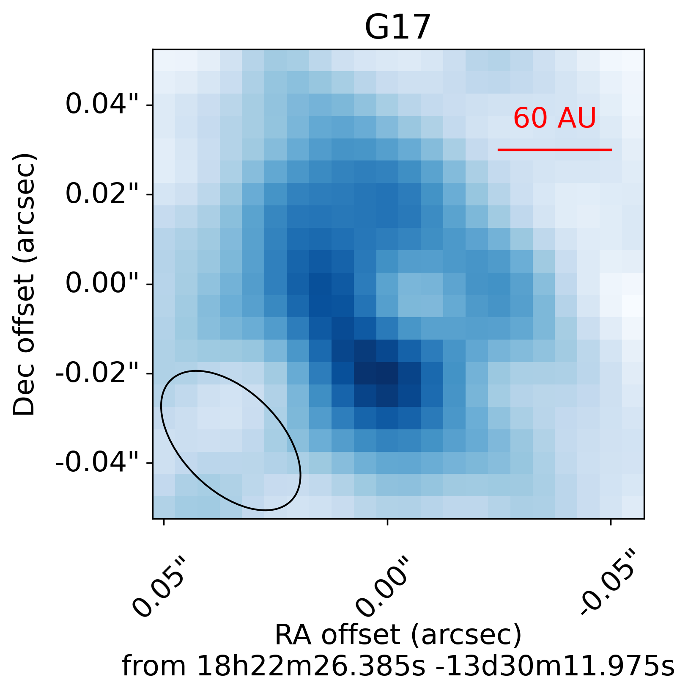
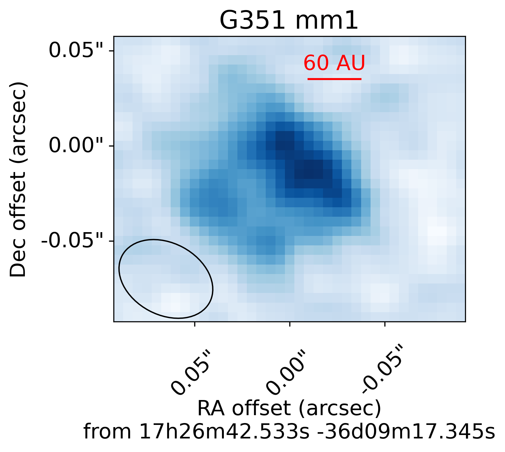
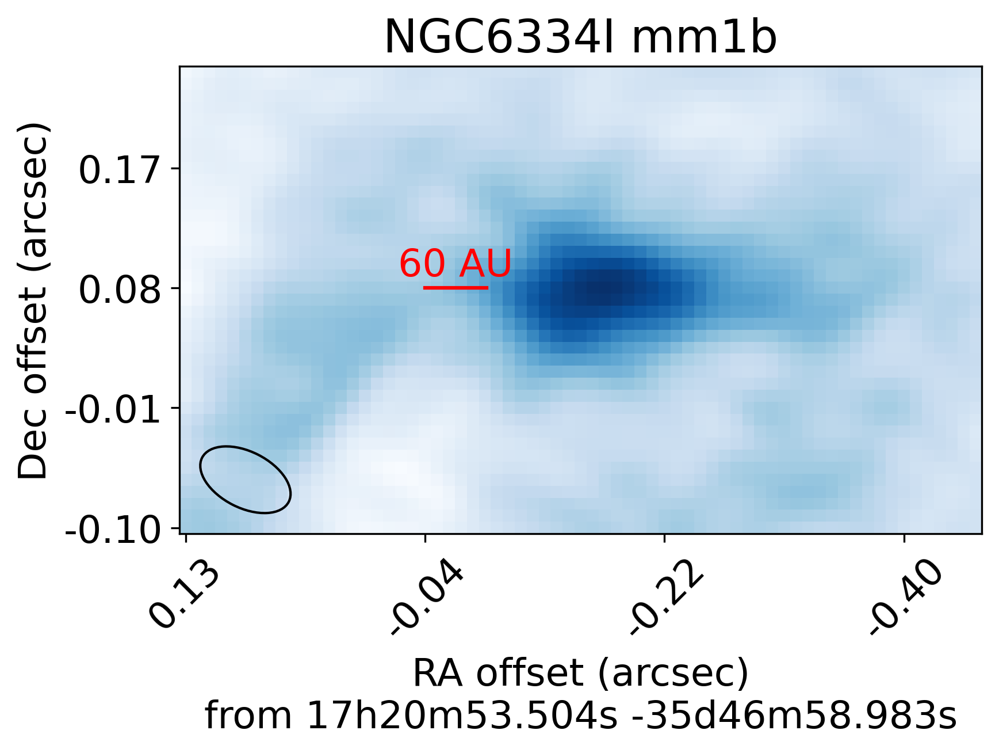
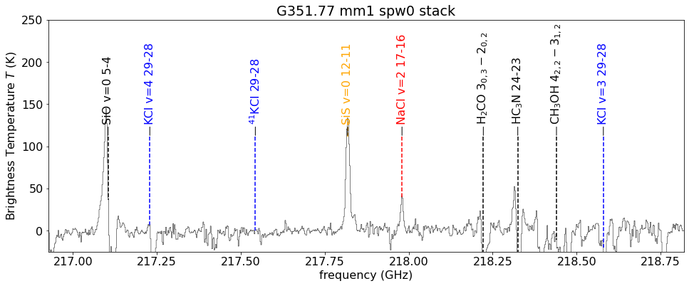
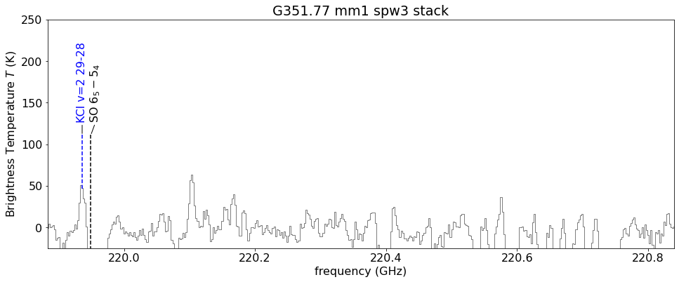
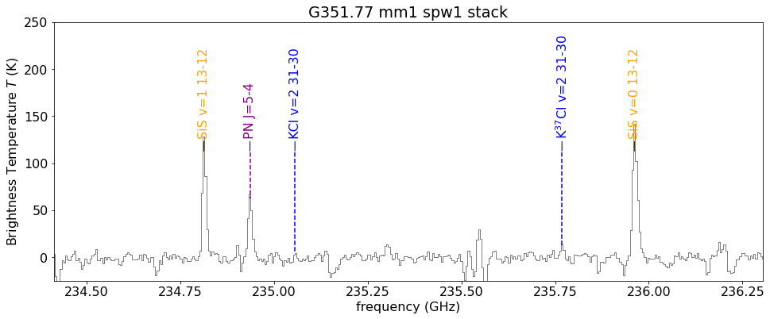
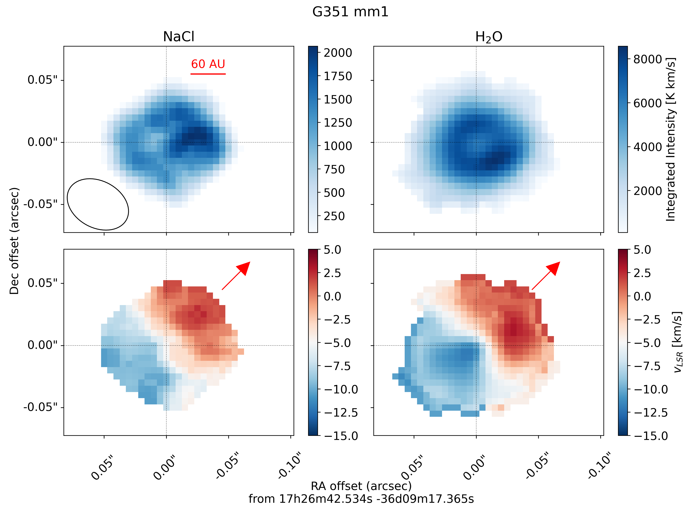

$\newcommand{\ensuremath}{}$
$\newcommand{\xspace}{}$
$\newcommand{\object}[1]{\texttt{#1}}$
$\newcommand{\farcs}{{.}''}$
$\newcommand{\farcm}{{.}'}$
$\newcommand{\arcsec}{''}$
$\newcommand{\arcmin}{'}$
$\newcommand{\ion}[2]{#1#2}$
$\newcommand{\textsc}[1]{\textrm{#1}}$
$\newcommand{\hl}[1]{\textrm{#1}}$
$\newcommand{\url}[1]{\href{#1}{#1}}$
$\newcommand{\dodoi}[1]{doi:~\href{http://doi.org/#1}{\nolinkurl{#1}}}$
$\newcommand{\doeprint}[1]{\href{http://ascl.net/#1}{\nolinkurl{http://ascl.net/#1}}}$
$\newcommand{\doarXiv}[1]{\href{https://arxiv.org/abs/#1}{\nolinkurl{https://arxiv.org/abs/#1}}}$
$\newcommand{\vdag}{(v)^\dagger}$
$\newcommand$
$\newcommand$
$\newcommand{\paa}{Pa\ensuremath{\alpha}}$
$\newcommand{\brg}{Br\ensuremath{\gamma}}$
$\newcommand{\msun}{\ensuremath{M_{\odot}}\xspace}$
$\newcommand{\mdot}{\ensuremath{\dot{M}}\xspace}$
$\newcommand{\lsun}{\ensuremath{L_{\odot}}\xspace}$
$\newcommand{\rsun}{\ensuremath{R_{\odot}}\xspace}$
$\newcommand{\lbol}{\ensuremath{L_{\mathrm{bol}}\xspace}}$
$\newcommand{\ks}{K\ensuremath{_{\mathrm{s}}}}$
$\newcommand{\hh}{\ensuremath{\textrm{H}_{2}}\xspace}$
$\newcommand{\dens}{\ensuremath{n(\hh) [\percc]}\xspace}$
$\newcommand{\formaldehyde}{\ensuremath{\textrm{H}_2\textrm{CO}}\xspace}$
$\newcommand{\formamide}{\ensuremath{\textrm{NH}_2\textrm{CHO}}\xspace}$
$\newcommand{\formaldehydeIso}{\ensuremath{\textrm{H}_2~^{13}\textrm{CO}}\xspace}$
$\newcommand{\methanol}{\ensuremath{\textrm{CH}_3\textrm{OH}}\xspace}$
$\newcommand{\ortho}{\ensuremath{\textrm{o-H}_2\textrm{CO}}\xspace}$
$\newcommand{\para}{\ensuremath{\textrm{p-H}_2\textrm{CO}}\xspace}$
$\newcommand{\oneone}{\ensuremath{1_{1,0}-1_{1,1}}\xspace}$
$\newcommand{\twotwo}{\ensuremath{2_{1,1}-2_{1,2}}\xspace}$
$\newcommand{\threethree}{\ensuremath{3_{1,2}-3_{1,3}}\xspace}$
$\newcommand{\threeohthree}{\ensuremath{3_{0,3}-2_{0,2}}\xspace}$
$\newcommand{\threetwotwo}{\ensuremath{3_{2,2}-2_{2,1}}\xspace}$
$\newcommand{\threetwoone}{\ensuremath{3_{2,1}-2_{2,0}}\xspace}$
$\newcommand{\fourtwotwo}{\ensuremath{4_{2,2}-3_{1,2}}\xspace}$
$\newcommand{\methylcyanide}{\ensuremath{\textrm{CH}_{3}\textrm{CN}}\xspace}$
$\newcommand{\ketene}{\ensuremath{\textrm{H}_{2}\textrm{CCO}}\xspace}$
$\newcommand{\ethylcyanide}{\ensuremath{\textrm{CH}_3\textrm{CH}_2\textrm{CN}}\xspace}$
$\newcommand{\cyanoacetylene}{\ensuremath{\textrm{HC}_{3}\textrm{N}}\xspace}$
$\newcommand{\methylformate}{\ensuremath{\textrm{CH}_{3}\textrm{OCHO}}\xspace}$
$\newcommand{\dimethylether}{\ensuremath{\textrm{CH}_{3}\textrm{OCH}_{3}}\xspace}$
$\newcommand{\gaucheethanol}{\ensuremath{\textrm{g-CH}_3\textrm{CH}_2\textrm{OH}}\xspace}$
$\newcommand{\acetone}{\ensuremath{\left[\textrm{CH}_{3}\right]_2\textrm{CO}}\xspace}$
$\newcommand{\methyleneamidogen}{\ensuremath{\textrm{H}_{2}\textrm{CN}}\xspace}$
$\newcommand{\Rone}{\ensuremath{\para~S_{\nu}(\threetwoone) / S_{\nu}(\threeohthree)}\xspace}$
$\newcommand{\Rtwo}{\ensuremath{\para~S_{\nu}(\threetwotwo) / S_{\nu}(\threetwoone)}\xspace}$
$\newcommand{\JKaKc}{\ensuremath{J_{K_a K_c}}}$
$\newcommand{\water}{H_{2}O\xspace}$
$\newcommand{\feii}{\ion{Fe}{ii}\xspace}$
$\newcommand{\uchii}{\ion{UCH}{ii}\xspace}$
$\newcommand{\UCHII}{\ion{UCH}{ii}\xspace}$
$\newcommand{\hchii}{\ion{HCH}{ii}\xspace}$
$\newcommand{\HCHII}{\ion{HCH}{ii}\xspace}$
$\newcommand{\hii}{\ion{H}{ii}\xspace}$
$\newcommand{\hi}{H~{\sc i}\xspace}$
$\newcommand{\Hii}{\hii}$
$\newcommand{\HII}{\hii}$
$\newcommand{\Xform}{\ensuremath{X_{\formaldehyde}}}$
$\newcommand{\kms}{\textrm{km~s}\ensuremath{^{-1}}\xspace}$
$\newcommand{\nsample}{456\xspace}$
$\newcommand{\CFR}{5\xspace}$
$\newcommand{\permyr}{\ensuremath{\mathrm{Myr}^{-1}}\xspace}$
$\newcommand{\pers}{\ensuremath{\mathrm{s}^{-1}}\xspace}$
$\newcommand{\perspc}{\ensuremath{\mathrm{pc}^{-2}}\xspace}$
$\newcommand{\tsuplim}{0.5\xspace}$
$\newcommand{\ncandidates}{18\xspace}$
$\newcommand{\mindist}{8.7\xspace}$
$\newcommand{\rcluster}{2.5\xspace}$
$\newcommand{\ncomplete}{13\xspace}$
$\newcommand{\middistcut}{13.0\xspace}$
$\newcommand{\nMPC}{3\xspace}$
$\newcommand{\obsfrac}{30}$
$\newcommand{\nMPCtot}{10\xspace}$
$\newcommand{\nMPCtoterr}{6\xspace}$
$\newcommand{\plaw}{2.1\xspace}$
$\newcommand{\plawerr}{0.3\xspace}$
$\newcommand{\mmin}{\ensuremath{10^4~\msun}\xspace}$
$\newcommand{\kmspc}{\textrm{km~s}\ensuremath{^{-1}}\textrm{pc}\ensuremath{^{-1}}\xspace}$
$\newcommand{\sqcm}{cm^{2}\xspace}$
$\newcommand{\percc}{\ensuremath{\textrm{cm}^{-3}}\xspace}$
$\newcommand{\perpc}{\ensuremath{\textrm{pc}^{-1}}\xspace}$
$\newcommand{\persc}{\ensuremath{\textrm{cm}^{-2}}\xspace}$
$\newcommand{\persr}{\ensuremath{\textrm{sr}^{-1}}\xspace}$
$\newcommand{\peryr}{\ensuremath{\textrm{yr}^{-1}}\xspace}$
$\newcommand{\perkmspc}{\textrm{km~s}\ensuremath{^{-1}}\textrm{pc}\ensuremath{^{-1}}\xspace}$
$\newcommand{\perkms}{\textrm{per~km~s}\ensuremath{^{-1}}\xspace}$
$\newcommand{\um}{\ensuremath{\mu \textrm{m}}\xspace}$
$\newcommand{\microjy}{\ensuremath{\mu\textrm{Jy}}\xspace}$
$\newcommand{\microJy}{\ensuremath{\mu\textrm{Jy}}\xspace}$
$\newcommand{\mum}{\um}$
$\newcommand{\htwo}{\ensuremath{\textrm{H}_2}}$
$\newcommand{\Htwo}{\ensuremath{\textrm{H}_2}}$
$\newcommand{\HtwoO}{\ensuremath{\textrm{H}_2\textrm{O}}}$
$\newcommand{\htwoo}{\ensuremath{\textrm{H}_2\textrm{O}}}$
$\newcommand{\ha}{\ensuremath{\textrm{H}\alpha}}$
$\newcommand{\hb}{\ensuremath{\textrm{H}\beta}}$
$\newcommand{\so}{SO~\ensuremath{5_6-4_5}\xspace}$
$\newcommand{\SO}{SO~\ensuremath{1_2-1_1}\xspace}$
$\newcommand{\ammonia}{NH\ensuremath{_3}\xspace}$
$\newcommand{\twelveco}{\ensuremath{^{12}\textrm{CO}}\xspace}$
$\newcommand{\thirteenco}{\ensuremath{^{13}\textrm{CO}}\xspace}$
$\newcommand{\ceighteeno}{\ensuremath{\textrm{C}^{18}\textrm{O}}\xspace}$
$\newcommand{\degrees}{\ensuremath{^{\circ}}}$
$\newcommand{\lowirac}{800}$
$\newcommand{\highirac}{8000}$
$\newcommand{\lowmips}{600}$
$\newcommand{\highmips}{5000}$
$\newcommand{\perbeam}{\ensuremath{\textrm{beam}^{-1}}\xspace}$
$\newcommand{\ds}{\ensuremath{\textrm{d}s}}$
$\newcommand{\dnu}{\ensuremath{\textrm{d}\nu}}$
$\newcommand{\dv}{\ensuremath{\textrm{d}v}}$
$\newcommand{\necluster}{Sh~2-233IR~NE}$
$\newcommand{\swcluster}{Sh~2-233IR~SW}$
$\newcommand{\region}{IRAS 05358}$
$\newcommand{\nwfive}{40}$
$\newcommand{\nouter}{15}$
$\newcommand{\vone}{{\rm v}1.0\xspace}$
$\newcommand{\vtwo}{{\rm v}2.0\xspace}$
$\newcommand$
$\newcommand$
$\newcommand$
$\newcommand$
$\newcommand$
$\newcommand{\todo}[1]{\textcolor{red}{#1}}$
$\newcommand{\okinfinal}[1]{{#1}}$
$\newcommand{\ndisks}{9\xspace}$
$\newcommand{\ntentative}{3\xspace}$
$\newcommand{\ndiskstext}{nine\xspace}$
$\newcommand{\nnewdisks}{5\xspace}$
$\newcommand{\nregions}{6\xspace}$
$\newcommand{\}{ee}$
$\newcommand{\}{secref}$
$\newcommand{\}{eqref}$
$\newcommand{\}{facility}$
$\newcommand{\}{natexlab}$

$\newcommand{$\ensuremath$}{}$
$\newcommand{$\xspace$}{}$
$\newcommand{$\object$}[1]{\texttt{#1}}$
$\newcommand{$\farcs$}{{.}''}$
$\newcommand{$\farcm$}{{.}'}$
$\newcommand{$\arcsec$}{''}$
$\newcommand{$\arcmin$}{'}$
$\newcommand{$\ion$}[2]{#1#2}$
$\newcommand{$\textsc$}[1]{\textrm{#1}}$
$\newcommand{$\hl$}[1]{\textrm{#1}}$
$\newcommand{$\url$}[1]{\href{#1}{#1}}$
$\newcommand{$\dodoi$}[1]{doi:~\href{http://doi.org/#1}{\nolinkurl{#1}}}$
$\newcommand{$\doeprint$}[1]{\href{http://ascl.net/#1}{\nolinkurl{http://ascl.net/#1}}}$
$\newcommand{$\doarXiv$}[1]{\href{https://arxiv.org/abs/#1}{\nolinkurl{https://arxiv.org/abs/#1}}}$
$\newcommand{$\vdag$}{(v)^\dagger}$
$\newcommand$
$\newcommand$
$\newcommand{$\paa$}{Pa$\ensuremath${\alpha}}$
$\newcommand{$\brg$}{Br$\ensuremath${\gamma}}$
$\newcommand{$\msun$}{$\ensuremath${M_{\odot}}$\xspace$}$
$\newcommand{$\mdot$}{$\ensuremath${\dot{M}}$\xspace$}$
$\newcommand{$\lsun$}{$\ensuremath${L_{\odot}}$\xspace$}$
$\newcommand{$\rsun$}{$\ensuremath${R_{\odot}}$\xspace$}$
$\newcommand{$\lbol$}{$\ensuremath${L_{\mathrm{bol}}$\xspace$}}$
$\newcommand{$\ks$}{K$\ensuremath${_{\mathrm{s}}}}$
$\newcommand{$\hh$}{$\ensuremath${\textrm{H}_{2}}$\xspace$}$
$\newcommand{$\dens$}{$\ensuremath${n($\hh$) [$\percc$]}$\xspace$}$
$\newcommand{$\formaldehyde$}{$\ensuremath${\textrm{H}_2\textrm{CO}}$\xspace$}$
$\newcommand{$\formamide$}{$\ensuremath${\textrm{NH}_2\textrm{CHO}}$\xspace$}$
$\newcommand{$\formaldehyde$Iso}{$\ensuremath${\textrm{H}_2~^{13}\textrm{CO}}$\xspace$}$
$\newcommand{$\methanol$}{$\ensuremath${\textrm{CH}_3\textrm{OH}}$\xspace$}$
$\newcommand{$\ortho$}{$\ensuremath${\textrm{o-H}_2\textrm{CO}}$\xspace$}$
$\newcommand{$\para$}{$\ensuremath${\textrm{p-H}_2\textrm{CO}}$\xspace$}$
$\newcommand{$\oneone$}{$\ensuremath${1_{1,0}-1_{1,1}}$\xspace$}$
$\newcommand{$\twotwo$}{$\ensuremath${2_{1,1}-2_{1,2}}$\xspace$}$
$\newcommand{$\threethree$}{$\ensuremath${3_{1,2}-3_{1,3}}$\xspace$}$
$\newcommand{$\threeohthree$}{$\ensuremath${3_{0,3}-2_{0,2}}$\xspace$}$
$\newcommand{$\threetwotwo$}{$\ensuremath${3_{2,2}-2_{2,1}}$\xspace$}$
$\newcommand{$\threetwoone$}{$\ensuremath${3_{2,1}-2_{2,0}}$\xspace$}$
$\newcommand{$\fourtwotwo$}{$\ensuremath${4_{2,2}-3_{1,2}}$\xspace$}$
$\newcommand{$\methylcyanide$}{$\ensuremath${\textrm{CH}_{3}\textrm{CN}}$\xspace$}$
$\newcommand{$\ketene$}{$\ensuremath${\textrm{H}_{2}\textrm{CCO}}$\xspace$}$
$\newcommand{$\ethylcyanide$}{$\ensuremath${\textrm{CH}_3\textrm{CH}_2\textrm{CN}}$\xspace$}$
$\newcommand{$\cyanoacetylene$}{$\ensuremath${\textrm{HC}_{3}\textrm{N}}$\xspace$}$
$\newcommand{$\methylformate$}{$\ensuremath${\textrm{CH}_{3}\textrm{OCHO}}$\xspace$}$
$\newcommand{$\dimethylether$}{$\ensuremath${\textrm{CH}_{3}\textrm{OCH}_{3}}$\xspace$}$
$\newcommand{$\gaucheethanol$}{$\ensuremath${\textrm{g-CH}_3\textrm{CH}_2\textrm{OH}}$\xspace$}$
$\newcommand{$\acetone$}{$\ensuremath${\left[\textrm{CH}_{3}\right]_2\textrm{CO}}$\xspace$}$
$\newcommand{$\methyleneamidogen$}{$\ensuremath${\textrm{H}_{2}\textrm{CN}}$\xspace$}$
$\newcommand{$\Rone$}{$\ensuremath${$\para$~S_{\nu}($\threetwoone$) / S_{\nu}($\threeohthree$)}$\xspace$}$
$\newcommand{$\Rtwo$}{$\ensuremath${$\para$~S_{\nu}($\threetwotwo$) / S_{\nu}($\threetwoone$)}$\xspace$}$
$\newcommand{$\JKaKc$}{$\ensuremath${J_{K_a K_c}}}$
$\newcommand{$\water$}{H_{2}O$\xspace$}$
$\newcommand{$\feii$}{$\ion${Fe}{ii}$\xspace$}$
$\newcommand{$\uchii$}{$\ion${UCH}{ii}$\xspace$}$
$\newcommand{$\UCHII$}{$\ion${UCH}{ii}$\xspace$}$
$\newcommand{$\hchii$}{$\ion${HCH}{ii}$\xspace$}$
$\newcommand{$\HCHII$}{$\ion${HCH}{ii}$\xspace$}$
$\newcommand{$\hii$}{$\ion${H}{ii}$\xspace$}$
$\newcommand{$\hi$}{H~{\sc i}$\xspace$}$
$\newcommand{$\Hii$}{$\hii$}$
$\newcommand{$\HII$}{$\hii$}$
$\newcommand{$\Xform$}{$\ensuremath${X_{$\formaldehyde$}}}$
$\newcommand{$\kms$}{\textrm{km~s}$\ensuremath${^{-1}}$\xspace$}$
$\newcommand{$\nsample$}{456$\xspace$}$
$\newcommand{$\CFR$}{5$\xspace$}$
$\newcommand{$\permyr$}{$\ensuremath${\mathrm{Myr}^{-1}}$\xspace$}$
$\newcommand{$\pers$}{$\ensuremath${\mathrm{s}^{-1}}$\xspace$}$
$\newcommand{$\pers$pc}{$\ensuremath${\mathrm{pc}^{-2}}$\xspace$}$
$\newcommand{$\tsuplim$}{0.5$\xspace$}$
$\newcommand{$\ncandidates$}{18$\xspace$}$
$\newcommand{$\mindist$}{8.7$\xspace$}$
$\newcommand{$\rcluster$}{2.5$\xspace$}$
$\newcommand{$\ncomplete$}{13$\xspace$}$
$\newcommand{$\middistcut$}{13.0$\xspace$}$
$\newcommand{$\nMPC$}{3$\xspace$}$
$\newcommand{$\obsfrac$}{30}$
$\newcommand{$\nMPC$tot}{10$\xspace$}$
$\newcommand{$\nMPC$toterr}{6$\xspace$}$
$\newcommand{$\plaw$}{2.1$\xspace$}$
$\newcommand{$\plaw$err}{0.3$\xspace$}$
$\newcommand{$\mmin$}{$\ensuremath${10^4~$\msun$}$\xspace$}$
$\newcommand{$\kms$pc}{\textrm{km~s}$\ensuremath${^{-1}}\textrm{pc}$\ensuremath${^{-1}}$\xspace$}$
$\newcommand{$\sqcm$}{cm^{2}$\xspace$}$
$\newcommand{$\percc$}{$\ensuremath${\textrm{cm}^{-3}}$\xspace$}$
$\newcommand{$\perpc$}{$\ensuremath${\textrm{pc}^{-1}}$\xspace$}$
$\newcommand{$\pers$c}{$\ensuremath${\textrm{cm}^{-2}}$\xspace$}$
$\newcommand{$\pers$r}{$\ensuremath${\textrm{sr}^{-1}}$\xspace$}$
$\newcommand{$\peryr$}{$\ensuremath${\textrm{yr}^{-1}}$\xspace$}$
$\newcommand{$\perkmspc$}{\textrm{km~s}$\ensuremath${^{-1}}\textrm{pc}$\ensuremath${^{-1}}$\xspace$}$
$\newcommand{$\perkms$}{\textrm{per~km~s}$\ensuremath${^{-1}}$\xspace$}$
$\newcommand{$\um$}{$\ensuremath${\mu \textrm{m}}$\xspace$}$
$\newcommand{$\microjy$}{$\ensuremath${\mu\textrm{Jy}}$\xspace$}$
$\newcommand{$\microJy$}{$\ensuremath${\mu\textrm{Jy}}$\xspace$}$
$\newcommand{$\mum$}{$\um$}$
$\newcommand{$\htwo$}{$\ensuremath${\textrm{H}_2}}$
$\newcommand{$\Htwo$}{$\ensuremath${\textrm{H}_2}}$
$\newcommand{$\Htwo$O}{$\ensuremath${\textrm{H}_2\textrm{O}}}$
$\newcommand{$\htwo$o}{$\ensuremath${\textrm{H}_2\textrm{O}}}$
$\newcommand{$\ha$}{$\ensuremath${\textrm{H}\alpha}}$
$\newcommand{$\hb$}{$\ensuremath${\textrm{H}\beta}}$
$\newcommand{$\so$}{SO~$\ensuremath${5_6-4_5}$\xspace$}$
$\newcommand{$\SO$}{SO~$\ensuremath${1_2-1_1}$\xspace$}$
$\newcommand{$\ammonia$}{NH$\ensuremath${_3}$\xspace$}$
$\newcommand{$\twelveco$}{$\ensuremath${^{12}\textrm{CO}}$\xspace$}$
$\newcommand{$\thirteenco$}{$\ensuremath${^{13}\textrm{CO}}$\xspace$}$
$\newcommand{$\ceighteeno$}{$\ensuremath${\textrm{C}^{18}\textrm{O}}$\xspace$}$
$\newcommand{$\degrees$}{$\ensuremath${^{\circ}}}$
$\newcommand{$\lowirac$}{800}$
$\newcommand{$\hi$ghirac}{8000}$
$\newcommand{$\lowmips$}{600}$
$\newcommand{$\hi$ghmips}{5000}$
$\newcommand{$\perbeam$}{$\ensuremath${\textrm{beam}^{-1}}$\xspace$}$
$\newcommand{$\ds$}{$\ensuremath${\textrm{d}s}}$
$\newcommand{$\dnu$}{$\ensuremath${\textrm{d}\nu}}$
$\newcommand{$\dv$}{$\ensuremath${\textrm{d}v}}$
$\newcommand{$\necluster$}{Sh~2-233IR~NE}$
$\newcommand{$\swcluster$}{Sh~2-233IR~SW}$
$\newcommand{$\region$}{IRAS 05358}$
$\newcommand{$\nwfive$}{40}$
$\newcommand{$\nouter$}{15}$
$\newcommand{$\vone$}{{\rm v}1.0$\xspace$}$
$\newcommand{$\vtwo$}{{\rm v}2.0$\xspace$}$
$\newcommand$
$\newcommand$
$\newcommand$
$\newcommand$
$\newcommand$
$\newcommand{$\todo$}[1]{\textcolor{red}{#1}}$
$\newcommand{$\okinfinal$}[1]{{#1}}$
$\newcommand{$\ndisks$}{9$\xspace$}$
$\newcommand{$\ntentative$}{3$\xspace$}$
$\newcommand{$\ndisks$text}{nine$\xspace$}$
$\newcommand{$\nnewdisks$}{5$\xspace$}$
$\newcommand{$\nregions$}{6$\xspace$}$
$\newcommand{\}{ee}$
$\newcommand{\}{secref}$
$\newcommand{\}{eqref}$
$\newcommand{\}{facility}$
$\newcommand{\}{natexlab}$

# Salt-bearing disk candidates around high-mass young stellar objects

<mark>Appeared on: 2022-11-07</mark> - _accepted to ApJ_

Adam Ginsburg, et al. -- incl., <mark>Yichen Zhang</mark>, <mark>Henrik Beuther</mark>

**Abstract:** Molecular lines tracing the orbital motion of gas in a well-defined disk are valuable tools for inferring both the properties of the disk and the star it surrounds.Lines that arise only from a disk, and not also from the surrounding molecular cloud core that birthed the star or from the outflow it drives, are rare.Several such emission lines have recently been discovered in one example case, those from NaCl and KCl salt molecules.We studied a sample of 23 candidate high-mass young stellar objects (HMYSOs) in 17 high-mass star-forming regions to determine how frequently emission from these species is detected.We present$\nnewdisks$new detections of water, NaCl, KCl, PN, and SiS from the innermost regions around the objects, bringing the total number of known briny disk candidates to$\ndisks$.Their kinematic structure is generally disk-like,{though we are unable to determine whether they arise from a disk or outflow in the  sources with new detections}.We demonstrate that these species are spatially coincident in a few resolved cases and show that they are generally detected together, suggesting a common origin or excitation mechanism.We also show that several disks around HMYSOs clearly do not exhibit emission in these species.Salty disks are therefore neither particularly rare in high-mass disks, nor are they ubiquitous.

**Figure 5. -** Moment-0 (integrated intensity) images of the resolved sources in NaCl lines.
     For SrcI (top-left), this is the integrated intensity of the NaCl $J$=18-17 $v$=0
     line.  For the remainder, G17 (top right), G351 mm1 (bottom left), and NGC 6334I mm1b (bottom right),
     these are the average of the $J$=18-17 and $J$=17-16 transitions
     of both the $v$=0 and $v$=1 states.  The coordinates are given in RA/Dec offset from the
     central position specified under the abscissa.
     The scalebars show physical sizes as labeled.
     The ellipses in the corners show the full-width half-maximum beam ellipse. (*fig:resolveddisks*)

**Figure 13. -** Stacked spectra from G351.77mm1 from the \citet{Beuther2019} data set.
    The stacking was based on the H$_2$O line.
    Line IDs are shown; no KCl detections are clear.
    Different colors are used for targeted species with multiple transitions in-band: orange for SiS, blue for KCl, red for NaCl, {magenta for H30$\alpha$, purple for PN, and green for $\water$}.
    The remaining species, with only one transition marked, are shown in black.
    The PN line identification should be taken with a grain of salt
    since it is the only transition we observe from PN.
     (*fig:g351mm1*)

**Figure 11. -** Moment-0 (integrated intensity) and moment-1 (intensity-weighted velocity) images of {stacked} NaCl (left) and $\water$(right) for G351 mm1.
    The position-velocity diagrams in Figure \ref{fig:g351momentpv} are
    taken along position angle $130^\circ$, parallel to the velocity gradient seen in the lower panels here.
    {The red arrow shows the direction of the outflow from \citet{Beuther2019}{that extends $\gtrsim0.2$ pc to the northwest}.
    A compact blueshifted {feature} was also weakly detected b{in SiO} opposite the redshifted flow, but it is unresolved.
    {The blue side of the NaCl, $\water$, and (in Appendix \ref{appendix:g351}) SiS and PN corresponds with the SiO blueshifted lobe seen in Fig. 7 of \citet{Beuther2019}, but since its extent is limited to the $\lesssim100$ AU scale shown in this figure, we cannot confirm whether it is comprised of outflowing material.
    }} (*fig:g351brinemoments*)

