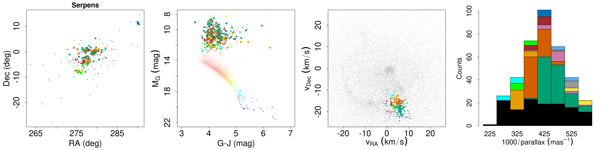
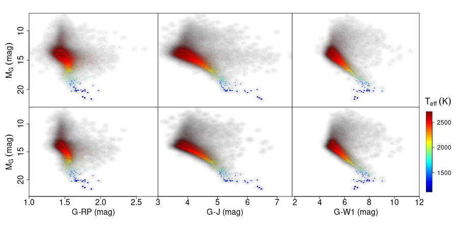
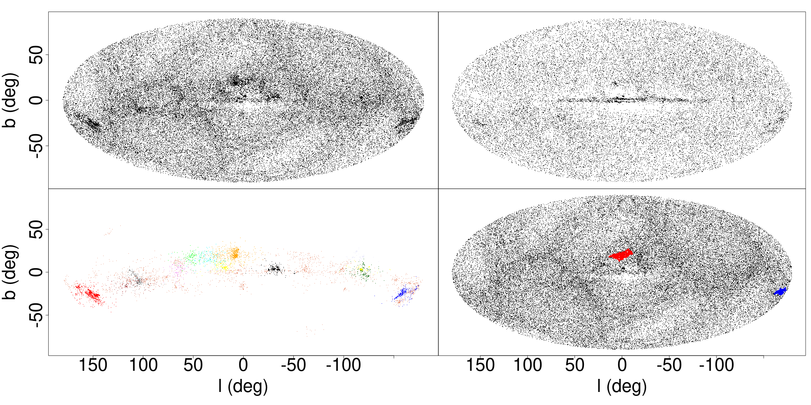

$\newcommand{\ensuremath}{}$
$\newcommand{\xspace}{}$
$\newcommand{\object}[1]{\texttt{#1}}$
$\newcommand{\farcs}{{.}''}$
$\newcommand{\farcm}{{.}'}$
$\newcommand{\arcsec}{''}$
$\newcommand{\arcmin}{'}$
$\newcommand{\ion}[2]{#1#2}$
$\newcommand{\textsc}[1]{\textrm{#1}}$
$\newcommand{\hl}[1]{\textrm{#1}}$
$\newcommand{\Unit}[1]{\ensuremath{\mathrm{~#1}}}$
$\newcommand{\pc}{\Unit{pc}}$
$\newcommand{\deriv}{\ensuremath{\mathrm{d}}}$
$\newcommand{\given}{\ensuremath{\hspace{0.07em}\mid\hspace{0.07em}}}$
$\newcommand{\parallax}{\ensuremath{\varpi}}$
$\newcommand{\parallaxsd}{\ensuremath{\sigma_\parallax}}$
$\newcommand{\parallaxtrue}{\ensuremath{\varpi_{\rm True}}}$
$\newcommand{\dist}{\ensuremath{r}}$
$\newcommand{\distest}{\ensuremath{\dist_{\rm est}}}$
$\newcommand{\distlen}{\ensuremath{L}}$
$\newcommand{\mg}{\ensuremath{M_{\rm G}}}$
$\newcommand{\gmag}{\ensuremath{G}}$
$\newcommand{\ag}{\ensuremath{A_{\rm G}}}$
$\newcommand{\com}[2]{ {\textcolor{orange}{ #1 :}}$
$    {\textcolor{red}{ #2}}}$
$\newcommand{\dt}[1]{{\tt #1}}$
$\newcommand{\secs}{\ensuremath{ \rm s}\xspace}$
$\newcommand{\ms}{\ensuremath{\rm  m s^{-1}}\xspace}$
$\newcommand{\kms}{\ensuremath{\rm  km s^{-1}}\xspace}$
$\newcommand{\masyr}{\ensuremath{\rm  mas yr^{-1}}\xspace}$
$\newcommand{\muas}{\ensuremath{ \mu\textnormal{as}}\xspace}$
$\newcommand{\muasyr}{\ensuremath{\muas \rm yr^{-1}}\xspace}$
$\newcommand{\inp}[1]{{\tt #1}}$
$\newcommand{\prog}[1]{{\it #1}}$
$\newcommand{\class}[1]{{\it #1}}$
$\newcommand{\pack}[1]{{\em #1}}$
$\newcommand{\property}[1]{{\em #1}}$
$\newcommand{\method}[1]{{\em #1}}$
$\newcommand{\file}[1]{{\em #1}}$
$\newcommand{\directory}[1]{{\em #1}}$
$\newcommand{\code}[1]{{\tt #1}}$
$\newcommand{\maspyr}{\muasyr}$
$\newcommand{\deriv}{\ensuremath{\mathrm{d}}}$
$\newcommand{\given}{\ensuremath{\hspace{0.1em}\mid\hspace{0.1em}}}$
$\newcommand{\prob}[2]{\ensuremath{{P^#1_#2}}}$
$\newcommand{\prior}[2]{\ensuremath{{\pi^#1_#2}}}$
$\newcommand{\bcg}{\ensuremath{\mathrm{BC}_G}\xspace}$
$\newcommand{\bcgsol}{\ensuremath{\mathrm{BC}_{G\odot}}\xspace}$
$\newcommand{\sigparallax}{\ensuremath{\sigma_{\varpi}}\xspace}$
$\newcommand{\dist}{\ensuremath{r}\xspace}$
$\newcommand{\aabun}{\ensuremath{[\alpha/\mathrm{H}]}\xspace}$
$\newcommand{\teff}{\ensuremath{T_{\mathrm{{eff}}}}\xspace}$
$\newcommand{\logteff}{\ensuremath{\log\teff}\xspace}$
$\newcommand{\lum}{\ensuremath{{L}}\xspace}$
$\newcommand{\loglum}{\ensuremath{\log\lum}\xspace}$
$\newcommand{\loggrav}{\ensuremath{\log g}\xspace}$
$\newcommand{\logg}{\ensuremath{\log g}\xspace}$
$\newcommand{\mass}{\ensuremath{{M}}\xspace}$
$\newcommand{\radius}{\ensuremath{{R}}\xspace}$
$\newcommand{\Zabun}{\ensuremath{{Z}}\xspace}$
$\newcommand{\mh}{[M/H]\xspace}$
$\newcommand{\feh}{[Fe/H]\xspace}$
$\newcommand{\vsini}{\ensuremath{v\sin i}\xspace}$
$\newcommand{\azero}{\ensuremath{A_0}\xspace}$
$\newcommand{\ag}{\ensuremath{A_G}\xspace}$
$\newcommand{\abp}{\ensuremath{A_\mathrm{BP}}\xspace}$
$\newcommand{\arp}{\ensuremath{A_\mathrm{RP}}\xspace}$
$\newcommand{\av}{\ensuremath{A_\mathrm{V}}\xspace}$
$\newcommand{\rzero}{\ensuremath{R_0}\xspace}$
$\newcommand{\ebpminrp}{\ensuremath{E(G_{\rm BP} - G_{\rm RP})}\xspace}$
$\newcommand{\gmag}{\ensuremath{G}}$
$\newcommand{\bpmag}{\ensuremath{G_\mathrm{BP}}}$
$\newcommand{\rpmag}{\ensuremath{G_\mathrm{RP}}}$
$\newcommand{\mg}{M_\gmag}$
$\newcommand{\ra}{\ensuremath{\alpha}}$
$\newcommand{\dec}{\ensuremath{\delta}}$
$\newcommand{\parallax}{\ensuremath{\varpi}}$
$\newcommand{\sigparallax}{\ensuremath{\sigma_{\varpi}}}$
$\newcommand{\parzp}{\ensuremath{\varpi_{\rm zp}}}$
$\newcommand{\pmra}{\ensuremath{\mu_{\ra\ast}}}$
$\newcommand{\pmdec}{\ensuremath{\mu_\dec}}$
$\newcommand{\propm}{\ensuremath{\mu}}$
$\newcommand{\glon}{\ensuremath{\ell}}$
$\newcommand{\glat}{\ensuremath{b}}$
$\newcommand{\mag}{\ensuremath{ \mathrm{mag}}\xspace}$
$\newcommand{\nm}{\ensuremath{ \mathrm{nm}}\xspace}$
$\newcommand{\um}{\ensuremath{ \mu\mathrm{m}}\xspace}$
$\newcommand{\erg}{\ensuremath{ \rm erg}\xspace}$
$\newcommand{\ergs}{\ensuremath{ \rm erg~s}\xspace}$
$\newcommand{\yr}{\ensuremath{ \rm yr}\xspace}$
$\newcommand{\Myr}{\ensuremath{ \rm Myr}\xspace}$
$\newcommand{\Gyr}{\ensuremath{ \rm Gyr}\xspace}$
$\newcommand{\pc}{\ensuremath{ \rm pc}\xspace}$
$\newcommand{\kpc}{\ensuremath{ \rm kpc}\xspace}$
$\newcommand{\Mpc}{\ensuremath{ \rm Mpc}\xspace}$
$\newcommand{\Lsun}{\ensuremath{ {\lum}_{\odot}}\xspace}$
$\newcommand{\Msun}{\ensuremath{ {\mass}_{\odot}}\xspace}$
$\newcommand{\Rsun}{\ensuremath{ {\radius}_{\odot}}\xspace}$
$\newcommand{\Zsun}{\ensuremath{ {\Zabun}_{\odot}}\xspace}$
$\newcommand{\ang}{\ensuremath{ \text{\AA}}\xspace}$
$\newcommand{\mas}{\ensuremath{ \mathrm{mas}}\xspace}$
$\newcommand{\kms}{\ensuremath{\textrm{km s}^{-1}}}$
$\newcommand{\maspyr}{\ensuremath{\textrm{mas yr}^{-1}}}$
$\newcommand{\degree}{\ensuremath{^\circ}}$
$\newcommand{\hpix}{HEALPix}$
$\newcommand{\cairt}{\ion{Ca}{ii} IRT\xspace}$
$\newcommand{\mbolsun}{\ensuremath{M_{\rm bol}}\xspace}$
$\newcommand{\Tsun}{\ensuremath{{\teff_{\odot}}}\xspace}$
$\newcommand{\modulename}[1]{#1\xspace}$
$\newcommand{\apsis}{\modulename{Apsis}}$
$\newcommand{\smsgen}{\modulename{SMSGen}}$
$\newcommand{\dsc}{\modulename{DSC}}$
$\newcommand{\gspphot}{\modulename{GSP-Phot}}$
$\newcommand{\priam}{\modulename{Priam}}$
$\newcommand{\aeneas}{\modulename{Aeneas}}$
$\newcommand{\gspspec}{\modulename{GSP-Spec}}$
$\newcommand{\msc}{\modulename{MSC}}$
$\newcommand{\flame}{\modulename{FLAME}}$
$\newcommand{\espels}{\modulename{ESP-ELS}}$
$\newcommand{\esphs}{\modulename{ESP-HS}}$
$\newcommand{\espcs}{\modulename{ESP-CS}}$
$\newcommand{\espucd}{\modulename{ESP-UCD}}$
$\newcommand{\ugc}{\modulename{UGC}}$
$\newcommand{\oa}{\modulename{OA}}$
$\newcommand{\oca}{\modulename{OCA}}$
$\newcommand{\qsoc}{\modulename{QSOC}}$
$\newcommand{\tge}{\modulename{TGE}}$
$\newcommand{\mgalgo}{Matisse-Gauguin}$
$\newcommand{\basti}{BaSTI}$
$\newcommand$
$\newcommand{\gdr}[1]{Gaia~DR{#1}}$
$\newcommand{\gedr}[1]{Gaia~eDR{#1}}$
$\newcommand{\sample}[1]{sample~{#1}}$
$\newcommand{\tabname}[1]{\texttt{\detokenize{#1}}}$
$\newcommand{\red}{\textcolor{red}}$
$\newcommand{\orange}{\textcolor{orange}}$
$\newcommand{\green}{\textcolor{OliveGreen}}$
$\newcommand{\XXX}{{~\red{XXX}~}}$
$\newcommand{\corr}[1]{\textbf{#1}}$
$\newcommand{\tick}{\checkmark}$
$\newcommand{\secref}[1]{Sect.~\ref{#1}}$
$\newcommand{\totalfields}{{538}\xspace}$
$\newcommand{\numberuniqueparameters}{{43}\xspace}$
$\newcommand{\linktodoc}{https://geapre.esac.esa.int/archive/documentation/GDR3}$
$\newcommand{\linktoapparam}[2]{\href{\linktodoc/Gaia_archive/chap_datamodel/sec_dm_astrophysical_parameter_tables/ssec_dm_#1.html\##1-#2}{\fieldName{#2}\xspace}}$
$\newcommand{\linktogalparam}[2]{\href{\linktodoc/Gaia_archive/chap_datamodel/sec_dm_extra--galactic_tables/ssec_dm_#1.html\##1-#2}{\fieldName{#2}\xspace}}$
$\newcommand{\linktogsparam}[2]{\href{\linktodoc/Gaia_archive/chap_datamodel/sec_dm_main_source_tables/ssec_dm_#1.html\##1-#2}{\fieldName{#2}\xspace}}$
$\newcommand{\linktotable}[1]{\href{\linktodoc/Gaia_archive/chap_datamodel/sec_dm_astrophysical_parameter_tables/ssec_dm_#1.html}{\fieldName{#1}\xspace}}$
$\newcommand{\aptable}{\linktotable{astrophysical_parameters}}$
$\newcommand{\apsupptable}{\linktotable{astrophysical_parameters_supp}}$
$\newcommand{\linktogaltable}[1]{\href{\linktodoc/Gaia_archive/chap_datamodel/sec_dm_extra--galactic_tables/ssec_dm_#1.html}{\fieldName{#1}\xspace}}$
$\newcommand{\linktogstable}[1]{\href{\linktodoc/Gaia_archive/chap_datamodel/sec_dm_main_source_catalogue/ssec_dm_#1.html}{\fieldName{#1}\xspace}}$
$\newcommand{\linksubsec}[2]{\href{\linktodoc/Data_analysis/chap_cu8par/#1.html}{#2\xspace}}$
$\newcommand{\linksec}[2]{\href{\linktodoc/Data_analysis/chap_cu8par/#1}{#2\xspace}}$
$\newcommand{\linkfig}[1]{\href{\linktodoc/Data_analysis/chap_cu8par/#1.html}{see table\xspace}}$
$\newcommand{\livelink}[2]{\href{https://dms.cosmos.esa.int/cs/livelink/open/#1}{\texttt{\textcolor{blue!70!black}{Livelink:#2}}}}$
$\newcommand$
$\newcommand$
$\newcommand$
$\newcommand$
$\newcommand$
$\newcommand$
$\newcommand$
$\newcommand$
$\newcommand$
$\newcommand$
$\newcommand$
$\newcommand$
$\newcommand$
$\newcommand$
$\newcommand$
$\newcommand$
$\newcommand$
$\newcommand$
$\newcommand$
$\newcommand{\azul}[1]{{\textcolor{blue}{#1}}}$
$\newcommand{\rojo}[1]{{\textcolor{red}{#1}}}$
$\newcommand{\bpminrp}{\ensuremath{G_\mathrm{BP}-G_\mathrm{RP}}\xspace}$
$\newcommand{\bporrp}{BP/RP\xspace}$
$\newcommand{\orcit}[1]{\protect\href{https://orcid.org/#1}{\protect\includegraphics[width=8pt]{orcid.png}}}$
$\newcommand$
$\newcommand{\deg}{\ensuremath{^\circ}}$
$\newcommand{\arcmin}{\ensuremath{'}}$
$\newcommand{\arcsec}{\ensuremath{"}}$
$\newcommand{\fd}{\ensuremath{.\!\!^{\mathrm d}}}$
$\newcommand{\fh}{\ensuremath{.\!\!^{\mathrm h}}}$
$\newcommand{\fm}{\ensuremath{.\!\!^{\mathrm m}}}$
$\newcommand{\fs}{\ensuremath{.\!\!^{\mathrm s}}}$
$\newcommand{\fdg}{\ensuremath{.\!\!^\circ}}$
$\newcommand{\farcm}{\ensuremath{.\mkern-4mu^\prime}}$
$\newcommand{\farcs}{\ensuremath{.\!\!^{\prime\prime}}}$
$\newcommand{\extratrees}{\textsc{ExtraTrees}\xspace}$
$\newcommand{\@}{fieldName}$

$\newcommand{$\ensuremath$}{}$
$\newcommand{$\xspace$}{}$
$\newcommand{$\object$}[1]{\texttt{#1}}$
$\newcommand{$\farcs$}{{.}''}$
$\newcommand{$\farcm$}{{.}'}$
$\newcommand{$\arcsec$}{''}$
$\newcommand{$\arcmin$}{'}$
$\newcommand{$\ion$}[2]{#1#2}$
$\newcommand{$\textsc$}[1]{\textrm{#1}}$
$\newcommand{$\hl$}[1]{\textrm{#1}}$
$\newcommand{$\Unit$}[1]{$\ensuremath${\mathrm{~#1}}}$
$\newcommand{$\pc$}{$\Unit${pc}}$
$\newcommand{$\deriv$}{$\ensuremath${\mathrm{d}}}$
$\newcommand{$\given$}{$\ensuremath${\hspace{0.07em}\mid\hspace{0.07em}}}$
$\newcommand{$\parallax$}{$\ensuremath${\varpi}}$
$\newcommand{$\parallax$sd}{$\ensuremath${\sigma_$\parallax$}}$
$\newcommand{$\parallax$true}{$\ensuremath${\varpi_{\rm True}}}$
$\newcommand{$\dist$}{$\ensuremath${r}}$
$\newcommand{$\dist$est}{$\ensuremath${$\dist$_{\rm est}}}$
$\newcommand{$\dist$len}{$\ensuremath${L}}$
$\newcommand{$\mg$}{$\ensuremath${M_{\rm G}}}$
$\newcommand{$\gmag$}{$\ensuremath${G}}$
$\newcommand{$\ag$}{$\ensuremath${A_{\rm G}}}$
$\newcommand{\com}[2]{ {\textcolor{orange}{ #1 :}}$
$    {\textcolor{red}{ #2}}}$
$\newcommand{$\dt$}[1]{{\tt #1}}$
$\newcommand{$\secs$}{$\ensuremath${ \rm s}$\xspace$}$
$\newcommand{$\ms$}{$\ensuremath${\rm  m s^{-1}}$\xspace$}$
$\newcommand{$\kms$}{$\ensuremath${\rm  km s^{-1}}$\xspace$}$
$\newcommand{$\masyr$}{$\ensuremath${\rm  mas yr^{-1}}$\xspace$}$
$\newcommand{$\muas$}{$\ensuremath${ \mu\textnormal{as}}$\xspace$}$
$\newcommand{$\muas$yr}{$\ensuremath${$\muas$ \rm yr^{-1}}$\xspace$}$
$\newcommand{$\inp$}[1]{{\tt #1}}$
$\newcommand{$\prog$}[1]{{\it #1}}$
$\newcommand{$\class$}[1]{{\it #1}}$
$\newcommand{$\pack$}[1]{{\em #1}}$
$\newcommand{$\property$}[1]{{\em #1}}$
$\newcommand{$\method$}[1]{{\em #1}}$
$\newcommand{$\file$}[1]{{\em #1}}$
$\newcommand{$\directory$}[1]{{\em #1}}$
$\newcommand{$\code$}[1]{{\tt #1}}$
$\newcommand{$\maspyr$}{$\muas$yr}$
$\newcommand{$\deriv$}{$\ensuremath${\mathrm{d}}}$
$\newcommand{$\given$}{$\ensuremath${\hspace{0.1em}\mid\hspace{0.1em}}}$
$\newcommand{$\prob$}[2]{$\ensuremath${{P^#1_#2}}}$
$\newcommand{$\prior$}[2]{$\ensuremath${{\pi^#1_#2}}}$
$\newcommand{$\bcg$}{$\ensuremath${\mathrm{BC}_G}$\xspace$}$
$\newcommand{$\bcg$sol}{$\ensuremath${\mathrm{BC}_{G\odot}}$\xspace$}$
$\newcommand{$\sigparallax$}{$\ensuremath${\sigma_{\varpi}}$\xspace$}$
$\newcommand{$\dist$}{$\ensuremath${r}$\xspace$}$
$\newcommand{$\aabun$}{$\ensuremath${[\alpha/\mathrm{H}]}$\xspace$}$
$\newcommand{$\teff$}{$\ensuremath${T_{\mathrm{{eff}}}}$\xspace$}$
$\newcommand{$\logteff$}{$\ensuremath${\log$\teff$}$\xspace$}$
$\newcommand{$\lum$}{$\ensuremath${{L}}$\xspace$}$
$\newcommand{$\loglum$}{$\ensuremath${\log$\lum$}$\xspace$}$
$\newcommand{$\loggrav$}{$\ensuremath${\log g}$\xspace$}$
$\newcommand{$\logg$}{$\ensuremath${\log g}$\xspace$}$
$\newcommand{$\mass$}{$\ensuremath${{M}}$\xspace$}$
$\newcommand{$\radius$}{$\ensuremath${{R}}$\xspace$}$
$\newcommand{$\Zabun$}{$\ensuremath${{Z}}$\xspace$}$
$\newcommand{$\mh$}{[M/H]$\xspace$}$
$\newcommand{$\feh$}{[Fe/H]$\xspace$}$
$\newcommand{$\vsini$}{$\ensuremath${v\sin i}$\xspace$}$
$\newcommand{$\azero$}{$\ensuremath${A_0}$\xspace$}$
$\newcommand{$\ag$}{$\ensuremath${A_G}$\xspace$}$
$\newcommand{$\abp$}{$\ensuremath${A_\mathrm{BP}}$\xspace$}$
$\newcommand{$\arp$}{$\ensuremath${A_\mathrm{RP}}$\xspace$}$
$\newcommand{$\av$}{$\ensuremath${A_\mathrm{V}}$\xspace$}$
$\newcommand{$\rzero$}{$\ensuremath${R_0}$\xspace$}$
$\newcommand{$\ebpminrp$}{$\ensuremath${E(G_{\rm BP} - G_{\rm RP})}$\xspace$}$
$\newcommand{$\gmag$}{$\ensuremath${G}}$
$\newcommand{$\bpmag$}{$\ensuremath${G_\mathrm{BP}}}$
$\newcommand{$\rpmag$}{$\ensuremath${G_\mathrm{RP}}}$
$\newcommand{$\mg$}{M_$\gmag$}$
$\newcommand{$\ra$}{$\ensuremath${\alpha}}$
$\newcommand{$\dec$}{$\ensuremath${\delta}}$
$\newcommand{$\parallax$}{$\ensuremath${\varpi}}$
$\newcommand{$\sigparallax$}{$\ensuremath${\sigma_{\varpi}}}$
$\newcommand{$\parzp$}{$\ensuremath${\varpi_{\rm zp}}}$
$\newcommand{$\pmra$}{$\ensuremath${\mu_{$\ra$\ast}}}$
$\newcommand{$\pmdec$}{$\ensuremath${\mu_$\dec$}}$
$\newcommand{$\propm$}{$\ensuremath${\mu}}$
$\newcommand{$\glon$}{$\ensuremath${\ell}}$
$\newcommand{$\glat$}{$\ensuremath${b}}$
$\newcommand{$\mag$}{$\ensuremath${ \mathrm{mag}}$\xspace$}$
$\newcommand{$\nm$}{$\ensuremath${ \mathrm{nm}}$\xspace$}$
$\newcommand{$\um$}{$\ensuremath${ \mu\mathrm{m}}$\xspace$}$
$\newcommand{$\erg$}{$\ensuremath${ \rm erg}$\xspace$}$
$\newcommand{$\erg$s}{$\ensuremath${ \rm erg~s}$\xspace$}$
$\newcommand{$\yr$}{$\ensuremath${ \rm yr}$\xspace$}$
$\newcommand{$\Myr$}{$\ensuremath${ \rm Myr}$\xspace$}$
$\newcommand{$\Gyr$}{$\ensuremath${ \rm Gyr}$\xspace$}$
$\newcommand{$\pc$}{$\ensuremath${ \rm pc}$\xspace$}$
$\newcommand{$\kpc$}{$\ensuremath${ \rm kpc}$\xspace$}$
$\newcommand{$\Mpc$}{$\ensuremath${ \rm Mpc}$\xspace$}$
$\newcommand{$\Lsun$}{$\ensuremath${ {$\lum$}_{\odot}}$\xspace$}$
$\newcommand{$\Msun$}{$\ensuremath${ {$\mass$}_{\odot}}$\xspace$}$
$\newcommand{$\Rsun$}{$\ensuremath${ {$\radius$}_{\odot}}$\xspace$}$
$\newcommand{$\Zsun$}{$\ensuremath${ {$\Zabun$}_{\odot}}$\xspace$}$
$\newcommand{$\ang$}{$\ensuremath${ \text{\AA}}$\xspace$}$
$\newcommand{$\mas$}{$\ensuremath${ \mathrm{mas}}$\xspace$}$
$\newcommand{$\kms$}{$\ensuremath${\textrm{km s}^{-1}}}$
$\newcommand{$\maspyr$}{$\ensuremath${\textrm{mas yr}^{-1}}}$
$\newcommand{$\degree$}{$\ensuremath${^\circ}}$
$\newcommand{$\hpix$}{HEALPix}$
$\newcommand{$\cairt$}{$\ion${Ca}{ii} IRT$\xspace$}$
$\newcommand{$\mbolsun$}{$\ensuremath${M_{\rm bol}}$\xspace$}$
$\newcommand{$\Tsun$}{$\ensuremath${{$\teff$_{\odot}}}$\xspace$}$
$\newcommand{$\modulename$}[1]{#1$\xspace$}$
$\newcommand{$\apsis$}{$\modulename${Apsis}}$
$\newcommand{$\smsgen$}{$\modulename${SMSGen}}$
$\newcommand{$\dsc$}{$\modulename${DSC}}$
$\newcommand{$\gspphot$}{$\modulename${GSP-Phot}}$
$\newcommand{$\priam$}{$\modulename${Priam}}$
$\newcommand{$\aeneas$}{$\modulename${Aeneas}}$
$\newcommand{$\gspspec$}{$\modulename${GSP-Spec}}$
$\newcommand{$\ms$c}{$\modulename${MSC}}$
$\newcommand{$\flame$}{$\modulename${FLAME}}$
$\newcommand{$\espels$}{$\modulename${ESP-ELS}}$
$\newcommand{$\esphs$}{$\modulename${ESP-HS}}$
$\newcommand{$\espcs$}{$\modulename${ESP-CS}}$
$\newcommand{$\espucd$}{$\modulename${ESP-UCD}}$
$\newcommand{$\ugc$}{$\modulename${UGC}}$
$\newcommand{$\oa$}{$\modulename${OA}}$
$\newcommand{$\oca$}{$\modulename${OCA}}$
$\newcommand{$\qsoc$}{$\modulename${QSOC}}$
$\newcommand{$\tge$}{$\modulename${TGE}}$
$\newcommand{$\mg$algo}{Matisse-Gauguin}$
$\newcommand{$\basti$}{BaSTI}$
$\newcommand$
$\newcommand{$\gdr$}[1]{Gaia~DR{#1}}$
$\newcommand{$\gedr$}[1]{Gaia~eDR{#1}}$
$\newcommand{$\sample$}[1]{sample~{#1}}$
$\newcommand{$\tabname$}[1]{\texttt{\detokenize{#1}}}$
$\newcommand{$\red$}{\textcolor{red}}$
$\newcommand{$\orange$}{\textcolor{orange}}$
$\newcommand{$\green$}{\textcolor{OliveGreen}}$
$\newcommand{$\XXX$}{{~$\red${XXX}~}}$
$\newcommand{$\corr$}[1]{\textbf{#1}}$
$\newcommand{$\tick$}{\checkmark}$
$\newcommand{$\secref$}[1]{Sect.~\ref{#1}}$
$\newcommand{$\totalfields$}{{538}$\xspace$}$
$\newcommand{$\numberuniqueparameters$}{{43}$\xspace$}$
$\newcommand{$\linktodoc$}{https://geapre.esac.esa.int/archive/documentation/GDR3}$
$\newcommand{$\linktoapparam$}[2]{\href{$\linktodoc$/Gaia_archive/chap_datamodel/sec_dm_astrophysical_parameter_tables/ssec_dm_#1.html\##1-#2}{\fieldName{#2}$\xspace$}}$
$\newcommand{$\linktogalparam$}[2]{\href{$\linktodoc$/Gaia_archive/chap_datamodel/sec_dm_extra--galactic_tables/ssec_dm_#1.html\##1-#2}{\fieldName{#2}$\xspace$}}$
$\newcommand{$\linktogsparam$}[2]{\href{$\linktodoc$/Gaia_archive/chap_datamodel/sec_dm_main_source_tables/ssec_dm_#1.html\##1-#2}{\fieldName{#2}$\xspace$}}$
$\newcommand{$\linktotable$}[1]{\href{$\linktodoc$/Gaia_archive/chap_datamodel/sec_dm_astrophysical_parameter_tables/ssec_dm_#1.html}{\fieldName{#1}$\xspace$}}$
$\newcommand{$\aptable$}{$\linktotable${astrophysical_parameters}}$
$\newcommand{$\apsupptable$}{$\linktotable${astrophysical_parameters_supp}}$
$\newcommand{$\linktogaltable$}[1]{\href{$\linktodoc$/Gaia_archive/chap_datamodel/sec_dm_extra--galactic_tables/ssec_dm_#1.html}{\fieldName{#1}$\xspace$}}$
$\newcommand{$\linktogstable$}[1]{\href{$\linktodoc$/Gaia_archive/chap_datamodel/sec_dm_main_source_catalogue/ssec_dm_#1.html}{\fieldName{#1}$\xspace$}}$
$\newcommand{$\linksubsec$}[2]{\href{$\linktodoc$/Data_analysis/chap_cu8par/#1.html}{#2$\xspace$}}$
$\newcommand{$\linksec$}[2]{\href{$\linktodoc$/Data_analysis/chap_cu8par/#1}{#2$\xspace$}}$
$\newcommand{$\linkfig$}[1]{\href{$\linktodoc$/Data_analysis/chap_cu8par/#1.html}{see table$\xspace$}}$
$\newcommand{$\livelink$}[2]{\href{https://dms.cosmos.esa.int/cs/livelink/open/#1}{\texttt{\textcolor{blue!70!black}{Livelink:#2}}}}$
$\newcommand$
$\newcommand$
$\newcommand$
$\newcommand$
$\newcommand$
$\newcommand$
$\newcommand$
$\newcommand$
$\newcommand$
$\newcommand$
$\newcommand$
$\newcommand$
$\newcommand$
$\newcommand$
$\newcommand$
$\newcommand$
$\newcommand$
$\newcommand$
$\newcommand$
$\newcommand{$\azul$}[1]{{\textcolor{blue}{#1}}}$
$\newcommand{$\rojo$}[1]{{\textcolor{red}{#1}}}$
$\newcommand{$\bpminrp$}{$\ensuremath${G_\mathrm{BP}-G_\mathrm{RP}}$\xspace$}$
$\newcommand{$\bporrp$}{BP/RP$\xspace$}$
$\newcommand{$\orcit$}[1]{\protect\href{https://orcid.org/#1}{\protect\includegraphics[width=8pt]{orcid.png}}}$
$\newcommand$
$\newcommand{$\deg$}{$\ensuremath${^\circ}}$
$\newcommand{$\arcmin$}{$\ensuremath${'}}$
$\newcommand{$\arcsec$}{$\ensuremath${"}}$
$\newcommand{$\fd$}{$\ensuremath${.\!\!^{\mathrm d}}}$
$\newcommand{$\fh$}{$\ensuremath${.\!\!^{\mathrm h}}}$
$\newcommand{$\fm$}{$\ensuremath${.\!\!^{\mathrm m}}}$
$\newcommand{$\fs$}{$\ensuremath${.\!\!^{\mathrm s}}}$
$\newcommand{$\fd$g}{$\ensuremath${.\!\!^\circ}}$
$\newcommand{$\farcm$}{$\ensuremath${.\mkern-4mu^\prime}}$
$\newcommand{$\farcs$}{$\ensuremath${.\!\!^{\prime\prime}}}$
$\newcommand{$\extratrees$}{$\textsc${ExtraTrees}$\xspace$}$
$\newcommand{\@}{fieldName}$

#  DR3

<mark>Appeared on: 2022-11-08</mark> - _Accepted by Astronomy and Astrophysics. 29 pages, 20 figures plus 3 appendices_

L.M.                          Sarro, et al. -- incl., <mark>M.              García-Torres</mark>, <mark>C.A.L.                   Bailer-Jones</mark>, <mark>R.                         Andrae</mark>, <mark>M.                      Fouesneau</mark>, <mark>E.                        Livanou</mark>, <mark>H.                           Zhao</mark>

**Abstract:** Previous\gaiaData Releases offered the opportunity to uncover ultracool dwarfs (UCDs) through astrometric, rather than purely photometric selection. The most recent, third data release offers in addition the opportunity to use low-resolution spectra to refine and widen the selection.In this work we use the\gaiaDR3 set of ultracool dwarf candidates and complement the\gaiaspectrophotometry with additional photometry in order to characterise its global properties. This includes the inference of the distances, their locus in the\gaiacolour-absolute magnitude diagram and the (biased through selection) luminosity function in the faint end of the Main Sequence. We study the overall changes in the\gaiaRP spectra as a function of spectral type. We study the UCDs in binary systems, attempt to identify low-mass members of nearby young associations, star forming regions and clusters, and analyse their variability properties.We use a forward model and the Bayesian inference framework to produce posterior probabilities for the distribution parameters and a calibration of the colour index as a function of the absolute magnitude in the form of a Gaussian Process. Additionally we apply the HMAC unsupervised classification algorithm for the detection and characterisation of overdensities in the space of celestial coordinates, projected velocities and parallaxes.We detect 57 young, kinematically homogeneous groups some of which are identified as well known star forming regions, associations and clusters of different ages. We find that the primary members of 880 binary systems with a UCD belong mainly to the thin and thick disk components of the Milky Way. We identify 1109 variable UCDs using the variability tables in the\gaiaarchive, 728 of which belong to the star forming regions defined by HMAC. We define two groups of variable UCDs with extreme bright or faint outliers.The set of sources identified as UCDs in the\gaiaarchive contains a wealth of information that will require focused follow-up studies and observations. It will help to advance our understanding of the nature of the faint end of the Main Sequence and the stellar/substellar transition.

**Figure 46. -** Properties of one (level 4) HMAC cluster tentatively
	        identified with Serpens (but see text) with no sources
	        in common with BANYAN associations. From left to
	        right: equatorial coordinates with various colours
	        separating subclusters at a hierarchy level lower (and
	        hence finer) than 4; CAMD (points represent the full
	        set of UCD candidates in the catalogue and circles
	        identify the HMAC group at level 4; black dots
	        represent sources not assigned to any subcluster in
	        the lower level); tangential velocities; and the
	        stacked histogram of the inverse of the parallax in
	        all subclusters. (*fig:hmac-only-610*)

**Figure 39. -** Colour-absolute magnitude diagrams (CAMDs) combining several \gaia, 2MASS and WISE magnitudes. The top row represents all sources with available measurements and the bottom row shows the subset with quality flags A or B in the corresponding 2MASS and AllWISE catalogues. A kernel density estimate is shown using a grey scale. The transparency and the symbol sizes were chosen to enhance visibility of the main densities. The colour code reflects the estimated $\teff$ as indicated by the colour bar at the lower right edge of the Figure. (*fig:camds-dense*)

**Figure 41. -** Distribution in Galactic coordinates of the sources in quality classes 0 and 1 (upper left) and 2 (upper right) of the \gaia UCD catalogue using the aitoff projection. Lower left panel: clusters at level 4 of the hierarchy with more than 10 members identified by HMAC in the set of sources in quality classes 0 and 1. There are 88 such clusters, the largest 13 of which are identified with prominent colours and the rest are plotted in salmon for clarity. Lower right panel: the rest of the sources in clusters with 10 members or less. We mark in red and blue the two most prominent overdensities. (*fig:lb*)

