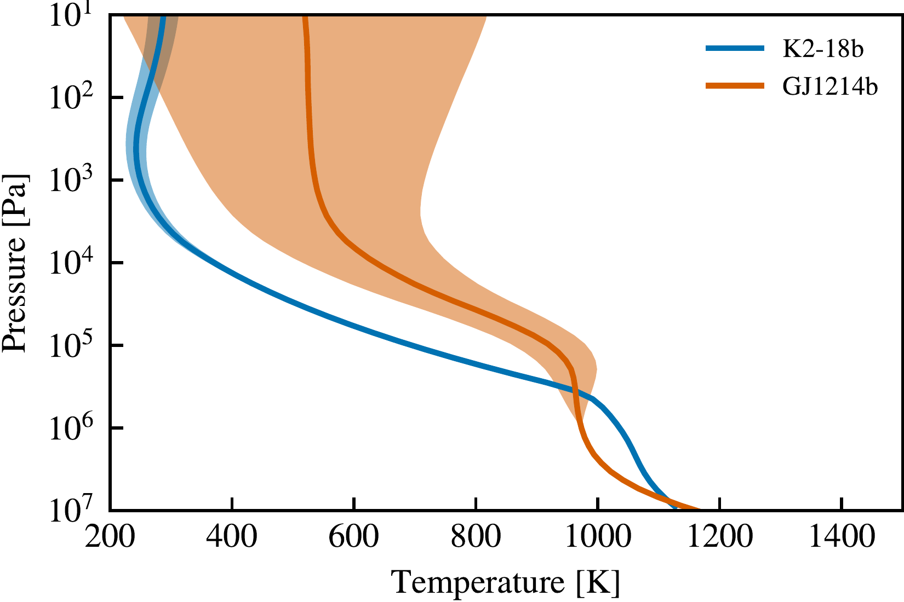
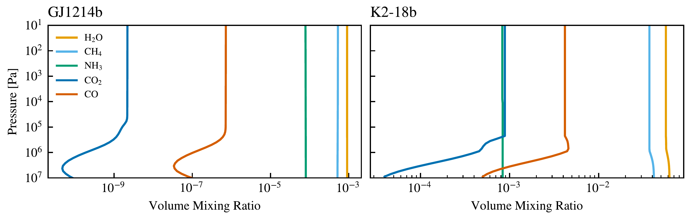

$\newcommand{\ensuremath}{}$
$\newcommand{\xspace}{}$
$\newcommand{\object}[1]{\texttt{#1}}$
$\newcommand{\farcs}{{.}''}$
$\newcommand{\farcm}{{.}'}$
$\newcommand{\arcsec}{''}$
$\newcommand{\arcmin}{'}$
$\newcommand{\ion}[2]{#1#2}$
$\newcommand{\textsc}[1]{\textrm{#1}}$
$\newcommand{\hl}[1]{\textrm{#1}}$
$\newcommand{\vdag}{(v)^\dagger}$
$\newcommand$
$\newcommand$

$\newcommand{$\ensuremath$}{}$
$\newcommand{$\xspace$}{}$
$\newcommand{$\object$}[1]{\texttt{#1}}$
$\newcommand{$\farcs$}{{.}''}$
$\newcommand{$\farcm$}{{.}'}$
$\newcommand{$\arcsec$}{''}$
$\newcommand{$\arcmin$}{'}$
$\newcommand{$\ion$}[2]{#1#2}$
$\newcommand{$\textsc$}[1]{\textrm{#1}}$
$\newcommand{$\hl$}[1]{\textrm{#1}}$
$\newcommand{$\vdag$}{(v)^\dagger}$
$\newcommand$
$\newcommand$

# 

<mark>Appeared on: 2022-11-09</mark> - _Accepted to PSJ_

<mark>Duncan A. Christie</mark>, et al. -- incl., <mark>Elspeth K. H. Lee</mark>, <mark>Linda Sohl</mark>, <mark>Maria E. Steinrueck</mark>

**Abstract:** With an increased focus on the observing and modelling of mini-Neptunes, there comes a need to better understand the tools we use to model their atmospheres.  In this paper, we present the protocol for the CAMEMBERT (Comparing Atmospheric Models of Extrasolar Mini-neptunes Building and Envisioning Retrievals and Transits) project, an intercomparison of general circulation models (GCMs) used by the exoplanetary science community to simulate the atmospheres of mini-Neptunes.   We focus on two targets well studied both observationally and theoretically with planned JWST Cycle 1 observations:  the warm GJ 1214b and the cooler K2-18b.  For each target, we consider a temperature-forced case, a clear sky dual-grey radiative transfer case, and a clear sky multi band radiative transfer case, covering a range of complexities and configurations where we know differences exist between GCMs in the literature.   This paper presents all the details necessary to participate in the intercomparison, with the intention of presenting the results in future papers.   Currently, there are eight GCMs participating ({\sc ExoCAM},{\sc Exo-FMS}, FMS PCM,{\sc Generic PCM},{\sc MITgcm}, RM-GCM, THOR, and the UM), and membership in the project remains open.  Those interested in participating are invited to contact the authors.

**Figure 1. -** Initial temperature profiles for K2-18b and GJ 1214b.  The solid lines indicate the initial temperature profiles for each planet while the shaded regions indicate the range of equilibrium temperatures $T_\mathrm{eq}$ in the temperature-forced case (see Equation \ref{Eqn:Teq}). \label{Fig:Profiles} (*Fig:Profiles*)

**Figure 2. -** Chemical abundance profiles for K2-18b and GJ 1214b\label{Fig:ChemProfiles} to be used in Case 3.  These are publicly available in the CAMEMBERT repository (see Section \ref{Sec:Repo}). (*Fig:ChemProfiles*)

