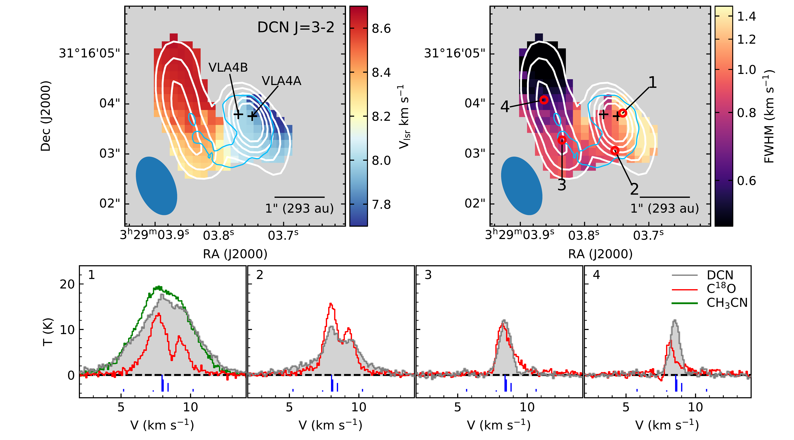
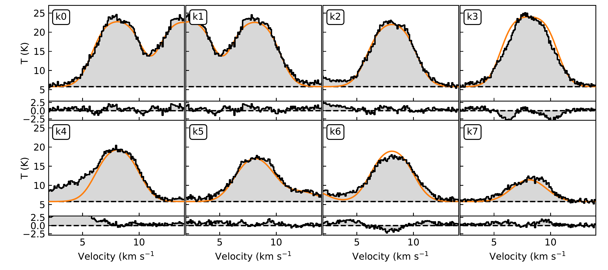
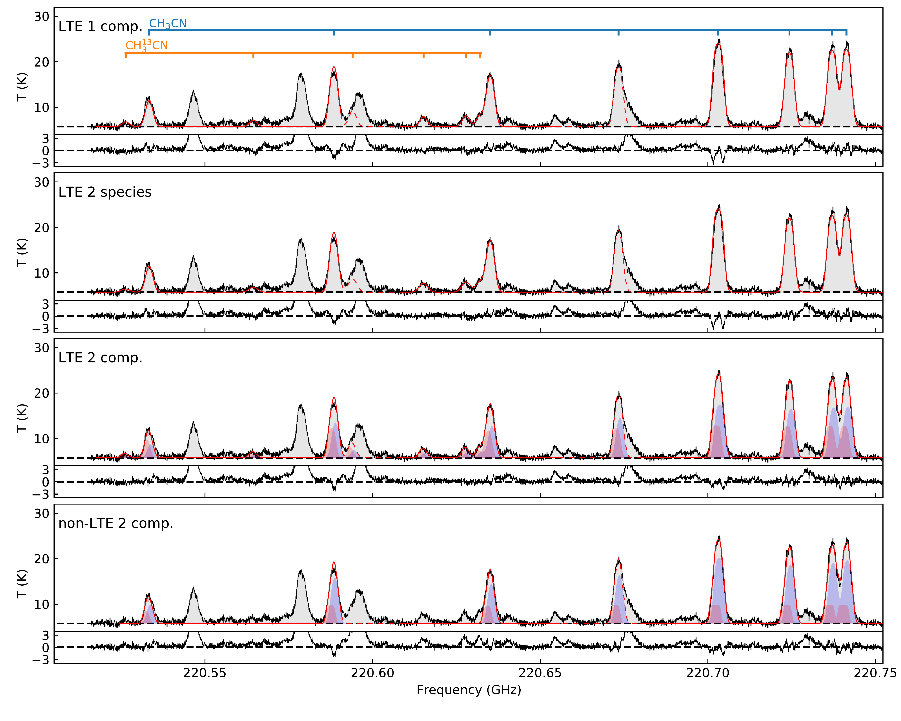

$\newcommand{\ensuremath}{}$
$\newcommand{\xspace}{}$
$\newcommand{\object}[1]{\texttt{#1}}$
$\newcommand{\farcs}{{.}''}$
$\newcommand{\farcm}{{.}'}$
$\newcommand{\arcsec}{''}$
$\newcommand{\arcmin}{'}$
$\newcommand{\ion}[2]{#1#2}$
$\newcommand{\textsc}[1]{\textrm{#1}}$
$\newcommand{\hl}[1]{\textrm{#1}}$
$\newcommand{\vdag}{(v)^\dagger}$
$\newcommand$
$\newcommand$

$\newcommand{\ensuremath}{}$
$\newcommand{\xspace}{}$
$\newcommand{\object}[1]{\texttt{#1}}$
$\newcommand{\farcs}{{.}''}$
$\newcommand{\farcm}{{.}'}$
$\newcommand{\arcsec}{''}$
$\newcommand{\arcmin}{'}$
$\newcommand{\ion}[2]{#1#2}$
$\newcommand{\textsc}[1]{\textrm{#1}}$
$\newcommand{\hl}[1]{\textrm{#1}}$
$\newcommand{\vdag}{(v)^\dagger}$
$\newcommand$
$\newcommand$

# PRODIGE - Envelope to Disk with NOEMA\thanks{Based on observations carried out under project number L19MB with the IRAM NOEMA Interferometer. IRAM is supported by INSU/CNRS (France), MPG (Germany) and IGN (Spain)}

<mark>Appeared on: 2022-11-09</mark> - _20 pages, 19 figures, accepted to A&A_

T.-H. Hsieh, et al. -- incl., <mark>D. Semenov</mark>, <mark>B. Zhao</mark>

**Abstract:** Aims. We present high sensitivity and high-spectral resolution NOEMAobservations of the Class 0/I binary system SVS13A, composed of the low-massprotostars VLA4A and VLA4B with a separation of ~90 au. VLA4A is undergoing anaccretion burst that enriches the chemistry of the surrounding gas. This givesus an excellent opportunity to probe the chemical and physical conditions aswell as the accretion process. Methods. We observe the (12K-11K) lines of CH3CNand CH313CN, the DCN (3-2) line, and the C18O (2-1) line toward SVS13A usingNOEMA. Results. We find complex line profiles at disk scales which cannot beexplained by a single component or pure Keplerian motion. By adopting twovelocity components to model the complex line profiles, we find that thetemperatures and densities are significantly different between these twocomponents. This suggests that the physical conditions of the emitting gastraced via CH3CN can change dramatically within the circumbinary disk. Inaddition, combining our observations of DCN (3-2) with previous ALMAhigh-angular-resolution observations, we find that the binary system (or VLA4A)might be fed by an infalling streamer from envelope scales (~700 au). If thisis the case, this streamer contributes to the accretion of material onto thesystem with a rate of at least 1.4x10-6 Msun yr-1. Conclusions. We concludethat the CH3CN emission in SVS13A traces hot gas from a complex structure. Thiscomplexity might be affected by a streamer that is possibly infalling andfunneling material into the central region.

**Figure 7. -** 
DCN (3-2) centroid-velocity (_ top left_) and linewidth (_ top right_) maps from the blue-shifted component in the hyperfine structure fitting (see Appendix \ref{sec:decom}). The white contours show its peak intensity. The contour levels start at 25$\sigma$ and increase in 5$\sigma$ step, where $\sigma=0.3$ K. The blue contour shows the ALMA 1.3 mm continuum emission at the 3$\sigma$ level. (_ Bottom_) The spectra of DCN (3--2), \ce{C^{18}O}(2--1), and \ce{CH3CN}($12_3--11_3$) toward the four positions marked in the right panel.
The blue bars show the relative intensities of the DCN (3--2) hyperfine structure at the velocity of the blue-shifted component (see Appendix \ref{sec:decom}).
 (*fig:dcn_fit*)

**Figure 10. -** Zoom-in spectra for each K-ladder component of \ce{CH3CN} J$=$12-11. The orange curve shows the best-fit 1-component LTE model. The bottom frame in each panel shows the residual from the fitting. (*fig:asym*)

**Figure 6. -** Modeled \ce{CH3CN} and \ce{CH3 ^13CN} spectra overlaid on the observed spectra.
The first panel shows the LTE model one velocity component fitting. The second panel is the same as the first panel but treats \ce{CH3CN} and \ce{CH3 ^13CN} as two species with independent temperature, velocity and linewidth.
The third panel is the LTE two velocity component fitting while the fourth panel shows the non-LTE one.
The red curve shows the modeled spectrum;
The K=4 component of \ce{CH3CN} and K=3 component of \ce{CH3 ^13CN} suffer from severe line contamination so they were not included in the fitting. The model in these frequency ranges is shown with the dashed line.
The red and blue shaded areas in the two bottom panels represent the modeled spectrum from the individual components. The residual from the best-fit is shown in the bottom frame of each panel. The best-fit parameters are listed in Table \ref{tab:cassis} and the corner plots are shown in Appendix \ref{sec:mcmc}.
 (*fig:cassis*)

