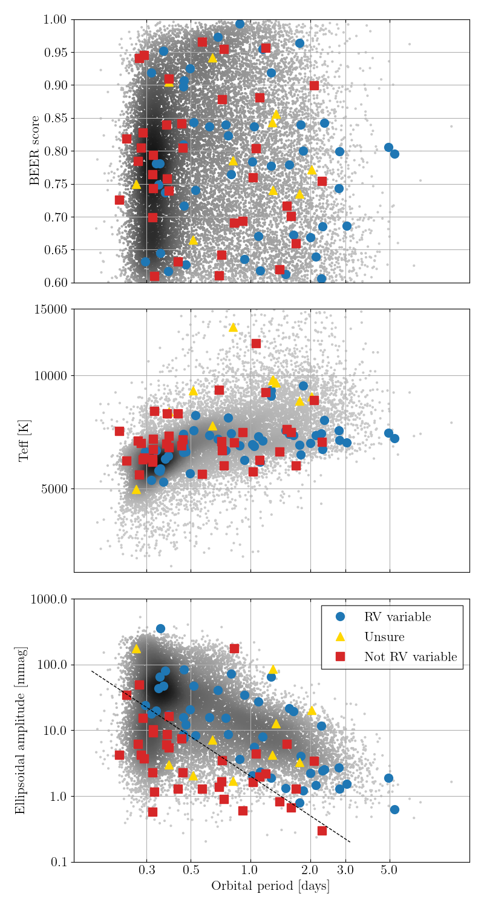
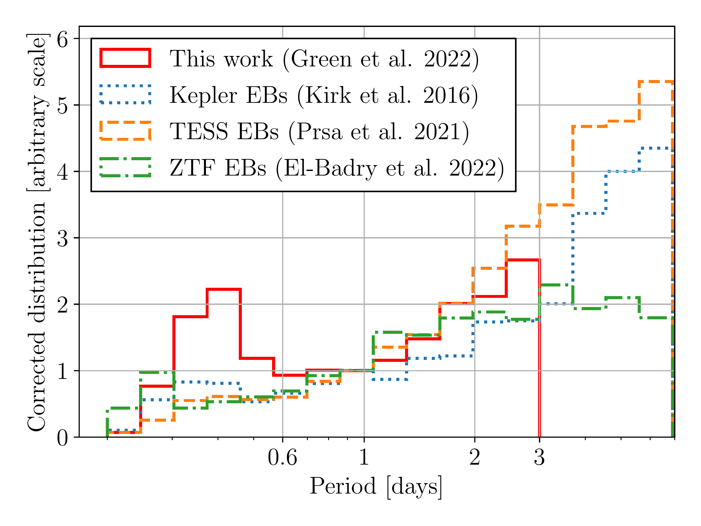
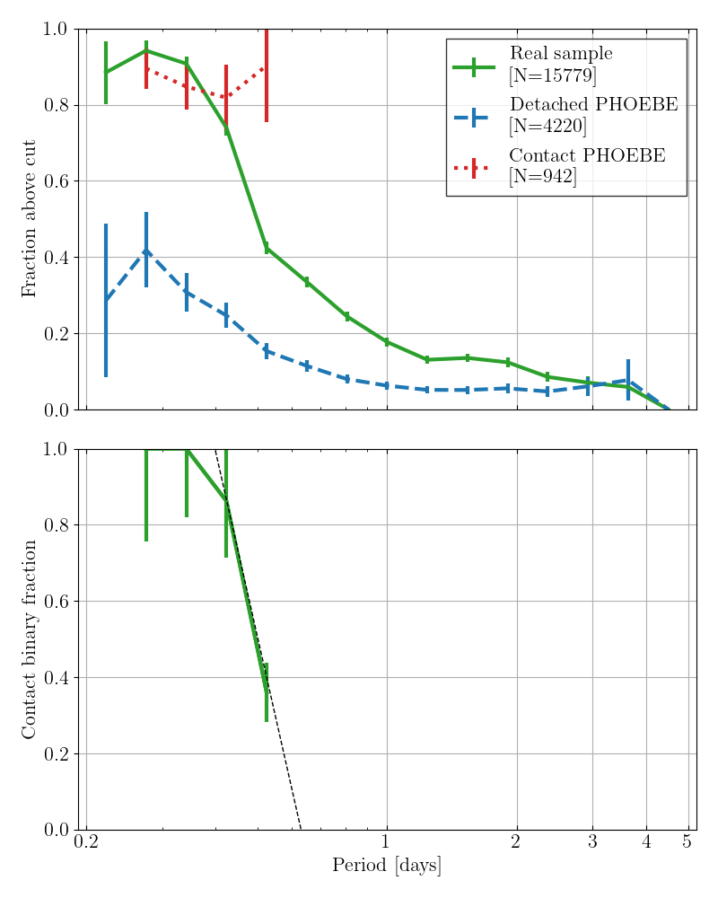

$\newcommand{\ensuremath}{}$
$\newcommand{\xspace}{}$
$\newcommand{\object}[1]{\texttt{#1}}$
$\newcommand{\farcs}{{.}''}$
$\newcommand{\farcm}{{.}'}$
$\newcommand{\arcsec}{''}$
$\newcommand{\arcmin}{'}$
$\newcommand{\ion}[2]{#1#2}$
$\newcommand{\textsc}[1]{\textrm{#1}}$
$\newcommand{\hl}[1]{\textrm{#1}}$
$\newcommand{\dani}[1]{\textcolor{blue}{(#1)}}$
$\newcommand{\review}[1]{\textcolor{red}{#1}}$
$\newcommand{\cmnt}[1]$
$\newcommand{\software}[1]{\texttt{\sc #1}}$
$\newcommand{\porb}{P_\mathrm{orb}}$
$\newcommand{\teff}{T_\mathrm{eff}}$
$\newcommand{\tell}{\mathcal{T}}$
$\newcommand{\tlv}{^1}$
$\newcommand{\warwick}{^2}$
$\newcommand{\weissman}{^3}$
$\newcommand{\harvard}{^4}$
$\newcommand{\mpia}{^5}$
$\newcommand{\berkeley}{^3}$
$\newcommand{\samplesize}{15 779}$
$\newcommand{\inputsize}{4 301 148}$
$\newcommand{\longinputsize}{8 975 643}$
$\newcommand{\scorethreshold}{0.6}$

$\newcommand{$\ensuremath$}{}$
$\newcommand{$\xspace$}{}$
$\newcommand{$\object$}[1]{\texttt{#1}}$
$\newcommand{$\farcs$}{{.}''}$
$\newcommand{$\farcm$}{{.}'}$
$\newcommand{$\arcsec$}{''}$
$\newcommand{$\arcmin$}{'}$
$\newcommand{$\ion$}[2]{#1#2}$
$\newcommand{$\textsc$}[1]{\textrm{#1}}$
$\newcommand{$\hl$}[1]{\textrm{#1}}$
$\newcommand{$\dani$}[1]{\textcolor{blue}{(#1)}}$
$\newcommand{$\review$}[1]{\textcolor{red}{#1}}$
$\newcommand{$\cmnt$}[1]$
$\newcommand{$\software$}[1]{\texttt{\sc #1}}$
$\newcommand{$\porb$}{P_\mathrm{orb}}$
$\newcommand{$\teff$}{T_\mathrm{eff}}$
$\newcommand{$\tell$}{\mathcal{T}}$
$\newcommand{$\tlv$}{^1}$
$\newcommand{$\warwick$}{^2}$
$\newcommand{$\weissman$}{^3}$
$\newcommand{$\harvard$}{^4}$
$\newcommand{$\mpia$}{^5}$
$\newcommand{$\berkeley$}{^3}$
$\newcommand{$\samplesize$}{15 779}$
$\newcommand{$\inputsize$}{4 301 148}$
$\newcommand{$\longinputsize$}{8 975 643}$
$\newcommand{$\scorethreshold$}{0.6}$

# : Orbital Periods, Binary Fraction, and Tertiary Companions

<mark>Appeared on: 2022-11-14</mark> - _27 pages, 21 figures, submitted to MNRAS. The associated sample data will be released alongside the accepted paper_

<mark><mark>Matthew J. Green</mark></mark>, et al. -- incl., <mark><mark>Hans-Walter Rix</mark></mark>

**Abstract:** We present a homogeneously-selected sample of$\samplesize$candidate binary systems with main sequence primary stars and orbital periods shorter than 5 days.The targets were selected from\textit{TESS}full-frame image lightcurves on the basis of their tidally-induced ellipsoidal modulation.Spectroscopic follow-up suggests a sample purity of$83 \pm 13$per cent.Injection-recovery tests allow us to estimate our overall completeness as$28 \pm 3$per cent with$\porb$$< 3$days and to quantify our selection effects.We estimate that$39 \pm 4$per cent of our sample are contact binary systems, and we disentangle the period distributions of the contact and detached binaries.We derive the orbital period distribution of the main sequence binary population at short orbital periods, finding a distribution continuous with the log-normal distribution previously found for solar-type stars at longer periods, but with a significant steepening  at$\porb$$\lesssim 3$days, and a pile-up of contact binaries at$\porb$$\approx 0.4$days.Companions in the period range 1--5 days are found to be an order of magnitude more frequent around stars hotter than$\approx 6250 K$(the Kraft break) when compared to cooler stars, suggesting that magnetic braking plays an important role in shaping the temperature and period distributions.We detect resolved tertiary companions to$9.0 \pm 0.2$per cent of our binaries with a median separation of 3200 AU.The frequency of tertiary companions rises to$29 \pm 5$per cent among the systems with the shortest ellipsoidal periods.This large binary sample with quantified selection effects will be a powerful resource for future studies of detached and contact binary systems with$\porb$$<5$days.$\cmnt${word count: 242/250}

**Figure 2. -** Properties of 93 targets with score $> 0.6$ that were observed with LCO spectroscopic follow-up. Nine targets with $\software${beer} scores $< 0.6$ have not been plotted.
The upper panel plots $\software${beer} score, the middle panel shows primary $T_\mathrm{eff}$ from TIC, and lower panel shows the second-order ellipsoidal amplitude, all as a function of orbital period.
Coloured points indicate targets observed with LCOGT, coloured according to whether or not they showed RV variability, while grey points show the other targets in our sample (before applying the cut in Equation \ref{eq:lco-cut}).
The cut in Equation \ref{eq:lco-cut} is shown as a dashed line in the lower panel, which separates the lower-left region populated primarily by targets that are not RV variable.
 (*fig:lco-targets*)

**Figure 12. -** A comparison of the orbital period distribution of our sample with several eclipsing binary samples, as summarized in Table \ref{tab:ebs-samples}.
Between one and three days our period distribution is similar to those of other samples.
 (*fig:ebs_comparison*)

**Figure 6. -** \textit{Top:} The fraction of lightcurves with $R_{23}$ greater than the cut in \ref{eq:contacts} as a function of orbital period, for our real sample and for simulated lightcurves of detached and contact binary systems.
\textit{Below:} The fraction of the real sample which must be contact binary systems as a function of orbital period, in order to reproduce the curve of the real sample in the top figure.
The dotted grey line shows an approximation to the contact binary fraction described in Equation \ref{eq:contact-fraction}.
 (*fig:contact-fraction*)

