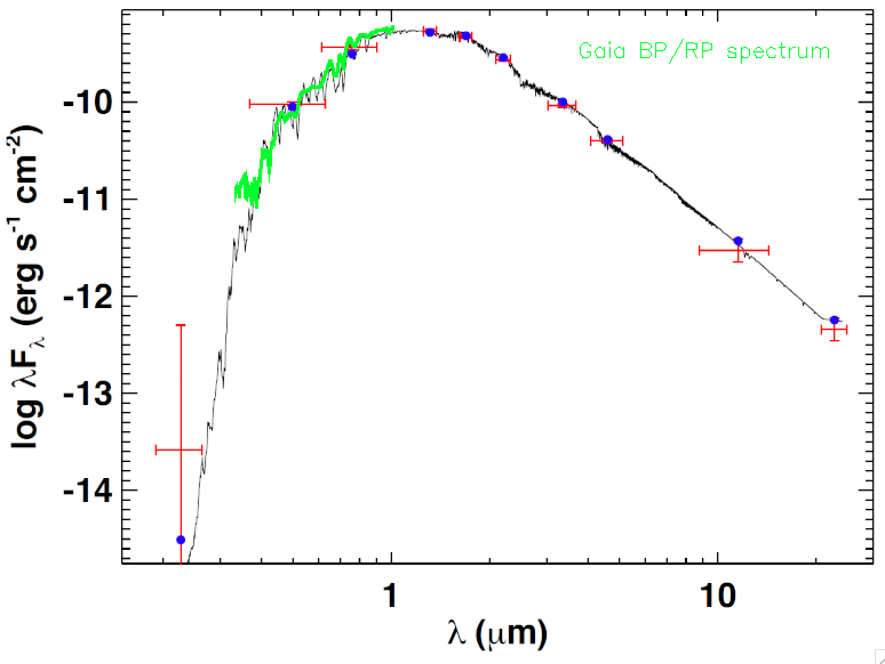
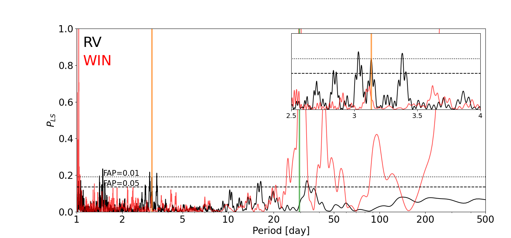
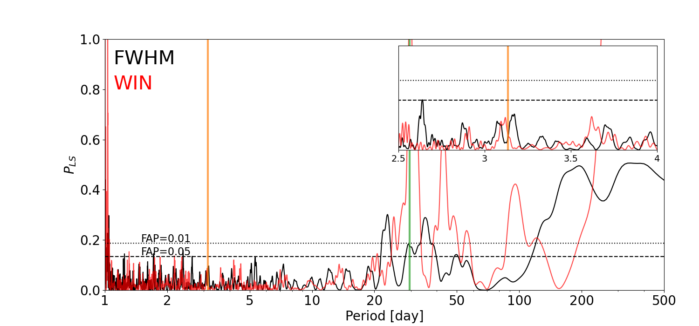
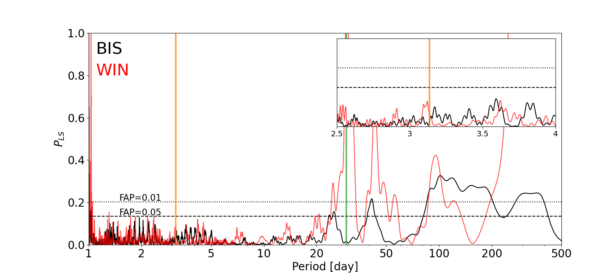
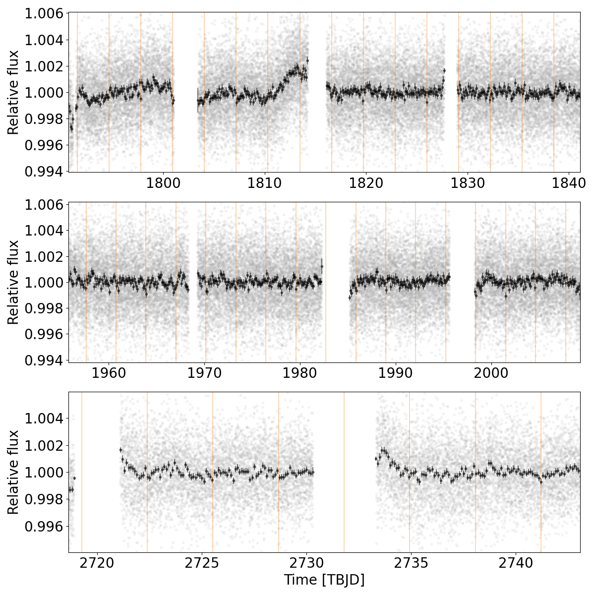

$\newcommand{\ensuremath}{}$
$\newcommand{\xspace}{}$
$\newcommand{\object}[1]{\texttt{#1}}$
$\newcommand{\farcs}{{.}''}$
$\newcommand{\farcm}{{.}'}$
$\newcommand{\arcsec}{''}$
$\newcommand{\arcmin}{'}$
$\newcommand{\ion}[2]{#1#2}$
$\newcommand{\textsc}[1]{\textrm{#1}}$
$\newcommand{\hl}[1]{\textrm{#1}}$
$\newcommand{\}{MJ}$
$\newcommand{\}{ME}$
$\newcommand{\}{RJ}$
$\newcommand{\}{RE}$
$\newcommand{\}{RS}$
$\newcommand{\}{msol}$
$\newcommand{\}{kms}$
$\newcommand{\}{ms}$

$\newcommand{$\ensuremath$}{}$
$\newcommand{$\xspace$}{}$
$\newcommand{$\object$}[1]{\texttt{#1}}$
$\newcommand{$\farcs$}{{.}''}$
$\newcommand{$\farcm$}{{.}'}$
$\newcommand{$\arcsec$}{''}$
$\newcommand{$\arcmin$}{'}$
$\newcommand{$\ion$}[2]{#1#2}$
$\newcommand{$\textsc$}[1]{\textrm{#1}}$
$\newcommand{$\hl$}[1]{\textrm{#1}}$
$\newcommand{\}{MJ}$
$\newcommand{\}{ME}$
$\newcommand{\}{RJ}$
$\newcommand{\}{RE}$
$\newcommand{\}{RS}$
$\newcommand{\}{msol}$
$\newcommand{\}{kms}$
$\newcommand{\}{ms}$

# A sub-Neptune planet around TOI-1695 discovered and characterized with SPIRou and TESS

<mark>Appeared on: 2022-11-14</mark> - _15 pages (+9 appendix pages), 19 figures, 8 tables_

F. Kiefer, et al. -- incl., <mark><mark>K. Hesse</mark></mark>, <mark><mark>H. Lewis</mark></mark>, <mark><mark>C.-F. Liu</mark></mark>

**Abstract:** TOI-1695 is a V-mag=13 M-dwarf star from the northern hemisphere at 45 pc from the Sun, around which a 3.134-day periodic transit signal from a super-Earth candidate was identified in TESS photometry. With a transit depth of 1.3 mmag, the radius of candidate TOI-1695.01 was estimated by the TESS pipeline to be 1.82 R$_\oplus$with an equilibrium temperature of$\sim$620 K. We successfully detect a reflex motion of the star and establish it is due to a planetary companion at an orbital period consistent with the photometric transit period thanks to a year-long radial-velocity monitoring of TOI-1695 by the SPIRou infrared spectropolarimeter. We use and compare different methods to reduce and analyse those data. We report a 5.5-$\sigma$detection of the planetary signal, giving a mass of$5.5\pm1.0$M$_\oplus$and a radius of 2.03$\pm$0.18 R$_\oplus$. We derive a mean equilibrium planet temperature of 590$\pm$90 K. The mean density of this small planet of 3.6$\pm$1.1 g cm$^{-3}$is similar (1.7--$\sigma$lower) than that of the Earth. It leads to a non-negligible fraction of volatiles in its atmosphere with$f_{H,He}$=0.28$^{+0.46}_{-0.23}$\%or$f_\text{water}$=23$\pm$12\%. TOI-1695 b is a new sub-Neptune planet at the border of the M-dwarf radius valley that can help test formation scenarios for super-Earth/sub-Neptune-like planets.

**Figure 4. -** Spectral energy distribution of TOI-1695. Red symbols represent the observed photometric measurements, where the horizontal bars represent the effective width of the passband. Blue symbols are the model fluxes from the best-fit NextGen atmosphere model (black). The green curve is the published Gaia DR3 spectrum for this star. \label{fig:SED} (*fig:SED*)

**Figure 5. -** From top to bottom, RV, FWHM and BIS Lomb-Scargle periodograms with FAP levels 0.01 and 0.05 indicated as dotted and dashed lines for data extracted with the APERO v6 version. They are compared to the window function (red solid line). The vertical orange solid line indicates the 3.134-days period of the TESS transit signal. The moon synodic orbital period (29.53 days) is also shown as a green solid lines. \label{fig:periodo_all} (*fig:periodo_all*)

**Figure 1. -** The full TESS lightcurve separated in sectors (gray dots) and binned with a 0.1-day timestep (black). The identified transit locations are shown with orange vertical lines. \label{fig:transit_detection} (*fig:transit_detection*)

