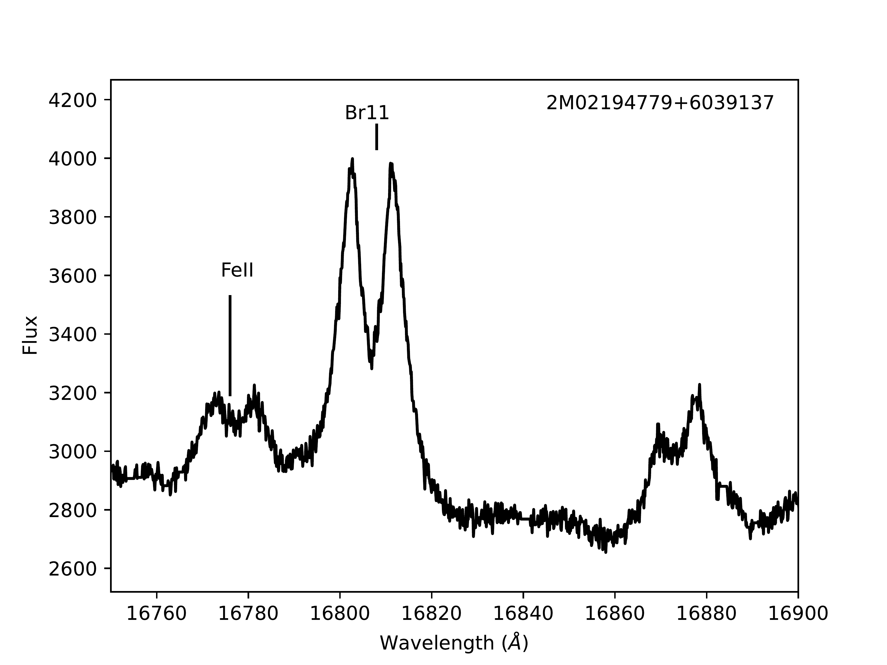
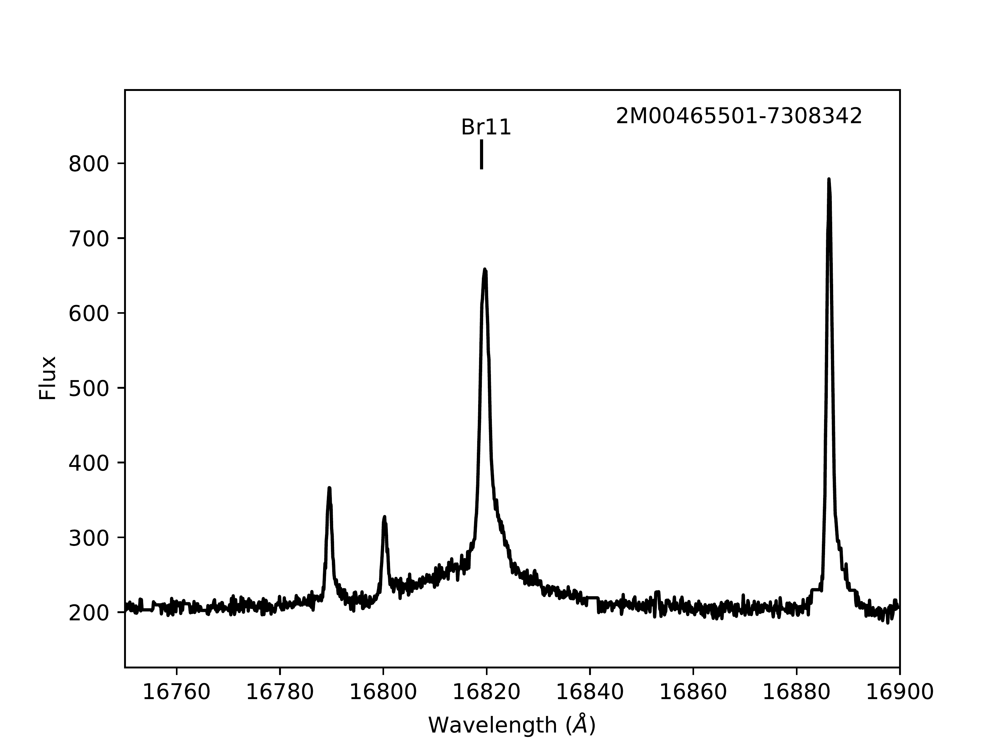
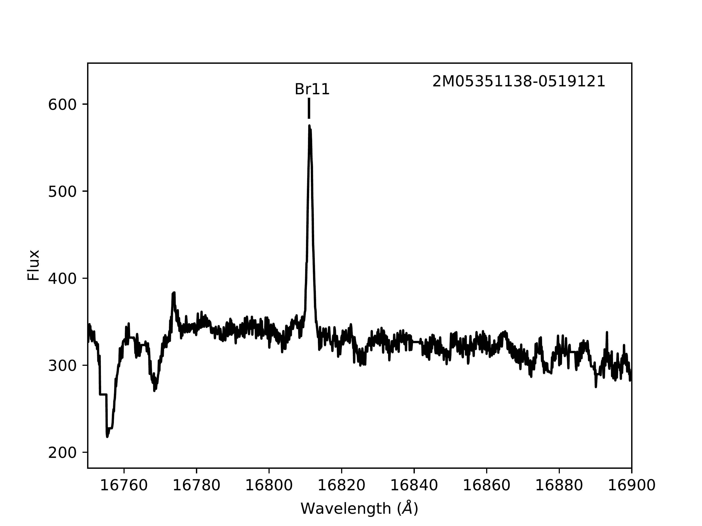
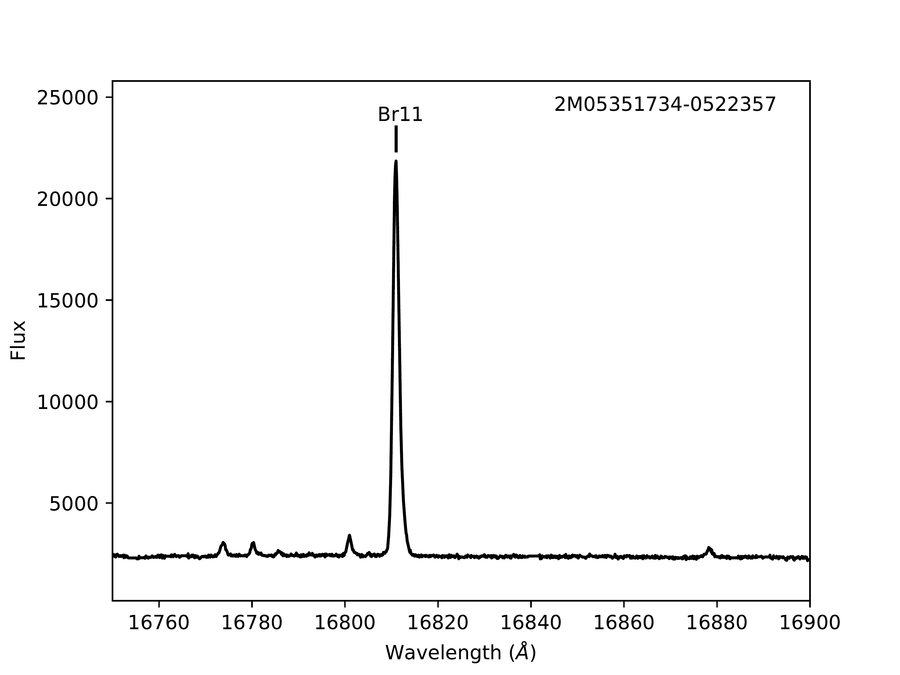
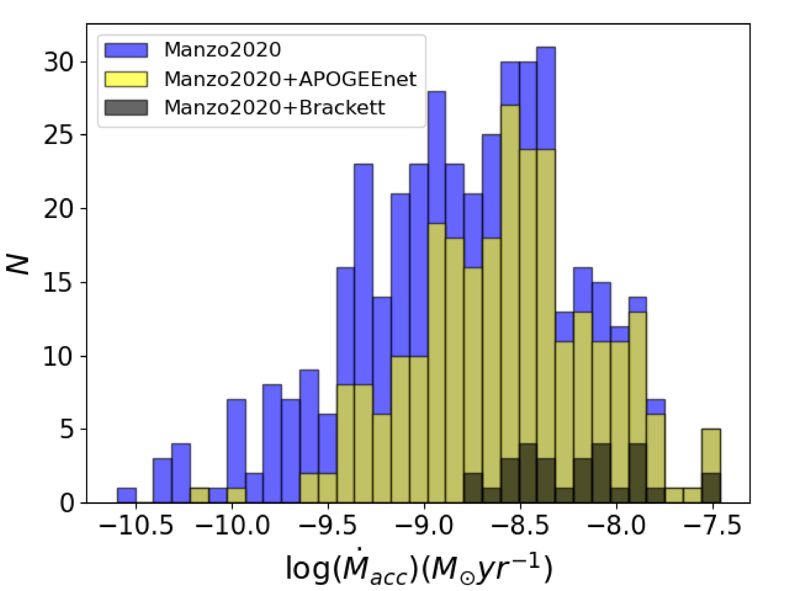
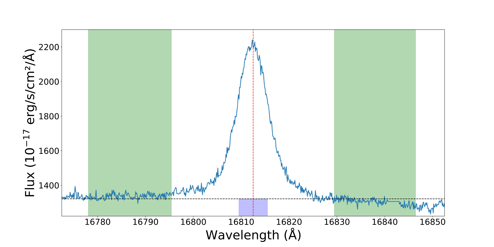
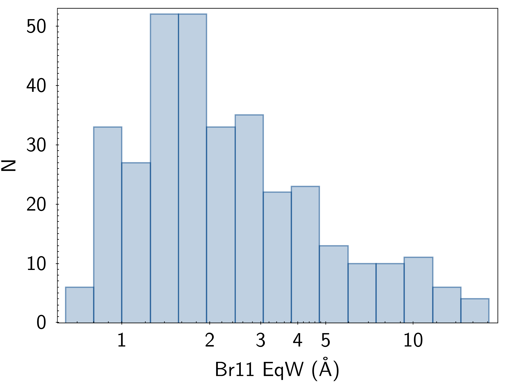

$\newcommand{\ensuremath}{}$
$\newcommand{\xspace}{}$
$\newcommand{\object}[1]{\texttt{#1}}$
$\newcommand{\farcs}{{.}''}$
$\newcommand{\farcm}{{.}'}$
$\newcommand{\arcsec}{''}$
$\newcommand{\arcmin}{'}$
$\newcommand{\ion}[2]{#1#2}$
$\newcommand{\textsc}[1]{\textrm{#1}}$
$\newcommand{\hl}[1]{\textrm{#1}}$
$\newcommand{\vdag}{(v)^\dagger}$
$\newcommand$
$\newcommand$

$\newcommand{$\ensuremath$}{}$
$\newcommand{$\xspace$}{}$
$\newcommand{$\object$}[1]{\texttt{#1}}$
$\newcommand{$\farcs$}{{.}''}$
$\newcommand{$\farcm$}{{.}'}$
$\newcommand{$\arcsec$}{''}$
$\newcommand{$\arcmin$}{'}$
$\newcommand{$\ion$}[2]{#1#2}$
$\newcommand{$\textsc$}[1]{\textrm{#1}}$
$\newcommand{$\hl$}[1]{\textrm{#1}}$
$\newcommand{$\vdag$}{(v)^\dagger}$
$\newcommand$
$\newcommand$

# 

<mark>Appeared on: 2022-11-15</mark> - _19 pages, 9 figures, accepted to AJ_

Elliott Khilfeh, et al. -- incl., <mark><mark>Jesús Hernández</mark></mark>

**Abstract:** Very young (t$\lesssim$10 Myrs) stars possess strong magnetic fields that channel ionized gas from the interiors of their circumstellar discs to the surface of the star. Upon impacting the stellar surface, the shocked gas recombines and emits hydrogen spectral lines. To characterize the density and temperature of the gas within these accretion streams, we measure equivalent widths of Brackett (Br) 11 – 20 emission lines detected in 1101 APOGEE spectra of 326 likely pre-main sequence accretors. For sources with multiple observations, we measure median epoch-to-epoch line strength variations of 10\%in Br11 and 20\%in Br20. We also fit the measured line ratios to predictions of radiative transfer models by Kwan\&Fischer.  We find characteristic best-fit electron densities of$n_e$= 10$^{11} - 10^{12}$cm$^{-3}$, and excitation temperatures that are inversely correlated with electron density (from T$\sim$5000 K for$n_e \sim 10^{12}$cm$^{-3}$, to T$\sim$12500 K at$n_e \sim 10^{11}$cm$^{-3}$). These physical parameters are in good agreement with predictions from modelling of accretion streams that account for the hydrodynamics and radiative transfer within the accretion stream. We also present a supplementary catalog of line measurements from 9733 spectra of 4255 Brackett emission line sources in the APOGEE DR17 dataset.

**Figure 9. -** \textit{(top left panel)}: Example of a source with (double-peaked) Br 11 emission, and a neighboring 16781 line with an identical velocity profile. These sources are coded with an FeII flag = 1 in the machine readable table of our sample.  \textit{(top right panel)}: Example of a source with strong Br 11 emission, and two lines near the wavelength expected for the neighboring [FeII] line. These sources are coded with an FeII flag = 2 in the machine readable table of our sample. \textit{(Bottom panels)}: Examples of two sources with a prominent emission feature at 16775: the source on the left shows this line near two photospheric features, while the source on the right shows two additional emission lines in between the 16775 line and Br11.  Both of these patterns which include the 16775 feature are coded with an FeII flag = 3 in the machine readable table of our sample. \label{fig:FeII_emitters} (*fig:FeII_emitters*)

**Figure 1. -** Accretion rate measurements for sources with optical measurements by \citet{Manzo-Martinez2020}(full sample shown as the blue histogram), highlighting the subsets of sources with APOGEEnet stellar parameters (yellow histogram), and with Brackett emission lines detected in this work (black histogram). The Brackett sample is strongly biased towards the most rapidly accreting sources in the \citet{Manzo-Martinez2020} sample, given the larger temperatures and densities required to populate hydrogen's n=11-20 levels, and the larger optical depths that are necessary to produce detectable emission lines. \label{fig:Manzo_comparison} (*fig:Manzo_comparison*)

**Figure 6. -** Left: Wavelength-flux plot of the Br11 emission line for a strongly accreting YSO, 2M05471411+0009073. The green highlighted regions are the windows which were used to calculate the continuum (horizontal dashed line) on the left and right of the central line (vertical dashed line). The equivalent width of the Br11 line is given by the width of the shaded blue region below the continuum. Right: Distribution of the absolute value of equivalent widths for Br11 for all of the objects in the sample, excluding those that are likely associated with Be stars or that have nebular emission. Note that since Br11 line is seen in emission, by convention EqW is negative. \label{fig:EqW} (*fig:EqW*)

