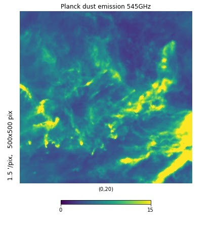
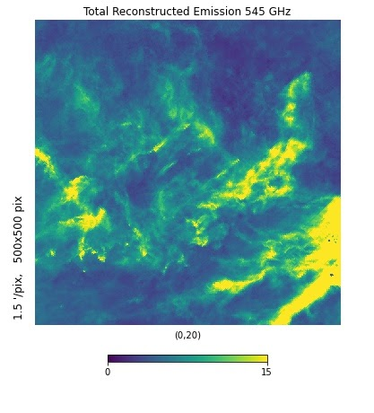
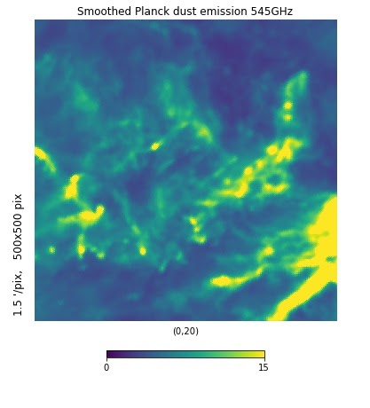
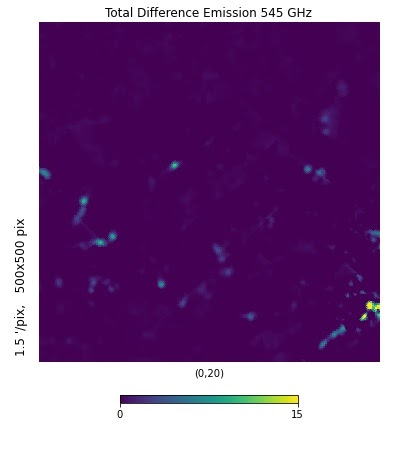
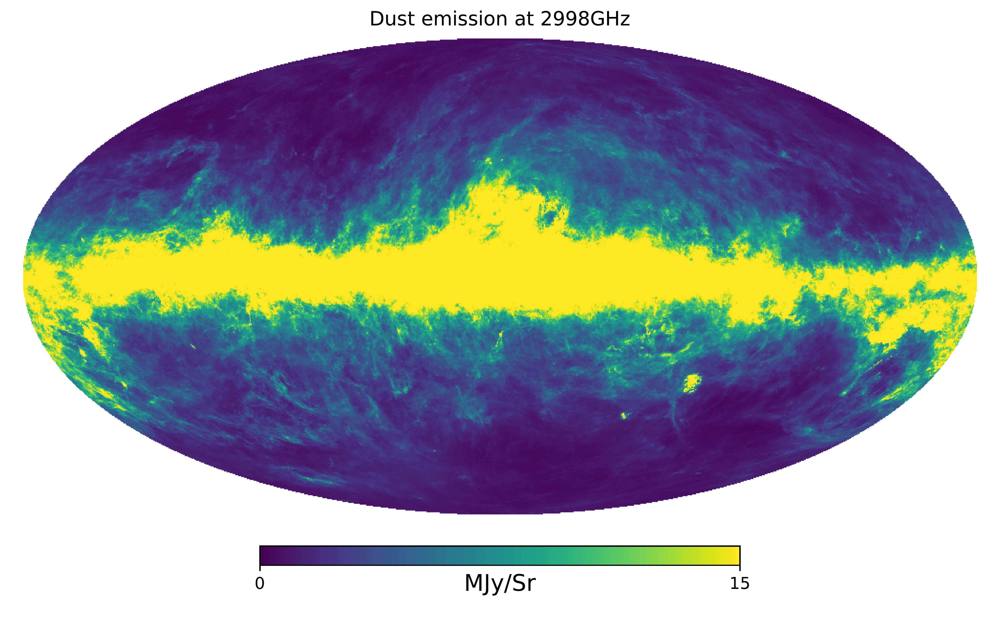
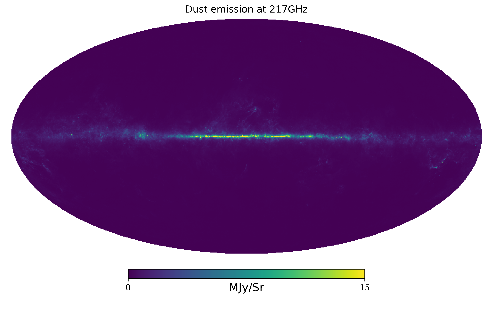
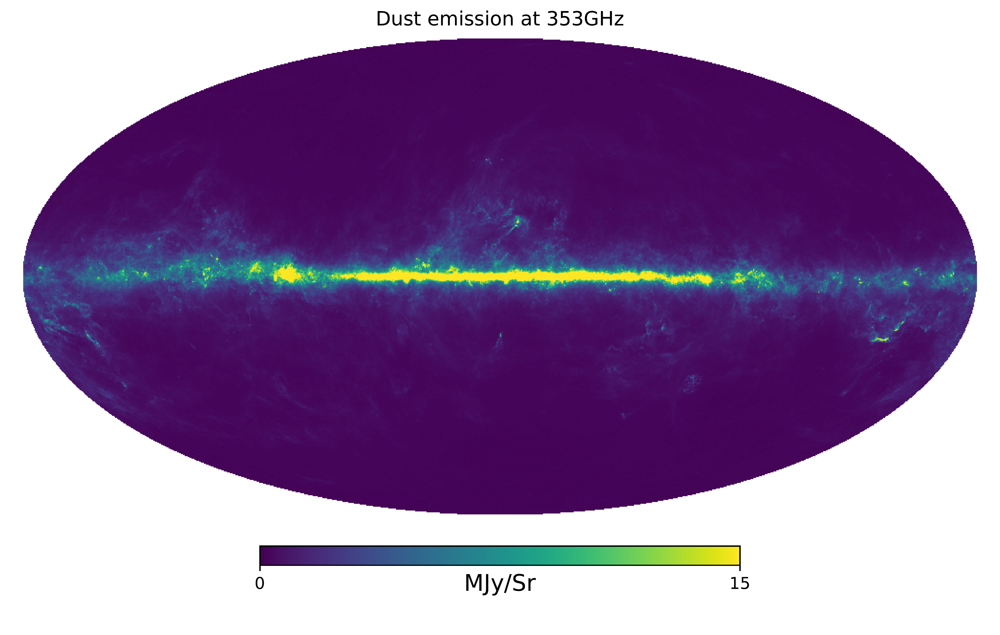
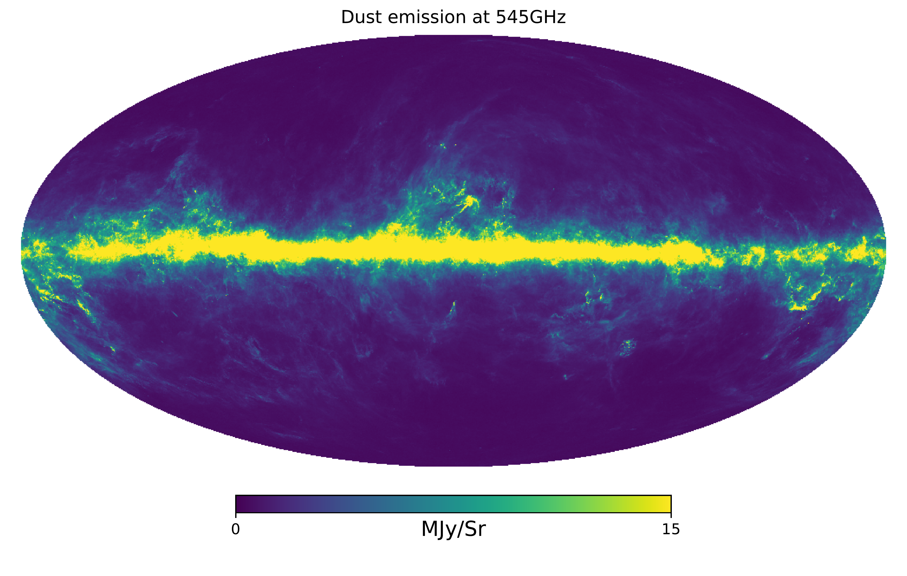
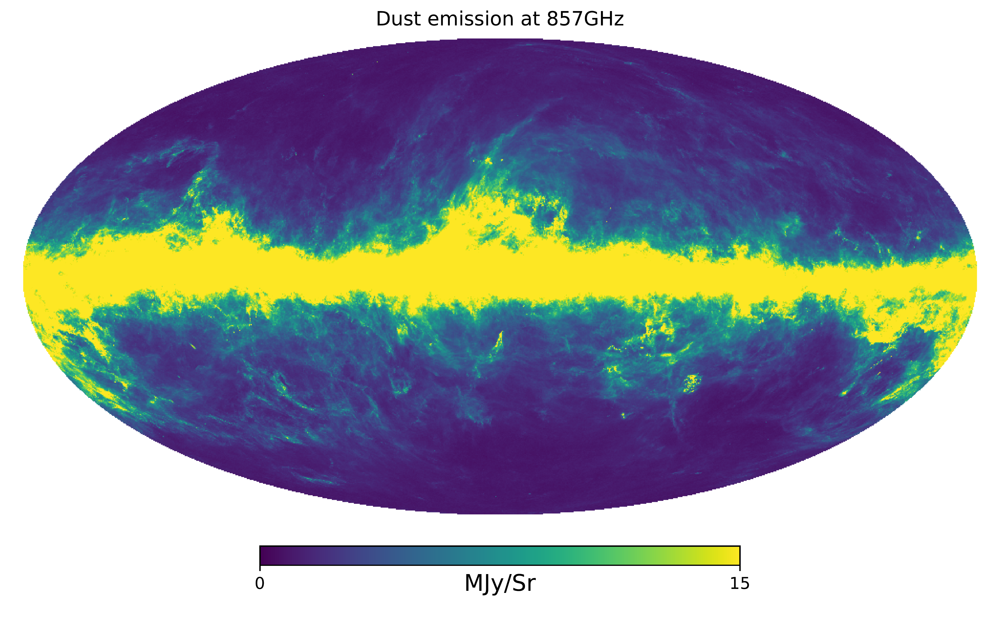

$\newcommand{\ensuremath}{}$
$\newcommand{\xspace}{}$
$\newcommand{\object}[1]{\texttt{#1}}$
$\newcommand{\farcs}{{.}''}$
$\newcommand{\farcm}{{.}'}$
$\newcommand{\arcsec}{''}$
$\newcommand{\arcmin}{'}$
$\newcommand{\ion}[2]{#1#2}$
$\newcommand{\textsc}[1]{\textrm{#1}}$
$\newcommand{\hl}[1]{\textrm{#1}}$
$\newcommand{\vdag}{(v)^\dagger}$
$\newcommand$
$\newcommand$

$\newcommand{$\ensuremath$}{}$
$\newcommand{$\xspace$}{}$
$\newcommand{$\object$}[1]{\texttt{#1}}$
$\newcommand{$\farcs$}{{.}''}$
$\newcommand{$\farcm$}{{.}'}$
$\newcommand{$\arcsec$}{''}$
$\newcommand{$\arcmin$}{'}$
$\newcommand{$\ion$}[2]{#1#2}$
$\newcommand{$\textsc$}[1]{\textrm{#1}}$
$\newcommand{$\hl$}[1]{\textrm{#1}}$
$\newcommand{$\vdag$}{(v)^\dagger}$
$\newcommand$
$\newcommand$

#  3D Map of Interstellar Dust Temperature

<mark>Appeared on: 2022-11-16</mark> - _11 Figures, 19 pages_

Ioana A. Zelko, Douglas P. Finkbeiner, <mark>Albert Lee</mark>, <mark>Gregory Green</mark>

**Abstract:** We present the first large-scale 3D map of interstellar dust temperature. We build upon existing 3D reddening maps derived from starlight absorption (Bayestar19), covering 3/4 of the sky. Starting with the column density for each of 500 million 3D voxels, we propose a temperature and emissivity power-law slope ($\beta$) for each of them, and integrate along the line of sight to synthesize an emission map in five frequency bands observed by\emph{Planck}and\emph{IRAS}.  The reconstructed emission map is constrained to match observations on a$10'$scale, and does so with good fidelity. We produce 3D temperature maps at  resolutions of$110', 55', $and$27'$. We assess performance on Cepheus, a dust cloud with two distinct components along the line of sight, and find distinct temperatures for the two components. We thus show that this methodology has enough precision to constrain clouds with different temperature along the line of sight up to$1-\sigma$error. This would be an important result for dust frequency decorrelation foreground analysis for cosmic microwave background experiments, which would be impacted by a line-of-sight with varying temperature and magnetic field components. In addition to$T$and$\beta$, we constrain the conversion factor between emission optical depth and reddening. This conversion factor is assumed to be constant in commonly used emission-based reddening maps. However, this work shows a factor of two variation that may prove significant for some applications.

**Figure 5. -** Smoothed Maps(a) The data for dust emission at 545 GHz, after the processing described in Section \S\ref{sec:dust_3D_data}. The plot is zoomed in on the sky area of the $\rho$ Ophiuchi cloud complex. (b) The reconstruction of the emission data in (a) using the 3D dust reddening fits. We noticed that even though the images match well in general, the reconstruction has higher resolution than the emission data. This is due to Bayestar having higher resolution than the \emph{Planck} maps. Thus, smoothing is required to match the "point spread functions" of the emission and reddening data. (c) Data emission map after smoothing to 10'. (d) Reconstructed emission map based on both emission data and Bayestar smoothed to 10'. Figure \ref{fig:difference_smoothed_maps} shows the difference between maps (c) and (d). (*fig:smoothed_maps*)

**Figure 1. -** Difference Between Smoothed Data and Reconstructed MapsThe difference between the smoothed emission data and the reconstruction based on the smoothed reddening map ( Figs (c) and (d) in \ref{fig:smoothed_maps}. If the relative point spread functions would not match, we would see contours appear around brighter spots; the fact that we don't see them is an indication the smoothing was successful. (*fig:difference_smoothed_maps*)

**Figure 3. -** Sky Dust Emission MapsThe sky-wide dust emission maps. The are obtained from the 217, 353, 545, 857GHz emission maps from the \emph{Planck}  satellite  and the 2998GHz \emph{IRAS/DIRBE} map, after subtracting the contribution of the CMB. The other foregrounds are subdominant to dust at these frequencies, with the exception of the CIB. This analysis thus applies only to the lines of sight where the contribution from the ISM dust is big enough to dominate the CIB. (*fig:dust_3D_emissison_data*)

