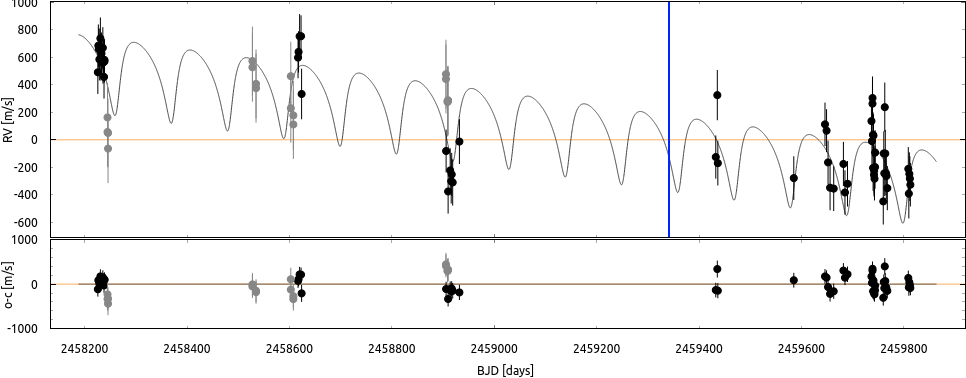
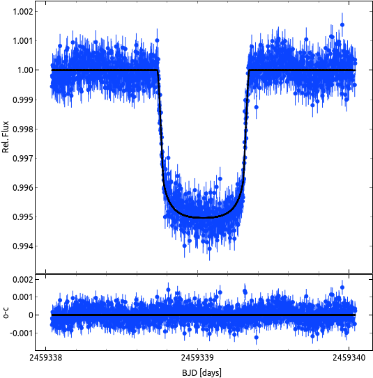

$\newcommand{\ensuremath}{}$
$\newcommand{\xspace}{}$
$\newcommand{\object}[1]{\texttt{#1}}$
$\newcommand{\farcs}{{.}''}$
$\newcommand{\farcm}{{.}'}$
$\newcommand{\arcsec}{''}$
$\newcommand{\arcmin}{'}$
$\newcommand{\ion}[2]{#1#2}$
$\newcommand{\textsc}[1]{\textrm{#1}}$
$\newcommand{\hl}[1]{\textrm{#1}}$
$\newcommand{\todo}[1]{\textcolor{red}{#1}}$

$\newcommand{$\ensuremath$}{}$
$\newcommand{$\xspace$}{}$
$\newcommand{$\object$}[1]{\texttt{#1}}$
$\newcommand{$\farcs$}{{.}''}$
$\newcommand{$\farcm$}{{.}'}$
$\newcommand{$\arcsec$}{''}$
$\newcommand{$\arcmin$}{'}$
$\newcommand{$\ion$}[2]{#1#2}$
$\newcommand{$\textsc$}[1]{\textrm{#1}}$
$\newcommand{$\hl$}[1]{\textrm{#1}}$
$\newcommand{$\todo$}[1]{\textcolor{red}{#1}}$

# Radial Velocity Survey for Planets around Young stars (RVSPY): Based on observations collected at the European Organization for Astronomical Research in the Southern Hemisphere under MPG programs 0101.A-9012, 0103.A-9010, 0104.A-9003, 0107.A-9004, 0108.A-9014, 0109.A-9014 and ESO programs 098.C-0739, 1101.C-0557.

<mark>Appeared on: 2022-11-16</mark> - _10 pages, 9 figures, 5 tables; Accepted for publication in A&A Letters_

<mark><mark>O. Zakhozhay</mark></mark>, et al. -- incl., <mark><mark>R. Launhardt</mark></mark>, <mark><mark>T. Trifonov</mark></mark>, <mark><mark>M. Kürster</mark></mark>, <mark><mark>Th. Henning</mark></mark>

**Abstract:** Aiming to detect planetary companions to young stars with debris disks via the radial velocity method, we observed HD114082 during April 2018 - August 2022 as one of the targets of our RVSPY program (Radial Velocity Survey for Planets around Young stars). We used the FEROS spectrograph, mounted to the MPG/ESO 2.2 m telescope in Chile, to obtain high signal-to-noise spectra and time series of precise radial velocities (RVs). Additionally, we analyzed archival HARPS spectra and TESS photometric data. We used the CERES, CERES++ and SERVAL pipelines to derive RVs and activity indicators and ExoStriker for the independent and combined analysis of the RVs and TESS photometry. We report the discovery of a warm super-Jovian companion around HD114082 based on a 109.8$\pm$0.4 day signal in the combined RV data from FEROS and HARPS, and on one transit event in the TESS photometry. The best-fit model indicates a 8.0$\pm$1.0 Mjup companion with a radius of 1.00$\pm$0.03 Rjup in an orbit with a semi-major axis of 0.51$\pm$0.01 au and an eccentricity of 0.4$\pm$0.04. The companions orbit is in agreement with the known near edge-on debris disk located at about 28 au. HD114082b is possibly the youngest (15$\pm$6 Myr), and one of only three younger than 100 Myr giant planetary companions for which both their mass and radius have been determined observationally. It is probably the first properly model-constraining giant planet that allows distinguishing between hot and cold-start models. It is significantly more compatible with the cold-start model. 

**Figure 7. -** \label{fig:RV}
RV time series data for HD 114082. FEROS data from RVSPY are shown as black circles. The RVs computed from the publicly available HARPS spectra are shown as gray circles. Error bars account for the suspected activity jitter (see text for details). The solid gray line shows the best-fit model (see parameters in Table \ref{tab:plan_pars}), and the vertical blue line indicates the time of the observed transit. The lower panel shows the residuals of the fit.
 (*fig:RV*)

**Figure 8. -** \label{fig:activity_feros}
Time series and GLS of the RVs and activity indicators derived from the FEROS spectra (left and middle panels, respectively). The right panels show the correlation with respect to the FEROS RVs for the derived key activity indicators. The type of activity indicator is given in each of the panels of the middle column. The vertical red line shows the suspected planetary period ($P$ = 109.8 d), from the model with linear trend of the combined RVs (FEROS+HARPS) and photometric (TESS) data.
 (*fig:activity_feros*)

**Figure 3. -** \label{fig:TESS}
Baseline-corrected sector 38 {\it TESS} data (relative flux) for HD 114082 around the transit event with the best-fit model of the transit overlaid (black line). The bottom panel shows the residuals of the fit.
 (*fig:TESS*)

