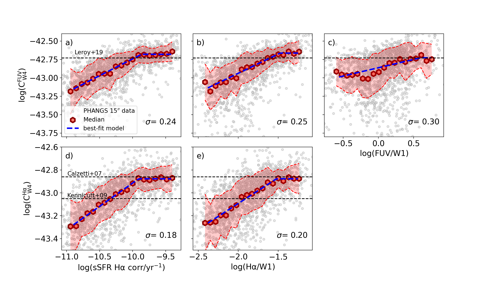
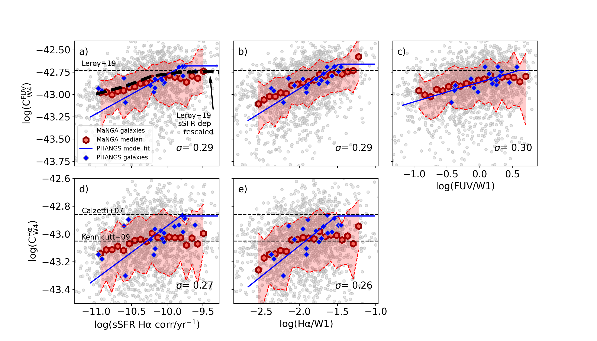
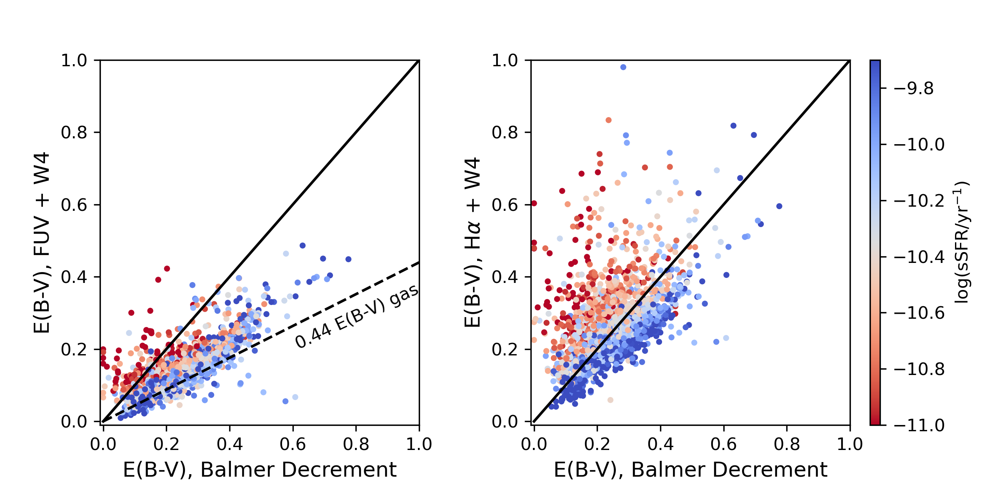

$\newcommand{\ensuremath}{}$
$\newcommand{\xspace}{}$
$\newcommand{\object}[1]{\texttt{#1}}$
$\newcommand{\farcs}{{.}''}$
$\newcommand{\farcm}{{.}'}$
$\newcommand{\arcsec}{''}$
$\newcommand{\arcmin}{'}$
$\newcommand{\ion}[2]{#1#2}$
$\newcommand{\textsc}[1]{\textrm{#1}}$
$\newcommand{\hl}[1]{\textrm{#1}}$
$\newcommand{\comment}[2][alizarin]{{\color{#1}[[{\bf #2}]]}}$
$\newcommand{\ppxf}{pPXF}$
$\newcommand{\oiii}{\textup{[O \textsc{iii}]}}$
$\newcommand{\nii}{\textup{[N \textsc{ii}]}}$
$\newcommand{\sii}{\textup{[S \textsc{ii}]}}$
$\newcommand{\oi}{\textup{[O \textsc{i}]}}$
$\newcommand{\siii}{\textup{[S \textsc{iii}]}}$
$\newcommand{\oii}{\textup{[O \textsc{ii}]}}$
$\newcommand{\hii}{\textup{H} \textsc{ii}}$
$\newcommand{\ha}{\textup{H}\ensuremath{\alpha}}$
$\newcommand{\hb}{\textup{H}\ensuremath{\beta}}$
$\newcommand{\re}{\textup{R}\ensuremath{_\mathrm{e}}}$
$\newcommand{\Te}{\textup{T}\ensuremath{_\mathrm{e}}}$
$\newcommand{\SFR}{\ensuremath{\Sigma_{\mathrm{SFR}}}}$
$\newcommand{\aha}{\ensuremath{A_{\mathrm{ H \alpha}}}}$

$\newcommand{$\ensuremath$}{}$
$\newcommand{$\xspace$}{}$
$\newcommand{$\object$}[1]{\texttt{#1}}$
$\newcommand{$\farcs$}{{.}''}$
$\newcommand{$\farcm$}{{.}'}$
$\newcommand{$\arcsec$}{''}$
$\newcommand{$\arcmin$}{'}$
$\newcommand{$\ion$}[2]{#1#2}$
$\newcommand{$\textsc$}[1]{\textrm{#1}}$
$\newcommand{$\hl$}[1]{\textrm{#1}}$
$\newcommand{$\comment$}[2][alizarin]{{\color{#1}[[{\bf #2}]]}}$
$\newcommand{$\ppxf$}{pPXF}$
$\newcommand{$\oiii$}{\textup{[O $\textsc${iii}]}}$
$\newcommand{$\nii$}{\textup{[N $\textsc${ii}]}}$
$\newcommand{$\sii$}{\textup{[S $\textsc${ii}]}}$
$\newcommand{$\oi$}{\textup{[O $\textsc${i}]}}$
$\newcommand{$\sii$i}{\textup{[S $\textsc${iii}]}}$
$\newcommand{$\oi$i}{\textup{[O $\textsc${ii}]}}$
$\newcommand{$\hii$}{\textup{H} $\textsc${ii}}$
$\newcommand{$\ha$}{\textup{H}$\ensuremath${\alpha}}$
$\newcommand{$\hb$}{\textup{H}$\ensuremath${\beta}}$
$\newcommand{$\re$}{\textup{R}$\ensuremath${_\mathrm{e}}}$
$\newcommand{$\Te$}{\textup{T}$\ensuremath${_\mathrm{e}}}$
$\newcommand{$\SFR$}{$\ensuremath${\Sigma_{\mathrm{SFR}}}}$
$\newcommand{$\aha$}{$\ensuremath${A_{\mathrm{ H \alpha}}}}$

#  maps

<mark>Appeared on: 2022-11-17</mark> - _accepted in A&A_

Francesco Belfiore, et al. -- incl., <mark>Kathryn Kreckel</mark>, <mark>Lukas Neumann</mark>, <mark>Eva Schinnerer</mark>

**Abstract:** Mapping star-formation rates (SFR) within galaxies is key to unveiling their assembly and evolution. Calibrations exist for computing SFR from a combination of ultraviolet andinfrared bands for galaxies as integrated systems, but their applicability to sub-galactic (kpc) scales remains largely untested. Here we use integral field spectroscopy of 19 nearby ($D <$20 Mpc) galaxies obtained by PHANGS--MUSE to derive accurate Balmer decrements (H$\alpha$/H$\beta$) and attenuation-corrected H$\alpha$maps. We combine this information with mid-infrared maps from\textit{WISE}at 22$\rm \mu m$, and ultraviolet maps from\textit{GALEX}in the far-UV band, to derive SFR surface densities in nearby galaxies on resolved (kpc) scales. Using the$\ha$attenuation-corrected SFR as a reference, we find that hybrid recipes from the literature overestimate the SFR in regions of low SFR surface density, low specific star-formation rate (sSFR), low attenuation and old stellar ages. We attribute these trends to heating of the dust by old stellar populations (`IR cirrus'). We calibrate this effect by proposing functional forms for the coefficients in front of the IR term which depend on band ratios sensitive to the sSFR. Such recipes return SFR estimates in agreement with those in the literature at high sSFR ($\rm log(sSFR/yr^{-1}) > -9.9$). Moreover, they lead to negligible bias and$<$0.16 dex scatter when compared to our reference attenuation-corrected SFR from$\ha$. These calibrations prove reliable as a function of physical scale. In particular, they agree within 10\%with the attenuation corrections computed from the Balmer decrement on 100 pc scales. Despite small quantitative differences, our calibrations are also applicable to integrated galaxy scales probed by the MaNGA survey, albeit with a larger scatter (up to 0.22 dex). Observations with\textit{JWST}open up the possibility to calibrate these relations in nearby galaxies with cloud-scale ($\sim$100 pc) resolution mid-IR imaging.

**Figure 6. -** The hybridisation coefficients of W4 with either FUV ($\rm C^{FUV}_{W4}$, Panels a, b, c) or $\ha$($\rm C^{H\alpha}_{W4}$, Panels d, e) as a function of sSFR (left), $L_{\rm H\alpha}/L_{\rm W1}$(middle) and $L_{\rm FUV}/L_{\rm W1}$(right). These coefficients are calibrated to match the SFR obtained from Balmer-decrement-corrected $\ha$ for individual 15$\arcsec$($\sim$ kpc-scale) regions (grey dots). Red hexagons and shaded areas show the median trends and scatter. Median relations are fitted with a broken power law (equation $\re$f{eq:hybrid_ratios}) and the best-fit model is shown as a dashed blue line. The scatter $\sigma$ of the data with respect to the best-fit is presented in the bottom-right. Values of $C_{\rm W4}^{\rm FUV}$ and $C_{\rm W4}^{\rm H\alpha}$ from the literature are shown as black dashed horizontal lines. Our data for kpc-scale regions agree well with the literature values at high sSFR, but show a systematic deviation for lower sSFR which is captured well by the power-law model. (*fig:fig4*)

**Figure 7. -** The hybridization coefficients of W4 with either FUV (Panels a, b, c) or $\ha$(Panels d, e) as a function of sSFR (left), $L_{\rm H\alpha}/L_{\rm W1}$(middle) and $L_{\rm FUV}/L_{\rm W1}$(right) for the MaNGA sample (using galaxy-integrated fluxes). Best-fit relations obtained for the PHANGS 15$\arcsec$ data (Fig. $\re$f{fig:fig4}) are shown in blue. Blue diamonds show the results obtained considering the integrated fluxes from the 19 PHANGS galaxies. Values of $C_{\rm W4}^{\rm FUV}$ and $C_{\rm W4}^{\rm H\alpha}$ from the literature are shown as black dashed horizontal lines and labelled in the figure (see text for additional detail). The scatter $\sigma$ of the data with respect to the best-fit is presented in the bottom-right. The MaNGA data show similar trends as the resolved regions in PHANGS galaxies, even though in general it displays flatter slopes and does not reach the same values of $C$ at the highest sSFR.  (*fig:fig6*)

**Figure 5. -** Comparison between $E(B-V)$ estimated via the Balmer Decrement and the same quantity calculated via FUV+W4 (left) and $\ha$+W4 (right), colour-coded by sSFR. In the left panel we show as a dashed line the ratio between the differential reddening of gas and stars inferred by \cite{Calzetti2000}, $\rm E(B-V)_{stars} = 0.44  E(B-V)_{gas}$. Solid black lines in both panels represent the one-to-one line. In both panels attenuation is overestimated in regions of low sSFR because of IR cirrus. (*fig:fig3*)

