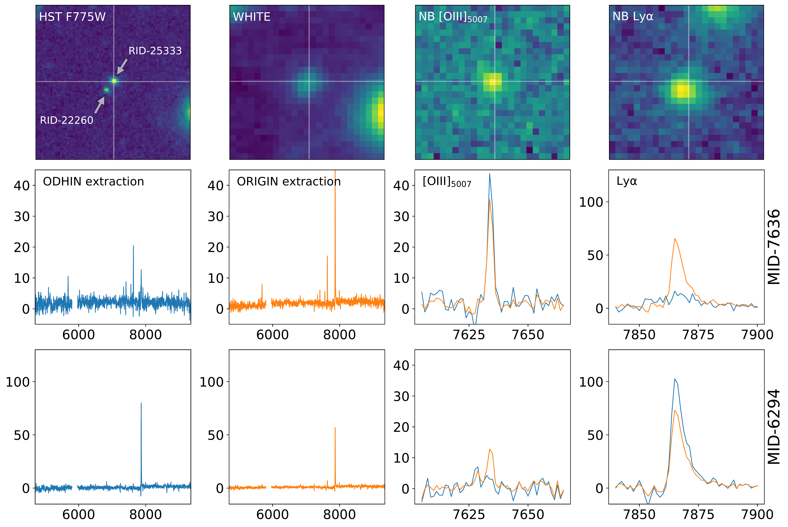
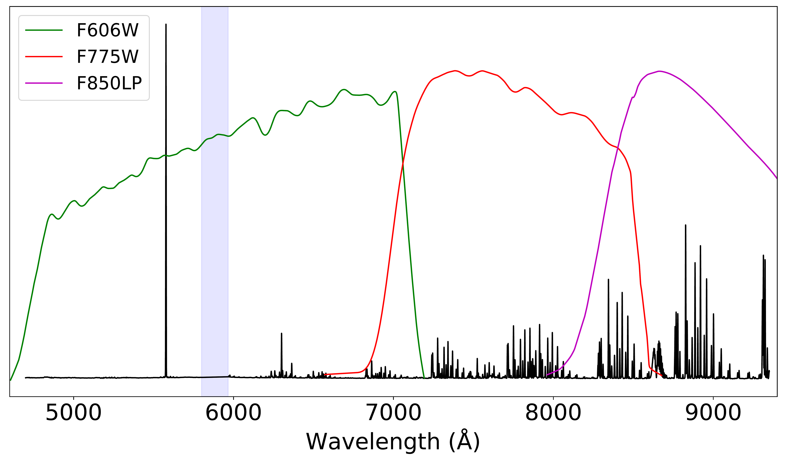

$\newcommand{\ensuremath}{}$
$\newcommand{\xspace}{}$
$\newcommand{\object}[1]{\texttt{#1}}$
$\newcommand{\farcs}{{.}''}$
$\newcommand{\farcm}{{.}'}$
$\newcommand{\arcsec}{''}$
$\newcommand{\arcmin}{'}$
$\newcommand{\ion}[2]{#1#2}$
$\newcommand{\textsc}[1]{\textrm{#1}}$
$\newcommand{\hl}[1]{\textrm{#1}}$
$\newcommand{\argmax}{\operatornamewithlimits{argmax}}$
$\newcommand{\argmin}{\operatornamewithlimits{argmin}}$
$\newcommand{\lae}{\ensuremath{\mathrm{Ly}\alpha} emitter}$
$\newcommand{\laes}{\ensuremath{\mathrm{Ly}\alpha} emitters}$
$\newcommand{\vmpc}{\ensuremath{\mathrm{cMpc^{3}}}}$
$\newcommand{\invmpc}{\ensuremath{\mathrm{cMpc^{-3}}}}$
$\newcommand{\msun}{\ifmmode M_{\odot} \else M_{\odot}\fi}$
$\newcommand{\msunyr}{\ensuremath{\mathrm{M_{\odot} yr^{-1}}}}$
$\newcommand{\kms}{\ensuremath{\mathrm{km s^{-1}}}}$
$\newcommand{\degree}{\ensuremath{^\circ}}$
$\newcommand{\ergslum}{\ensuremath{\mathrm{erg s^{-1}}}}$
$\newcommand{\ergsluma}[1]{\ensuremath{\mathrm{10^{#1} erg s^{-1}}}}$
$\newcommand{\ergslumb}[2]{\ensuremath{\mathrm{{#1} \times 10^{#2}   erg s^{-1}}}}$
$\newcommand{\ergs}{\ensuremath{\mathrm{erg s^{-1} cm^{-2} Å^{-1}}}}$
$\newcommand{\ergsa}[1]{\ensuremath{\mathrm{10^{#1} erg s^{-1} cm^{-2} Å^{-1}}}}$
$\newcommand{\ergsb}[2]{\ensuremath{\mathrm{{#1} \times 10^{#2} erg s^{-1} cm^{-2} Å^{-1}}}}$
$\newcommand{\ergsline}{\ensuremath{\mathrm{erg s^{-1} cm^{-2}}}}$
$\newcommand{\ergslineb}[2]{\ensuremath{\mathrm{#1 \times 10^{#2} erg s^{-1} cm^{-2}}}}$
$\newcommand{\ergslinea}[1]{\ensuremath{\mathrm{10^{#1} erg s^{-1} cm^{-2}}}}$
$\newcommand{\erglinesurf}[2]{\ensuremath{\mathrm{#1 \times 10^{#2} erg s^{-1} cm^{-2} arcsec^{-2}}}}$
$\newcommand{\erglsurf}[1]{\ensuremath{\mathrm{10^{#1} erg s^{-1} cm^{-2} arcsec^{-2}}}}$
$\newcommand{\ergsurfb}{\ensuremath{\mathrm{erg s^{-1} cm^{-2} arcsec^{-2}}}}$
$\newcommand{\ergsurf}{\ensuremath{\mathrm{erg s^{-1} cm^{-2} Å^{-1} arcsec^{-2}}}}$
$\newcommand{\lya}{Ly\textalpha}$
$\newcommand{\ha}{H\textalpha}$
$\newcommand{\hb}{H\textbeta}$
$\newcommand{\hg}{H\textgamma}$
$\newcommand{\hd}{H\textdelta}$
$\newcommand{\oii}{[O {\sc ii}]}$
$\newcommand{\oiid}{[O {\sc ii}]\textlambda\textlambda3726,3729}$
$\newcommand{\oiiid}{[O {\sc iii}]\textlambda4959,5007}$
$\newcommand{\oiiia}{[O {\sc iii}]\textlambda4959}$
$\newcommand{\oiiib}{[O {\sc iii}]\textlambda5007}$
$\newcommand{\ciii}{C {\sc iii}]}$
$\newcommand{\ciiid}{C {\sc iii}]\textlambda\textlambda1907,1909}$
$\newcommand{\civ}{C {\sc iv}}$
$\newcommand{\civd}{C {\sc iv} \textlambda\textlambda1548,1550}$
$\newcommand{\mgii}{Mg {\sc ii}}$
$\newcommand{\mgiid}{Mg {\sc ii} \textlambda\textlambda2797,2803}$
$\newcommand{\heii}{He {\sc ii}}$
$\newcommand{\mosaic}{\textsf{MOSAIC}}$
$\newcommand{\udft}{\textsf{UDF-10}}$
$\newcommand{\mxdf}{\textsf{MXDF}}$
$\newcommand{\drt}{\textsf{DR2}}$
$\newcommand{\dro}{\textsf{DR1}}$
$\newcommand{\origin}{\textsf{ORIGIN}}$
$\newcommand{\odhin}{\textsf{ODHIN}}$
$\newcommand{\nbext}{\textsf{NBEXT}}$
$\newcommand{\pymarz}{\textsf{pyMarZ}}$
$\newcommand{\mpdaf}{\textsf{MPDAF}}$
$\newcommand{\pfit}{\textsf{pyPlatefit}}$
$\newcommand{\sex}{\textsf{SExtractor}}$
$\newcommand{\se}{\textsf{SourceInspector}}$
$\newcommand{\psfrec}{\textsf{muse-psfr}}$
$\newcommand{\prospector}{\textsf{Prospector}}$
$\newcommand{\magphys}{\textsf{Magphys}}$
$\newcommand{\amused}{\textsf{AMUSED}}$
$\newcommand{\hubble}{\textsf{\textit{Hubble}}}$
$\newcommand{\hudf}{\textsf{HUDF}}$
$\newcommand{\uvudf}{\textsf{UVUDF}}$
$\newcommand{\tdhst}{\textsf{3D-HST}}$
$\newcommand{\candels}{\textsf{CANDELS v2}}$
$\newcommand{\astrod}{\textsf{ASTRODEEP}}$
$\newcommand{\ALG@name}{Algorithm}$
$\newcommand{\b0}{\boldsymbol{0}}$
$\newcommand{\ba}{\boldsymbol{a}}$
$\newcommand{\bb}{\boldsymbol{b}}$
$\newcommand{\bd}{\boldsymbol{d}}$
$\newcommand{\bg}{\boldsymbol{g}}$
$\newcommand{\bs}{\boldsymbol{s}}$
$\newcommand{\bt}{\boldsymbol{t}}$
$\newcommand{\bu}{\boldsymbol{u}}$
$\newcommand{\bv}{\boldsymbol{v}}$
$\newcommand{\bx}{\boldsymbol{x}}$
$\newcommand{\by}{\boldsymbol{y}}$
$\newcommand{\bz}{\boldsymbol{z}}$
$\newcommand{\bA}{\boldsymbol{A}}$
$\newcommand{\bB}{\boldsymbol{B}}$
$\newcommand{\bC}{\boldsymbol{C}}$
$\newcommand{\bD}{\boldsymbol{D}}$
$\newcommand{\bE}{\boldsymbol{E}}$
$\newcommand{\bF}{\boldsymbol{F}}$
$\newcommand{\bG}{\boldsymbol{G}}$
$\newcommand{\bH}{\boldsymbol{H}}$
$\newcommand{\bI}{\boldsymbol{I}}$
$\newcommand{\bL}{\boldsymbol{L}}$
$\newcommand{\bM}{\boldsymbol{M}}$
$\newcommand{\bP}{\boldsymbol{P}}$
$\newcommand{\bQ}{\boldsymbol{Q}}$
$\newcommand{\bR}{\boldsymbol{R}}$
$\newcommand{\bS}{\boldsymbol{S}}$
$\newcommand{\bT}{\boldsymbol{T}}$
$\newcommand{\bU}{\boldsymbol{U}}$
$\newcommand{\wbU}{\widetilde{\boldsymbol{U}}}$
$\newcommand{\bV}{\boldsymbol{V}}$
$\newcommand{\bX}{\boldsymbol{X}}$
$\newcommand{\bY}{\boldsymbol{Y}}$
$\newcommand{\bZ}{\boldsymbol{Z}}$
$\newcommand{\beps}{\boldsymbol{\epsilon}}$
$\newcommand{\bSigma}{\boldsymbol{\Sigma}}$
$\newcommand{\bbeta}{\boldsymbol{\beta}}$
$\newcommand{\br}{\boldsymbol{r}}$
$\newcommand{\bw}{\boldsymbol{w}}$
$\newcommand{\bW}{\boldsymbol{W}}$
$\newcommand{\Fm}{F^{-\textrm{min}}}$
$\newcommand{\FM}{F^{\textrm{max}}}$
$\newcommand{\}{mean}$

$\newcommand{\ensuremath}{}$
$\newcommand{\xspace}{}$
$\newcommand{\object}[1]{\texttt{#1}}$
$\newcommand{\farcs}{{.}''}$
$\newcommand{\farcm}{{.}'}$
$\newcommand{\arcsec}{''}$
$\newcommand{\arcmin}{'}$
$\newcommand{\ion}[2]{#1#2}$
$\newcommand{\textsc}[1]{\textrm{#1}}$
$\newcommand{\hl}[1]{\textrm{#1}}$
$\newcommand{\argmax}{\operatornamewithlimits{argmax}}$
$\newcommand{\argmin}{\operatornamewithlimits{argmin}}$
$\newcommand{\lae}{\ensuremath{\mathrm{Ly}\alpha} emitter}$
$\newcommand{\laes}{\ensuremath{\mathrm{Ly}\alpha} emitters}$
$\newcommand{\vmpc}{\ensuremath{\mathrm{cMpc^{3}}}}$
$\newcommand{\invmpc}{\ensuremath{\mathrm{cMpc^{-3}}}}$
$\newcommand{\msun}{\ifmmode M_{\odot} \else M_{\odot}\fi}$
$\newcommand{\msunyr}{\ensuremath{\mathrm{M_{\odot} yr^{-1}}}}$
$\newcommand{\kms}{\ensuremath{\mathrm{km s^{-1}}}}$
$\newcommand{\degree}{\ensuremath{^\circ}}$
$\newcommand{\ergslum}{\ensuremath{\mathrm{erg s^{-1}}}}$
$\newcommand{\ergsluma}[1]{\ensuremath{\mathrm{10^{#1} erg s^{-1}}}}$
$\newcommand{\ergslumb}[2]{\ensuremath{\mathrm{{#1} \times 10^{#2}   erg s^{-1}}}}$
$\newcommand{\ergs}{\ensuremath{\mathrm{erg s^{-1} cm^{-2} Å^{-1}}}}$
$\newcommand{\ergsa}[1]{\ensuremath{\mathrm{10^{#1} erg s^{-1} cm^{-2} Å^{-1}}}}$
$\newcommand{\ergsb}[2]{\ensuremath{\mathrm{{#1} \times 10^{#2} erg s^{-1} cm^{-2} Å^{-1}}}}$
$\newcommand{\ergsline}{\ensuremath{\mathrm{erg s^{-1} cm^{-2}}}}$
$\newcommand{\ergslineb}[2]{\ensuremath{\mathrm{#1 \times 10^{#2} erg s^{-1} cm^{-2}}}}$
$\newcommand{\ergslinea}[1]{\ensuremath{\mathrm{10^{#1} erg s^{-1} cm^{-2}}}}$
$\newcommand{\erglinesurf}[2]{\ensuremath{\mathrm{#1 \times 10^{#2} erg s^{-1} cm^{-2} arcsec^{-2}}}}$
$\newcommand{\erglsurf}[1]{\ensuremath{\mathrm{10^{#1} erg s^{-1} cm^{-2} arcsec^{-2}}}}$
$\newcommand{\ergsurfb}{\ensuremath{\mathrm{erg s^{-1} cm^{-2} arcsec^{-2}}}}$
$\newcommand{\ergsurf}{\ensuremath{\mathrm{erg s^{-1} cm^{-2} Å^{-1} arcsec^{-2}}}}$
$\newcommand{\lya}{Ly\textalpha}$
$\newcommand{\ha}{H\textalpha}$
$\newcommand{\hb}{H\textbeta}$
$\newcommand{\hg}{H\textgamma}$
$\newcommand{\hd}{H\textdelta}$
$\newcommand{\oii}{[O {\sc ii}]}$
$\newcommand{\oiid}{[O {\sc ii}]\textlambda\textlambda3726,3729}$
$\newcommand{\oiiid}{[O {\sc iii}]\textlambda4959,5007}$
$\newcommand{\oiiia}{[O {\sc iii}]\textlambda4959}$
$\newcommand{\oiiib}{[O {\sc iii}]\textlambda5007}$
$\newcommand{\ciii}{C {\sc iii}]}$
$\newcommand{\ciiid}{C {\sc iii}]\textlambda\textlambda1907,1909}$
$\newcommand{\civ}{C {\sc iv}}$
$\newcommand{\civd}{C {\sc iv} \textlambda\textlambda1548,1550}$
$\newcommand{\mgii}{Mg {\sc ii}}$
$\newcommand{\mgiid}{Mg {\sc ii} \textlambda\textlambda2797,2803}$
$\newcommand{\heii}{He {\sc ii}}$
$\newcommand{\mosaic}{\textsf{MOSAIC}}$
$\newcommand{\udft}{\textsf{UDF-10}}$
$\newcommand{\mxdf}{\textsf{MXDF}}$
$\newcommand{\drt}{\textsf{DR2}}$
$\newcommand{\dro}{\textsf{DR1}}$
$\newcommand{\origin}{\textsf{ORIGIN}}$
$\newcommand{\odhin}{\textsf{ODHIN}}$
$\newcommand{\nbext}{\textsf{NBEXT}}$
$\newcommand{\pymarz}{\textsf{pyMarZ}}$
$\newcommand{\mpdaf}{\textsf{MPDAF}}$
$\newcommand{\pfit}{\textsf{pyPlatefit}}$
$\newcommand{\sex}{\textsf{SExtractor}}$
$\newcommand{\se}{\textsf{SourceInspector}}$
$\newcommand{\psfrec}{\textsf{muse-psfr}}$
$\newcommand{\prospector}{\textsf{Prospector}}$
$\newcommand{\magphys}{\textsf{Magphys}}$
$\newcommand{\amused}{\textsf{AMUSED}}$
$\newcommand{\hubble}{\textsf{\textit{Hubble}}}$
$\newcommand{\hudf}{\textsf{HUDF}}$
$\newcommand{\uvudf}{\textsf{UVUDF}}$
$\newcommand{\tdhst}{\textsf{3D-HST}}$
$\newcommand{\candels}{\textsf{CANDELS v2}}$
$\newcommand{\astrod}{\textsf{ASTRODEEP}}$
$\newcommand{\ALG@name}{Algorithm}$
$\newcommand{\b0}{\boldsymbol{0}}$
$\newcommand{\ba}{\boldsymbol{a}}$
$\newcommand{\bb}{\boldsymbol{b}}$
$\newcommand{\bd}{\boldsymbol{d}}$
$\newcommand{\bg}{\boldsymbol{g}}$
$\newcommand{\bs}{\boldsymbol{s}}$
$\newcommand{\bt}{\boldsymbol{t}}$
$\newcommand{\bu}{\boldsymbol{u}}$
$\newcommand{\bv}{\boldsymbol{v}}$
$\newcommand{\bx}{\boldsymbol{x}}$
$\newcommand{\by}{\boldsymbol{y}}$
$\newcommand{\bz}{\boldsymbol{z}}$
$\newcommand{\bA}{\boldsymbol{A}}$
$\newcommand{\bB}{\boldsymbol{B}}$
$\newcommand{\bC}{\boldsymbol{C}}$
$\newcommand{\bD}{\boldsymbol{D}}$
$\newcommand{\bE}{\boldsymbol{E}}$
$\newcommand{\bF}{\boldsymbol{F}}$
$\newcommand{\bG}{\boldsymbol{G}}$
$\newcommand{\bH}{\boldsymbol{H}}$
$\newcommand{\bI}{\boldsymbol{I}}$
$\newcommand{\bL}{\boldsymbol{L}}$
$\newcommand{\bM}{\boldsymbol{M}}$
$\newcommand{\bP}{\boldsymbol{P}}$
$\newcommand{\bQ}{\boldsymbol{Q}}$
$\newcommand{\bR}{\boldsymbol{R}}$
$\newcommand{\bS}{\boldsymbol{S}}$
$\newcommand{\bT}{\boldsymbol{T}}$
$\newcommand{\bU}{\boldsymbol{U}}$
$\newcommand{\wbU}{\widetilde{\boldsymbol{U}}}$
$\newcommand{\bV}{\boldsymbol{V}}$
$\newcommand{\bX}{\boldsymbol{X}}$
$\newcommand{\bY}{\boldsymbol{Y}}$
$\newcommand{\bZ}{\boldsymbol{Z}}$
$\newcommand{\beps}{\boldsymbol{\epsilon}}$
$\newcommand{\bSigma}{\boldsymbol{\Sigma}}$
$\newcommand{\bbeta}{\boldsymbol{\beta}}$
$\newcommand{\br}{\boldsymbol{r}}$
$\newcommand{\bw}{\boldsymbol{w}}$
$\newcommand{\bW}{\boldsymbol{W}}$
$\newcommand{\Fm}{F^{-\textrm{min}}}$
$\newcommand{\FM}{F^{\textrm{max}}}$
$\newcommand{\}{mean}$

# The MUSE _\hubble_ Ultra Deep Field surveys: Data release II\thanks{Based on observations made with ESO telescopes at the La Silla Paranal Observatory under the programs 094.A-0289(B), 095.A-0010(A), 096.A-0045(A), 096.A-0045(B) and 1101.A-0127}

<mark>Appeared on: 2022-11-15</mark> - _46 pages, 48 figures_

Roland Bacon, et al. -- incl., <mark><mark>Leindert Boogaard</mark></mark>, <mark><mark>Yucheng Guo</mark></mark>

**Abstract:** We present the second data release of the MUSE _Hubble_ Ultra-Deep Field surveys, which includes the deepest spectroscopic survey ever performed. The MUSE data, with their 3D content, amazing depth, wide spectral range, and excellent spatial and medium spectral resolution, are rich in information. Their location in the _Hubble_ ultra-deep field area, which benefits from an exquisite collection of ancillary panchromatic information, is a major asset. This update of the first release incorporates a new 141-hour adaptive-optics-assisted MUSE eXtremely Deep Field ( \mxdf ; 1 arcmin diameter field of view) in addition to the reprocessed 10-hour mosaic ( $\rm 3 \times 3   arcmin^2$ ) and the single 31-hour deep field ( $\rm 1 \times 1   arcmin^2$ ). All three data sets were processed and analyzed homogeneously using advanced data reduction and analysis methods. The $3\sigma$ point-source flux limit of an unresolved emission line reaches $\rm 3.1 \times 10^{-19}$ and $\rm 6.3 \times 10^{-20}   \ergsline$ at 10- and 141-hour depths, respectively.We have securely identified and measured the redshift of 2221 sources, an increase of 41 \% compared to the first release. With the exception of eight stars, the collected sample consists of 25 nearby galaxies ( $z < 0.25$ ), 677 \oii emitters ( $z=0.25-1.5$ ), 201 galaxies in the MUSE  redshift desert range ( $z=1.5-2.8$ ), and 1308 \laes ( $z=2.8-6.7$ ).This represents an order of magnitude more redshifts than the collection of all spectroscopic redshifts obtained before MUSE in the _Hubble_ ultra-deep field area (i.e., 2221 versus 292). At high redshift ( $z > 3$ ), the difference is even more striking, with a factor of 65 increase (1308 versus 20).We compared the measured redshifts against three published photometric redshift catalogs and find the photo-z accuracy  to be lower than the constraints provided by photo-z fitting codes.Eighty percent of the galaxies in our final catalog have an HST counterpart. These galaxies are on average faint, with a median AB F775W magnitude of 25.7 and 28.7 for the \oii and \lya emitters, respectively. Fits of their spectral energy distribution show that these galaxies tend to be low-mass star-forming galaxies, with a median stellar mass of $\rm 6.2 \times 10^8   M_\odot$ and a median star-formation rate of $\rm 0.4   M_\odot yr^{-1}$ .We measured the completeness of our catalog with respect to HST and found that, in the deepest 141-hour  area, 50 \% completeness is achieved for an AB magnitude of 27.6 and 28.7 (F775W) at $z=0.8-1.6$ and $z=3.2-4.5$ , respectively.Twenty percent of our catalog, or 424 galaxies, have no HST counterpart. The vast majority of these new sources are high equivalent-width $z>2.8$ \laes that are detected by MUSE thanks to their bright and asymmetric broad \lya line.We release advanced data products, specific software, and a web interface to select and download data sets.

**Figure 15. -** Example of $\odhin$ de-blending of two close sources MID-7636 (RID-25333), a $z=0.5$ star forming galaxy, and MID-6294 (RID-22260), a $z=5.5$\lae. The separation of the sources is 0.4 arcsec. The top row of panels shows, from left to right: the HST F775W, MUSE white-light, [OIII]5007Å and $\lya$ narrow band images ($\rm 5 \times 5   arcsec^2$ size). The central and bottom panels display the spectra derived from $\odhin$(in blue) and $\origin$ extraction (in orange) for each source. Fluxes and observed wavelengths are expressed in units of $\ergs$a{-20} and Å, respectively. (*fig:deblend_example*)

**Figure 1. -** MUSE spectral range. The typical sky spectrum (shown in black) is observed in one 25 min observing block. The blue shaded wavelength region shows the location of the sodium notch filter used in MUSE GLAO mode. The response curves of the HST ACS filters F606W, F775W, and F850LP are also indicated.
 (*fig:specrange*)

**Figure 10. -** Schematic of the processes involved in the data release production.
 (*fig:process*)

