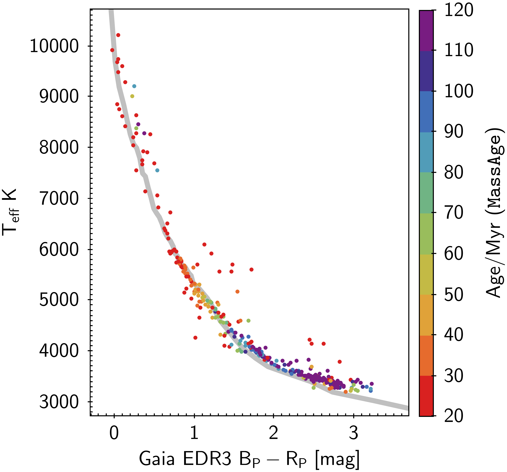
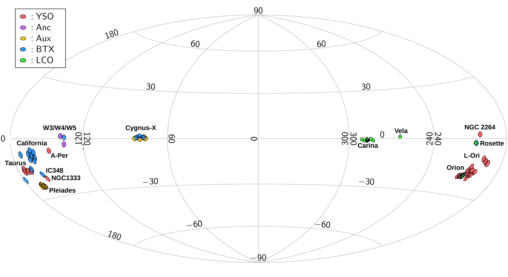

$\newcommand{\ensuremath}{}$
$\newcommand{\xspace}{}$
$\newcommand{\object}[1]{\texttt{#1}}$
$\newcommand{\farcs}{{.}''}$
$\newcommand{\farcm}{{.}'}$
$\newcommand{\arcsec}{''}$
$\newcommand{\arcmin}{'}$
$\newcommand{\ion}[2]{#1#2}$
$\newcommand{\textsc}[1]{\textrm{#1}}$
$\newcommand{\hl}[1]{\textrm{#1}}$
$\newcommand{\vdag}{(v)^\dagger}$
$\newcommand$
$\newcommand$
$\newcommand$
$\newcommand$
$\newcommand$
$\newcommand$
$\newcommand$
$\newcommand$
$\newcommand$

$\newcommand{$\ensuremath$}{}$
$\newcommand{$\xspace$}{}$
$\newcommand{$\object$}[1]{\texttt{#1}}$
$\newcommand{$\farcs$}{{.}''}$
$\newcommand{$\farcm$}{{.}'}$
$\newcommand{$\arcsec$}{''}$
$\newcommand{$\arcmin$}{'}$
$\newcommand{$\ion$}[2]{#1#2}$
$\newcommand{$\textsc$}[1]{\textrm{#1}}$
$\newcommand{$\hl$}[1]{\textrm{#1}}$
$\newcommand{$\vdag$}{(v)^\dagger}$
$\newcommand$
$\newcommand$
$\newcommand$
$\newcommand$
$\newcommand$
$\newcommand$
$\newcommand$
$\newcommand$
$\newcommand$

# Based on SDSS Data Releases 16 and 17

<mark>Appeared on: 2022-11-18</mark> - _6 figures, 4 tables_

Carlos G. Rom\'an-Z\'u\~niga, et al. -- incl., <mark>Jes\'us Hern\'andez</mark>, <mark>D. A. Garc\'ia-Hern\'andez</mark>

**Abstract:** The Sloan Digital Sky Survey IV (SDSS-IV) APOGEE-2 primary science goal was to observe red giant stars throughout the Galaxy to study its dynamics, morphology, and chemical evolution. The APOGEE instrument, a high- resolution 300 fiber H-band (1.55-1.71 micron) spectrograph, is also ideal to study other stellar populations in the Galaxy, among which are a number of star forming regions and young open clusters. We present the results of the determination of six stellar properties (\teff,\logg,[Fe/H],$\mathrm{L/L_\odot, M/M_\odot, and  age}$) for a sample that is composed of 3360  young stars, of sub-solar to super-solar types, in sixteen Galactic star formation and young open cluster regions. Those sources were selected by using a clustering method that removes most of the field contamination. Samples were also refined by removing targets affected by various systematic effects of the parameter determination. The final samples are presented in a comprehensive catalog that includes all six estimated parameters. This overview study also includes parameter spatial distribution maps for all regions and Hertzprung-Russell ($\mathrm{\log{L/L_\odot}}$versus\teff) diagrams. This study serves as a guide for detailed studies on individual regions, and paves the way for the future studies on the global properties of stars in the pre-main sequence phase of stellar evolution using more robust samples.

**Figure 1. -** Effective temperature vs. Gaia EDR3 colors for the APOGEE Pleiades sample. The symbol colors represent age estimates from \texttt{MassAge}. The solid line is the empirical sequence from \citet{Esplin18}. \label{fig:pleidisc} (*fig:pleidisc*)

**Figure 2. -** A map, in Galactic coordinates, showing the locations of all the fields listed in Table \ref{tab:yso_sample}, along with labels identifying the eighteen main regions reported in this study. Each circular field is projected with a realistic radius of 1.5 or 1.0 deg for regions observed with the North or South APOGEE instruments, respectively. The colors of the fields refer to the field-subprograms described in Section \ref{sec:observations}. \label{fig:bigmap} (*fig:bigmap*)

**Figure 3. -** APOGEE-2 Cygnus-X Complex Fields are shown, delimited with circles; red circles indicate the main region fields, and the dotted blue circles indicate "auxiliary" fields (see Appendix \ref{App:sub-programs}) also searched for candidate members. Color dot symbols indicate the positions of all scientific targets.
The grayscale image in the background shows a 12 $\mu$m dust emission map from the
WISE WSSA Atlas \citep{WSSA14}. The colorbar indicates values of the signal-to-noise ratio after visit combination. The component figures (51) for all the regions studied in this paper, are available online in the Figure Set \ref{FS1}, which also include maps highlighting H mag brightness and Number of Visits.
\label{fig:posmap} (*fig:posmap*)

