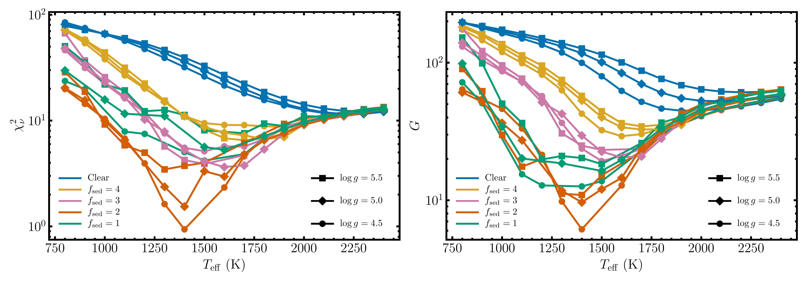
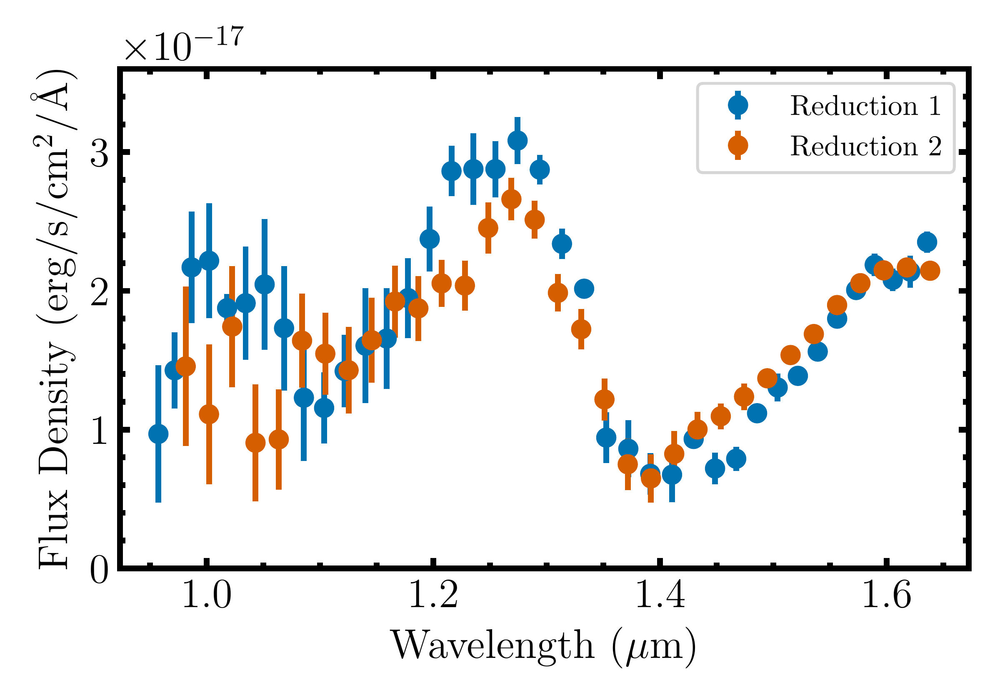
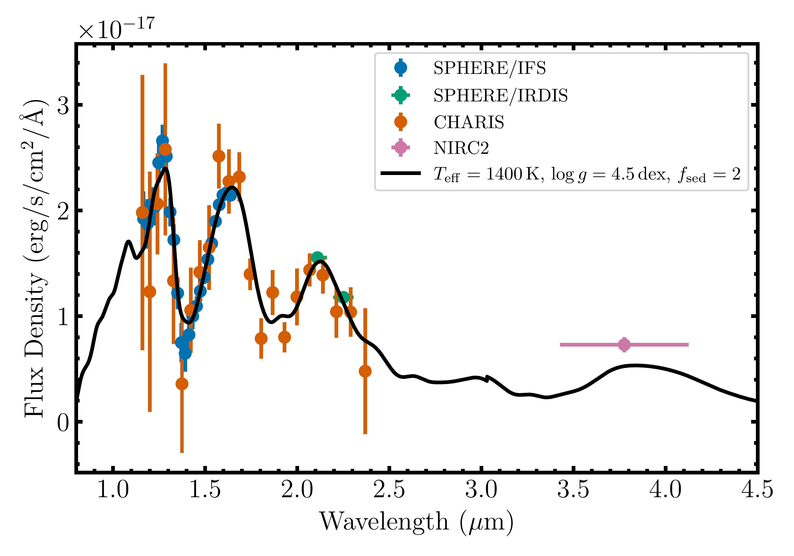

$\newcommand{\ensuremath}{}$
$\newcommand{\xspace}{}$
$\newcommand{\object}[1]{\texttt{#1}}$
$\newcommand{\farcs}{{.}''}$
$\newcommand{\farcm}{{.}'}$
$\newcommand{\arcsec}{''}$
$\newcommand{\arcmin}{'}$
$\newcommand{\ion}[2]{#1#2}$
$\newcommand{\textsc}[1]{\textrm{#1}}$
$\newcommand{\hl}[1]{\textrm{#1}}$
$\newcommand{\vdag}{(v)^\dagger}$
$\newcommand$
$\newcommand$

$\newcommand{$\ensuremath$}{}$
$\newcommand{$\xspace$}{}$
$\newcommand{$\object$}[1]{\texttt{#1}}$
$\newcommand{$\farcs$}{{.}''}$
$\newcommand{$\farcm$}{{.}'}$
$\newcommand{$\arcsec$}{''}$
$\newcommand{$\arcmin$}{'}$
$\newcommand{$\ion$}[2]{#1#2}$
$\newcommand{$\textsc$}[1]{\textrm{#1}}$
$\newcommand{$\hl$}[1]{\textrm{#1}}$
$\newcommand{$\vdag$}{(v)^\dagger}$
$\newcommand$
$\newcommand$

# Based in part on data collected at Subaru Telescope, which is operated by the National Astronomical Observatory of Japan.

<mark>Appeared on: 2022-11-21</mark> - _40 pages, 19 figures, accepted to AJ_

Kyle Franson, et al. -- incl., <mark>Matthias Samland</mark>, <mark>Zhoujian Zhang</mark>, <mark>Kevin Heng</mark>

**Abstract:** Benchmark brown dwarf companions with well-determined ages and model-independent masses are powerful tools to test substellar evolutionary models and probe the formation of giant planets and brown dwarfs. Here, we report the independent discovery of HIP 21152 B, the first imaged brown dwarf companion in the Hyades, and conduct a comprehensive orbital and atmospheric characterization of the system. HIP 21152 was targeted in an ongoing high-contrast imaging campaign of stars exhibiting proper motion changes between Hipparcos and Gaia, and was also recently identified by\citet{bonavitaResultsCopainsPilot_2022}and\citet{kuzuharaDirectImagingDiscovery_2022}. Our Keck/NIRC2 and SCExAO/CHARIS imaging of HIP 21152 revealed a comoving companion at a separation of$0$\farcs$37$(16 au). We perform a joint orbit fit of all available relative astrometry and radial velocities together with the Hipparcos-Gaia proper motions, yielding a dynamical mass of$24^{+6}_{-4} \mathrm{M_{Jup}}$, which is$1{-}2{\sigma}$lower than evolutionary model predictions. Hybrid grids that include the evolution of cloud properties best reproduce the dynamical mass. We also identify a comoving wide-separation ($1837$\arcsec$$or$\SI{7.9e4}{au}$) early-L dwarf with an inferred mass near the hydrogen-burning limit. Finally, we analyze the spectra and photometry of HIP 21152 B using the\citet{saumonEvolutionDwarfsColor_2008}atmospheric models and a suite of retrievals. The best-fit grid-based models have$f_{\mathrm{sed}}=2$, indicating the presence of clouds,$T_{\mathrm{eff}}=\SI{1400}{K}$, and$\log{g}=\SI{4.5}{dex}$. These results are consistent with the object's spectral type of$\mathrm{T0\pm1}$. As the first benchmark brown dwarf companion in the Hyades, HIP 21152 B joins the small but growing number of substellar companions with well-determined ages and dynamical masses.

**Figure 15. -** Reduced chi-square ($\chi^2_\nu$; left) and goodness-of-fit ($G$; right) values for model spectra from \citet{saumonEvolutionDwarfsColor_2008} compared with HIP 21152 B's spectra and photometry. Lower values of $\chi^2_\nu$ or $G$ signify a better fit to the data. Colors indicate different values of $f_{\mathrm{sed}}$, while symbols correspond to different values of $\log g$. Reduction 2 is used for the SPHERE/IFS spectrum. The two metrics yield the same best-fitting spectrum, with $T_{\mathrm{eff}} = \SI{1400}{K}$, $\log g = 4.5$, and $f_{\mathrm{sed}} = 2$.
    \label{fig:model_spec_comp} (*fig:model_spec_comp*)

**Figure 2. -** Comparison between two independent reductions of the SPHERE/IFS data. Reduction 1 uses the DRH pipeline complemented with additional steps described in \citet{langloisSphereInfraredSurvey_2021} and the SpeCal software to extract spectral cubes from the raw data, subtract the host star PSF, and obtain the companion's spectrum. Reduction 2 uses a modified version of the CHARIS pipeline and the TRAP post-processing pipeline to measure the companion's spectrum from the raw data. These two independent reductions produce similar results for $\lambda \gtrsim \SI{1.15}{\mu m}$. Reduction 2 tends to yield lower values for the companion flux blueward of $\SI{1.15}{\mu m}$ than Reduction 1. Due to this discrepancy, we exclude points with $\lambda < \SI{1.15}{\mu m}$ from this analysis. \label{fig:spec_comp} (*fig:spec_comp*)

**Figure 5. -** Spectra and photometry of HIP 21152 B compared with the best-fitting \citet{saumonEvolutionDwarfsColor_2008} model spectrum (black). The model represents $T_{\mathrm{eff}} = \SI{1400}{K}$, $\log{g} = \SI{4.5}{dex}$, and $f_{\mathrm{sed}} = 2$, and has been smoothed to a resolving power of $R=25$. Reduction 2 is used for the SPHERE/IFS spectrum. The atmospheric model reproduces the companion's spectra well, although we find a slight excess in $L^\prime$ that might hint at disequilibrium chemistry from 3--\SI{4}{\mu m}.
    \label{fig:spectrum_model_plot} (*fig:spectrum_model_plot*)

