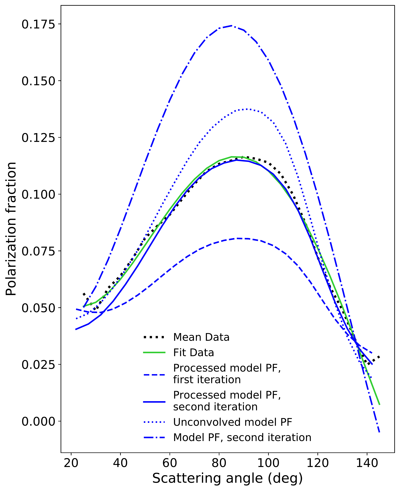
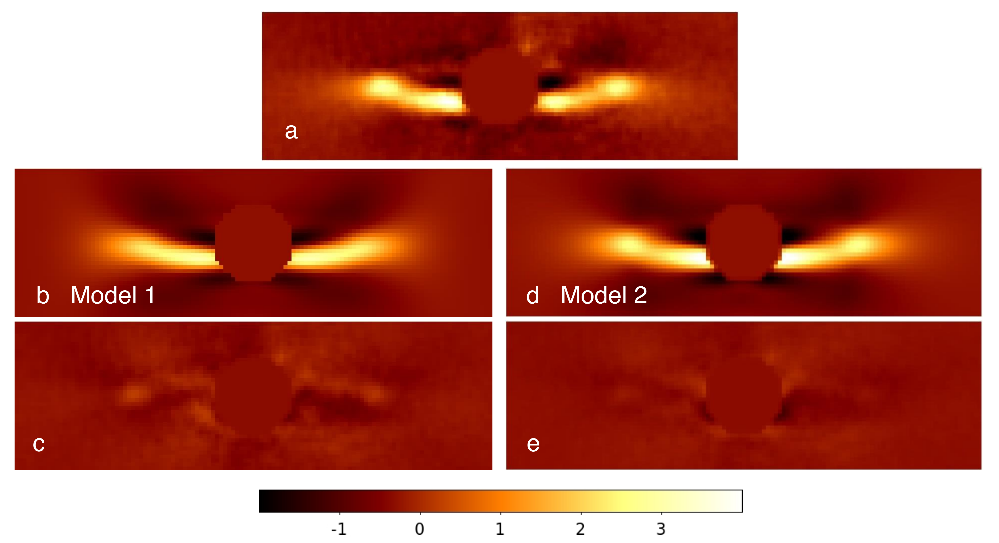

$\newcommand{\ensuremath}{}$
$\newcommand{\xspace}{}$
$\newcommand{\object}[1]{\texttt{#1}}$
$\newcommand{\farcs}{{.}''}$
$\newcommand{\farcm}{{.}'}$
$\newcommand{\arcsec}{''}$
$\newcommand{\arcmin}{'}$
$\newcommand{\ion}[2]{#1#2}$
$\newcommand{\textsc}[1]{\textrm{#1}}$
$\newcommand{\hl}[1]{\textrm{#1}}$
$\newcommand{\tabularnewline}{\\}$
$\newcommand{\Mearth}{M_{\oplus}}$
$\newcommand{\Mjup}{M_{\text{Jup}}}$
$\newcommand{\Msun}{M_{\odot}}$
$\newcommand$
$\newcommand$
$\newcommand{\micron}{\unit{\micro\meter}}$
$\newcommand{\JM}[1]{\textcolor{blue}{ #1}}$
$\newcommand{\arraystretch}{1.3}$
$\newcommand{\thefigure}{E.\arabic{figure} (Cont.)}$

$\newcommand{$\ensuremath$}{}$
$\newcommand{$\xspace$}{}$
$\newcommand{$\object$}[1]{\texttt{#1}}$
$\newcommand{$\farcs$}{{.}''}$
$\newcommand{$\farcm$}{{.}'}$
$\newcommand{$\arcsec$}{''}$
$\newcommand{$\arcmin$}{'}$
$\newcommand{$\ion$}[2]{#1#2}$
$\newcommand{$\textsc$}[1]{\textrm{#1}}$
$\newcommand{$\hl$}[1]{\textrm{#1}}$
$\newcommand{$\tabularnewline$}{\\}$
$\newcommand{$\Mearth$}{M_{\oplus}}$
$\newcommand{$\Mjup$}{M_{\text{Jup}}}$
$\newcommand{$\Msun$}{M_{\odot}}$
$\newcommand$
$\newcommand$
$\newcommand{$\micron$}{\unit{\micro\meter}}$
$\newcommand{$\JM$}[1]{\textcolor{blue}{ #1}}$
$\newcommand{$\arraystretch$}{1.3}$
$\newcommand{$\thefigure$}{E.\arabic{figure} (Cont.)}$

# Based on data collected at the European Southern Observatory (ESO), Chile under programs 096.C-0388, 098.C-0505 and 198.C-0209.: Constraints from VLT/SPHERE and TESS

<mark>Appeared on: 2022-11-23</mark> - _27 pages_

N. Engler, et al. -- incl., <mark>J. Olofsson</mark>, <mark>M. Feldt</mark>, <mark>M. Langlois</mark>, <mark>M.R. Meyer</mark>

**Abstract:** We present new optical and near-IR images of debris disk around the F-type star HD 114082. We obtained direct imaging observations and analysed the TESS photometric time series data of this target with a goal to search for planetary companions and to characterise the morphology of the debris disk and the scattering properties of dust particles. HD 114082 was observed with the VLT/SPHERE instrument: the IRDIS camera in the K band together with the IFS in the Y, J and H band using the ADI technique as well as IRDIS in the H band and ZIMPOL in the I_PRIME band using the PDI technique. The scattered light images were fitted with a 3D model for single scattering in an optically thin dust disk. We performed aperture photometry in order to derive the scattering and polarized phase functions, polarization fraction and spectral scattering albedo for the dust particles in the disk. This method was also used to obtain the reflectance spectrum of the disk to retrieve the disk color and study the dust reflectivity in comparison to the debris disk HD 117214. We also performed the modeling of the HD 114082 light curve measured by TESS using the models for planet transit and stellar activity to put constraints on radius of the detected planet and its orbit. The debris disk appears as an axisymmetric debris belt with a radius of ~0.37$''$ (35 au), inclination of ~83$^\circ$ and a wide inner cavity. Dust particles in HD 114082 have a maximum polarization fraction of ~17% and a high reflectivity which results in a spectral scattering albedo of 0.65. The analysis of TESS photometric data reveals a transiting planetary companion to HD 114082 with a radius of $\sim$1~$\rm R_{J}$ on an orbit with a semi-major axis of $0.7 \pm 0.4$ au. In the IRDIS K band images, we reach deep sensitivity limits in terms of companion masses, down to ~5$M_{\rm Jup}$ at 50 au, and ~11 $M_{\rm Jup}$ at 20 au from the central star. 

**Figure 20. -** Polarized intensity images of the $\object${HD 114082} debris disk. The $Q_\varphi$ images are shown on the left panels and $U_\varphi$ images on the right panels. IRDIS data taken in the H band are displayed in the top row. ZIMPOL data recorded with the I\_PRIME filter are shown in the bottom row. In the IRDIS $Q_\varphi$ image, a strong residual signal at the coronagraph edge is masked out for clarity of the picture. The positions of the star are marked by yellow crosses. All images are smoothed via a Gaussian kernel with $\sigma_{\rm kernel}=1$ pixel and shown in the same spatial scale indicated in the top left image. The color bar shows the flux values in cts/s. (*f_QphiUphi_IRDIS*)

**Figure 4. -** Polarization fraction of scattered light in debris disk HD 114082. The black dotted line shows a mean value of PF derived for the west and east disk sides. The green line shows a polynomial fit to it.  \label{f_pol_frac} (*f_pol_frac*)

**Figure 21. -** Comparison of the total intensity image ({\it panel a}) with the forward models of scattered light with a single HG function ({\it panel b}) and a  two-component HG function ({\it panel d}). {\it Panels c} and {\it e}: Residual images obtained after subtracting the forward model images from the total intensity image. The color bar shows the flux values in cts/s.  \label{f_model} (*f_model*)

