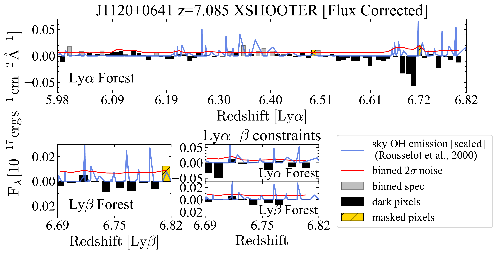
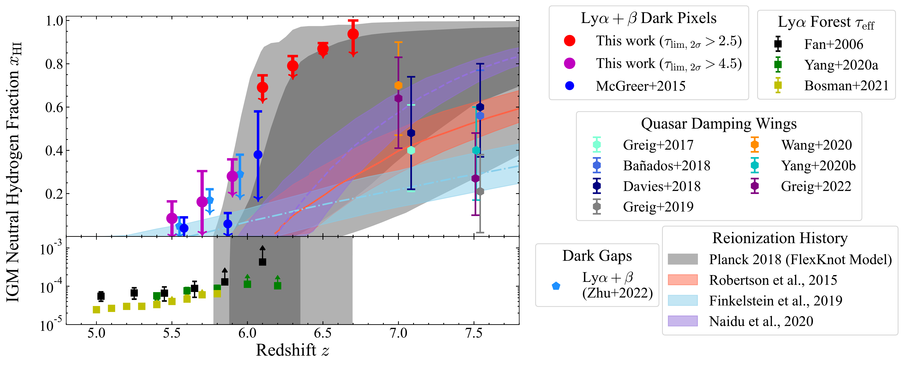
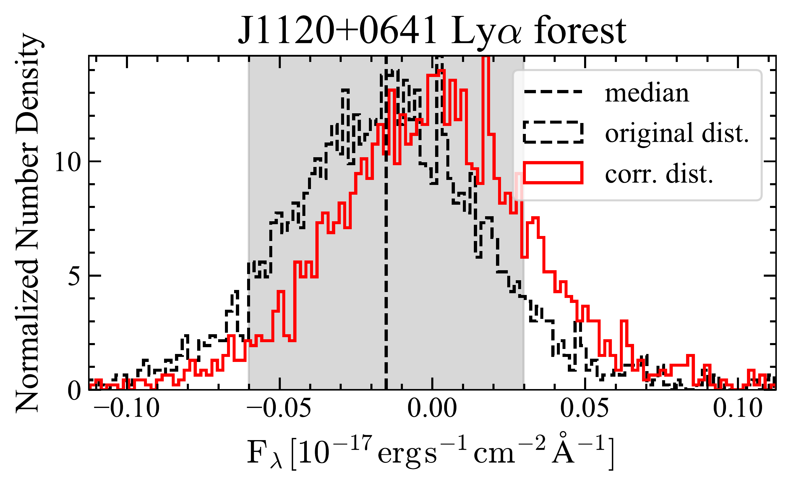

$\newcommand{\ensuremath}{}$
$\newcommand{\xspace}{}$
$\newcommand{\object}[1]{\texttt{#1}}$
$\newcommand{\farcs}{{.}''}$
$\newcommand{\farcm}{{.}'}$
$\newcommand{\arcsec}{''}$
$\newcommand{\arcmin}{'}$
$\newcommand{\ion}[2]{#1#2}$
$\newcommand{\textsc}[1]{\textrm{#1}}$
$\newcommand{\hl}[1]{\textrm{#1}}$
$\newcommand{\vdag}{(v)^\dagger}$
$\newcommand$
$\newcommand$

$\newcommand{\ensuremath}{}$
$\newcommand{\xspace}{}$
$\newcommand{\object}[1]{\texttt{#1}}$
$\newcommand{\farcs}{{.}''}$
$\newcommand{\farcm}{{.}'}$
$\newcommand{\arcsec}{''}$
$\newcommand{\arcmin}{'}$
$\newcommand{\ion}[2]{#1#2}$
$\newcommand{\textsc}[1]{\textrm{#1}}$
$\newcommand{\hl}[1]{\textrm{#1}}$
$\newcommand{\vdag}{(v)^\dagger}$
$\newcommand$
$\newcommand$

# (Nearly) Model-Independent Constraints on the Neutral Hydrogen Fraction in the Intergalactic Medium at $z\sim 5 - 7$ Using Dark Pixel Fractions in Ly$\alpha$ and Ly$\beta$ Forests

<mark>Appeared on: 2022-11-22</mark> - _13 pages, 6 figures, 2 tables, accepted for publication in ApJ_

Xiangyu Jin, et al. -- incl., <mark>Frederick B. Davies</mark>, <mark>Fabian Walter</mark>

**Abstract:** Cosmic reionization was the last major phase transition of hydrogen from neutral to highly ionized in the intergalactic medium (IGM). Current observations show that the IGM is significantly neutral at $z>7$ , and largely ionized by $z\sim5.5$ . However, most methods to measure the IGM neutral fraction are highly model-dependent, and are limited to when the volume-averaged neutral fraction of the IGM is either relatively low ( $\overline{x}_{\rm HI} \lesssim 10^{-3}$ ) or close to unity ( $\overline{x}_{\rm HI}\sim 1$ ). In particular, the neutral fraction evolution of the IGM at the critical redshift range of $z=6-7$ is poorly constrained. We present new constraints on $\overline{x}_{\rm HI}$ at $z\sim5.1-6.8$ , by analyzing deep optical spectra of $53$ quasars at $5.73<z<7.09$ .We derive model-independent upper limits on the neutral hydrogen fraction based on the fraction of “dark” pixels identified in the Lyman $\alpha$ (Ly $\alpha$ ) and Lyman $\beta$ (Ly $\beta$ ) forests, without any assumptions on the IGM model or the intrinsic shape of the quasar continuum. They are the first model-independent constraints on the IGM neutral hydrogen fraction at $z\sim6.2-6.8$ using quasar absorption measurements. Our results give upper limits of $\overline{x}_{\rm HI}(z=6.3) < 0.79\pm0.04$ (1 $\sigma$ ), $\overline{x}_{\rm HI} (z=6.5) < 0.87\pm0.03$ (1 $\sigma$ ), and $\overline{x}_{\rm HI} (z=6.7) < 0.94^{+0.06}_{-0.09}$ (1 $\sigma$ ). The dark pixel fractions at $z>6.1$ are consistent with the redshift evolution of the neutral fraction of the IGM derived from the Planck 2018.

**Figure 2. -** J1120+0641 binned spectrum in the Ly$\alpha$ forests (upper panel), Ly$\beta$ forests (lower left panel), and the redshift overlapping regions in Ly$\alpha$ and Ly$\beta$ forests (lower middle panel). The size of each binned pixel is $3.3 $cMpc. The binned $2\sigma$ spectral uncertainty is shown as the red line. The binned flux density is presented in bars, and identified "dark" pixels are shown in black. The sky OH emission is shown by the blue line \citep{Rousselot2000AA}, and our spectral binning method effectively puts the majority of pixels between sky OH emission lines. Yellow hatched pixels are manually masked during our analysis, as those fluxes are plausibly from residual sky OH emission. The zero flux level is corrected by the $2\sigma$ clipping median of all pixels in the Ly$\alpha$ forest (i. e., the vertical dashed line shown in Figure \ref{fig:1120_flux_distribution}).
     (*fig:binned_spec_correction*)

**Figure 4. -** Constraints on the IGM neutral hydrogen fraction $\overline{x}_{\rm HI}$ from high-$z$ quasars studies and Planck 2018 results. The upper limits on $\overline{x}_{\rm HI}$ from dark pixels are in red (this work, derived from flux-corrected $\tau^{\alpha}_{\rm lim,2\sigma}>2.5$ pixels at $z>6$), magenta (this work, derived from flux-corrected $\tau^{\alpha}_{\rm lim,2\sigma}>4.5$ pixels at $z<6$), and blue \citep{McGreer2015MNRAS}. Constraints on $\overline{x}_{\rm HI}$ derived from Ly$\alpha$ effective optical depth are shown by black squares \citep{Fan2006AJ}, green squares \citep{Yang2020ApJb}, and yellow squares \citep{Bosman2021MNRAS}. The upper limits on $\overline{x}_{\rm HI}$, inferred from long dark gap length distributions in Ly$\alpha$ and Ly$\beta$ forests, are shown in blue pentagons \citep{Zhu2022ApJ}. At $z>7$, individual measurements on the neutral hydrogen fraction from quasar damping wings are denoted by hexagons \citep{Greig2017MNRAS,Banados2018Natur,Davies2018ApJ,Greig2019MNRAS,Wang2020ApJ,Yang2020ApJa}. The $1\sigma$ and $2\sigma$ reionization history derived from Planck 2018 results by assuming the FlexKnot model are denoted by the dark grey shaded region and the light grey shaded region \citep{Planck2020AA}. The colored regions display $1\sigma$ reionization histories in \citealt[][]{Robertson2015ApJ}(red), \citealt{Finkelstein2019ApJ}(blue), and \citealt{Naidu2020ApJ}(purple). (*fig:nhi_other_constraints*)

**Figure 6. -** To correct "zero" flux level in VLT/X-Shooter spectra, we apply the median flux derived from sigma clipped pixels to the VLT/X-Shooter spectra. The original flux distribution of pixels in the Ly$\alpha$ forest from the J1120+0641 VLT/X-Shooter spectrum is shown by the black histogram. The median derived from the sigma clipping is denoted by the vertical black dashed line, and the 2$\sigma$ range from sigma clipping is in the grey shaded region. The flux distribution corrected by the sigma-clipped median is shown by the red histogram. (*fig:1120_flux_distribution*)

