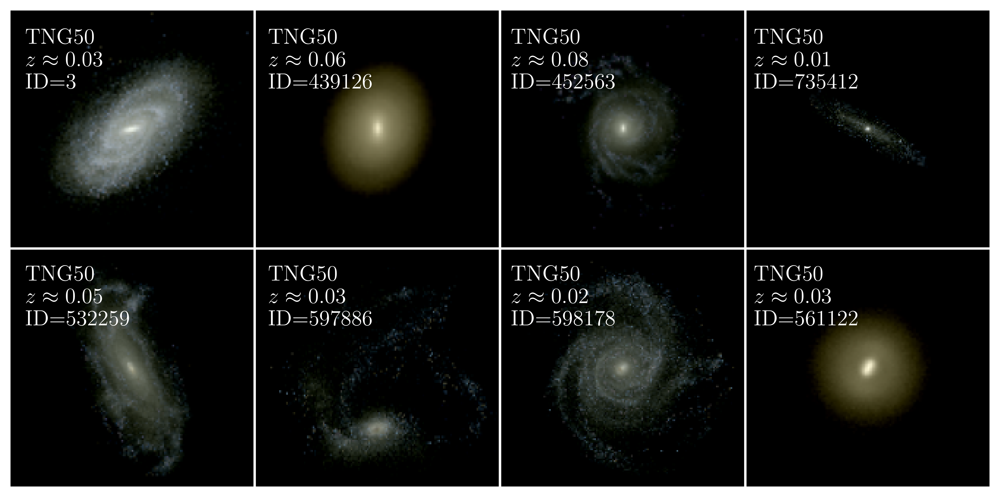
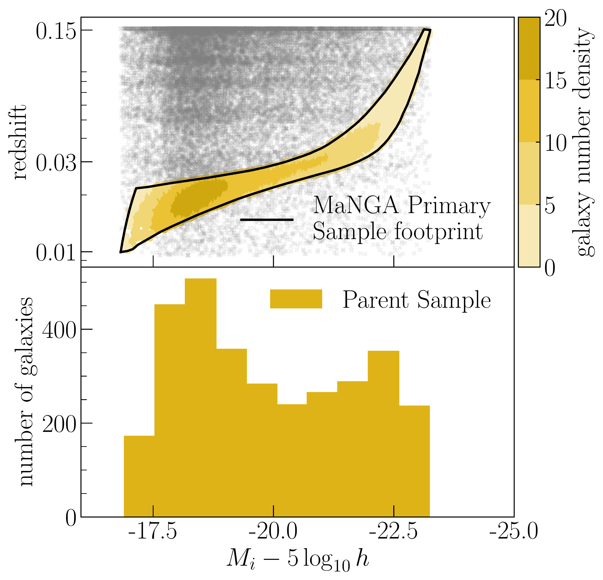
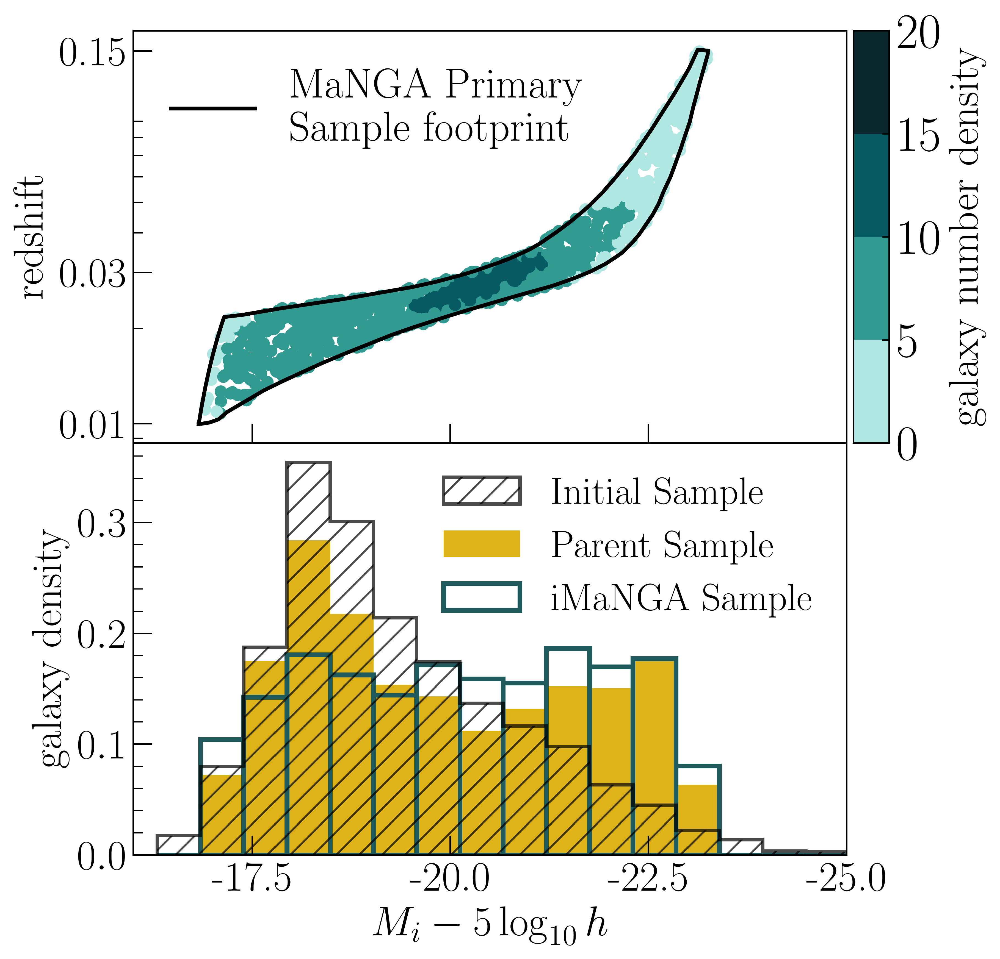

$\newcommand{\ensuremath}{}$
$\newcommand{\xspace}{}$
$\newcommand{\object}[1]{\texttt{#1}}$
$\newcommand{\farcs}{{.}''}$
$\newcommand{\farcm}{{.}'}$
$\newcommand{\arcsec}{''}$
$\newcommand{\arcmin}{'}$
$\newcommand{\ion}[2]{#1#2}$
$\newcommand{\textsc}[1]{\textrm{#1}}$
$\newcommand{\hl}[1]{\textrm{#1}}$
$\newcommand{\thebibliography}{\DeclareRobustCommand{\VAN}[3]{##3}\VANthebibliography}$

$\newcommand{$\ensuremath$}{}$
$\newcommand{$\xspace$}{}$
$\newcommand{$\object$}[1]{\texttt{#1}}$
$\newcommand{$\farcs$}{{.}''}$
$\newcommand{$\farcm$}{{.}'}$
$\newcommand{$\arcsec$}{''}$
$\newcommand{$\arcmin$}{'}$
$\newcommand{$\ion$}[2]{#1#2}$
$\newcommand{$\textsc$}[1]{\textrm{#1}}$
$\newcommand{$\hl$}[1]{\textrm{#1}}$
$\newcommand{$\thebibliography$}{\DeclareRobustCommand{\VAN}[3]{##3}\VANthebibliography}$

# iMaNGA: mock MaNGA galaxies based on IllustrisTNG-50 and MaStar SSPs. II. the catalogue

<mark>Appeared on: 2022-11-24</mark> - _arXiv admin note: text overlap with arXiv:2203.11575_

Lorenza Nanni, et al. -- incl., <mark><mark>Justus Neumann</mark></mark>, <mark><mark>Lewis Hill</mark></mark>, <mark><mark>Annalisa Pillepich</mark></mark>

**Abstract:** To probe the current theory on galaxy formation and evolution, an increased synergy between observations and simulations is necessary. For this reason, in our previous paper of this series, we presented a method to mock  SDSS-IV/MaNGA integral-field spectroscopic galaxy observations from cosmological simulations of galaxy formation. Here we present the resulting mock galaxy catalogue.  This catalogue consists of 1,000 unique galaxies in IllustrisTNG-50 falling into the SDSS-IV/MaNGA-primary target footprint, defined in the redshift and i-band absolute magnitude space.In this paper, we describe the general characteristics of the catalogue, in terms of morphology, kinematics, and stellar population properties. We also investigate our ability to recover the galaxy characteristics, as given by the simulations, analysing the synthetic spectra. We show that the `intrinsic' and recovered kinematics, age and metallicity are consistent within 1${\sigma}$, with residuals over all tassels ($\sim 8$million) consistent with$0$at the$68\%$confidence level.  We also compare `intrinsic' and recovered star formation histories, finding a close resemblance. Therefore, our mocking and spectral fitting processes do not distort intrinsic galaxy properties, hence we can use these results for scientific analysis. In the next papers of this series, we will present a comprehensive comparison and scientific analysis of TNG50 simulations with MaNGA observational results.

**Figure 15. -** RGB images of 8 galaxies in the TNG50 iMaNGA sample (see \cref{sec:mangasample}). The RGB images are constructed from their mock MaNGA-like datacubes, generated with the method presented in \citet[][]{Nanni2022}. Different sky-sizes and morphologies can be appreciated. The redshift and the ID of the galaxies in TNG50 are reported in the upper-left corner for each galaxy. Their key properties are stated in Table \ref{tab:prop}.
     (*fig:posterimage*)

**Figure 3. -** LoF entryThe distribution of the TNG50 galaxies in the initial sample (see \cref{sec:tnggal}) falling into the MaNGA-primary target footprint, defined in the redshift and i-band AB magnitude space (upper panel), and their distribution in i-band AB magnitude (bottom panel). There are 3,152 galaxies in this sample, which we refer to as "parent sample". \textit{Upper panel:} The distribution of the TNG50 galaxies in the parent sample in the magnitude-redshift space, colour-coded by the number of galaxies, and the MaNGA-primary sample footprint (black solid line). The grey crosses represent the galaxies excluded from the sample because not in the MaNGA-primary target. (*fig:targetvsTNGintarget*)

**Figure 5. -** LoF entryThe distribution of TNG50 galaxies in the iMaNGA sample in the redshift and i-band AB magnitude space (upper panel) and their distribution in i-band AB magnitude in comparison to the previous defined samples, i.e. the initial and parent samples (bottom panel). The iMaNGA sample is built from the parent sample randomly extracting 1000 galaxies from it, with a higher probability to get selected if in magnitude bins less populated. \textit{Upper panel:} the distribution of the TNG50  galaxies in the iMaNGA sample in magnitude-redshift space, colour-coded by the number of galaxies. The black solid line reports the MaNGA-primary sample footprint.  \textit{Bottom panel:} the density distribution in i-band  AB $M_i-5\log_{10}h$ of the samples of TNG50 galaxies discussed so far, i.e. the initial sample (black hatch-filled histogram),  the parent sample (yellow histogram) and  the iMaNGA sample (teal empty histogram).
     (*fig:finalsample*)

