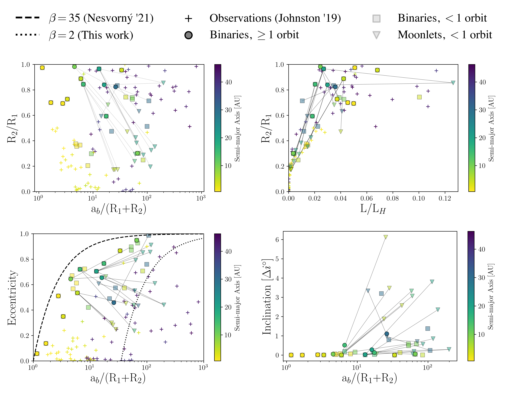
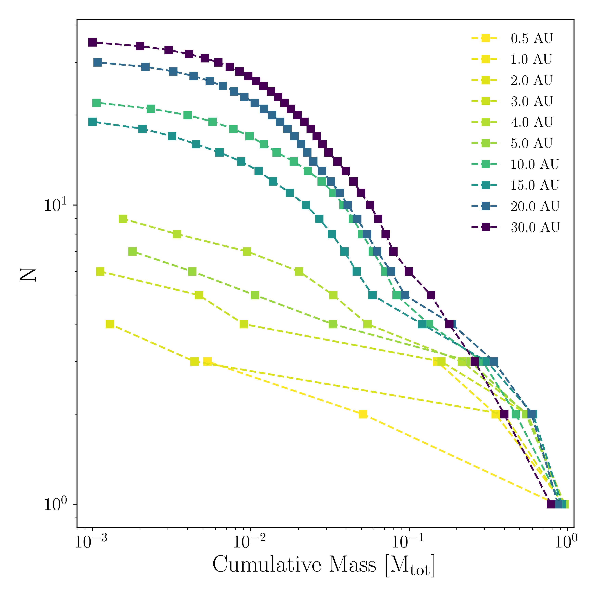
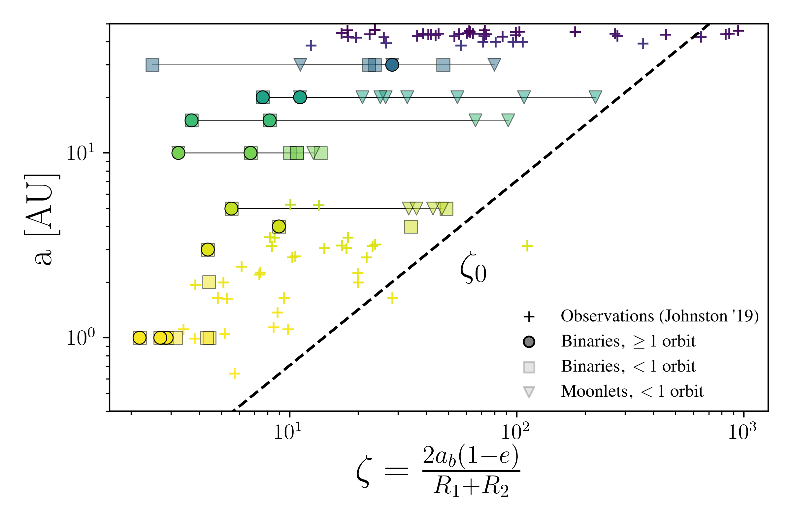

$\newcommand{\ensuremath}{}$
$\newcommand{\xspace}{}$
$\newcommand{\object}[1]{\texttt{#1}}$
$\newcommand{\farcs}{{.}''}$
$\newcommand{\farcm}{{.}'}$
$\newcommand{\arcsec}{''}$
$\newcommand{\arcmin}{'}$
$\newcommand{\ion}[2]{#1#2}$
$\newcommand{\textsc}[1]{\textrm{#1}}$
$\newcommand{\hl}[1]{\textrm{#1}}$
$\newcommand{\vdag}{(v)^\dagger}$
$\newcommand$
$\newcommand$
$\newcommand{\hubert}[1]{{\color{magenta}#1}}$
$\newcommand{\brooke}[1]{{\color{teal}#1}}$
$\newcommand{\response}[1]$
$\newcommand{\responsetwo}[1]$
$\newcommand{\baselinestretch}{1.1}$

$\newcommand{$\ensuremath$}{}$
$\newcommand{$\xspace$}{}$
$\newcommand{$\object$}[1]{\texttt{#1}}$
$\newcommand{$\farcs$}{{.}''}$
$\newcommand{$\farcm$}{{.}'}$
$\newcommand{$\arcsec$}{''}$
$\newcommand{$\arcmin$}{'}$
$\newcommand{$\ion$}[2]{#1#2}$
$\newcommand{$\textsc$}[1]{\textrm{#1}}$
$\newcommand{$\hl$}[1]{\textrm{#1}}$
$\newcommand{$\vdag$}{(v)^\dagger}$
$\newcommand$
$\newcommand$
$\newcommand{$\hubert$}[1]{{\color{magenta}#1}}$
$\newcommand{$\brooke$}[1]{{\color{teal}#1}}$
$\newcommand{$\response$}[1]$
$\newcommand{$\response$two}[1]$
$\newcommand{$\baselinestretch$}{1.1}$

# High Resolution Study of Planetesimal Formation by Gravitational Collapse of Pebble Clouds

<mark>Appeared on: 2022-11-28</mark> - _Accepted for publication in ApJ_

Brooke Polak, <mark>Hubert Klahr</mark>

**Abstract:** Planetary embryos are built through the collisional growth of 10-100 km sized objects called planetesimals, a formerly large population of objects, of which asteroids, comets and Kuiper-Belt objects represent the leftovers from planet formation in our solar system.Here, we follow the paradigm that turbulence created over-dense pebble clouds, which then collapse under their own self-gravity.We use the multi-physics code GIZMO  to model the pebble cloud density as a continuum, with a polytropic equation of state to account for collisional interactions and capturing the phase transition to a quasi-incompressible "solid" object, i.e. a planetesimal in hydrostatic equilibrium.Thus we study cloud collapse effectively at the resolution of the forming planetesimals, allowing us to derive an initial mass function for planetesimals in relation to the total pebble mass of the collapsing cloud.The redistribution of angular momentum in the collapsing pebble cloud is the main mechanism leading to multiple fragmentation. The angular momentum of the pebble cloud and thus the centrifugal radius increases with distance to the sun, but the solid size of the forming planetesimals is constant. Therefore we find that with increasing distance to the sun, the number of forming planetesimals per pebble cloud increases. For all distances the formation of binaries occurs within higher hierarchical systems.The size distribution is top heavy and can be described with a Gaussian distribution of planetesimal mass. For the asteroid belt, we can infer a most likely size of 125 km, all stemming from pebble clouds of equivalent size 152 km.

**Figure 22. -** Properties of the binaries formed in our simulations. Circles, triangles, and squares are the simulated binaries and plus signs are observations of KBOs. The color represents the semi-major axis of the objects around a 1M$_\odot$ central star. The opaque circles are the binaries that have completed at least one orbital radius, and the transparent squares are the binaries that have been detected but haven't had time to complete an orbit. The transparent triangles are the moons, with the lines indicating to which binary they belong. None of the moons have completed an orbit. Upper left plot shows the scaled binary semi-major axis against the binary size ratio. Upper right shows the angular momentum scaled to the Hill angular momentum $L_H=$. Lower left shows the eccentricities. The lines denote the pericenter distances $\beta=a_b(1-e_b)/(R_1+R_2)=$35 (dotted) and 2 (dashed) which represent the binary separation resolving limit of the \citet{Nesvorny2021} simulations and our current model, respectively. This means our current model can resolve much tighter binaries than previous models. Lower right shows the binary orbit inclination angle from the initial rotation axis of the cloud. (*fig:binaryProperties*)

**Figure 3. -** Cumulative mass distribution of clumps in units of the initial cloud mass. Color represents orbital radius. (*fig:etaCumMass*)

**Figure 11. -** Binary proximity factor $\zeta$ against heliocentric semi-major axis. Circles, triangles, and squares are the simulated binaries and plus signs are observations of KBOs. The color represents the semi-major axis of the objects around a 1M$_\odot$ central star. The triangles are moons, with lines indicating to which binary they belong. The opaque circles have completed at lest one orbit, and the transparent squares (and triangles) have not. For a contact binary, $\zeta=1$. The maximum proximity factor $\zeta_0$ for a given semi-major axis is shown by the dashed black line. This factor corresponds to the binary that would form if all the angular momentum from the initial cloud went into a single equal mass binary. (*fig:binaryAU*)

