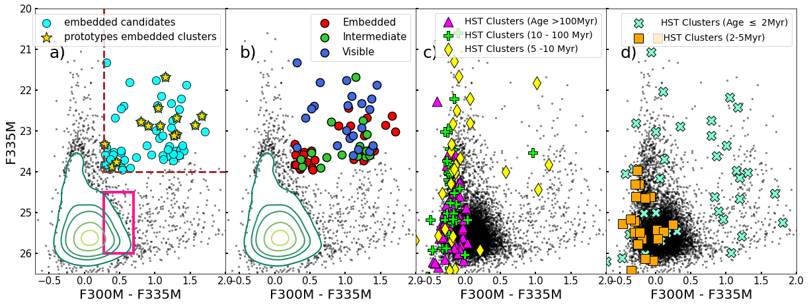
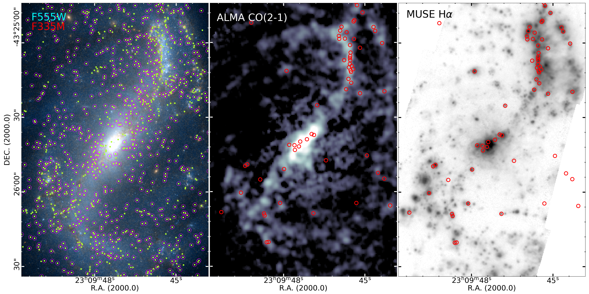

$\newcommand{\ensuremath}{}$
$\newcommand{\xspace}{}$
$\newcommand{\object}[1]{\texttt{#1}}$
$\newcommand{\farcs}{{.}''}$
$\newcommand{\farcm}{{.}'}$
$\newcommand{\arcsec}{''}$
$\newcommand{\arcmin}{'}$
$\newcommand{\ion}[2]{#1#2}$
$\newcommand{\textsc}[1]{\textrm{#1}}$
$\newcommand{\hl}[1]{\textrm{#1}}$
$\newcommand{\footnote}[1]{}$
$\newcommand{\msun}{M_{\odot}}$
$\newcommand{\sfr}{M_{\odot} yr^{-1}}$

$\newcommand{\ensuremath}{}$
$\newcommand{\xspace}{}$
$\newcommand{\object}[1]{\texttt{#1}}$
$\newcommand{\farcs}{{.}''}$
$\newcommand{\farcm}{{.}'}$
$\newcommand{\arcsec}{''}$
$\newcommand{\arcmin}{'}$
$\newcommand{\ion}[2]{#1#2}$
$\newcommand{\textsc}[1]{\textrm{#1}}$
$\newcommand{\hl}[1]{\textrm{#1}}$
$\newcommand{\footnote}[1]{}$
$\newcommand{\msun}{M_{\odot}}$
$\newcommand{\sfr}{M_{\odot} yr^{-1}}$

# PHANGS-JWST First Results: Dust embedded star clusters in NGC 7496$\selected via 3.3$$\mu$m PAH emission

<mark>Appeared on: 2022-11-24</mark> - _12 pages, 6 figures; accepted for publication in ApJL as part of PHANGS-JWST First Results Special Issue_

M. Jimena Rodríguez, et al. -- incl., <mark>Janice C. Lee</mark>, <mark>Eva Schinnerer</mark>, <mark>Kathryn~Kreckel</mark>, <mark>Annie~Hughes</mark>

**Abstract:** The earliest stages of star formation occur enshrouded in dustand are not observable in the optical.Here we leverage the extraordinary new high-resolution infrared imaging from JWST to begin the study of dust-embedded star clusters in nearby galaxies throughout the local volume.  We present atechnique for identifying dust-embedded clusters in NGC 7496 (18.7 Mpc), the first galaxy to be observed by the PHANGS-JWST Cycle 1 Treasury Survey.We select sources that have strong 3.3 $\mu$ m PAH emission based on a $\rm F300M-F335M$ color excess, and identify 67 candidate embedded clusters.  Only eight of these are found in the PHANGS-HST optically-selected cluster catalog and all are young (six have SED-fit ages of $\sim1$ Myr).  We find that this sample of embedded cluster candidates may significantly increase the census of young clusters in NGC 7496 from the PHANGS-HST catalog -- the number of clusters younger than $\sim$ 2 Myr could be increased by a factor of two.  Candidates are preferentially located in dust lanes, and are coincident with peaks in PHANGS-ALMA CO (2-1)maps. We take a first look at concentration indices, luminosity functions, SEDs spanning from 2700Å to 21 $\mu$ m, and stellar masses (estimated to be between $\sim10^4-10^5 M_{\odot}$ ).  The methods tested here provide a basis for future work to derive accurate constraints on the physical properties of embedded clusters, characterize the completeness of cluster samples, and expand analysis to all 19 galaxies in the PHANGS-JWST sample, which will enable basic unsolved problems in star formation and cluster evolution to be addressed.

**Figure 4. -** Color-magnitude diagram $\rm F335M$ vs. $\rm F300M-F335M$ for NGC 7496. Magnitudes are in the AB system. In all panels the black dots are $\rm F335M$ sources detected with Photutils _ find\_peaks_. Density contours for the densest parts of this diagram are shown in panels _ a_ and _ b_. In panel _ a)_ yellow stars show the 12 prototype embedded clusters selected in our initial visual inspection. Based on the location in the CMD of these candidates, we select 67 embedded candidates (cyan circles). The dashed lines show the selection criteria: $\rm F300M-F335M >$0.3 and F335M$<$24. The magenta box indicates a region where scatter due to the uncertainties in the color is large, and is chosen for the purposes of illustrating the spatial distribution in Fig. \ref{Fig:color_CO_alpha}.
Panel _ b)_ shows the same extended sample of 67 candidates but differentiated by category: embedded objects (red), intermediate or partially embedded (green), and visible or exposed (blue).
Panels _ c_ and _ d_ show for comparison the location in the CMD sources from the PHANGS-HST optical cluster catalog.
Panel _ c)_ show clusters older than 100 Myr (magenta). As expected, these clusters fall around $\rm F300M-F335M=0$, indicating that these old sources do not have PAH emission. This panel also shows clusters with SED-fit age estimates between 10-100 Myr (green crosses) and 5-10 Myr (yellow diamonds), which also appear around $\rm F300M-F335M=0$. In contrast, about half of the clusters younger than 2 Myr shown in panel _ d)_(small cyan crosses) are PAH emitters. Panel _ d)_ also shows clusters between 2 and 5 Myr (orange squares), which mostly have little measured PAH emission. (*fig:cmd*)

**Figure 3. -** 
The upper panel shows the PHANGS-HST WFC3 $\rm F555M$ image of NGC 7496.
The sample of 67 PHANGS-JWST 3.3 $\mu$m selected star cluster candidates are plotted with different colors according to their categories: embedded (red), partially embedded (green) and visible (blue).
The locations of optically-selected clusters from the PHANGS-HST catalog are also shown, and distinguished by SED-fit age (black squares for $>10$ Myr and black circles for $<10$ Myr). Only clusters brighter than $\rm F300M < 25$ are included.
The bottom panels show images in the HST-WFC3, JWST-NIRCam, and JWST-MIRI filters, for the $10" \times 10"$ region indicated by the white box in the upper panel. The central wavelength of each filter is indicated in the panel label.
The colored circles are the same as in the upper panel. Clusters marked by an additional yellow circle are part of our prototype sample (see text for details).
The comparison of this region in the optical HST images and IR from JWST, clearly shows that the candidates fall along a dust lane, largely obscured in the HST bands.
 (*fig:galaxy+reg*)

**Figure 6. -** _ Left:_ Combined HST F555W (blue) and JWST F335M (red) image. The green dots are sources detected in F335M that satisfy our color cut $\rm F300M-F335M>0.3$(Sect. \ref{subsect:selectioncriteria}), but before performing any cut in magnitude.  Sources shown in green without a magenta circle are the strongest PAH emitters, and are mostly found in the main dust lanes within the spiral arms.
Sources with an additional magenta circle are those that have $\rm F300M-F335M$ between 0.3 and 0.7, and $\rm F335M>24.5$, i.e., they are both fainter and have larger color uncertainties (magenta box in Fig. \ref{fig:cmd}). This figure shows that when we select only the brightest sources with the largest color excesses, sources which tend to coincide with minor dust lanes in the galaxy, i.e., potentially fainter embedded clusters, are excluded.
_ Middle_: CO(2-1) ALMA map, with resolution of $\sim 1"$ with the 67 embedded cluster candidates (red circles).
_ Right_: Muse H$_{\alpha}$ map with resolution of $\sim 0$\farcs$$7 and the 67 candidates. Note that the sample is well-correlated with $H_{\alpha}$ and CO(2-1) peaks.  (*Fig:color_CO_alpha*)

