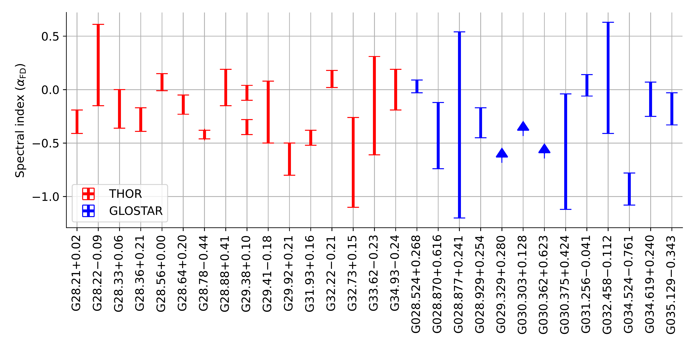

$\newcommand{\ensuremath}{}$
$\newcommand{\xspace}{}$
$\newcommand{\object}[1]{\texttt{#1}}$
$\newcommand{\farcs}{{.}''}$
$\newcommand{\farcm}{{.}'}$
$\newcommand{\arcsec}{''}$
$\newcommand{\arcmin}{'}$
$\newcommand{\ion}[2]{#1#2}$
$\newcommand{\textsc}[1]{\textrm{#1}}$
$\newcommand{\hl}[1]{\textrm{#1}}$
$\newcommand{\footnote}[1]{}$
$\newcommand{\dok}{\citetalias{2021A&A...651A..86D}}$
$\newcommand{\loren}{\citetalias{2017A&A...605A..58A}}$

$\newcommand{\ensuremath}{}$
$\newcommand{\xspace}{}$
$\newcommand{\object}[1]{\texttt{#1}}$
$\newcommand{\farcs}{{.}''}$
$\newcommand{\farcm}{{.}'}$
$\newcommand{\arcsec}{''}$
$\newcommand{\arcmin}{'}$
$\newcommand{\ion}[2]{#1#2}$
$\newcommand{\textsc}[1]{\textrm{#1}}$
$\newcommand{\hl}[1]{\textrm{#1}}$
$\newcommand{\footnote}[1]{}$
$\newcommand{\dok}{\citetalias{2021A&A...651A..86D}}$
$\newcommand{\loren}{\citetalias{2017A&A...605A..58A}}$

# A global view on star formation: The GLOSTAR Galactic plane survey

<mark>Appeared on: 2022-11-24</mark> - _To be published in A&A. 21 pages, 15 figures_

R. Dokara, et al. -- incl., <mark><mark>H. Beuther</mark></mark>, <mark><mark>P. Müller</mark></mark>

**Abstract:** While over 1000 supernova remnants (SNRs) are estimated to exist in the Milky Way, only less than 400 have been found to date.  In the context of this apparent deficiency, more than 150 SNR candidates were recently identified in the D-configuration Very Large Array (VLA-D) continuum images of the 4--8 GHz global view on star formation (GLOSTAR) survey, in the Galactic longitude range $-2◦ee<l<60◦ee$ . We attempt to find evidence of nonthermal synchrotron emission from 35 SNR candidates in the region of Galactic longitude range $28◦ee<l<36◦ee$ , and also to study the radio continuum emission from the previously confirmed SNRs in this region. Using the short-spacing corrected GLOSTAR VLA-D+Effelsberg images, we measure the ${\sim}6$ GHz total and linearly polarized flux densities of the SNR candidates and the SNRs that were previously confirmed.  We also attempt to determine the spectral indices by measuring flux densities from complementary Galactic plane surveys and from the temperature-temperature plots of the GLOSTAR-Effelsberg images. We provide evidence of nonthermal emission from four candidates that have spectral indices and polarization consistent with a SNR origin, and, considering their morphology, we are confident that three of these (G28.36+0.21, G28.78-0.44, and G29.38+0.10) are indeed SNRs.  However, about $25\%$ of the candidates (8 out of 35) have spectral index measurements that indicate thermal emission, and the rest of them are too faint to have a good constraint on the spectral index yet. Additional observations at longer wavelengths and higher sensitivities will shed more light on the nature of these candidates.  A simple Monte-Carlo simulation reiterates the view that future studies must persist with the current strategy of searching for SNRs with small angular size to solve the problem of the Milky Way's missing SNRs.

**Figure 5. -** SNR G35.6-0.4: the top left and right panels show the GLOSTAR combination images of total and linearly polarized intensity.  The red dotted circles represent the two shell-like structures identified at 610 MHz by \citet{2014A&A...561A..56P}, while the black diamond marks the position of the recombination line discovered by \citet{1989ApJS...71..469L}.  The TT-plot from GLOSTAR-Effelsberg images and the flux density spectrum are presented in the bottom left and right panels respectively.  (*fig:G35.6-0.4*)

**Figure 3. -** From top to bottom: G29.6+0.1, G31.5-0.6, G32.4+0.1, and G32.8-0.1.  Left panels show the GLOSTAR combination images.  The TT-plot from GLOSTAR-Effelsberg images, and the flux density spectrum using the GLOSTAR combination images and ancillary data are presented in the middle and right panels respectively.   (*fig:ksnrs*)

**Figure 6. -** Flux density spectral indices ($\alpha_{\mathrm{FD}}$) of the candidate SNRs being studied in this work.  Candidates with lower limits are represented by upward arrows.  Since G29.38+0.10 has a spectral break, both the spectral indices are shown.  (*fig:spidxdist*)

