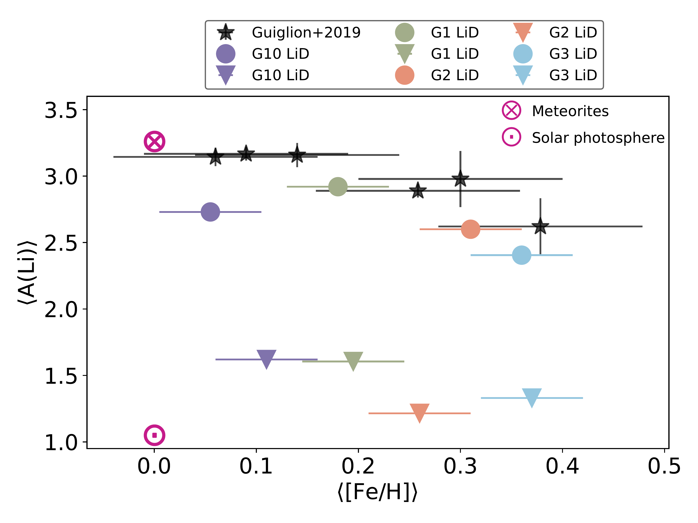
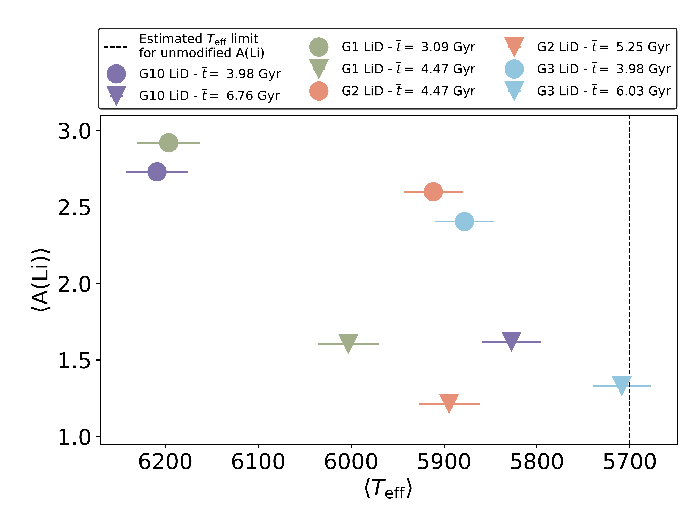
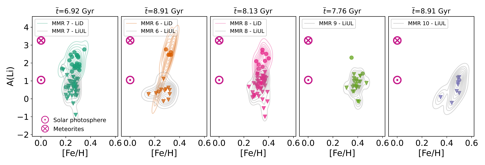
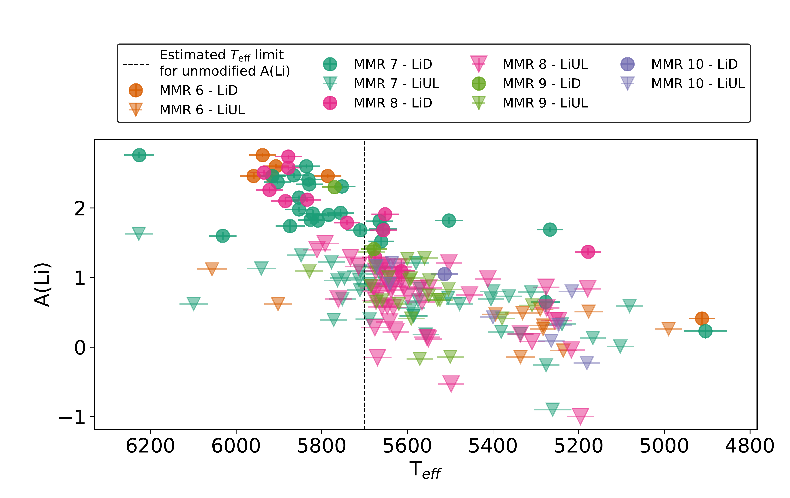

$\newcommand{\ensuremath}{}$
$\newcommand{\xspace}{}$
$\newcommand{\object}[1]{\texttt{#1}}$
$\newcommand{\farcs}{{.}''}$
$\newcommand{\farcm}{{.}'}$
$\newcommand{\arcsec}{''}$
$\newcommand{\arcmin}{'}$
$\newcommand{\ion}[2]{#1#2}$
$\newcommand{\textsc}[1]{\textrm{#1}}$
$\newcommand{\hl}[1]{\textrm{#1}}$
$\newcommand{\footnote}[1]{}$
$\newcommand{\feh}{\langle \rm{[Fe/H]} \rangle}$
$\newcommand{\ali}{A(Li)}$
$\newcommand{\medt}{\overline{t}}$
$\newcommand{\sfehtot}{\sigma(\rm{[Fe/H]})_{\rm tot}}$
$\newcommand{\sfehtop}{\sigma(\rm{[Fe/H]})_{\rm top6}}$
$\newcommand{\smgfetot}{\sigma(\rm{[Mg/Fe]})_{\rm tot}}$
$\newcommand{\smgfetop}{\sigma(\rm{[Mg/Fe]})_{\rm top6}}$
$\newcommand$
$\newcommand$

$\newcommand{\ensuremath}{}$
$\newcommand{\xspace}{}$
$\newcommand{\object}[1]{\texttt{#1}}$
$\newcommand{\farcs}{{.}''}$
$\newcommand{\farcm}{{.}'}$
$\newcommand{\arcsec}{''}$
$\newcommand{\arcmin}{'}$
$\newcommand{\ion}[2]{#1#2}$
$\newcommand{\textsc}[1]{\textrm{#1}}$
$\newcommand{\hl}[1]{\textrm{#1}}$
$\newcommand{\footnote}[1]{}$
$\newcommand{\feh}{\langle \rm{[Fe/H]} \rangle}$
$\newcommand{\ali}{A(Li)}$
$\newcommand{\medt}{\overline{t}}$
$\newcommand{\sfehtot}{\sigma(\rm{[Fe/H]})_{\rm tot}}$
$\newcommand{\sfehtop}{\sigma(\rm{[Fe/H]})_{\rm top6}}$
$\newcommand{\smgfetot}{\sigma(\rm{[Mg/Fe]})_{\rm tot}}$
$\newcommand{\smgfetop}{\sigma(\rm{[Mg/Fe]})_{\rm top6}}$
$\newcommand$
$\newcommand$

# The $*Gaia*$-ESO Survey: Probing the lithium abundances in old  metal-rich dwarf stars in the solar vicinity

<mark>Appeared on: 2022-11-25</mark> - _8 pages, 3 figures. Abridged abstract to fit ArXiv's requirements. Letter published in A&A Letters. Version after the language proofs_

M. L. L. Dantas, et al. -- incl., <mark><mark>G. Guiglion</mark></mark>

**Abstract:** Lithium (Li) is a fragile element that is produced in a variety of sites but can also be very easily depleted in stellar photospheres. Radial migration has been reported to explain the decrease in the upper envelope of Li measurements observed for relatively old metal-rich dwarf stars in some surveys. We test a scenario in which radial migration could affect the Li abundance pattern of dwarf stars in the solar neighbourhood. This may confirm that the Li abundances in these stars cannot serve as a probe for the Li abundance in the interstellar medium (ISM). In other words, to probe the evolution of the Li abundance in the local ISM, it is crucial that stellar intruders be identified and removed from the adopted sample. We used the high-quality data (including Li abundances) from the sixth internal Data Release of the $*Gaia*$ -ESO survey. In this sample we grouped stars by similarity in chemical abundances via hierarchical clustering. Our analysis treats both measured Li abundances and upper limits. The Li envelope of the previously identified radially migrated stars is well below the benchmark meteoritic value (<3.26 dex); the star with the highest detected abundance has A(Li) = 2.76 dex. This confirms the previous trends observed for old dwarf stars (median ages $\sim$ 8 Gyr), where Li decreases for [ Fe/H ] $\gtrsim$ 0. This result is supporting evidence that the abundance of Li measured in the upper envelope of old dwarf stars should not be considered a proxy for the ISM Li. Our scenario also indicates that the stellar yields for [ M/H ] >0 should not be decreased, as recently proposed in the literature. Our study backs recent studies that claim that old dwarfs on the hot side of the dip are efficient probes of the ISM abundance of Li, provided atomic diffusion does not significantly lower the initial Li abundance in the atmospheres of metal-rich objects.

**Figure 1. -** $\ali$ vs $\feh$ and $\langle T_{\rm eff} \rangle$ respectively for the super-solar groups. *Left panel:*$\langle{\rm A(Li)} \rangle$ vs $\feh$ for the super-solar groups of the sample, split into those with a direct detection of Li (LiD -- round markers) and those with an upper limit estimate (LiUL -- inverted triangle markers). In this representation, only the median of the top six stars with the highest $\ali$ is shown in each marker. Dark magenta markers have been added to represent the meteoritic ({\tiny{$\bigotimes$}}) and solar photospheric ({\tiny $\bigodot$}) values. The median ages of the stars represented by each marker are displayed on the legend. The black star-shaped markers display the data from  ([Guiglion and Recio-Blanco (2016)]()) . It is worth mentioning that the errors associated with $\ali$ are very small, and that is why they are not seen. *Right panel:*$\langle{\rm A(Li)} \rangle$ vs $\langle T_{\rm eff} \rangle$. It is possible to see that $\ali$ seems to decrease with decreasing $T_{\rm eff}$. Indeed, the warmer temperatures seem to have a protective effect on $\ali$ due to their thinner convective layers. A straight dotted black line is added to depict an approximate estimation of $T_{\rm{eff}}$(i.e. at $\sim$5700K) for unmodified $\ali$, as shown in \citet[][]{romano2021}. (*fig:li_feh_top6*)

**Figure 2. -** $\ali$ vs [Fe/H] in the shape of a scatter plot and a 2D-Gaussian kernel density plot of the MMR subgroups (from 6 to 10) in order of increasing $\feh$. Round and inverted-triangle markers depict, respectively, LiD and LiUL measurements. The 2D-kernel densities are either in the same colour as the scatter markers (for LiD) or in grey (for LiUL). 2D-kernel densities are not shown for subgroups 9 and 10 in the case of LiD due to the low number of stars with detected Li in each of these subgroups (two and one, respectively). As in Fig. \ref{fig:li_feh_top6}, additional markers were added to depict both the meteoritic and solar photospheric $\ali$. The MMR group colours are the same as in  ([Dantas, Smiljanic and Boesso (2022)]()) . The errors are omitted to ease the visualisation. The median ages of each MMR subgroup are depicted at the top of each subplot; it is worth noting that subgroup 10 (purple) has a smaller $\overline{t}$ than depicted in \citet[][]{Dantas2022}. The reason for this difference is due to the removal of stars with missing Li measurements. (*fig:mmr_feh_li*)

**Figure 3. -** $\ali$ vs $T_{\rm{eff}}$ for all MMR stars. Stars with LiD are represented by the round markers, whereas those with LiUL are displayed using inverted triangles. The colours that differentiate each MMR subgroup are the same as in Fig. \ref{fig:mmr_feh_li}. A straight dotted black line is added to depict an approximate estimation of $T_{\rm{eff}}$(i.e. at $\sim$5700K) for unmodified $\ali$, as shown in \citet[][]{romano2021}. (*fig:mmr_li_teff*)

