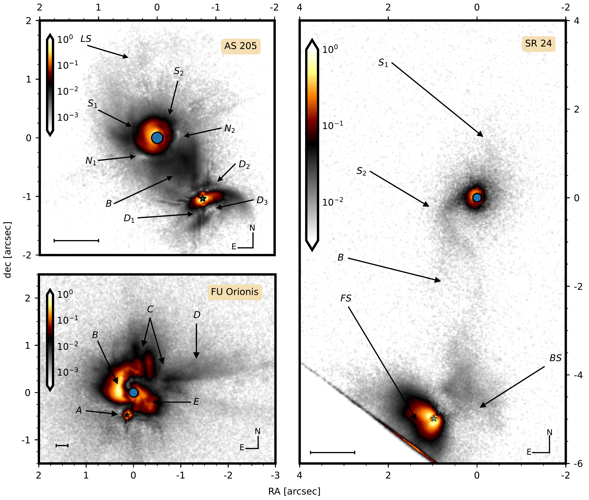
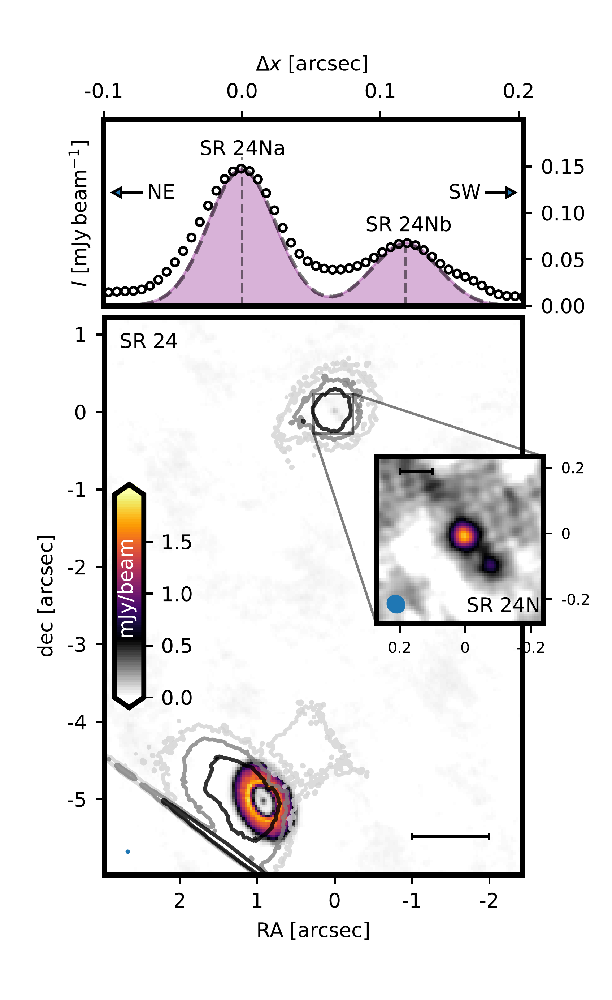
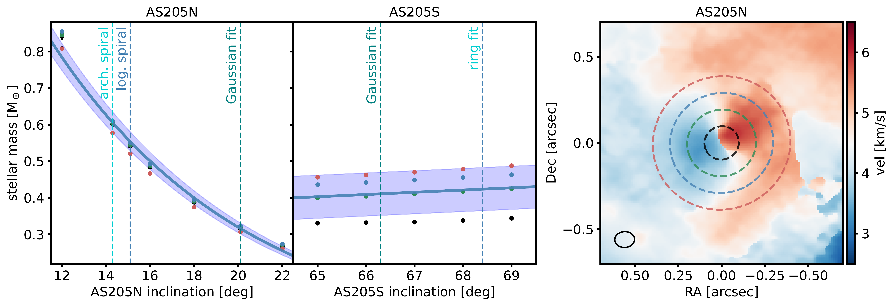

$\newcommand{\ensuremath}{}$
$\newcommand{\xspace}{}$
$\newcommand{\object}[1]{\texttt{#1}}$
$\newcommand{\farcs}{{.}''}$
$\newcommand{\farcm}{{.}'}$
$\newcommand{\arcsec}{''}$
$\newcommand{\arcmin}{'}$
$\newcommand{\ion}[2]{#1#2}$
$\newcommand{\textsc}[1]{\textrm{#1}}$
$\newcommand{\hl}[1]{\textrm{#1}}$
$\newcommand{\thebibliography}{\DeclareRobustCommand{\VAN}[3]{##3}\VANthebibliography}$

$\newcommand{\ensuremath}{}$
$\newcommand{\xspace}{}$
$\newcommand{\object}[1]{\texttt{#1}}$
$\newcommand{\farcs}{{.}''}$
$\newcommand{\farcm}{{.}'}$
$\newcommand{\arcsec}{''}$
$\newcommand{\arcmin}{'}$
$\newcommand{\ion}[2]{#1#2}$
$\newcommand{\textsc}[1]{\textrm{#1}}$
$\newcommand{\hl}[1]{\textrm{#1}}$
$\newcommand{\thebibliography}{\DeclareRobustCommand{\VAN}[3]{##3}\VANthebibliography}$

# The SPHERE view of three interacting twin disc systems in polarised light

<mark>Appeared on: 2022-11-25</mark> - _23 pages, 17 figures, accepted for publication in MNRAS_

Philipp Weber, et al. -- incl., <mark><mark>Nicolás T. Kurtovic</mark></mark>

**Abstract:** Dense stellar environments as hosts of ongoing star formation increase the probability of gravitational encounters among stellar systems during the early stages of evolution. Stellar interaction may occur through non-recurring, hyperbolic or parabolic passages (a so-called ‘fly-by'), through secular binary evolution, or through binary capture. In all three scenarios, the strong gravitational perturbation is expected to manifest itself in the disc structures around the individual stars.Here, we present near-infrared polarised light observations that were taken with the SPHERE/IRDIS instrument of three known interacting twin-disc systems: AS 205, EM* SR 24, and FU Orionis.The scattered light exposes spirals likely caused by the gravitational interaction.On a larger scale, we observe connecting filaments between the stars.We analyse their very complex polarised intensity and put particular attention to the presence of multiple light sources in these systems. The local angle of linear polarisation indicates the source whose light dominates the scattering process from the bridging region between the two stars.Further, we show that the polarised intensity from scattering with multiple relevant light sources results from an incoherent summation of the individuals' contribution.This can produce nulls of polarised intensity in an image, as potentially observed in AS 205.We discuss the geometry and content of the systems by comparing the polarised light observations with other data at similar resolution, namely with ALMA continuum and gas emission.Collective observational data can constrain the systems' geometry and stellar trajectories, with the important potential to differentiate between dynamical scenarios of stellar interaction.

**Figure 10. -** SPHERE/IRDIS observations of three twin disc systems: AS 205, SR 24 and FU Orionis. North is up, East is to the left. We show the normalised polarised light intensity in logarithmic colour scale with the $1\sigma_{\rm rms}-$level as the lower limit and the maximum intensity as the upper limit. The coordinates are centred on the respective northern source. The central circles mark the coronagraph's diameter. The location of the companions in the images are marked by a star. The length of the bar in the lower left corner of each panel is equivalent to a projected distance of 100$ $au. Arrows and letters are referred to in the text. For SR 24 the southern source is very close to the edge of the detector which is why the lower frame is visible there. (*fig:mosaic*)

**Figure 4. -** Lower panel: ALMA band 6 intensity map for SR 24. Contours trace the $H$-Band polarised intensity presented in Fig. \ref{fig:mosaic} for comparison at levels of 0.25\%, 1\% and 5\% of the peak intensity. The bar in the bottom right corner shows the projected distance of 100$ $au. The inset zooms in on the location of SR 24N. Contrast in the inset is increased by a factor of ten, the two sources SR 24Na and SR 24Nb are detected with $\sim12 \sigma_{\rm rms}$ and $\sim 5 \sigma_{\rm rms}$, respectively. The bar in the top left corner of the inset corresponds to 10$ $au. Top panel: Intensity along the connecting line between SR 24Na and SR 24Nb, north-east is to the left, south-west to the right. The circles show the ALMA band 6 data points, the dashed lines show the beam size of the observation. (*fig:cont_sr24*)

**Figure 12. -** {The left and central panel show dynamical stellar mass estimates for AS 205N and AS 205S, respectively, measured with the {\tt eddy}-package \citep[][]{eddy}. The stellar masses were calculated for different assumed disc inclinations, spread around the estimates provided in  ([Kurtovic, et. al (2018)](https://ui.adsabs.harvard.edu/abs/2018ApJ...869L..44K))  from different methods, for which the measured inclination values are indicated by vertical dashed lines. At each assumed inclination we varied the size of the mask to which the dynamical measurement was limited between radii of $0$\farcs$1$, $0$\farcs$2$, $0$\farcs$3$ and $0$\farcs$4$. AS a visual example, the right panel shows the moment 1 map centred on AS 205N with the different mask sizes indicated by dashed circles. The colour of the data points in the two left panels corresponds to the colour of the applied mask in the right panel.} (*fig:AS_kine_masks*)

