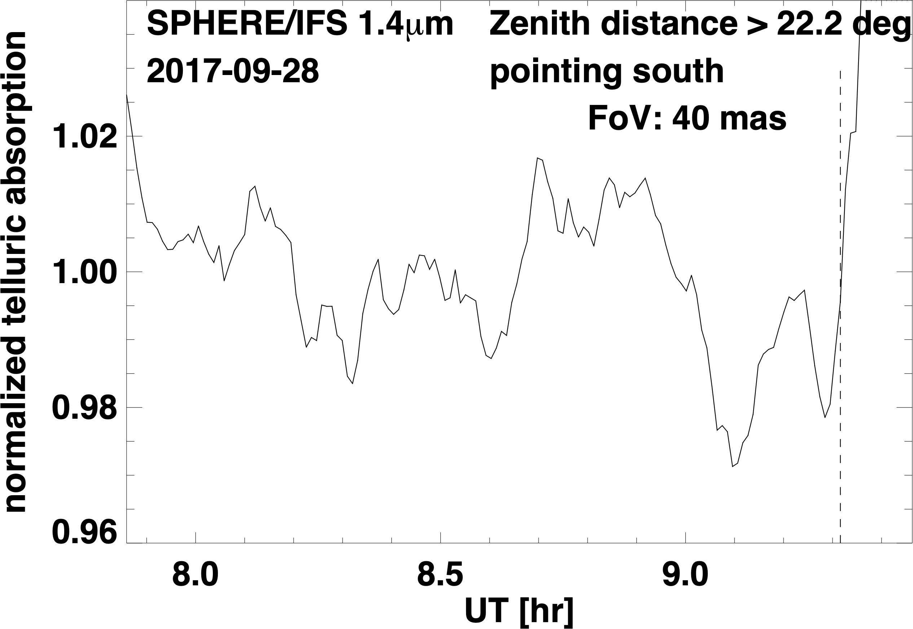
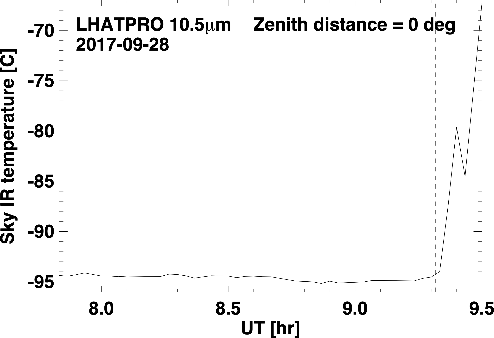
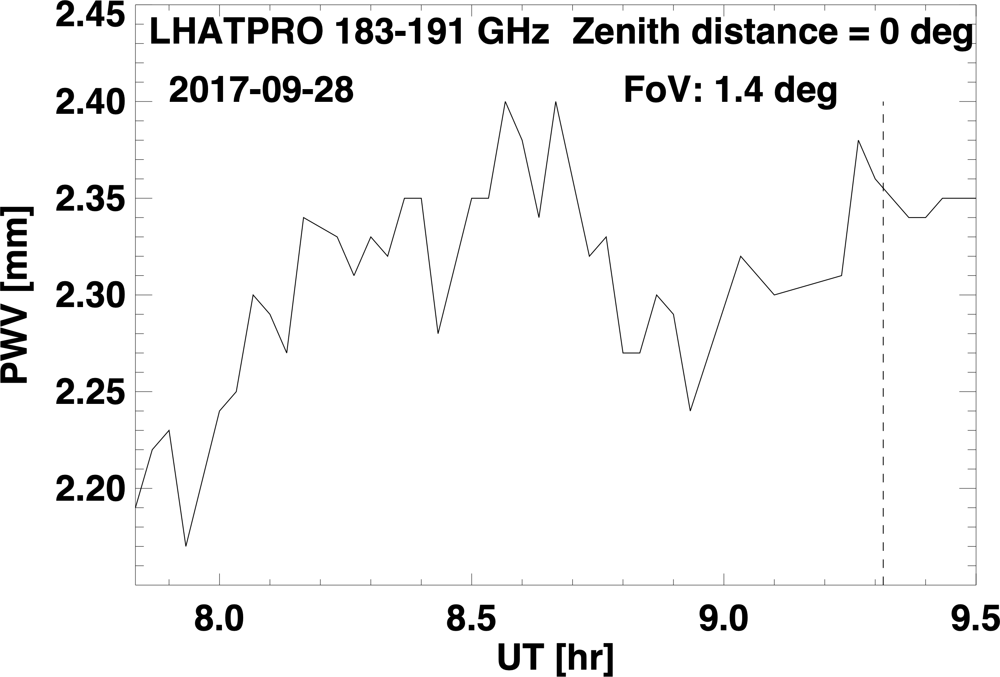
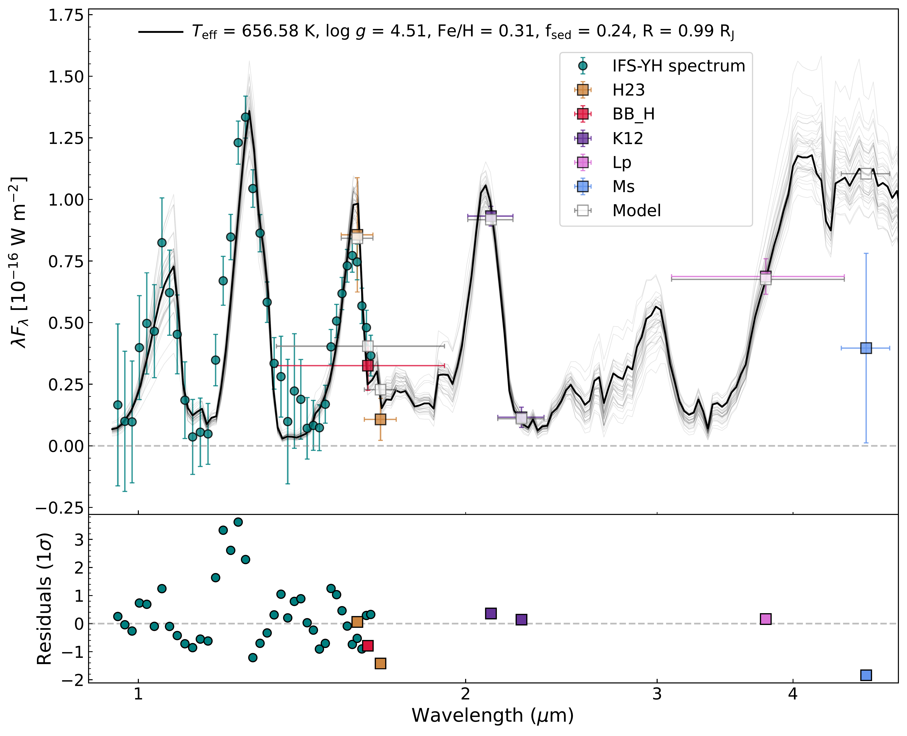

$\newcommand{\ensuremath}{}$
$\newcommand{\xspace}{}$
$\newcommand{\object}[1]{\texttt{#1}}$
$\newcommand{\farcs}{{.}''}$
$\newcommand{\farcm}{{.}'}$
$\newcommand{\arcsec}{''}$
$\newcommand{\arcmin}{'}$
$\newcommand{\ion}[2]{#1#2}$
$\newcommand{\textsc}[1]{\textrm{#1}}$
$\newcommand{\hl}[1]{\textrm{#1}}$
$\newcommand{\footnote}[1]{}$
$\newcommand{\SubItem}[1]{$
$    {\setlength\itemindent{15pt} \item[-] #1}$
$}$
$\newcommand{\arraystretch}{1.5}$
$\newcommand{\arraystretch}{1.5}$

$\newcommand{\ensuremath}{}$
$\newcommand{\xspace}{}$
$\newcommand{\object}[1]{\texttt{#1}}$
$\newcommand{\farcs}{{.}''}$
$\newcommand{\farcm}{{.}'}$
$\newcommand{\arcsec}{''}$
$\newcommand{\arcmin}{'}$
$\newcommand{\ion}[2]{#1#2}$
$\newcommand{\textsc}[1]{\textrm{#1}}$
$\newcommand{\hl}[1]{\textrm{#1}}$
$\newcommand{\footnote}[1]{}$
$\newcommand{\SubItem}[1]{$
$    {\setlength\itemindent{15pt} \item[-] #1}$
$}$
$\newcommand{\arraystretch}{1.5}$
$\newcommand{\arraystretch}{1.5}$

# Revisiting the atmosphere of the exoplanet 51 Eridani b with VLT/SPHERE

<mark>Appeared on: 2022-11-25</mark> - _Accepted for publication in A&A. 21 pages, 7 figures in the main text and 9 figures in the Appendix_

<mark><mark>S. B. Brown-Sevilla</mark></mark>, et al. -- incl., <mark><mark>P. Mollière</mark></mark>, <mark><mark>M. Samland</mark></mark>, <mark><mark>M. Feldt</mark></mark>, <mark><mark>M. Meyer</mark></mark>, <mark><mark>A. Pavlov</mark></mark>

**Abstract:** [Full abstract in the paper] We aim to better constrain the atmosphericproperties of the directly imaged exoplanet 51~Eri~b by using a retrievalapproach on higher signal-to-noise data than previously reported. In thiscontext, we also compare the results of using the atmospheric retrieval code\texttt{petitRADTRANS} vs a self-consistent model to fit atmosphericparameters. We present a higher signal-to-noise $YH$ spectrum of the planet andrevised $K1K2$ photometry (M$_{K1} = 15.11 \pm 0.04$ mag, M$_{K2} = 17.11 \pm0.38$ mag). The best-fit parameters obtained using an atmospheric retrievaldiffer from previous results using self-consistent models. In general, we findthat our solutions tend towards cloud-free atmospheres (e.g. log $\tau_{\rmclouds} = -5.20 \pm 1.44$). For our ``nominal'' model with new data, we find alower metallicity ([Fe/H] $= 0.26\pm$0.30 dex) and C/O ratio ($0.38\pm0.09$),and a slightly higher effective temperature (T$_{\rm{eff}} = 807\pm$45 K) thanprevious studies. The surface gravity (log $g = 4.05\pm0.37$) is in agreementwith the reported values in the literature within uncertainties. We estimatethe mass of the planet to be between 2 and 4 M$_{\rm{Jup}}$. When comparingwith self-consistent models, we encounter a known correlation between thepresence of clouds and the shape of the $P-T$ profiles. Our findings supportthe idea that results from atmospheric retrievals should not be discussed inisolation, but rather along with self-consistent temperature structuresobtained using the retrieval's best-fit parameters.

**Figure 6. -** Top: Telluric absorption as traced by SPHERE/IFS at $\approx 1.4\mu$m. Middle: Sky infrared temperature as traced by LHATPRO. Bottom: PWV as traced by LHATPRO.  The vertical dashed line in all figures marks our cut-off time for the first 140 IFS frames, which form the basis of our spectral analysis, out of a total of 154 IFS data frames. (*fig:telluric_timeseries*)

**Figure 11. -** \texttt{petitRADTRANS} best-fit spectrum of 51 Eri b for the "enforced clouds" retrieval run on our new SPHERE spectro-photometric data (teal circles and purple squares) along with the photometric points included in \cite{Samland2017}(shown as squares). The photometric points describe the average flux in the respective filter, the _x_-error bar represents the filter widths. 34 randomly drawn samples from the posterior probability distribution are shown in gray, to show the spread of model parameter combinations to fit the data. Residuals in multiples of 1 $\sigma$ uncertainties of the data are shown below. (*fig:new_cloudy*)

**Figure 12. -** Corner plot of the posterior PDFs of the "enforced clouds" retrieval run on the new data set. (*fig:cloudy_corner*)

