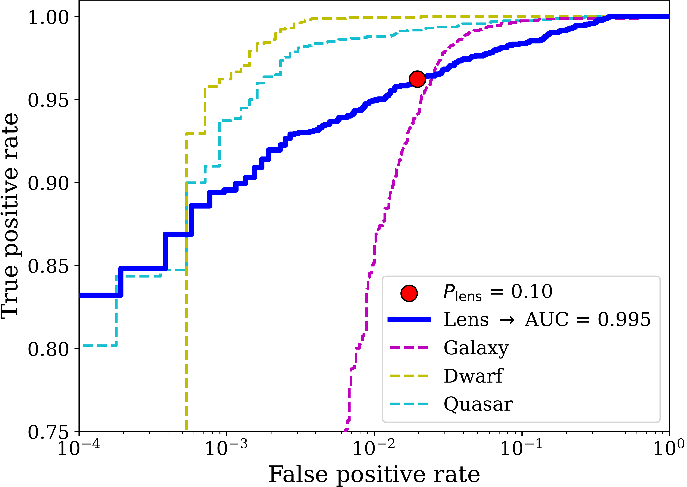
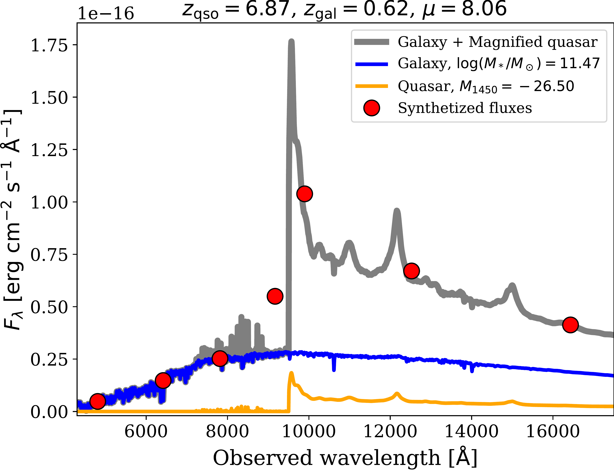
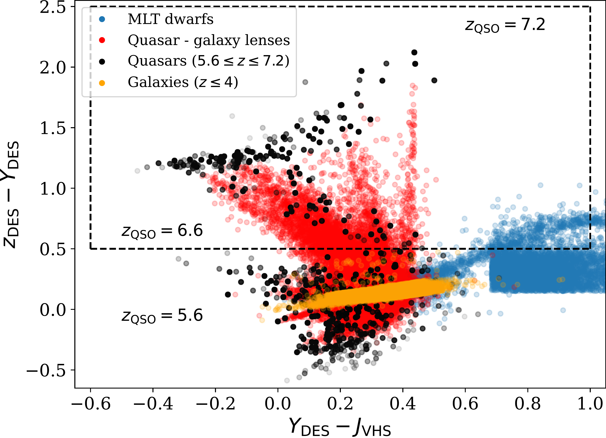

$\newcommand{\ensuremath}{}$
$\newcommand{\xspace}{}$
$\newcommand{\object}[1]{\texttt{#1}}$
$\newcommand{\farcs}{{.}''}$
$\newcommand{\farcm}{{.}'}$
$\newcommand{\arcsec}{''}$
$\newcommand{\arcmin}{'}$
$\newcommand{\ion}[2]{#1#2}$
$\newcommand{\textsc}[1]{\textrm{#1}}$
$\newcommand{\hl}[1]{\textrm{#1}}$
$\newcommand{\footnote}[1]{}$
$\newcommand{\vdag}{(v)^\dagger}$
$\newcommand$
$\newcommand$

$\newcommand{\ensuremath}{}$
$\newcommand{\xspace}{}$
$\newcommand{\object}[1]{\texttt{#1}}$
$\newcommand{\farcs}{{.}''}$
$\newcommand{\farcm}{{.}'}$
$\newcommand{\arcsec}{''}$
$\newcommand{\arcmin}{'}$
$\newcommand{\ion}[2]{#1#2}$
$\newcommand{\textsc}[1]{\textrm{#1}}$
$\newcommand{\hl}[1]{\textrm{#1}}$
$\newcommand{\footnote}[1]{}$
$\newcommand{\vdag}{(v)^\dagger}$
$\newcommand$
$\newcommand$

# When Spectral Modeling Meets Convolutional Networks:$\A Method for Discovering Reionization-era Lensed Quasars in Multi-band Imaging Data$

<mark>Appeared on: 2022-11-26</mark> - _24 pages, 17 figures, and 2 tables. Accepted for publication in The Astrophysical Journal. We welcome comments from the reader_

Irham Taufik Andika, et al. -- incl., <mark>Knud Jahnke</mark>, <mark>Sarah E. I. Bosman</mark>, <mark>Frederick B. Davies</mark>

**Abstract:** Over the last two decades, around 300 quasars have been discovered at $z\gtrsim6$ , yet only one has identified as being strongly gravitationally lensed.We explore a new approach -- enlarging the permitted spectral parameter space, while introducing a new spatial geometry veto criterion -- which is implemented via image-based deep learning.We first apply this approach to a systematic search for reionization-era lensed quasars, using data from the Dark Energy Survey, the Visible and Infrared Survey Telescope for Astronomy Hemisphere Survey, and the Wide-field Infrared Survey Explorer.Our search method consists of two main parts:(i) the preselection of the candidates based on their spectral energy distributions (SEDs) using catalog-level photometry and(ii) relative probabilities calculation of the candidates being a lens or some contaminant, utilizing a convolutional neural network (CNN) classification.The training data sets are constructed by painting deflected point-source lights over actual galaxy images, to generate realistic galaxy-quasar lens models, optimized to find systems with small image separations, i.e., Einstein radii of $\theta_\mathrm{E} \leq 1\arcsec$ .Visual inspection is then performed for sources with CNN scores of $P_\mathrm{lens} > 0.1$ , which leads us to obtain 36 newly selected lens candidates, which are awaiting spectroscopic confirmation.These findings show that automated SED modeling and deep learning pipelines, supported by modest human input, are a promising route for detecting strong lenses from large catalogs that can overcome the veto limitations of primarily dropout-based SED selection approaches.

**Figure 5. -** 
		Receiver operating characteristic (ROC) curve and the associated area under the curve (AUC) value.
		The curve for classifying lensed quasars is presented with a solid blue line.
		On the other hand, the curves for predicting galaxies, MLT dwarfs, and quasars are shown with magenta, yellow, and cyan dashed lines, respectively.
		The FPR and TPR value for the adopted $P_\mathrm{lens}$ thresholds is also shown as a red circle.
	 (*fig:roc_curve*)

**Figure 1. -** 
		Example of the simulated galaxy-quasar lens spectrum (gray line) and the associated synthetic photometry (red circles).
		The unlensed background quasar's emission (orange line) is magnified with a factor of $\mu$ before being added to the foreground galaxy's emission (blue line) to produce the lensed quasar spectrum.
	 (*fig:qso_gal_synspec*)

**Figure 2. -** 
		Color diagram of $Y_\mathrm{DES} - J_\mathrm{VHS}$ vs. $z_\mathrm{DES} - Y_\mathrm{DES}$.
		The colors of mock quasars (black circles), low-$z$ early-type galaxies (orange circles), simulated lenses (red circles), and a sample of MLT dwarfs \citep[blue circles;][]{2018ApJS..234....1B,2019MNRAS.489.5301C} are shown in the figure.
		Our color cuts preselection is marked by the dashed black box, which focuses on finding lensed quasars located at $z=6.6$--7.2.
		Note that the seemingly unnatural rectangle shape of the MLT dwarfs distribution on the right of the plot is caused by the color cut criteria used by  ([ and Santiago (2019)]())  to avoid the quasar color locus.
	 (*fig:lens_color*)

