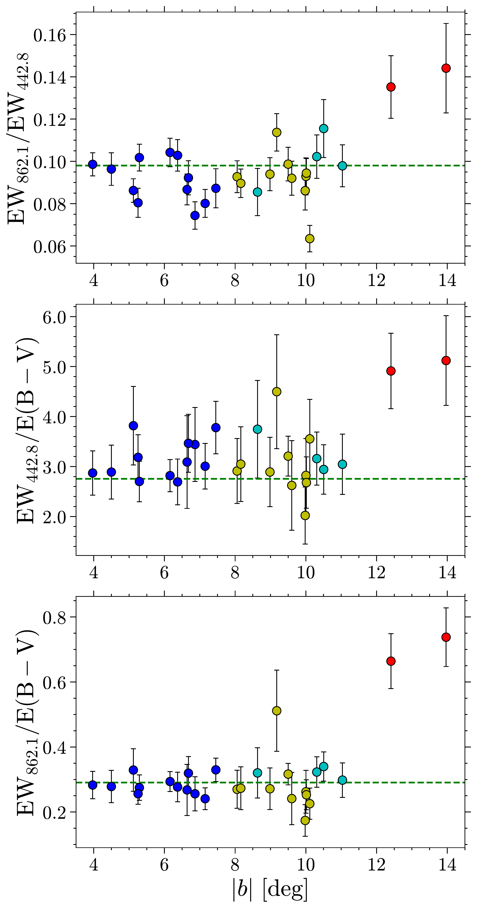

$\newcommand{\ensuremath}{}$
$\newcommand{\xspace}{}$
$\newcommand{\object}[1]{\texttt{#1}}$
$\newcommand{\farcs}{{.}''}$
$\newcommand{\farcm}{{.}'}$
$\newcommand{\arcsec}{''}$
$\newcommand{\arcmin}{'}$
$\newcommand{\ion}[2]{#1#2}$
$\newcommand{\textsc}[1]{\textrm{#1}}$
$\newcommand{\hl}[1]{\textrm{#1}}$
$\newcommand{\EBV}{E(B {-} V)}$
$\newcommand{\Teff}{T_{\rm eff}}$
$\newcommand{\logg}{{\rm log} g}$
$\newcommand{\feh}{\rm[Fe/H]}$
$\newcommand{\kms}{\rm km s^{-1}}$
$\newcommand{\Mathias}[1]{{\color{magenta} [Mathias:#1]}}$
$\newcommand{\hz}[1]{{\color{red} [He:#1]}}$
$\newcommand{\thebibliography}{\DeclareRobustCommand{\VAN}[3]{##3}\VANthebibliography}$

$\newcommand{$\ensuremath$}{}$
$\newcommand{$\xspace$}{}$
$\newcommand{$\object$}[1]{\texttt{#1}}$
$\newcommand{$\farcs$}{{.}''}$
$\newcommand{$\farcm$}{{.}'}$
$\newcommand{$\arcsec$}{''}$
$\newcommand{$\arcmin$}{'}$
$\newcommand{$\ion$}[2]{#1#2}$
$\newcommand{$\textsc$}[1]{\textrm{#1}}$
$\newcommand{$\hl$}[1]{\textrm{#1}}$
$\newcommand{$\EBV$}{E(B {-} V)}$
$\newcommand{$\Teff$}{T_{\rm eff}}$
$\newcommand{$\logg$}{{\rm log} g}$
$\newcommand{$\feh$}{\rm[Fe/H]}$
$\newcommand{$\kms$}{\rm km s^{-1}}$
$\newcommand{$\Mathias$}[1]{{\color{magenta} [Mathias:#1]}}$
$\newcommand{$\hz$}[1]{{\color{red} [He:#1]}}$
$\newcommand{$\thebibliography$}{\DeclareRobustCommand{\VAN}[3]{##3}\VANthebibliography}$

# The Pristine Inner Galaxy Survey (PIGS) VI: Different verticaldistributions between two DIBs at 442.8 nm and 862.1 nm

<mark>Appeared on: 2022-11-29</mark> - _13 pages, 14 figures, accepted for publication in MNRAS_

<mark><mark>He Zhao</mark></mark>, et al. -- incl., <mark><mark>Morgan Fouesneau</mark></mark>

**Abstract:** Although diffuse interstellar bands (DIBs) were discovered over 100 years ago, for most of them, their origins are still unknown.Investigation on the correlations between different DIBs is an important way to study the behavior and distributions of their carriers.Based on stacking thousands of spectra from the Pristine Inner Galaxy Survey, we study the correlations between two DIBs at 442.8 nm($\lambda$442.8) and 862.1 nm ($\lambda$862.1), as well as the dust grains, in a range of latitude spanning${\sim}22^{\circ}$($4\degr{<} |b| {<} 15\degr$) toward the Galactic center ($|\ell| {<} 11^{\circ}$). Tight linear intensity correlationscan be found between$\lambda$442.8,$\lambda$862.1, and dust grains for$|b| {<} 12^{\circ}$or$\EBV{>} 0.3$mag.For$|b| {>} 12^{\circ}$,$\lambda$442.8 and$\lambda$862.1 present larger relative strength with respect to the dust grains.A systematic variation of the relative strength between$\lambda$442.8 and$\lambda$862.1 with$|b|$and$\EBV$concludes that thetwo DIBs do not share a common carrier. Furthermore, the carrier of$\lambda$862.1 is more abundant at high latitudes than that of$\lambda$442.8. This work can be treated as an example showing the significance and potentials to the DIB research covering alarge latitude range.

**Figure 5. -** Spatial distribution $(\ell,b)$ of 29 PIGS fields, overplotted on the dust reddening map of \citet{Planck2016dust}.
    Different colors indicate different latitude groups defined in Sect. \ref{subsect:group}, that is red: G1, $|b| {>} 12^{\circ}$;
    yellow: G2, $8^{\circ} {<} |b| {<} 12^{\circ}$ and $\ell{>}{-}1^{\circ}$; cyan: G3, $8^{\circ} {<} |b| {<} 12^{\circ}$
    and $\ell{<}{-}1^{\circ}$, and blue: G4, $|b| {<} 8^{\circ}$. The median $\EBV$ of each filed is also indicated. (*fig:bgroup*)

**Figure 8. -** Variation of relative strength between DIBs $\lambda$442.8, $\lambda$862.1, and dust with Galactic latitude ($|b|$). The
  dashed green lines indicate their average strength ratios from linear fits (see Sect. \ref{subsect:linear}). See Sect.
  \ref{subsect:group} and Fig. \ref{fig:bgroup} for the point colors representing different latitude groups. (*fig:var-b*)

**Figure 9. -** The same as Fig. \ref{fig:var-b}, but for the variation with $\EBV$. (*fig:var-ebv*)

