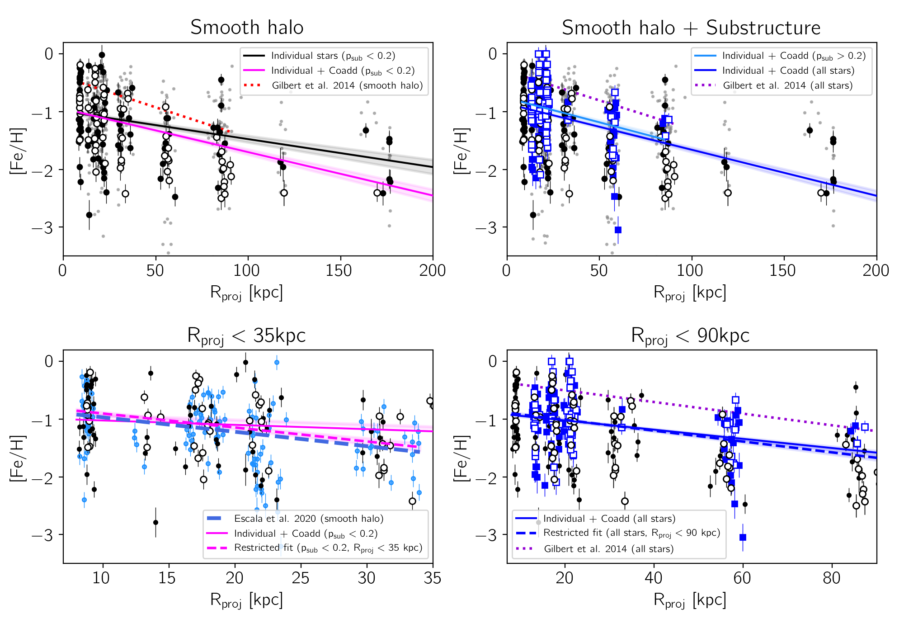
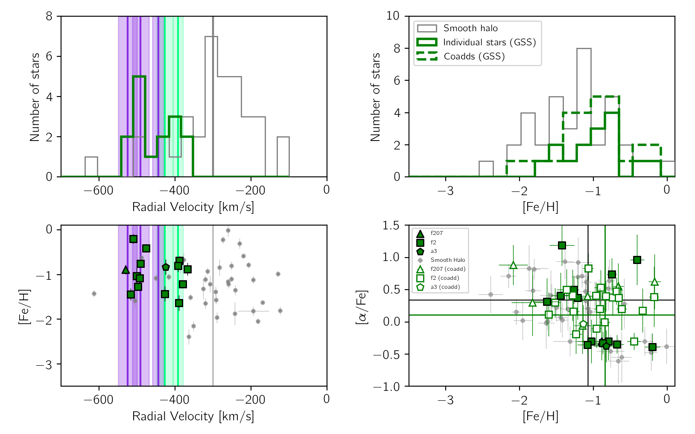
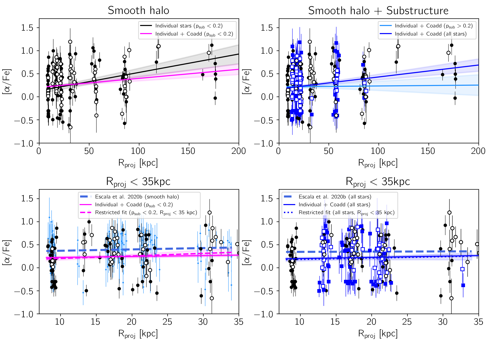

$\newcommand{\ensuremath}{}$
$\newcommand{\xspace}{}$
$\newcommand{\object}[1]{\texttt{#1}}$
$\newcommand{\farcs}{{.}''}$
$\newcommand{\farcm}{{.}'}$
$\newcommand{\arcsec}{''}$
$\newcommand{\arcmin}{'}$
$\newcommand{\ion}[2]{#1#2}$
$\newcommand{\textsc}[1]{\textrm{#1}}$
$\newcommand{\hl}[1]{\textrm{#1}}$
$\newcommand{\vdag}{(v)^\dagger}$
$\newcommand$
$\newcommand$
$\newcommand{\logg}{\log g }$
$\newcommand{\teff}{T_\mathrm{eff}}$
$\newcommand{\feh}{[Fe/H]}$
$\newcommand{\fehphot}{[Fe/H]_{\mathrm{phot}}}$
$\newcommand{\alphafe}{[\alpha/Fe]}$
$\newcommand{\rproj}{R_{\mathrm{proj}}}$
$\newcommand{\kms}{km s^{-1}}$
$\newcommand{\psub}{p_{\mathrm{sub}}}$
$\newcommand{\meanfeh}{\langle\feh \rangle}$
$\newcommand{\meanalphafe}{\langle\alphafe \rangle}$
$\newcommand{\sigmaalphafe}{\sigma\alphafe}$
$\newcommand{\sigmafeh}{\sigma\feh}$
$\newcommand{\gradientfehism}{-0.0048\pm0.0003}$
$\newcommand{\gradientfehicsm}{-0.0075\pm0.0003}$
$\newcommand{\gradientfehiss}{-0.0070\pm0.0007}$
$\newcommand{\gradientfehicss}{-0.0050\pm0.0003}$
$\newcommand{\gradientfehicsms}{-0.0050\pm0.0003}$
$\newcommand{\gradientfehicsmslimited}{-0.0094\pm0.0003}$
$\newcommand{\gradientalphaism}{+0.0040\pm0.0006}$
$\newcommand{\gradientalphaicsm}{+0.0020\pm0.0003}$
$\newcommand{\gradientalphaiss}{+0.0001\pm0.0008}$
$\newcommand{\gradientalphaicss}{+0.0002\pm0.0006}$
$\newcommand{\gradientalphaicsms}{+0.0026\pm0.0004}$
$\newcommand{\gradientalphaicsmlimited}{+0.0055\pm0.0020}$
$\newcommand{\gradientalphaicsmslimited}{+0.0030\pm0.0017}$
$\newcommand{\meanfehGSS}{-0.859\pm0.004}$
$\newcommand{\meanalphafeGSS}{0.107\pm0.017}$
$\newcommand{\meanfehGSSsmooth}{-1.080\pm0.005}$
$\newcommand{\meanalphafeGSSsmooth}{0.340\pm0.012}$
$\newcommand{\meanfehGSSenv}{-1.459\pm0.011}$
$\newcommand{\meanalphafeGSSenv}{0.066\pm0.026}$
$\newcommand{\meanfehGSSenvsmooth}{-1.391\pm0.013}$
$\newcommand{\meanalphafeGSSenvsmooth}{0.670\pm0.032}$
$\newcommand{\meanfehSE}{-0.927\pm0.005}$
$\newcommand{\meanalphafeSE}{0.063\pm0.017}$
$\newcommand{\meanfehSEsmooth}{-0.949\pm0.007}$
$\newcommand{\meanalphafeSEsmooth}{0.357\pm0.018}$
$\newcommand{\meanfehStC}{-1.313\pm0.007}$
$\newcommand{\meanalphafeStC}{0.199\pm0.020}$
$\newcommand{\meanfehStCsmooth}{-1.599\pm0.007}$
$\newcommand{\meanalphafeStCsmooth}{0.394\pm0.018}$

$\newcommand{$\ensuremath$}{}$
$\newcommand{$\xspace$}{}$
$\newcommand{$\object$}[1]{\texttt{#1}}$
$\newcommand{$\farcs$}{{.}''}$
$\newcommand{$\farcm$}{{.}'}$
$\newcommand{$\arcsec$}{''}$
$\newcommand{$\arcmin$}{'}$
$\newcommand{$\ion$}[2]{#1#2}$
$\newcommand{$\textsc$}[1]{\textrm{#1}}$
$\newcommand{$\hl$}[1]{\textrm{#1}}$
$\newcommand{$\vdag$}{(v)^\dagger}$
$\newcommand$
$\newcommand$
$\newcommand{$\logg$}{\log g }$
$\newcommand{$\teff$}{T_\mathrm{eff}}$
$\newcommand{$\feh$}{[Fe/H]}$
$\newcommand{$\feh$phot}{[Fe/H]_{\mathrm{phot}}}$
$\newcommand{$\alphafe$}{[\alpha/Fe]}$
$\newcommand{$\rproj$}{R_{\mathrm{proj}}}$
$\newcommand{$\kms$}{km s^{-1}}$
$\newcommand{$\psub$}{p_{\mathrm{sub}}}$
$\newcommand{$\meanfeh$}{\langle$\feh$ \rangle}$
$\newcommand{$\meanalphafe$}{\langle$\alphafe$ \rangle}$
$\newcommand{$\sigmaalphafe$}{\sigma$\alphafe$}$
$\newcommand{$\sigmafeh$}{\sigma$\feh$}$
$\newcommand{$\gradientfehism$}{-0.0048\pm0.0003}$
$\newcommand{$\gradientfehicsm$}{-0.0075\pm0.0003}$
$\newcommand{$\gradientfehiss$}{-0.0070\pm0.0007}$
$\newcommand{$\gradientfehicss$}{-0.0050\pm0.0003}$
$\newcommand{$\gradientfehicsm$s}{-0.0050\pm0.0003}$
$\newcommand{$\gradientfehicsm$slimited}{-0.0094\pm0.0003}$
$\newcommand{$\gradientalphaism$}{+0.0040\pm0.0006}$
$\newcommand{$\gradientalphaicsm$}{+0.0020\pm0.0003}$
$\newcommand{$\gradientalphaiss$}{+0.0001\pm0.0008}$
$\newcommand{$\gradientalphaicss$}{+0.0002\pm0.0006}$
$\newcommand{$\gradientalphaicsm$s}{+0.0026\pm0.0004}$
$\newcommand{$\gradientalphaicsm$limited}{+0.0055\pm0.0020}$
$\newcommand{$\gradientalphaicsm$slimited}{+0.0030\pm0.0017}$
$\newcommand{$\meanfeh$GSS}{-0.859\pm0.004}$
$\newcommand{$\meanalphafe$GSS}{0.107\pm0.017}$
$\newcommand{$\meanfeh$GSSsmooth}{-1.080\pm0.005}$
$\newcommand{$\meanalphafe$GSSsmooth}{0.340\pm0.012}$
$\newcommand{$\meanfeh$GSSenv}{-1.459\pm0.011}$
$\newcommand{$\meanalphafe$GSSenv}{0.066\pm0.026}$
$\newcommand{$\meanfeh$GSSenvsmooth}{-1.391\pm0.013}$
$\newcommand{$\meanalphafe$GSSenvsmooth}{0.670\pm0.032}$
$\newcommand{$\meanfeh$SE}{-0.927\pm0.005}$
$\newcommand{$\meanalphafe$SE}{0.063\pm0.017}$
$\newcommand{$\meanfeh$SEsmooth}{-0.949\pm0.007}$
$\newcommand{$\meanalphafe$SEsmooth}{0.357\pm0.018}$
$\newcommand{$\meanfeh$StC}{-1.313\pm0.007}$
$\newcommand{$\meanalphafe$StC}{0.199\pm0.020}$
$\newcommand{$\meanfeh$StCsmooth}{-1.599\pm0.007}$
$\newcommand{$\meanalphafe$StCsmooth}{0.394\pm0.018}$

#  throughout the M31 Halo with SPLASH

<mark>Appeared on: 2022-11-29</mark> - _Submitted to ApJ_

<mark>J. Leigh Wojno</mark>, et al.

**Abstract:** We present spectroscopic chemical abundances of red giant branch (RGB) stars in Andromeda (M31), using medium resolution ($R\sim6000$) spectra obtained via the Spectroscopic and Photometric Landscape of Andromeda's Stellar Halo (SPLASH) survey. In addition to individual chemical abundances, we coadd low signal-to-noise ratio (S/N) spectra of stars to obtain a high enough to measure average$\feh$and$\alphafe$abundances. We obtain individual and coadded measurements for$\feh$and$\alphafe$for M31 halo stars, covering a range of 9--180 kpc in projected radius from the center of M31. With these measurements, we greatly increase the number of outer halo ($\rproj$$> 50$kpc) M31 stars with spectroscopic$\feh$and$\alphafe$, adding abundance measurements for 45 individual stars and 33 coadds from a pool of an additional 174 stars. We measure the spectroscopic metallicity ($\feh$) gradient, finding a negative radial gradient of$-0.0050\pm0.0003$for all stars in the halo, consistent with gradient measurements obtained using photometric metallicities. Using the first measurements of$\alphafe$for M31 halo stars covering a large range of projected radii, we find a positive gradient ($+0.0026\pm0.0004$) in$\alphafe$as a function of projected radius. We also explore the distribution in$\feh$--$\alphafe$space as a function of projected radius for both individual and coadded measurements in the smooth halo, and compare these measurements to those stars potentially associated with substructure. These spectroscopic abundance distributions highlight the substantial evidence that M31 has had an appreciably different formation and merger history compared to our own Galaxy.

**Figure 7. -** Spectroscopic $\feh$ versus projected radius for stars with individual/coadded (filled/open circles) $\feh$ measurements.  Grey points are photometric $\feh$ measurements for our sample. Top left: The best-fit spectroscopic $\feh$ gradient for individual smooth halo stars (Section \ref{sec:feh_smooth_halo}, solid black), where the shaded regions indicate a 1$\sigma$ standard deviation. The red dotted line represents the gradient measured by \citet{gilbert14} for smooth halo stars, using photometric $\feh$. The magenta line shows the best-fit gradient calculated using both individual stars and coadds (Section \ref{sec:coadded_abundances}). Bottom left: Individual and coadded (filled/open circles) $\feh$ measurements, but for a limited radial range ($\rproj$$< 35$ kpc). The sample of \citet{escala20b} is shown as light blue points, and the gradient measured with their sample is shown as a dashed blue line. The solid magenta line is the same as the top-left panel. We also show the fit after limiting our sample to the same radial range (dashed magenta). Top right: Individual/coadded (filled/open dark blue squares) $\feh$ measurements for stars potentially associated with substructure (Section \ref{sec:substructure_probability}), with the best-fit gradient to individual and coadded measurements from the substructure sample (cyan), and the gradient including all stars (both the smooth halo and substructure samples; blue). The photometric $\feh$ gradient from \citet{gilbert14}, fit using smooth halo and substructure stars, is shown as a dashed purple line. Bottom right: The same as above, but for a limited range ($\rproj$$<90$kpc). Regardless of our sample selection, we recover a statistically significant metallicity gradient in the halo of M31. (*fig:metallicity_gradient_individ*)

**Figure 11. -** Top left: Histogram of the radial velocities for smooth halo stars with secure abundances in the radial range $15 <$\rproj$< 50$ kpc (grey) and stars associated with substructure in fields on the GSS core (f207, f2, a3; green). The vertical lines represent the mean line-of-sight velocity for the GSS (purple),
    and the secondary kinematically cold component (light green, Section \ref{sec:substructure_gss}) for each field shown \citep[][see their Table 4]{gilbert18}. The shaded regions indicate the corresponding velocity dispersion.
    The systemic velocity ($-300.0$\kms) of M31 is in grey. Top right: histograms of spectroscopic $\feh$ for the smooth halo (grey), individual (15 stars; solid green) and coadded stars potentially associated with substructure in these fields (27 coadds representing 136 stars; dashed green). Bottom left: Spectroscopic $\feh$ as a function of line-of-sight velocity for substructure stars (outlined green symbols) and smooth halo stars (grey). We show the same mean and dispersion velocity for the GSS and KCC as in the top left panel.
    Bottom right: $\feh$\--$\alphafe$ measurements for individual substructure stars (open green symbols), as well as coadded groupings of stars (filled green symbols).
    We also show the $\feh$\--$\alphafe$ distribution of smooth halo stars in grey. Solid lines show the mean $\feh$ and $\alphafe$ for the entire substructure sample (green), and the smooth halo (grey). (*fig:substr_comparison_gss*)

**Figure 8. -** The same as Figure \ref{fig:metallicity_gradient_individ}, but for the abundance gradient with respect to $\alphafe$. Top left: The best-fit spectroscopic $\alphafe$ gradient fit to individual and coadded abundance measurements is shown as a solid magenta line, with the shaded regions indicating a 1$\sigma$ standard deviation. The gradient fit using only individual measurements is shown as a black line. Bottom left: Zoomed in version of the top panel, now showing spectroscopic measurements from \citet{escala20b}(blue points), with their gradient (blue dashed line). Using the same radial range as in \citet{escala20b}, we find a gradient of $\gradientalphaicsm$limited dex kpc$^{-1}$(magenta dashed line). Top right: The best-fit gradient for individual and coadded stars associated with substructure is shown as the light blue line, with the gradient measured for all stars (individual and coadded, smooth halo and substructure) shown in dark blue. Bottom right: Zoomed in version of the top right panel, showing the best-fit gradient of all stars restricted to the same radial range as in \citet{escala20b}($\gradientalphaicsm$slimited dex kpc$^{-1}$, blue dotted line). (*fig:alphafe_gradient*)

