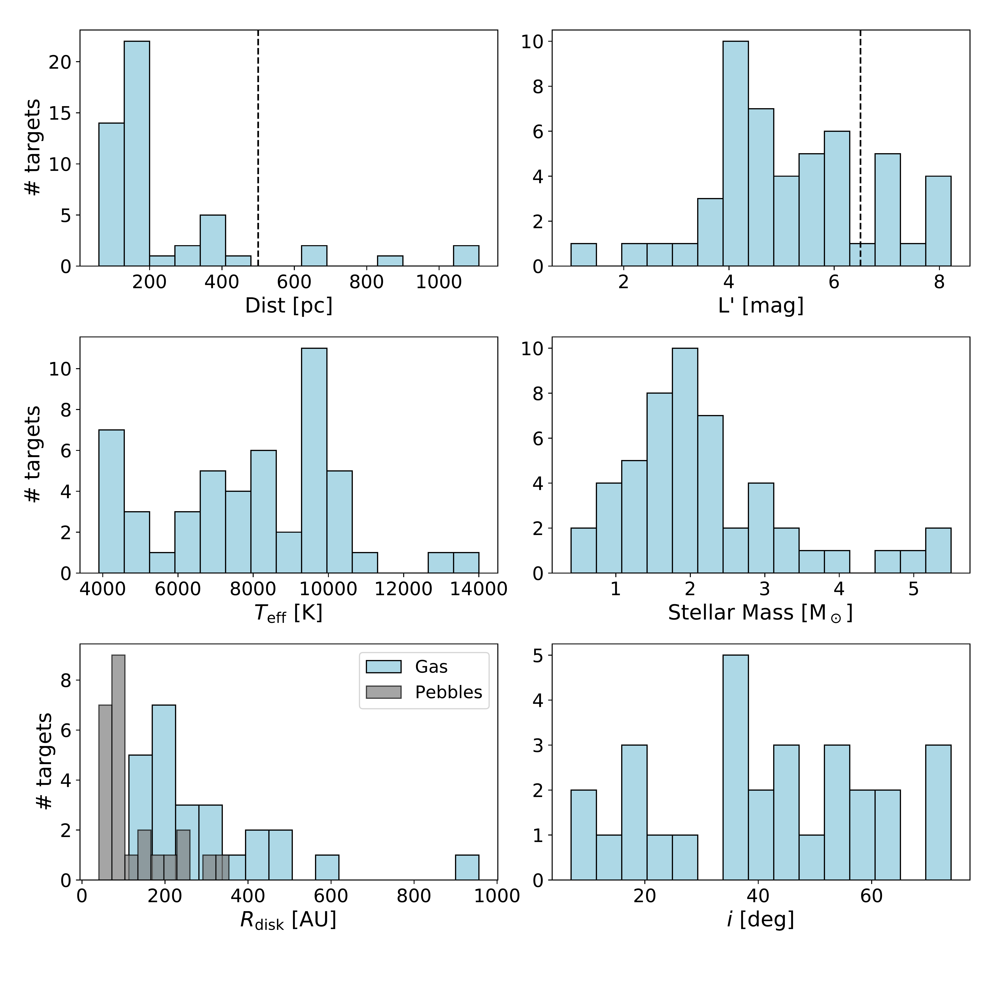
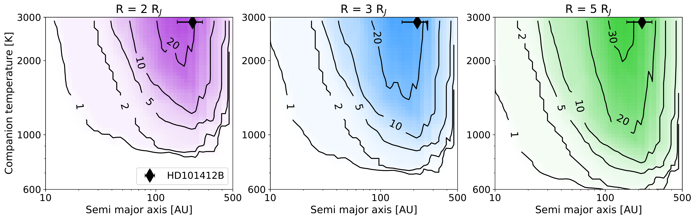
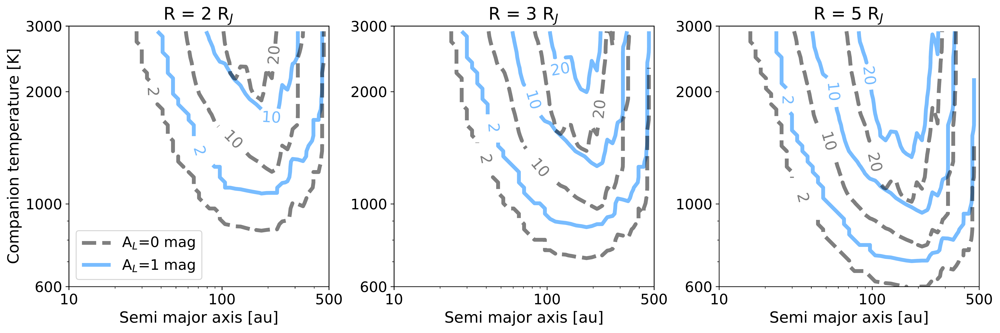

$\newcommand{\ensuremath}{}$
$\newcommand{\xspace}{}$
$\newcommand{\object}[1]{\texttt{#1}}$
$\newcommand{\farcs}{{.}''}$
$\newcommand{\farcm}{{.}'}$
$\newcommand{\arcsec}{''}$
$\newcommand{\arcmin}{'}$
$\newcommand{\ion}[2]{#1#2}$
$\newcommand{\textsc}[1]{\textrm{#1}}$
$\newcommand{\hl}[1]{\textrm{#1}}$
$\newcommand{\angstrom}{\mbox{\normalfont\AA}}$
$\newcommand{\todo}[1]{\textcolor{red}{#1}}$
$\newcommand{\verify}[1]{\textcolor{violet}{#1}}$
$\newcommand{\ok}[1]{\textcolor{green}{#1}}$
$\newcommand{\Lsun}{L_\odot}$
$\newcommand{\Msun}{M_\odot}$
$\newcommand{\MJ}{M_\mathrm{J}}$
$\newcommand{\Mp}{M_\mathrm{p}}$
$\newcommand{\Macc}{\dot{M}_\mathrm{acc}}$
$\newcommand{\RJ}{R_\mathrm{J}}$
$\newcommand{\Rp}{R_\mathrm{p}}$
$\newcommand{\Teff}{T_{\text{eff}}}$
$\newcommand{\MJyr}{\MJ \mathrm{yr}^{-1}}$
$\newcommand{\Rd}{R_\mathrm{dust}}$
$\newcommand{\Rg}{R_\mathrm{gas}}$
$\newcommand{\micron}{\mu\mathrm{m}}$
$\newcommand{\Lacc}{L_\mathrm{acc}}$
$\newcommand{\arraystretch}{1.25}$
$\newcommand{\arraystretch}{1.45}$
$\newcommand{\arraystretch}{1.25}$

$\newcommand{$\ensuremath$}{}$
$\newcommand{$\xspace$}{}$
$\newcommand{$\object$}[1]{\texttt{#1}}$
$\newcommand{$\farcs$}{{.}''}$
$\newcommand{$\farcm$}{{.}'}$
$\newcommand{$\arcsec$}{''}$
$\newcommand{$\arcmin$}{'}$
$\newcommand{$\ion$}[2]{#1#2}$
$\newcommand{$\textsc$}[1]{\textrm{#1}}$
$\newcommand{$\hl$}[1]{\textrm{#1}}$
$\newcommand{$\angstrom$}{\mbox{\normalfont\AA}}$
$\newcommand{$\todo$}[1]{\textcolor{red}{#1}}$
$\newcommand{$\verify$}[1]{\textcolor{violet}{#1}}$
$\newcommand{$\ok$}[1]{\textcolor{green}{#1}}$
$\newcommand{$\Lsun$}{L_\odot}$
$\newcommand{$\Msun$}{M_\odot}$
$\newcommand{$\MJ$}{M_\mathrm{J}}$
$\newcommand{$\Mp$}{M_\mathrm{p}}$
$\newcommand{$\Macc$}{\dot{M}_\mathrm{acc}}$
$\newcommand{$\RJ$}{R_\mathrm{J}}$
$\newcommand{$\Rp$}{R_\mathrm{p}}$
$\newcommand{$\Teff$}{T_{\text{eff}}}$
$\newcommand{$\MJ$yr}{$\MJ$ \mathrm{yr}^{-1}}$
$\newcommand{$\Rd$}{R_\mathrm{dust}}$
$\newcommand{$\Rg$}{R_\mathrm{gas}}$
$\newcommand{$\micron$}{\mu\mathrm{m}}$
$\newcommand{$\Lacc$}{L_\mathrm{acc}}$
$\newcommand{$\arraystretch$}{1.25}$
$\newcommand{$\arraystretch$}{1.45}$
$\newcommand{$\arraystretch$}{1.25}$

# The reduced images and contrast curves are only available at the CDS via anonymous ftp to cdsarc.u-strasbg.fr (130.79.128.5) or via https://cdsarc.u-strasbg.fr/viz-bin/qcat?J/A+A/

<mark>Appeared on: 2022-11-29</mark> - _25 pages, 16 figures, 3 tables, accepted for publication in A&A_

Gabriele Cugno, et al. -- incl., <mark><mark>Ralf Launhardt</mark></mark>, <mark><mark>Thomas Henning</mark></mark>, <mark><mark>André Müller</mark></mark>

**Abstract:** We present the statistical analysis of a subsample of 45 young stars surrounded by protoplanetary disks (PPDs). This is the largest imaging survey uniquely focused on PPDs to date. Our goal is to search for young forming companions embedded in the disk material and to constrain their occurrence rate in relation to the formation mechanism. We used principal component analysis based point spread function subtraction techniques to reveal young companions forming in the disks. We calculated detection limits for our datasets and adopted a black-body model to derive temperature upper limits of potential forming planets. We then used Monte Carlo simulations to constrain the population of forming gas giant companions and compare our results to different types of formation scenarios. Our data revealed a new binary system (HD38120) and a recently identified triple system with a brown dwarf companion orbiting a binary system (HD101412), in addition to 12 known companions. Furthermore, we detected signals from 17 disks, two of which (HD72106 and TCrA) were imaged for the first time. We reached median detection limits of L =15.4 mag at 2.0 arcsec, which were used to investigate the temperature of potentially embedded forming companions. We can constrain the occurrence of forming planets with semi-major axis a in [20 - 500] au and Teff in [600 - 3000] K, in line with the statistical results obtained for more evolved systems from other direct imaging surveys. The NaCo-ISPY data confirm that massive bright planets accreting at high rates are rare. More powerful instruments with better sensitivity in the near- to mid-infrared are likely required to unveil the wealth of forming planets sculpting the observed disk substructures. 

**Figure 1. -** Stellar and disk parameters for the objects in the ISPY PPD sample. In the top row the histogram for the distances (left) and $L'$ observed magnitudes (right) are reported. Stellar effective temperatures (left) and masses (right) are shown in the middle row. Finally, the bottom row provides the distributions of the disk outer radius (gas and mm-dust) on the left and disk inclinations (whenever measured) on the right. The dashed vertical lines represent the distance cutoff applied in Sect. \ref{sec:additional_selection}({\it top left panel}) and the limiting brightness for the coronagraphic observations ({\it top right panel}), respectively. (*fig:system_properties*)

**Figure 11. -** Depth of search for the 45 ISPY-PPD targets included in the analysis, reporting the number of stars to which the survey is complete for young forming planets in the $\Teff-a$ parameter space. The three plots represent maps when assuming $\Rp=2,3,5 $\RJ$$({\it left, mid} and {\it right} panels, respectively). Overplotted as full black marker the companion HD101412 B.  (*fig:prob_map*)

**Figure 16. -** Survey completeness maps obtained considering an additional extinction factor $A_{L'}=1.0$ mag. The three plots represent maps when assuming $\Rp=2,3,5 $\RJ$$({\it left, middle} and {\it right} panels, respectively). Solid contours limit the areas with completeness $2$, $10$ and $20$, while dotted lines are reported from Fig. \ref{fig:prob_map} and limit the same detection probability values when no extinction effects are included, thus allowing the direct comparison between the two cases. (*fig:map_extinction*)

