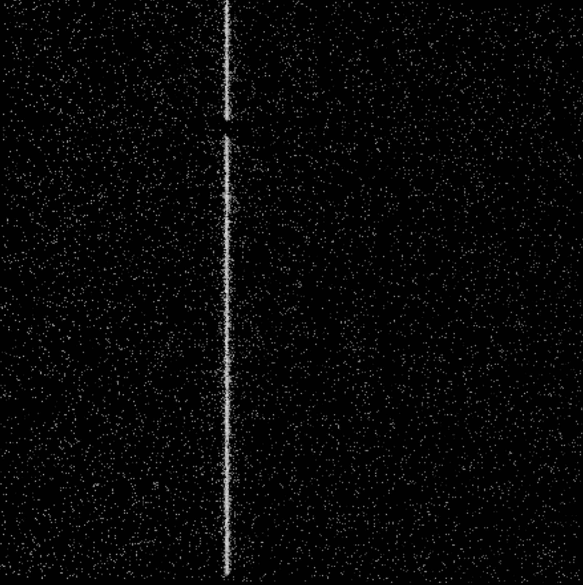
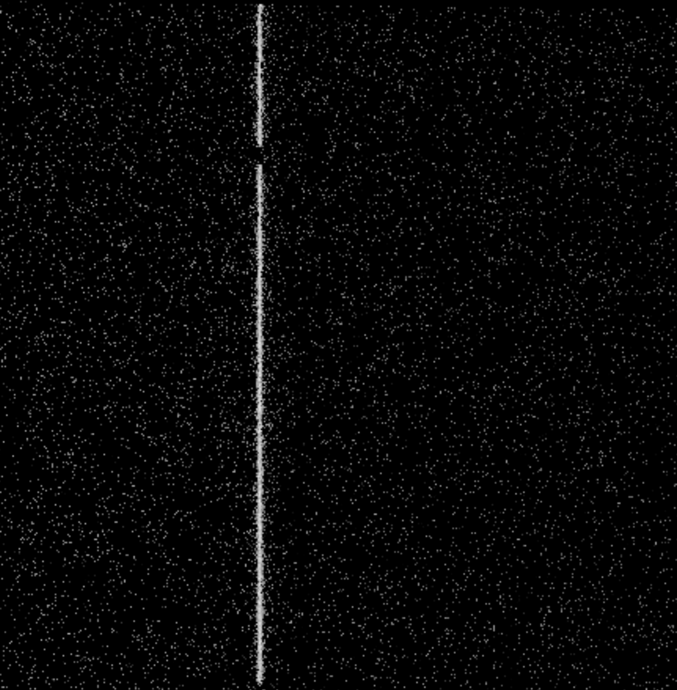
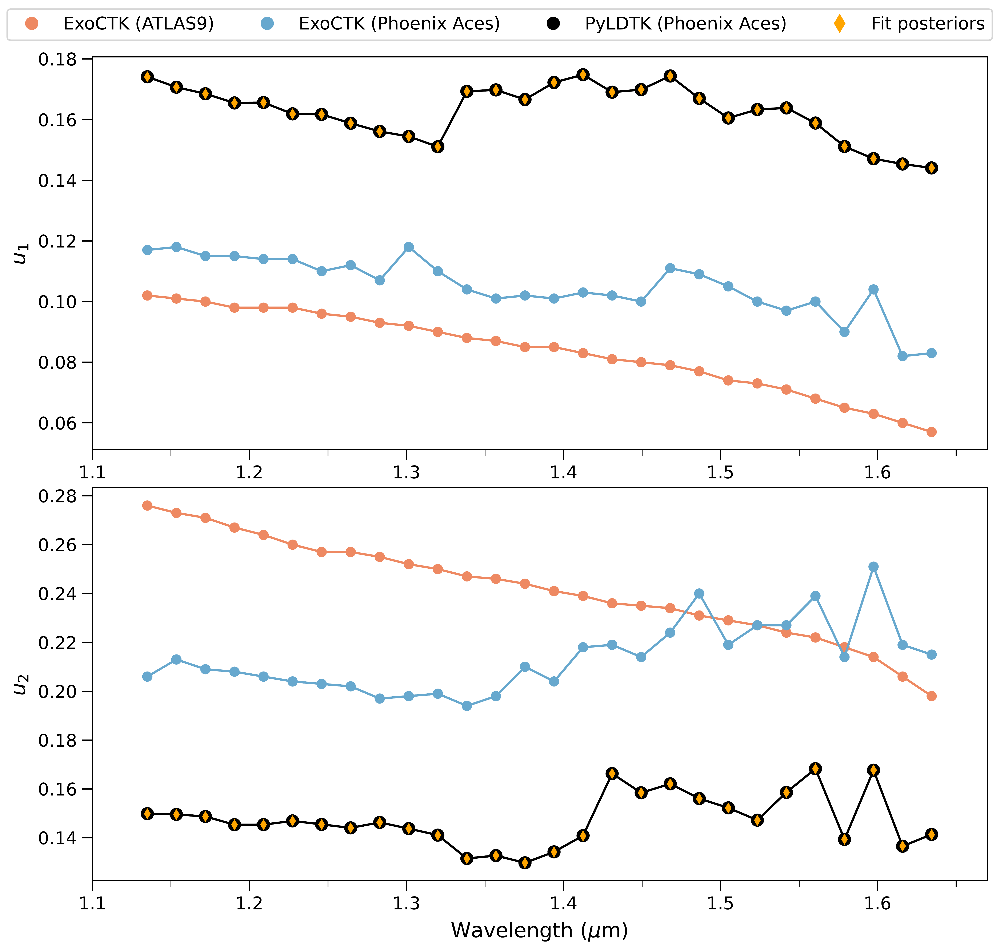
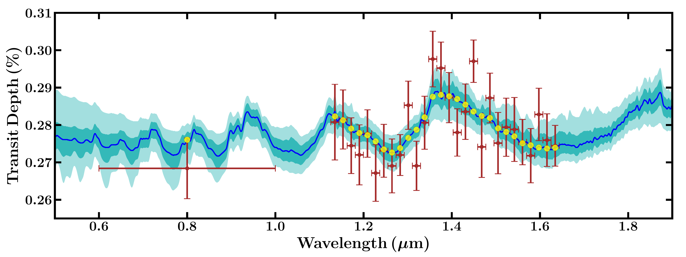
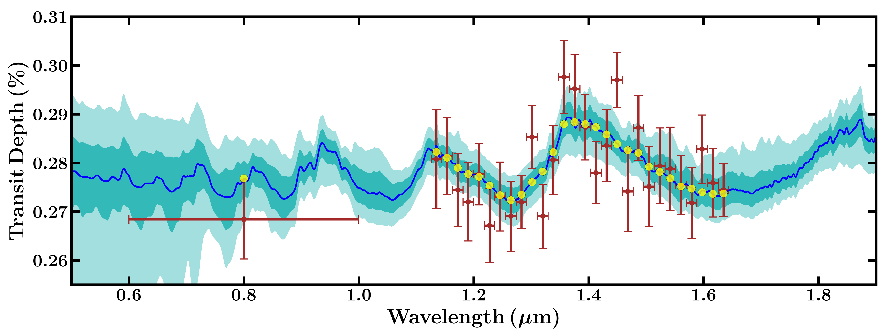

$\newcommand{\ensuremath}{}$
$\newcommand{\xspace}{}$
$\newcommand{\object}[1]{\texttt{#1}}$
$\newcommand{\farcs}{{.}''}$
$\newcommand{\farcm}{{.}'}$
$\newcommand{\arcsec}{''}$
$\newcommand{\arcmin}{'}$
$\newcommand{\ion}[2]{#1#2}$
$\newcommand{\textsc}[1]{\textrm{#1}}$
$\newcommand{\hl}[1]{\textrm{#1}}$
$\newcommand{\footnote}[1]{}$
$\newcommand{\Rp}{R_p}$
$\newcommand{\Mp}{M_p}$
$\newcommand{\Rs}{R_{\star}}$
$\newcommand{\aRs}{a/R_{\star}}$
$\newcommand{\JDUTC}{JD_{\textnormal{UTC}}}$
$\newcommand{\RpRs}{\Rp/\Rs}$
$\newcommand{\Rjup}{R_{\textnormal{J}}}$
$\newcommand{\Mjup}{M_{\textnormal{J}}}$
$\newcommand{\Teq}{T_{\textnormal{eq}}}$
$\newcommand{\RE}{R_{\Earth}}$
$\newcommand{\ME}{M_{\Earth}}$
$\newcommand{\RS}{R_{\odot}}$
$\newcommand{\mb}{\mathbf}$
$\newcommand{\gb}{\boldsymbol}$
$\newcommand{\tn}{\textnormal}$
$\newcommand{\um}{\mu\textnormal{m}}$
$\newcommand{\Teff}{T_{\textnormal{eff}}}$
$\newcommand{\FeH}{[{\rm{Fe}/\rm{H}}]}$
$\newcommand{\logg}{\log_{10} g}$
$\newcommand{\XHtwoO}{X_{\rm{H}_2\rm{O}}}$

$\newcommand{\ensuremath}{}$
$\newcommand{\xspace}{}$
$\newcommand{\object}[1]{\texttt{#1}}$
$\newcommand{\farcs}{{.}''}$
$\newcommand{\farcm}{{.}'}$
$\newcommand{\arcsec}{''}$
$\newcommand{\arcmin}{'}$
$\newcommand{\ion}[2]{#1#2}$
$\newcommand{\textsc}[1]{\textrm{#1}}$
$\newcommand{\hl}[1]{\textrm{#1}}$
$\newcommand{\footnote}[1]{}$
$\newcommand{\Rp}{R_p}$
$\newcommand{\Mp}{M_p}$
$\newcommand{\Rs}{R_{\star}}$
$\newcommand{\aRs}{a/R_{\star}}$
$\newcommand{\JDUTC}{JD_{\textnormal{UTC}}}$
$\newcommand{\RpRs}{\Rp/\Rs}$
$\newcommand{\Rjup}{R_{\textnormal{J}}}$
$\newcommand{\Mjup}{M_{\textnormal{J}}}$
$\newcommand{\Teq}{T_{\textnormal{eq}}}$
$\newcommand{\RE}{R_{\Earth}}$
$\newcommand{\ME}{M_{\Earth}}$
$\newcommand{\RS}{R_{\odot}}$
$\newcommand{\mb}{\mathbf}$
$\newcommand{\gb}{\boldsymbol}$
$\newcommand{\tn}{\textnormal}$
$\newcommand{\um}{\mu\textnormal{m}}$
$\newcommand{\Teff}{T_{\textnormal{eff}}}$
$\newcommand{\FeH}{[{\rm{Fe}/\rm{H}}]}$
$\newcommand{\logg}{\log_{10} g}$
$\newcommand{\XHtwoO}{X_{\rm{H}_2\rm{O}}}$

# Hubble Space Telescope transmission spectroscopy for the temperate sub-Neptune TOI-270d: a possible hydrogen-rich atmosphere containing water vapour

<mark>Appeared on: 2022-11-28</mark> - _Accepted for publication in AAS journals on November 22, 2022 (received July 5, 2022; revised October 30, 2022)_

<mark>Thomas Mikal-Evans</mark>, et al. -- incl., <mark>Laura Kreidberg</mark>

**Abstract:** TOI-270 d is a temperate sub-Neptune discovered by the Transiting Exoplanet Survey Satellite (TESS) around a bright ( $J=9.1$ mag) M3V host star. With an approximate radius of $2 \RE$ and equilibrium temperature of 350 K, TOI-270 d is one of the most promising small exoplanets for atmospheric characterisation using transit spectroscopy. Here we present a primary transit observation of TOI-270 d made with the Hubble Space Telescope (HST) Wide Field Camera 3 (WFC3) spectrograph across the 1.126-1.644 $\um$ wavelength range, and a 95 \% credible upper limit of $8.2 \times 10^{-14}$ erg s $^{-1}$ cm $^{-2}$ Å $^{-1}$ arcsec $^{-2}$ for the stellar Ly $\alpha$ emission obtained using the Space Telescope Imaging Spectrograph (STIS). The transmission spectrum derived from the TESS and WFC3 data provides evidence for molecular absorption by a hydrogen-rich atmosphere at ${4\sigma}$ significance relative to a featureless spectrum. The strongest evidence for any individual absorber is obtained for H $_2$ O, which is favoured at 3 $\sigma$ significance. When retrieving on the WFC3 data alone and allowing for the possibility of a heterogeneous stellar brightness profile, the detection significance of H $_2$ O is reduced to 2.8 $\sigma$ . Further observations are therefore required to robustly determine the atmospheric composition of TOI-270 d and assess the impact of stellar heterogeneity. If confirmed, our findings would make TOI-270 d one of the smallest and coolest exoplanets to date with detected atmospheric spectral features.

**Figure 4. -** Calibrated HST STIS Ly$\alpha$ observations of TOI-270. _(Top)_ Calibrated spectrum taken on 2020 January 31. Wavelength dispersion direction is along the horizontal axis. The bright stripe down the middle is the Earth's Ly$\alpha$ geocoronal emission. Ly$\alpha$ emission from TOI-270 would be visible alongside this line at the Doppler shift corresponding to the velocity difference between HST and the target. We find no significant evidence of Ly$\alpha$ emission in this exposure. _(Bottom)_ Identical as above, but for a second exposure taken on 2020 January 29.  (*fig:STIS_UV*)

**Figure 6. -** Coefficients ($u_1$, $u_2$) for a quadratic stellar limb darkening law obtained using ExoCTK and PyLDTK. Separate sets of ExoCTK coefficients were computed assuming an ATLAS 9 (blue circles) and Phoenix ACES (red circles) stellar model. The PyLDTK coefficients (black points) assume a Phoenix ACES stellar model. Posterior distributions obtained from the light curve fits are shown as orange diamonds, with $1\sigma$ credible intervals that are smaller than the marker symbols. (*fig:limbDarkeningCoeffs*)

**Figure 9. -** Observations and retrieval of the transmission spectrum of TOI-270 d. Top: Retrieval with baseline planetary atmosphere model and no stellar heterogeneity. Bottom: Retrieval including stellar heterogeneity. Both retrievals included the TESS (photometric point at 0.8 $\mu$m) and WFC3 (spectrum between 1.1-1.7 $\mu$m) data, shown in red. The blue curve shows the median-fit model spectrum and the light blue shaded regions show the $1\sigma$ and $2\sigma$ credible ranges. The binned model points for the median-fit spectrum are shown as yellow circles. (*fig:spectrum*)

