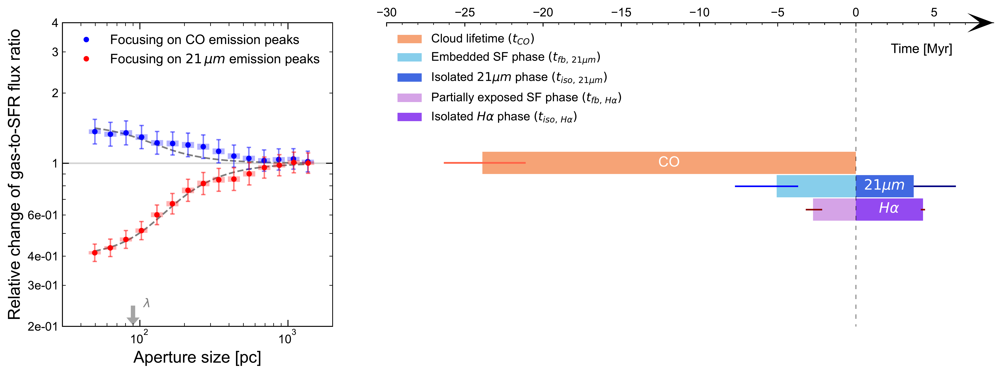
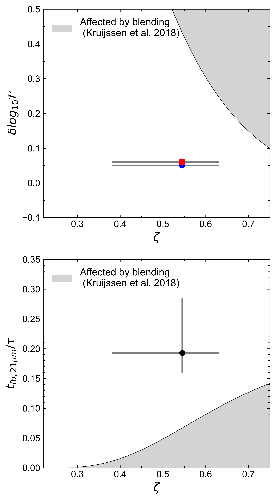

$\newcommand{\ensuremath}{}$
$\newcommand{\xspace}{}$
$\newcommand{\object}[1]{\texttt{#1}}$
$\newcommand{\farcs}{{.}''}$
$\newcommand{\farcm}{{.}'}$
$\newcommand{\arcsec}{''}$
$\newcommand{\arcmin}{'}$
$\newcommand{\ion}[2]{#1#2}$
$\newcommand{\textsc}[1]{\textrm{#1}}$
$\newcommand{\hl}[1]{\textrm{#1}}$
$\newcommand{\vdag}{(v)^\dagger}$
$\newcommand$
$\newcommand$

$\newcommand{\ensuremath}{}$
$\newcommand{\xspace}{}$
$\newcommand{\object}[1]{\texttt{#1}}$
$\newcommand{\farcs}{{.}''}$
$\newcommand{\farcm}{{.}'}$
$\newcommand{\arcsec}{''}$
$\newcommand{\arcmin}{'}$
$\newcommand{\ion}[2]{#1#2}$
$\newcommand{\textsc}[1]{\textrm{#1}}$
$\newcommand{\hl}[1]{\textrm{#1}}$
$\newcommand{\vdag}{(v)^\dagger}$
$\newcommand$
$\newcommand$

# PHANGS-JWST First Results: Duration of the early phase of massive star formation in NGC 628

<mark>Appeared on: 2022-11-28</mark> - _15 pages, 4 figures, 2 tables; accepted for publication in ApJL as part of a PHANGS-JWST First Results Focus issue_

Jaeyeon Kim, et al. -- incl., <mark>Frank Bigiel</mark>, <mark>Annie~Hughes</mark>, <mark>Kathryn Kreckel</mark>, <mark>Janice C. Lee</mark>, <mark>Eva Schinnerer</mark>, <mark>Rowan~J.~Smith</mark>

**Abstract:** The earliest stages of star formation, when young stars are still deeply embedded in their natal clouds, represent a critical phase in the matter cycle between gas clouds and young stellar regions. Until now, the high-resolution infrared observations required for characterizing this heavily obscured phase (during which massive stars have formed, but optical emission is not detected) could only be obtained for a handful of the most nearby galaxies. One of the main hurdles has been the limited angular resolution of the _Spitzer Space Telescope_ . With the revolutionary capabilities of the JWST, it is now possible to investigate the matter cycle during the earliest phases of star formation as a function of the galactic environment. In this Letter, we demonstrate this by measuring the duration of the embedded phase of star formation and the implied time over which molecular clouds remain inert in the galaxy NGC 628 at a distance of 9.8 Mpc, demonstrating that the cosmic volume where this measurement can be made has increased by a factor of $>100$ compared to _Spitzer_ . We show that young massive stars remain embedded for $5.1_{-1.4}^{+2.7}$ Myr ( $2.3_{-1.4}^{+2.7}$ Myr of which being heavily obscured), representing $\sim 20 \% $ of the total cloud lifetime. These values are in broad agreement with previous measurements in five nearby ( $D < 3.5$ Mpc) galaxies and constitute a proof of concept for the systematic characterization of the early phase of star formation across the nearby galaxy population with the PHANGS--JWST survey.

**Figure 4. -** The left panel shows the measured deviation of gas-to-SFR tracer (CO-to-21 $\mu$m) flux ratios compared to the galactic average as a function of the size of apertures centered on CO and 21 $\mu$m emission peaks. The data underlying this figure can be found in Appendix \ref{app:data}. The error bars show the 1$\sigma$ uncertainty of each measurement whereas the shaded region within the error bar indicates the effective 1$\sigma$ error, considering the covariance between data points. Our best-fitting model (dashed line), as well as the galactic average (horizontal line) are also shown. The constrained $\lambda$ is indicated with a downward arrow and other best-fitting parameters ($t_{\rm 21 \mu m}$ and $t_{\rm fb, 21 \mu m}$) are listed in Table \ref{tab:result}. The right panel illustrates the evolutionary sequence from inert molecular clouds to embedded star formation, partially exposed star formation, and finally to fully revealed young stellar regions. The duration of the CO emitting phase ($t_{\rm CO}$) is shown in orange while the time during which 21 $\mu$m and H$\alpha$ emission are detected without associated CO emission are shown in dark blue and dark purple, respectively. The feedback timescale, which is the time for which both CO and a SFR tracer are found coincident, is shown in light blue (for 21 $\mu$m) and light purple (for H$\alpha$). The error bars indicate the 1$\sigma$ uncertainty for each measurement. (*fig:result*)

**Figure 2. -** The top panel shows the flux contrast ($\rm{\delta}log_{10}\mathcal{F}$) used to identify peaks on CO (blue) 21 $\mu$m (red) map as a function of the average filling factor $\zeta$. The bottom panel shows the ratio of the feedback timescale ($t_{\rm fb, 21\mu m}$) and the total duration of the GMC lifecycle ($\tau$) as a function of $\zeta$. In both panels, the shaded region shows the parameter space where crowding of sources can lead to an overestimation of the feedback timescale. Our data points are well outside of this region, confirming that we sufficiently resolve star-forming regions and our measurement of $t_{\rm fb, 21 \mu m}$ is reliable.    (*fig:blending*)

**Figure 3. -** _Top:_ Comparison between the _Spitzer_ 24 $\mu$m map (left) and the JWST 21 $\mu$m map (middle), which has 10 times better resolution (0.67$\arcsec$) compared to _Spitzer_(6$\arcsec$). Orange circles show the beam in each panel. _Bottom:_ Composite three color images obtained by combining CO (blue), 21 $\mu$m (green), and H$\alpha$(red). The bottom right panel shows the zoomed-in image of the white rectangular region marked in the bottom left panel, with symbols indicating the distribution of emission peaks using the same color scheme. Emission peaks of CO (indicated with $\textcolor{blue}{\times}$), 21 $\mu$m ($\textcolor{green}{+}$), and H$\alpha$($\textcolor{red}{\triangle}$) show spatial offsets, indicating that these represent distinctive stages of star formation. The JWST field of view is outlined in green. The crowded galactic center (white circle), as well as extremely bright star-forming regions (yellow circles) are excluded from our analysis (see text). (*fig:map*)

