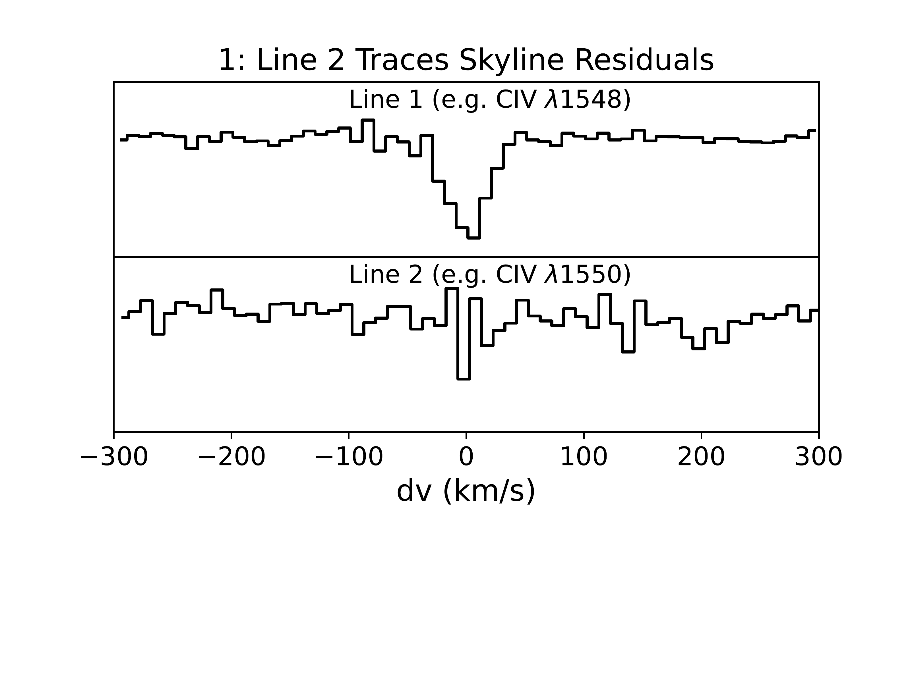
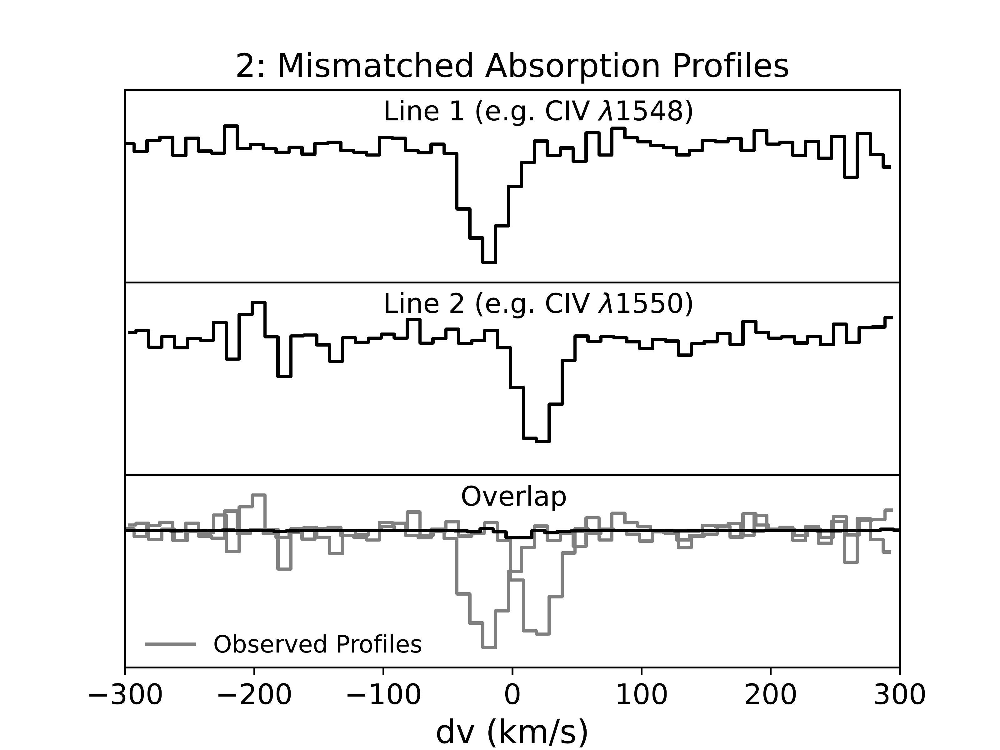
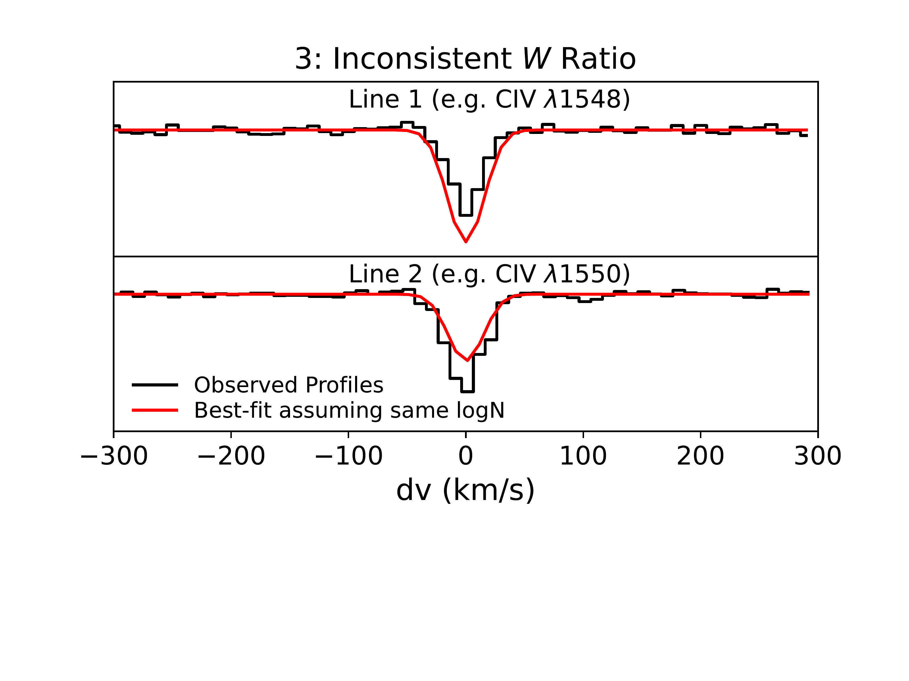
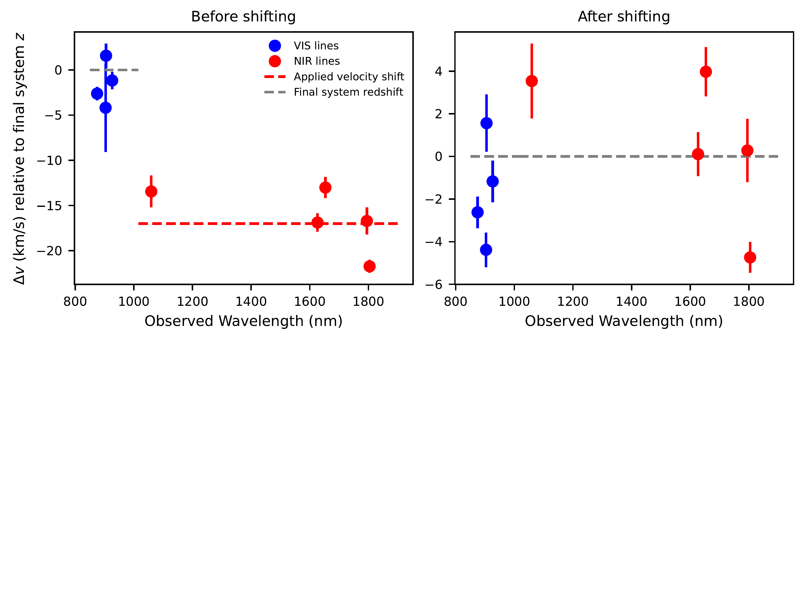
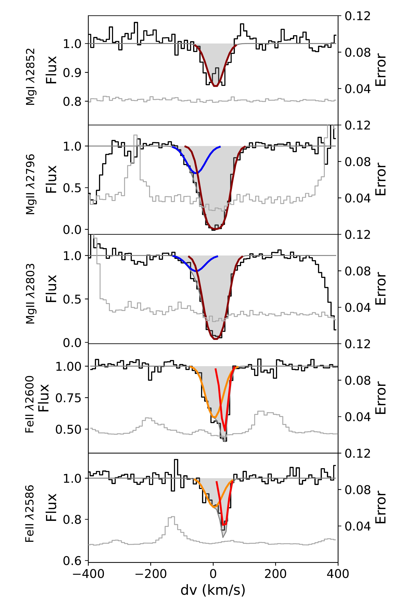

$\newcommand{\ensuremath}{}$
$\newcommand{\xspace}{}$
$\newcommand{\object}[1]{\texttt{#1}}$
$\newcommand{\farcs}{{.}''}$
$\newcommand{\farcm}{{.}'}$
$\newcommand{\arcsec}{''}$
$\newcommand{\arcmin}{'}$
$\newcommand{\ion}[2]{#1#2}$
$\newcommand{\textsc}[1]{\textrm{#1}}$
$\newcommand{\hl}[1]{\textrm{#1}}$
$\newcommand{\footnote}[1]{}$
$\newcommand{\NV}{\mbox{N \textsc{v}}}$
$\newcommand{\SiIV}{\mbox{Si \textsc{iv}}}$
$\newcommand{\CIV}{\mbox{C \textsc{iv}}}$
$\newcommand{\CII}{\mbox{C \textsc{ii}}}$
$\newcommand{\MgII}{\mbox{Mg \textsc{ii}}}$
$\newcommand{\SII}{\mbox{S \textsc{ii}}}$
$\newcommand{\ZnII}{\mbox{Zn \textsc{ii}}}$
$\newcommand{\TiII}{\mbox{Ti \textsc{ii}}}$
$\newcommand{\FeII}{\mbox{Fe \textsc{ii}}}$
$\newcommand{\AlII}{\mbox{Al \textsc{ii}}}$
$\newcommand{\AlIII}{\mbox{Al \textsc{iii}}}$
$\newcommand{\SiII}{\mbox{Si \textsc{ii}}}$
$\newcommand{\OI}{\mbox{O \textsc{i}}}$
$\newcommand{\HI}{\mbox{H \textsc{i}}}$
$\newcommand{\CoII}{\mbox{Co \textsc{ii}}}$
$\newcommand{\CrII}{\mbox{Cr \textsc{ii}}}$
$\newcommand{\CaII}{\mbox{Ca \textsc{ii}}}$
$\newcommand{\MnII}{\mbox{Mn \textsc{ii}}}$
$\newcommand{\NaI}{\mbox{Na \textsc{i}}}$
$\newcommand{\MgI}{\mbox{Mg \textsc{i}}}$
$\newcommand{\Lya}{Ly\alpha}$
$\newcommand{\numCIV}{479}$
$\newcommand{\numMgII}{360}$
$\newcommand{\numCII}{46}$
$\newcommand{\kms}{ km s^{-1}}$
$\newcommand{\bibtex}{\textsc{Bib}\!\TeX}$
$\newcommand{\appropto}{\mathrel{\vcenter{$
$  \offinterlineskip\halign{\hfil##\cr$
$    \propto\cr\noalign{\kern2pt}\sim\cr\noalign{\kern-2pt}}}}}$

$\newcommand{\ensuremath}{}$
$\newcommand{\xspace}{}$
$\newcommand{\object}[1]{\texttt{#1}}$
$\newcommand{\farcs}{{.}''}$
$\newcommand{\farcm}{{.}'}$
$\newcommand{\arcsec}{''}$
$\newcommand{\arcmin}{'}$
$\newcommand{\ion}[2]{#1#2}$
$\newcommand{\textsc}[1]{\textrm{#1}}$
$\newcommand{\hl}[1]{\textrm{#1}}$
$\newcommand{\footnote}[1]{}$
$\newcommand{\NV}{\mbox{N \textsc{v}}}$
$\newcommand{\SiIV}{\mbox{Si \textsc{iv}}}$
$\newcommand{\CIV}{\mbox{C \textsc{iv}}}$
$\newcommand{\CII}{\mbox{C \textsc{ii}}}$
$\newcommand{\MgII}{\mbox{Mg \textsc{ii}}}$
$\newcommand{\SII}{\mbox{S \textsc{ii}}}$
$\newcommand{\ZnII}{\mbox{Zn \textsc{ii}}}$
$\newcommand{\TiII}{\mbox{Ti \textsc{ii}}}$
$\newcommand{\FeII}{\mbox{Fe \textsc{ii}}}$
$\newcommand{\AlII}{\mbox{Al \textsc{ii}}}$
$\newcommand{\AlIII}{\mbox{Al \textsc{iii}}}$
$\newcommand{\SiII}{\mbox{Si \textsc{ii}}}$
$\newcommand{\OI}{\mbox{O \textsc{i}}}$
$\newcommand{\HI}{\mbox{H \textsc{i}}}$
$\newcommand{\CoII}{\mbox{Co \textsc{ii}}}$
$\newcommand{\CrII}{\mbox{Cr \textsc{ii}}}$
$\newcommand{\CaII}{\mbox{Ca \textsc{ii}}}$
$\newcommand{\MnII}{\mbox{Mn \textsc{ii}}}$
$\newcommand{\NaI}{\mbox{Na \textsc{i}}}$
$\newcommand{\MgI}{\mbox{Mg \textsc{i}}}$
$\newcommand{\Lya}{Ly\alpha}$
$\newcommand{\numCIV}{479}$
$\newcommand{\numMgII}{360}$
$\newcommand{\numCII}{46}$
$\newcommand{\kms}{ km s^{-1}}$
$\newcommand{\bibtex}{\textsc{Bib}\!\TeX}$
$\newcommand{\appropto}{\mathrel{\vcenter{$
$  \offinterlineskip\halign{\hfil##\cr$
$    \propto\cr\noalign{\kern2pt}\sim\cr\noalign{\kern-2pt}}}}}$

# The XQR-30 Metal Absorber Catalog: 778 Absorption Systems Spanning 2 $\lesssim z \lesssim$ 6.5

<mark>Appeared on: 2022-11-28</mark> - _29 pages and 14 figures including 2 appendices. Accepted for publication in MNRAS. The metal absorber catalogue can be downloaded from this https URL. Contents unchanged from v1 apart from change to author list_

<mark><mark>Rebecca L. Davies</mark></mark>, et al. -- incl., <mark><mark>Sarah E. I. Bosman</mark></mark>, <mark><mark>Romain A. Meyer</mark></mark>

**Abstract:** Intervening metal absorption lines in the spectra of $z\gtrsim$ 6 quasars are fundamental probes of the ionization state and chemical composition of circumgalactic and intergalactic gas near the end of the reionization epoch. Large absorber samples are required to robustly measure typical absorber properties and to refine models of the synthesis, transport, and ionization of metals in the early Universe. The "Ultimate XSHOOTER legacy survey of quasars at $z\sim$ 5.8-6.6" $\mbox{(XQR-30)}$ has obtained high signal-to-noise spectra of 30 luminous quasars, nearly quadrupling the existing sample of 12 high quality $z\sim$ 6 quasar spectra. We use this unprecedented sample to construct a catalog of 778 systems showing absorption in one or more of $\MgII$ ( $\numMgII$ systems), $\FeII$ (184), $\CII$ ( $\numCII$ ), $\CIV$ ( $\numCIV$ ), $\SiIV$ (127), and $\NV$ (13) which span $\mbox{2 $\lesssim z \lesssim$ 6.5}$ . This catalog significantly expands on existing samples of $\mbox{$z \gtrsim$ 5}$ absorbers, especially for $\CIV$ and $\SiIV$ which are important probes of the ionizing photon background at high redshift. The sample is 50 \% (90 \% ) complete for rest-frame equivalent widths $W \gtrsim$ 0.03Å (0.09Å). We publicly release the absorber catalog along with completeness statistics and a $Python$ script to compute the absorption search path for different ions and redshift ranges. This dataset is a key legacy resource for studies of enriched gas from the era of galaxy assembly to cosmic noon, and paves the way for even higher redshift studies with the $_James Webb Space Telescope_$ and 30m-class telescopes.

**Figure 1. -** Illustration of the criteria used to filter the lists of candidate absorption pairs. The absorption profile of each transition is resampled onto a 10 $\kms$ grid centered at the redshift of the candidate. _Top_: Line 2 is a skyline residual. A candidate is rejected if either absorption line does not span at least three 10 $\kms$ velocity channels (about one resolution element; Section \ref{subsubsec:skylines}). _Middle and Bottom_: In each candidate, both transitions are real absorption lines but they are associated with unrelated absorption systems. In the middle panel, the absorption profiles are misaligned in velocity space. We reject candidates that do not have significant absorption overlapping between the two transitions (Section \ref{subsubsec:overlap_signal}). The candidate in the bottom panel is rejected because the observed equivalent widths (black) are inconsistent with Voigt profile fits assuming a single column density (red) (Section \ref{subsubsec:ew_test}).  (*fig:filtering*)

**Figure 8. -** Left: Difference between the centroid velocities of VIS and NIR transitions (blue and red markers, respectively) as a function of observed wavelength for a single-component low-ionization absorption system at $z$ = 5.939 in the spectrum of SDSSJ2310+1855. The velocities are relative to the redshift of the absorption system in the final catalog (grey dashed line). The NIR transitions are offset by a median velocity of 17 $\kms$(red dashed line). Right: Velocity offsets after applying the 17 $\kms$ shift to the NIR spectrum. There is no evidence for any systematic variation in the measured centroid velocity as a function of wavelength. The final centroid velocities vary by $\sim$ 10 $\kms$ which is the width of a spectral pixel. (*fig:dv_wavelength*)

**Figure 2. -** Four component fit to a low-ionization absorption system at \mbox{$z$ = 2.72}. Each color indicates a different kinematic component. The $\MgII$ profiles (rows 2 and 3) show a blueshifted wing that is not detected in the other ions. The $\FeII$ profiles (rows 4 and 5) are well fit by two components (orange and red). However, the corresponding central absorption trough in $\MgII$(rows 2 and 3) can only be fit with a single component (brown) due to saturation. The $\MgI$ absorption profile (row 1) is fit using the same central component (brown) because the low S/N prevents a robust multi-component decomposition. (*fig:multi_comp_fitting*)

